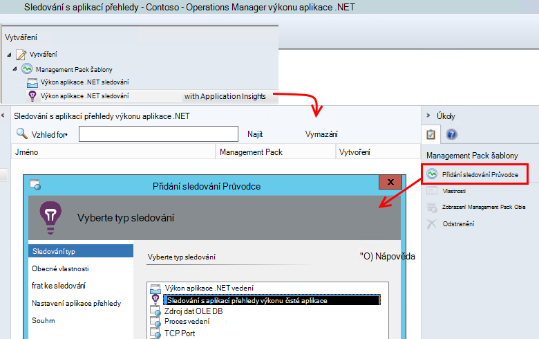
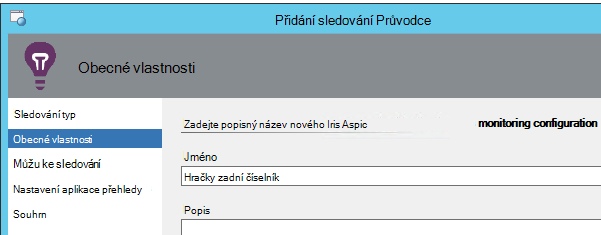
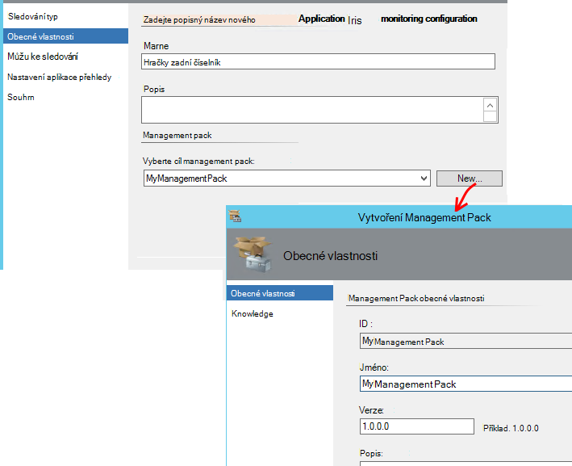
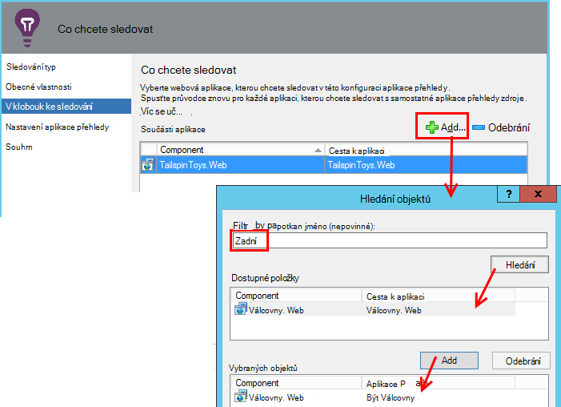
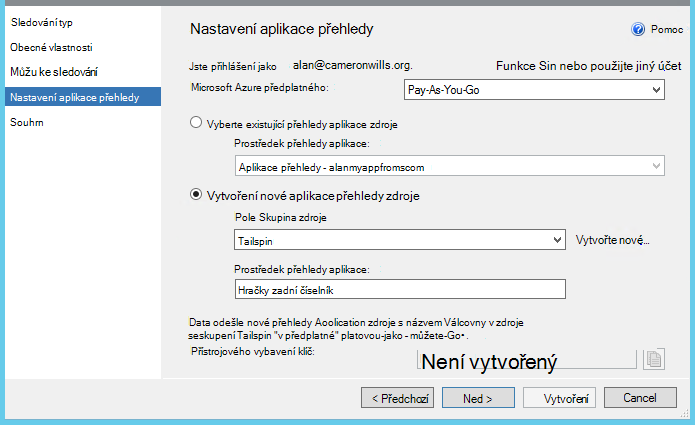
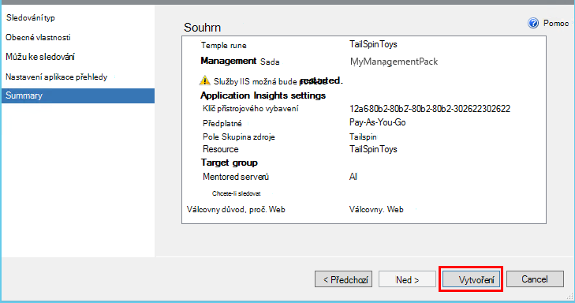
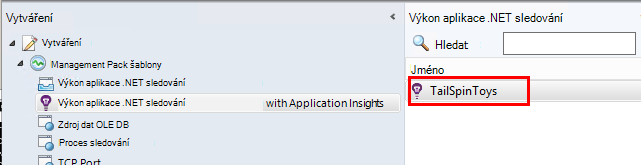
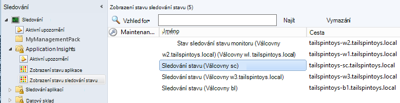

<properties 
    pageTitle="SCOM integrace s aplikací přehledy | Microsoft Azure" 
    description="Pokud jste uživatelem aplikace SCOM, sledovat výkon a Diagnostika problémů s aplikací přehledy. Úplný řídicí panely, inteligentní upozornění, výkonné diagnostické nástroje a analýzy dotazů." 
    services="application-insights" 
    documentationCenter=""
    authors="alancameronwills" 
    manager="douge"/>

<tags 
    ms.service="application-insights" 
    ms.workload="tbd" 
    ms.tgt_pltfrm="ibiza" 
    ms.devlang="na" 
    ms.topic="article" 
    ms.date="08/12/2016" 
    ms.author="awills"/>
 
# Pomocí aplikace přehledy pro SCOM sledování výkonu aplikace

Pokud používáte systém Centrum Operations Manager (SCOM) ke správě serverech, můžete sledovat výkon a diagnostikovat potíže s výkonem s pomocí [Aplikace Visual Studio aplikace přehledy](app-insights-asp-net.md). Aplikace přehledy sleduje příchozí žádosti webové aplikace, odchozí ZBÝVAJÍCÍ a SQL volání výjimky a protokolu trasování. Poskytuje řídicí panely metrických inteligentní upozornění, jakož i výkonné diagnostiky hledání a a analytické dotazů přes tento telemetrie. 

Můžete přepnout o aplikaci přehledy sledování pomocí SCOM management pack.

## Než začnete

Předpokladu, že:

* Znáte SCOM a použijte SCOM 2012 R2 nebo 2016 na Správa vašeho serveru IIS webových serverů.
* Jste již nainstalovali na serverech webovou aplikaci, kterou chcete sledovat s přehledy aplikace.
* Verze aplikace framework je .NET 4,5 nebo novější.
* Máte přístup k předplatnému v [Microsoft Azure](https://azure.com) a se přihlásit k [portálu Azure](https://portal.azure.com). Vaše organizace může mít předplatné a do ní můžete přidat účet Microsoft.

(Týmu vývoje může vytvořit [Přehledy SDK aplikace](app-insights-asp-net.md) na web appu. Tento přístrojového vybavení vytváření poskytnete větší flexibilitu při psaní vlastní telemetrie. Však nezáleží na: postupujte podle kroků popsaných v tomto poli s nebo bez SDK integrované.)

## (Jednou) Nainstalujte si aplikaci přehledy management pack

V počítači, kde spustíte Operations Manager:

2. Odinstalujte starou verzi management pack:
 1. Ve Správci operace otevřete Správa Management Pack. 
 2. Odstraňte starou verzi.
1. Stáhněte a nainstalujte management pack z katalogu.
2. Restartujte Operations Manager.

## Vytvoření management pack

1. V Operations Manager otevřete **vytváření formulářů**, **.NET... s přehledy aplikace**, **Průvodce přidáním sledování**a znovu vyberte **.NET... s přehledy aplikace**.

    

2. Název konfigurace po aplikace. (Máte nástroje aplikace jeden po druhém.)
    
    

3. Na stejné stránce průvodce vytvořte nové management pack nebo vyberte sadu, který jste vytvořili pro přehledy aplikace.

     (Aplikace přehledy [management pack](https://technet.microsoft.com/library/cc974491.aspx) je šablonu, od kterého vytvoříte instanci. Můžete znovu použít stejné instanci později.)

    

4. Zvolte jednu aplikaci, kterou chcete sledovat. Funkce vyhledávání hledá mezi aplikací, které jste na serverech.

    

    Volitelné pole Obor sledování lze určit podmnožinu serverech, pokud nechcete, aby ke sledování aplikace ve všech serverů.

5. Na další stránce průvodce musíte nejdřív zadat svoje přihlašovací údaje pro přihlášení k Microsoft Azure.

    Na této stránce zvolte zdrojů aplikace přehledy místo, kam chcete telemetrie data, která chcete analyzovat a zobrazí. 

 * Pokud žádost o konfiguraci pro přehledy aplikace během vývoje, vyberte existující zdroje.
 * V opačném vytvoření nového zdroje s názvem aplikace. Pokud jsou jiných aplikací, které jsou součástí stejný systém, zapište je do stejné skupiny prostředků můžete usnadnit přístup k telemetrie spravovat.

    Toto nastavení můžete změnit později.

    

6. Ukončete průvodce.

    
    
Tento postup opakujte pro každé aplikaci, kterou chcete sledovat.

Pokud potřebujete změnit nastavení později, znovu otevřete dialogové okno Vlastnosti monitor z okna vytváření formulářů.

## Ověření sledování

Sledování nainstalované vyhledávání aplikace na všech serverech. Pokud zjistí aplikaci nakonfiguruje sledování stavu přehledy aplikace pro sledování aplikace. V případě potřeby nainstaluje nejdřív sledování stavu na serveru.

Můžete zkontrolovat, které instancí aplikace najde:

## Zobrazení telemetrie v aplikaci přehledy

V [Azure portál](https://portal.azure.com)přejděte do zdrojů aplikace. [V tématu grafy s telemetrie](app-insights-dashboards.md) pomocí aplikace. (Pokud ho není uveden na hlavní stránce ještě, klikněte na živou toku metriky.)

## Další kroky

* [Nastavení řídicího panelu](app-insights-dashboards.md) na spojování nejdůležitější grafy sledování těchto i jiných aplikací.
* [Další informace o metriky](app-insights-metrics-explorer.md)
* [Nastavení upozornění](app-insights-alerts.md)
* [Diagnostika problémů s výkonem](app-insights-detect-triage-diagnose.md)
* [Výkonné analýzy dotazů](app-insights-analytics.md)
* [Dostupnost webových testů](app-insights-monitor-web-app-availability.md)
