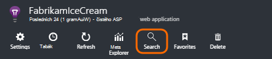
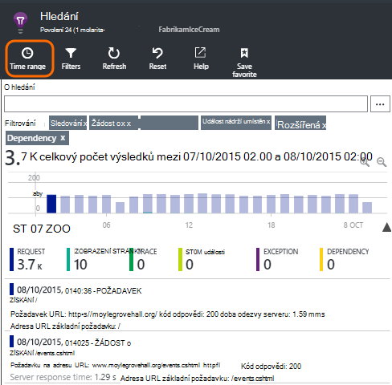
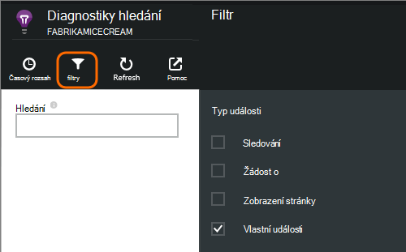
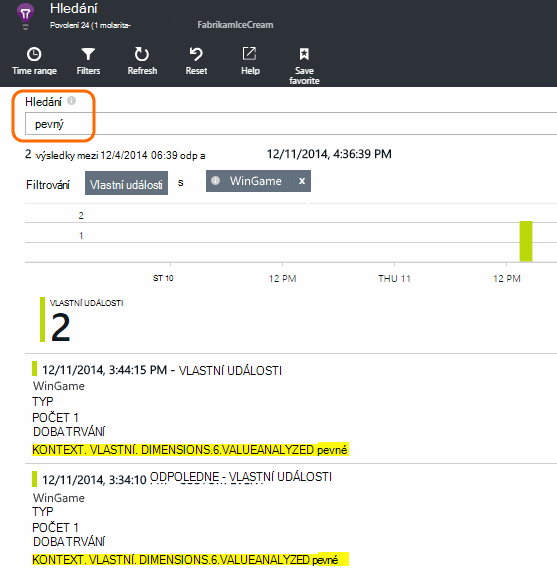
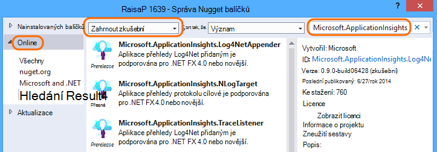
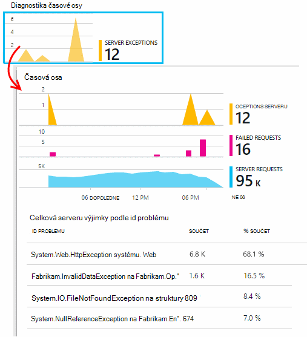
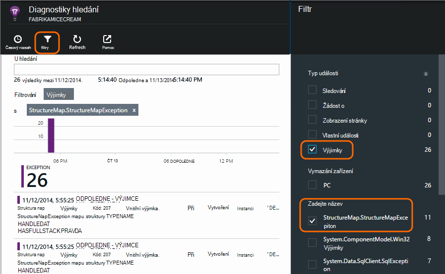

<properties 
    pageTitle="Protokoly, výjimky a vlastní diagnostice ASP.NET v aplikaci přehledy" 
    description="Diagnostika problémů s ve webových aplikacích pro ASP.NET hledáním požadavky, výjimky a protokolů generovaných se sledování, NLog nebo Log4Net." 
    services="application-insights" 
    documentationCenter=""
    authors="alancameronwills" 
    manager="douge"/>

<tags 
    ms.service="application-insights" 
    ms.workload="tbd" 
    ms.tgt_pltfrm="ibiza" 
    ms.devlang="na" 
    ms.topic="article" 
    ms.date="04/08/2016" 
    ms.author="awills"/>
 
# Protokoly, výjimky a vlastní diagnostice ASP.NET v aplikaci přehledy

[Aplikace přehledy] [ start] obsahuje výkonné [Diagnostiky hledání] [ diagnostic] nástroj, který umožňuje zkoumat a procházet telemetrie odeslaný SDK přehledy aplikace z aplikace. Mnoho události, jako je třeba zobrazení stránky uživatelů se automaticky odesílají tak, že v SDK.

Můžete také napsat kód odeslat vlastní události, výjimce sestavy a trasování. Pokud už používáte rámec protokolování například log4J, log4net, NLog nebo System.Diagnostics.Trace, můžete a zachytit jsou protokoly zahrnout do vyhledávání. Usnadňuje ke koordinaci protokolu trasování s akcemi uživatele, výjimky a dalších událostí.

## Před napsat vlastní telemetrie

Pokud jste tak dosud neučinili [Nastavení aplikace přehledy pro váš projekt][start], udělat teď.

Když spustíte aplikaci, odešle některé telemetrie, která se zobrazí v diagnostiky hledání, včetně požadavků přijatých serverem, stránky zobrazení přihlášení k lyncu na straně klienta a nezachycené výjimky.

Otevřete diagnostiky hledání zobrazíte telemetrie v SDK přiřazeno.

Podrobnosti se liší podle typu jedné aplikace. Můžete procházet jednotlivé události zobrazíte více podrobností.

## Analytický nástroj vzorkování 

Pokud používáte aplikaci přehledy SDK 2.0.0-beta3 verze technologie ASP.NET nebo novější aplikace odešle velké množství dat, může funkce adaptivní odběr ovládání a odeslat jenom procento vaší telemetrie. [Další informace o odběr.](app-insights-sampling.md)

##Vlastní události

Vlastní události neprojevila obě [Diagnostiky] hledání[ diagnostic] a v [Průzkumníku míru][metrics]. Můžete jim poslat ze zařízení, webových stránek a aplikací serveru. Použitím pro účely diagnostiky a [pochopit vzorce použití][track].

Vlastní události s názvem a mohou také obsahovat vlastnosti, které je můžete vyfiltrovat, spolu s číselné hodnoty.

JavaScriptu na klienta

    appInsights.trackEvent("WinGame",
         // String properties:
         {Game: currentGame.name, Difficulty: currentGame.difficulty},
         // Numeric measurements:
         {Score: currentGame.score, Opponents: currentGame.opponentCount}
         );

C# na serveru

    // Set up some properties:
    var properties = new Dictionary <string, string> 
       {{"game", currentGame.Name}, {"difficulty", currentGame.Difficulty}};
    var measurements = new Dictionary <string, double>
       {{"Score", currentGame.Score}, {"Opponents", currentGame.OpponentCount}};

    // Send the event:
    telemetry.TrackEvent("WinGame", properties, measurements);

VB na serveru

    ' Set up some properties:
    Dim properties = New Dictionary (Of String, String)
    properties.Add("game", currentGame.Name)
    properties.Add("difficulty", currentGame.Difficulty)

    Dim measurements = New Dictionary (Of String, Double)
    measurements.Add("Score", currentGame.Score)
    measurements.Add("Opponents", currentGame.OpponentCount)

    ' Send the event:
    telemetry.TrackEvent("WinGame", properties, measurements)

### Spusťte aplikaci a zobrazte výsledky.

Otevřete diagnostiky hledání.

Vyberte vlastní události a vyberte název zvláštní událost.

Filtrování dat Další zadejte hledaný výraz na hodnotu vlastnosti.  

Procházejte jednu událost zobrazíte podrobné vlastnosti.

##Zobrazení stránky

Stránka zobrazení telemetrie odeslaný voláním trackPageView() v [javascriptový fragment kódu vkládané na webových stránkách][usage]. Hlavním účelem je přispívat počty zobrazení stránky, které se zobrazí na stránce Přehled.

Obvykle je označená jako jednou na každé stránce HTML, ale můžete vložit další hovory – například pokud máte aplikaci jednostránkové a chcete zaznamenat novou stránku pokaždé, když uživatel obdrží více dat.

    appInsights.trackPageView(pageSegmentName, "http://fabrikam.com/page.htm"); 

V některých případech je užitečný pro připojení vlastnosti, které můžete použít jako filtry v diagnostiky hledání:

    appInsights.trackPageView(pageSegmentName, "http://fabrikam.com/page.htm",
     {Game: currentGame.name, Difficulty: currentGame.difficulty});

##Sledování telemetrie

Sledování telemetrie je kód, který vložíte speciálně k vytvoření diagnostické protokoly. 

Je třeba vložit hovorů takto:

    var telemetry = new Microsoft.ApplicationInsights.TelemetryClient();
    telemetry.TrackTrace("Slow response - database01");

####  Nainstalujte adaptér Framework protokolování

Můžete také prohledat protokoly vytvořený pomocí protokolování framework - log4Net NLog nebo System.Diagnostics.Trace. 

1. Pokud budete chtít používat log4Net nebo NLog, nainstalujte ji do projektu. 
2. V Průzkumníku projektu klikněte pravým tlačítkem myši a zvolte **Spravovat balíčků NuGet**.
3. Vyberte Online > všechny, vyberte **Zahrnout zkušební** a vyhledejte "Microsoft.ApplicationInsights"

    

4. Vyberte příslušný balíček – jeden z:
  + Microsoft.ApplicationInsights.TraceListener (k zaznamenání System.Diagnostics.Trace volání)
  + Microsoft.ApplicationInsights.NLogTarget
  + Microsoft.ApplicationInsights.Log4NetAppender

Balíček NuGet nainstaluje potřebné sestavení a také upraví web.config nebo app.config.

#### Vložení diagnostickém protokolu volání

Pokud používáte System.Diagnostics.Trace, budou typické hovoru:

    System.Diagnostics.Trace.TraceWarning("Slow response - database01");

Pokud raději používáte log4net nebo NLog:

    logger.Warn("Slow response - database01");

Spuštění aplikace v režimu ladění nebo ho nasadit.

Při vyberte filtr sledování zpráv v diagnostiky hledání uvidíte.

### Výjimky

Získání výjimky sestavy v aplikaci přehledy poskytuje setkat i v případě hodně výkonná, zejména vzhledem k tomu můžete přecházet mezi selhalo žádosti o schůzku a výjimky a číst zásobníku výjimku.

V některých případech, budete muset [Vložení několika řádků kódu] [ exceptions] a ujistěte se, vaše výjimky jsou zachyceny automaticky.

Můžete také vytvořit explicitní kód odeslat telemetrie výjimku:

JavaScript

    try 
    { ...
    }
    catch (ex)
    {
      appInsights.TrackException(ex, "handler loc",
        {Game: currentGame.Name, 
         State: currentGame.State.ToString()});
    }

C#

    var telemetry = new TelemetryClient();
    ...
    try 
    { ...
    }
    catch (Exception ex)
    {
       // Set up some properties:
       var properties = new Dictionary <string, string> 
         {{"Game", currentGame.Name}};

       var measurements = new Dictionary <string, double>
         {{"Users", currentGame.Users.Count}};

       // Send the exception telemetry:
       telemetry.TrackException(ex, properties, measurements);
    }

JAZYKA VISUAL BASIC

    Dim telemetry = New TelemetryClient
    ...
    Try
      ...
    Catch ex as Exception
      ' Set up some properties:
      Dim properties = New Dictionary (Of String, String)
      properties.Add("Game", currentGame.Name)

      Dim measurements = New Dictionary (Of String, Double)
      measurements.Add("Users", currentGame.Users.Count)
  
      ' Send the exception telemetry:
      telemetry.TrackException(ex, properties, measurements)
    End Try

Vlastnosti a naměřené hodnoty parametrů jsou volitelné, ale jsou vhodné k filtrování a přidáním dalších informací. Například pokud máte aplikaci, mohlo by umožnit spuštění několik hry může nenajdete všechny sestavy výjimce související určitá hra. Můžete přidat tolik položek podle potřeby do každého slovníku.

#### Zobrazení výjimky

Se zobrazuje souhrn výjimky vykázanému zásuvné – přehled a můžete procházet zobrazíte více podrobností. Příklad:

[]

Klikněte na libovolný typ výjimky zobrazíte konkrétní výskyty:

[]

Můžete také otevřít diagnostiky hledání přímo, filtrovat podle výjimky a zvolte typ výjimky, který chcete zobrazit.

### Vytváření sestav neošetřené výjimky

Sestavy aplikace přehledy neošetřené výjimky, kde ho ze zařízení, [webových prohlížečích]můžete[usage], nebo webových serverů, zda vybavit přístroji tak, že [Sledování stavu] [ redfield] nebo [Aplikace přehledy SDK][greenbrown]. 

Však není vždy možné tomu v některých případech .NET framework zachytí výjimky.  Abyste měli jistotu, že se zobrazí všechny výjimky, proto máte psát rutinu malé výjimky. Nejlepší postup se liší s technologií. V tématu [telemetrie výjimku pro ASP.NET] [ exceptions] podrobnosti. 

### Srovnávací s sestavení

Při čtení protokoly pro diagnostiku je pravděpodobné, že zdrojový kód bude změněn kód živou nasazené.

Proto je užitečné přepněte do vlastnosti spolu s každý výjimky nebo sledování informací Tvůrce dotazů, například adresu URL aktuální verzi. 

Namísto přidávání vlastnost samostatně všech výjimek volání, můžete nastavit informace ve výchozím kontextu. 

    // Telemetry initializer class
    public class MyTelemetryInitializer : ITelemetryInitializer
    {
        public void Initialize (ITelemetry telemetry)
        {
            telemetry.Properties["AppVersion"] = "v2.1";
        }
    }

V inicializačním aplikace například Global.asax.cs:

    protected void Application_Start()
    {
        // ...
        TelemetryConfiguration.Active.TelemetryInitializers
        .Add(new MyTelemetryInitializer());
    }

###Požadavky webového serveru

Žádost o telemetrie je automaticky odeslána při [instalaci sledování stavu na webovém serveru][redfield], nebo při [Přidání přehledy aplikace na web projektu][greenbrown]. Informační kanály také do čas grafy žádostí a odpovědí v Průzkumníku metrické a na stránce Přehled.

Pokud chcete odeslat dalších událostí, můžete použít rozhraní API TrackRequest().

## Služba Q & A

### Dojde k chybě "přístrojového vybavení klíč nemůže být prázdné"

Vypadá to jste nainstalovali balíček protokolování adaptér Nuget bez instalace aplikace přehledy.

V Průzkumníku klikněte pravým tlačítkem myši `ApplicationInsights.config` a zvolte **Update aplikace přehledy**. Zobrazí se dialog s vyzývá k přihlášení k Azure a vytvořte prostředek přehledy aplikace nebo znovu použít existující úrovně. Která by měla opravný nástroj fix it.

### Jaká data se zachovají?

Až 500 události sekundu z jednotlivých aplikací. Události uchovávají pro sedmi dnů.

### Některé události nebo stopy se nezobrazují

Pokud používáte aplikaci přehledy SDK 2.0.0-beta3 verze technologie ASP.NET nebo novější aplikace odešle velké množství dat, může funkce adaptivní odběr ovládání a odeslat jenom procento vaší telemetrie. [Další informace o odběr.](app-insights-sampling.md)

## Další kroky

* [Nastavení dostupnost a rychlostí reakce testů][availability]
* [Řešení potíží][qna]

<!--Link references-->

[availability]: app-insights-monitor-web-app-availability.md
[diagnostic]: app-insights-diagnostic-search.md
[exceptions]: app-insights-asp-net-exceptions.md
[greenbrown]: app-insights-asp-net.md
[metrics]: app-insights-metrics-explorer.md
[qna]: app-insights-troubleshoot-faq.md
[redfield]: app-insights-monitor-performance-live-website-now.md
[start]: app-insights-overview.md
[track]: app-insights-api-custom-events-metrics.md
[usage]: app-insights-web-track-usage.md

 
