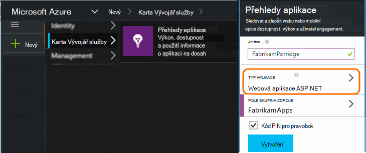
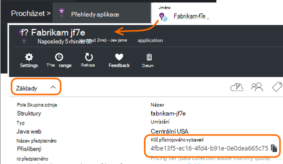

<properties 
    pageTitle="Oddělení zdrojů přehledy aplikace pro vývojáře, test a výrobní" 
    description="Sledovat výkon a použití te000126961 aplikace v různých fázích vývoje" 
    services="application-insights" 
    documentationCenter=""
    authors="alancameronwills" 
    manager="douge"/>

<tags 
    ms.service="application-insights" 
    ms.workload="tbd" 
    ms.tgt_pltfrm="ibiza" 
    ms.devlang="na" 
    ms.topic="article" 
    ms.date="05/04/2016" 
    ms.author="awills"/>

# Oddělení zdrojů aplikace přehledy

Má telemetrie z různých složek a verzí aplikace být poslané na jiné zdroje přehledy aplikace nebo sloučena do jednoho? Tento článek vypadá nejlépe postupy a potřebné postupy.

Nejdřív Projdeme si otázku. Data dostali z aplikace se ukládají a zpracována aplikace přehledy v Microsoft Azure *zdroje*. Jednotlivé zdroje je určen se *přístrojového vybavení klíč* (iKey). Ve své aplikaci klíč by vám měly SDK přehledy aplikace tak, aby ho můžete poslat data, která shromažďuje správné zdroji. Klíč lze zadat kód nebo ApplicationInsights.config. Změnou klávesu v SDK můžete odkázat data do různých zdrojů. 

V jednoduchém případě při vytváření kódu pro nové aplikace taky vytvoříte nový zdroj v aplikaci přehledy. Ve Visual Studiu dialogové okno *Nový projekt* to dělá za vás.

Pokud je web velkých objemů, může být nasazené na více než jedna instance serveru.

V dalších složitějších scénáře můžete vybrat systému, který se skládá z více součástí – například webu a procesor back-end. 

## Kdy použít samostatné iKeys

Tady je pár obecných pokynů:

* Pokud máte nezávisle na sobě nasadit aplikaci jednotku, která běží na sadu serveru instance, které je možné použít měřítko up/Page down nezávisle na jiných komponent, která by obvykle mapování na jeden zdroj – a pak to znamená, bude mít jeden přístrojového vybavení klíč (iKey).
* Důvody pro používání samostatné iKeys naopak patří:
 - Snadno čitelné samostatné metriky z jednotlivých součástí.
 - Oddělte nižší hlasitost telemetrie z velkých objemů, tak, aby omezení kvót a odběr na jeden toku nemají vliv na druhé.
 - Upozornění na samostatném exportovat a konfigurace položek práce.
 - [Limity](app-insights-pricing.md#limits-summary) rozprostřete pracovní jako telemetrie kvóty omezení a web testování count.
 - Kód ve vývoji a test má odeslat samostatné iKey než razítko výroby.  

Hodně portálu prostředí aplikace přehledy jsou určeny s těmito pokyny na paměti. Například servery zobrazení segmentů na instance serveru, díky za předpokladu, které telemetrie o jiný, který logický součásti můžou pocházet z několika instancí serveru.

## Jeden iKey

Pokud budete posílat telemetrie z více součástí jedné iKey:

* Přidání vlastnosti všechny telemetrie, která vám umožní segment a filtrovat na Identita součásti. Role ID automaticky přidán do telemetrie z role instance serveru, ale v ostatních případech, pomocí kterých můžete [telemetrie inicializační](app-insights-api-filtering-sampling.md#add-properties) přidat vlastnost.
* Aktualizujte SDK přehledy aplikace v části jiné ve stejnou dobu. Telemetrie pro jeden iKey mají pocházet se stejnou verzi aplikace v SDK.

## Samostatné iKeys

Pokud máte víc iKeys pro jiné aplikace součásti:

* Vytvoření [řídicího panelu](app-insights-dashboards.md) pro zobrazení klíčových telemetrie z logických aplikace, kombinovat z jiné aplikace komponent. Řídicí panely mohou být sdíleny, takže zobrazení jednoho logického systému lze použít v různých týmech.
* Uspořádání [skupin zdrojů](app-insights-resources-roles-access-control.md) na úrovni týmu. Přístupová oprávnění přiřazené podle skupiny zdrojů a jedná se o oprávnění k nastavení upozornění. 
* Pomocí [Správce prostředků Azure šablony a prostředí Powershell](app-insights-powershell.md) Správa artefakty například upozornění pravidla a webové testů.

## Samostatné iKeys pro vývojáře nebo zkoušení a výrobních

Usnadnit Změna klíče automaticky při uvolnění aplikace, nastavte iKey v kódu, ne v ApplicationInsights.config.

### Klíč dynamické přístrojového vybavení

V metodu inicializace, například global.aspx.cs služby ASP.NET nastavte klíč:

*C#*

    protected void Application_Start()
    {
      Microsoft.ApplicationInsights.Extensibility.
        TelemetryConfiguration.Active.InstrumentationKey = 
          // - for example -
          WebConfigurationManager.AppSettings["ikey"];
      ...

V tomto příkladu jsou umístěny ikeys u různých zdrojů v různých verzích konfiguračního souboru web. Výměna konfigurační soubor webového - které můžete použít jako součást skript vydání – bude zaměnit cílový prostředek.

### Webové stránky

IKey slouží také vaše aplikace webových stránek v [skript, který jste dostali od zásuvné rychlý start](app-insights-javascript.md). Místo kódování ho doslova do skript, negeneruje jeho stav serveru. Například v aplikaci pro ASP.NET:

*JavaScript v Razor*

    <script type="text/javascript">
    // Standard Application Insights web page script:
    var appInsights = window.appInsights || function(config){ ...
    // Modify this part:
    }({instrumentationKey:  
      // Generate from server property:
      "@Microsoft.ApplicationInsights.Extensibility.
         TelemetryConfiguration.Active.InstrumentationKey"
    }) // ...

## Vytvoření dalších zdrojů aplikace přehledy
  
Pokud se rozhodnete k oddělení telemetrie součástí jinou aplikací, nebo pro různé razítka (odchylka/test/výroba) stejné součásti, budete muset vytvořit nový zdroj přehledy aplikace.

V [portal.azure.com](https://portal.azure.com)přidejte aplikaci přehledy zdroje:

* **Typ aplikace** ovlivňuje, co se zobrazí na zásuvné – přehled a vlastnosti dostupné v [metrických Průzkumníka](app-insights-metrics-explorer.md). Pokud nevidíte typ aplikace, vyberte jeden z typů web na webových stránkách.
* **Pole Skupina zdroje** je pohodlí pro správu vlastnosti jako [řízení přístupu](app-insights-resources-roles-access-control.md). Můžete použít samostatné skupiny prostředků vývoj, test a výroby.
* **Předplatné** je účtu platby v Azure.
* Kde můžeme zajistit platnost dat je **umístění** . Momentálně je nelze změnit. 
* **Přidat do řídicího panelu** umístí dlaždice rychlý přístup pro zdroj na Azure domovské stránce. 

Vytvoření zdroje trvá několik sekund. Zobrazí se upozornění a po dokončení.

( [Skript Powershellu](app-insights-powershell-script-create-resource.md) automaticky vytvořit zdroj můžete napsat.)

## Získání klávesu přístrojového vybavení

Klíč přístrojového vybavení identifikuje prostředek, který jste vytvořili. 

Potřebujete klávesy přístrojového vybavení všech zdrojů, ke kterému se aplikace odeslat data.

 
