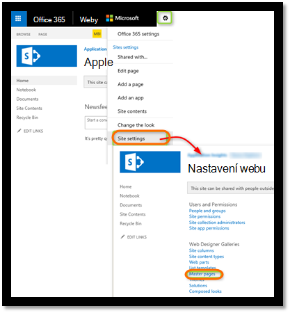

<properties 
    pageTitle="Sledování Sharepointového webu s přehledy aplikace" 
    description="Spuštění sledování nové aplikace s novým klíčem přístrojového vybavení" 
    services="application-insights" 
    documentationCenter=""
    authors="alancameronwills" 
    manager="douge"/>

<tags 
    ms.service="application-insights" 
    ms.workload="tbd" 
    ms.tgt_pltfrm="ibiza" 
    ms.devlang="na" 
    ms.topic="article" 
    ms.date="03/24/2016" 
    ms.author="awills"/>

# <a name="monitor-a-sharepoint-site-with-application-insights"></a>Sledování Sharepointového webu s přehledy aplikace


Přehledy aplikace Visual Studio sleduje dostupnost, výkon a použití te000126961 aplikace. Tady najdete informace o nastavení pro web služby SharePoint.


## <a name="create-an-application-insights-resource"></a>Vytvoření aplikace přehledy zdroje


[Azure portál](https://portal.azure.com)vytvoření nového prostředku přehledy aplikace. Zvolte ASP.NET jako typ aplikace.


Zásuvné, která se otevře je místo, kde zobrazí se výkonu a použití zásad správy informací o aplikaci. Zpět k nim získat přístup při příštím přihlášení na Azure, by měl nenajdete dlaždici ho na obrazovce start. Můžete taky klikněte na Procházet a vyhledejte jej.
    


## <a name="add-our-script-to-your-web-pages"></a>Přidání naše skriptu do webové stránky

V rychlém získáte skriptu pro webové stránky:


Vložení skriptu těsně před &lt;/sídlo&gt; značku části každé stránky, kterou chcete sledovat. Pokud má váš web stránku předlohy, můžete umístit skript tam. Například v projektu ASP.NET MVC by vložíte ji View\Shared\_Layout.cshtml

Skript obsahuje klávesu přístrojového vybavení, který směruje telemetrie aplikace přehledy zdroji.

### <a name="add-the-code-to-your-site-pages"></a>Přidání kódu pro stránky vašeho webu

#### <a name="on-the-master-page"></a>Na stránce předlohy

Pokud můžete upravit stránky předlohy webu, který vám poskytne sledování pro každou stránku na webu.

Podívejte se na stránku předlohy a upravovat pomocí aplikace SharePoint Designer nebo jiných editoru.




Přidání kódu pro těsně před </head> značku. 


#### <a name="or-on-individual-pages"></a>Nebo na jednotlivých stránkách

Sledování omezenou sadu stránky, přidejte skript nezávisle na každé stránce. 

Vložení webové části a vložení kódu v nich.


## <a name="view-data-about-your-app"></a>Zobrazení dat o aplikaci

Přeinstalujte aplikace.

Vraťte se do aplikace zásuvné [Azure portálu](https://portal.azure.com).

První událostí se zobrazí v hledání. 


Pokud jste očekává víc dat, klikněte na aktualizovat za několik sekund, než.

Přehled zásuvné klikněte na **Analýza využití** Chcete-li zobrazit grafy uživatelů, relace a zobrazení stránky:


Klikněte na graf zobrazíte více podrobností – třeba zobrazení stránky:


Nebo uživatele:


## <a name="capturing-user-id"></a>Zachycení Id uživatele


Fragment kódu standardní webovou stránku nemá zachytit id uživatele ze služby SharePoint, ale můžete to udělat malé úprav.


1. Zkopírujte vaše aplikace přístrojového vybavení klíč z Essentials rozevírací seznam v aplikaci přehledy. 


    

2. Nahraďte klávesu přístrojového vybavení "XXXX" v níže fragment kódu. 
3. Vložení skriptu do aplikace SharePoint místo fragment kódu, který jste dostali z portálu.


```


<SharePoint:ScriptLink ID="ScriptLink1" name="SP.js" runat="server" localizable="false" loadafterui="true" /> 
<SharePoint:ScriptLink ID="ScriptLink2" name="SP.UserProfiles.js" runat="server" localizable="false" loadafterui="true" /> 
  
<script type="text/javascript"> 
var personProperties; 
  
// Ensure that the SP.UserProfiles.js file is loaded before the custom code runs. 
SP.SOD.executeOrDelayUntilScriptLoaded(getUserProperties, 'SP.UserProfiles.js'); 
  
function getUserProperties() { 
    // Get the current client context and PeopleManager instance. 
    var clientContext = new SP.ClientContext.get_current(); 
    var peopleManager = new SP.UserProfiles.PeopleManager(clientContext); 
     
    // Get user properties for the target user. 
    // To get the PersonProperties object for the current user, use the 
    // getMyProperties method. 
    
    personProperties = peopleManager.getMyProperties(); 
  
    // Load the PersonProperties object and send the request. 
    clientContext.load(personProperties); 
    clientContext.executeQueryAsync(onRequestSuccess, onRequestFail); 
} 
     
// This function runs if the executeQueryAsync call succeeds. 
function onRequestSuccess() { 
var appInsights=window.appInsights||function(config){
function s(config){t[config]=function(){var i=arguments;t.queue.push(function(){t[config].apply(t,i)})}}var t={config:config},r=document,f=window,e="script",o=r.createElement(e),i,u;for(o.src=config.url||"//az416426.vo.msecnd.net/scripts/a/ai.0.js",r.getElementsByTagName(e)[0].parentNode.appendChild(o),t.cookie=r.cookie,t.queue=[],i=["Event","Exception","Metric","PageView","Trace"];i.length;)s("track"+i.pop());return config.disableExceptionTracking||(i="onerror",s("_"+i),u=f[i],f[i]=function(config,r,f,e,o){var s=u&&u(config,r,f,e,o);return s!==!0&&t["_"+i](config,r,f,e,o),s}),t
    }({
        instrumentationKey:"XXXX"
    });
    window.appInsights=appInsights;
    appInsights.trackPageView(document.title,window.location.href, {User: personProperties.get_displayName()});
} 
  
// This function runs if the executeQueryAsync call fails. 
function onRequestFail(sender, args) { 
} 
</script> 


```


## <a name="next-steps"></a>Další kroky

* [Web testů](app-insights-monitor-web-app-availability.md) pro sledování stavu webu.

* [Aplikace přehledy](app-insights-overview.md) pro jiné typy aplikace.


<!--Link references-->


 