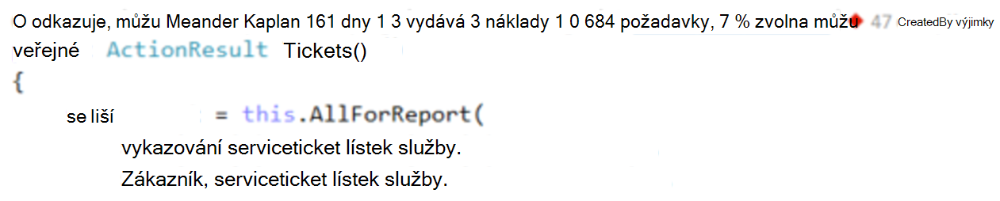
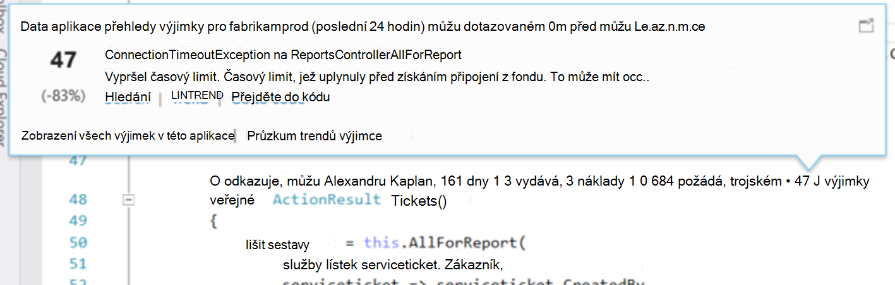
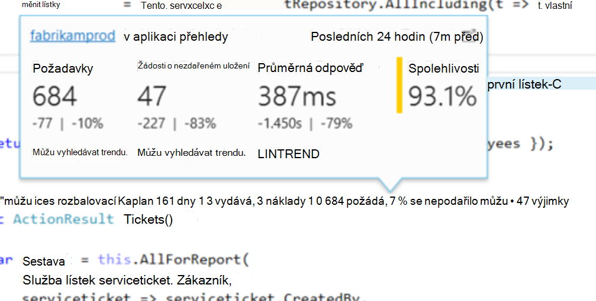
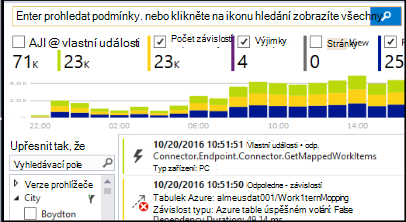
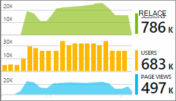

<properties 
    pageTitle="Aplikace přehledy telemetrie ve Visual Studiu CodeLens | Microsoft Azure" 
    description="Rychlý přístup k aplikaci přehledy žádosti a výjimce telemetrie s CodeLens ve Visual Studiu." 
    services="application-insights" 
    documentationCenter=".net"
    authors="numberbycolors" 
    manager="douge"/>

<tags 
    ms.service="application-insights" 
    ms.workload="tbd" 
    ms.tgt_pltfrm="ibiza" 
    ms.devlang="na" 
    ms.topic="get-started-article" 
    ms.date="08/30/2016" 
    ms.author="daviste"/>
    
# Aplikace přehledy telemetrie ve Visual Studiu CodeLens

Metody v kódu webovou aplikaci můžou být označena telemetrie o běhu výjimky a požádat o doby odezvy. Pokud nainstalovat [Přehledy aplikace Visual Studio](app-insights-overview.md) v aplikaci telemetrie se zobrazí ve Visual Studiu [CodeLens](https://msdn.microsoft.com/library/dn269218.aspx) - poznámky v horní části jednotlivou funkci, kde jste byli zvyklí, užitečné informace, jako je počet míst funkce odkazuje nebo poslední člověka, který jej upravit.

> [AZURE.NOTE] Aplikace přehledy v CodeLens je k dispozici ve Visual Studiu 2015 aktualizace 3 a novější nebo v rámci nejnovější verze [rozšíření Developer analytických nástrojů](https://visualstudiogallery.msdn.microsoft.com/82367b81-3f97-4de1-bbf1-eaf52ddc635a). Pole organizace a Professional edice Visual Studio neexistuje CodeLens.

## Kde najdete aplikace interpretaci dat.

Najděte aplikaci přehledy telemetrie v CodeLens indikátory metody veřejné požadavků webové aplikace. CodeLens indikátory jsou zobrazené nad metoda a jiných deklarace v jazyce C# a Visual Basic kódu. Pokud je k dispozici pro metodu přehledy aplikace dat, zobrazí se indikátory žádosti o schůzku a výjimky například "100 požádá, se nepodařilo 1 %" nebo "10." Klikněte na indikátor CodeLens další podrobnosti. 

> [AZURE.TIP] Žádosti o aplikaci přehledy a indikátory výjimce může trvat několik dalších sekund, než načtení po se zobrazí další CodeLens indikátory.

## Výjimky v CodeLens

Indikátor CodeLens výjimce zobrazuje počet výjimek, ke kterým došlo v posledních 24 hodin od 15 modus-nejčastěji výskytu výjimky v aplikaci během tohoto období během zpracování požadavku podávané množství metodou.

Pokud chcete zobrazit podrobnosti, klikněte na indikátor CodeLens výjimky:

* Procentuální změnu v počet výjimek z posledních 24 hodin vzhledem k předchozí 24 hodin
* Přejděte do zdrojového kódu pro funkci vyvolání výjimky zvolte **Přejít do kódu**
* Klikněte na **Hledat** k vytvoření dotazu všechny výskyty tato výjimka, ke kterým došlo v posledních 24 hodin
* Zvolte **trendu** zobrazíte trendu vizualizace pro výskyty tato výjimka za posledních 24 hodin
* Zvolte **zobrazení všech výjimek tuto aplikaci** k vytvoření dotazu všech výjimek, ke kterým došlo v posledních 24 hodin
* Zvolte **Prozkoumat výjimce trendů** zobrazíte vizualizace trend u všech výjimek, ke kterým došlo v posledních 24 hodin. 

> [AZURE.TIP] Pokud naopak uvidíte "0 výjimky" v CodeLens, ale víte, že by měl být výjimky, zkontrolujte správné zdroje aplikace přehledy v modelu CodeLens. Pokud chcete vybrat jiného zdroje, klikněte pravým tlačítkem myši na projektu v Průzkumníku řešení a zvolte **přehledy aplikace > Zvolit zdroj Telemetrie**. CodeLens se zobrazí pouze pro 15 většina nejčastěji se vyskytující výjimek v aplikaci za posledních 24 hodin, Ano, pokud výjimku 16 modus-nejčastěji nebo menší, uvidíte "0 výjimky." Výjimky z ASP.NET zobrazení nemusí zobrazit v metod řadiče generovaných těmito zobrazení.

> [AZURE.TIP] Pokud se zobrazí "? výjimky"v CodeLens, budete muset účet Azure přidružit Visual Studio nebo vypršela platnost účet Azure pověření. V obou případech klikněte na "? výjimky"a zvolte **Přidat účet …** a zadejte svoje přihlašovací údaje.

## Požadavky na CodeLens

Žádost o CodeLens indikátor se zobrazí číslo požadavků HTTP, která byla vyřízení metodou posledních 24 hodin a procento tyto požadavky, které se nezdařila.

Pokud chcete zobrazit podrobnosti, klikněte na žádosti o CodeLens indikátor:

* Absolutní a procento změnami počet požadavků, neúspěšných požadavků a doby odezvy průměr za posledních 24 hodin v porovnání s předchozí 24 hodin
* Spolehlivost metodu výpočtu v procentech požadavky, které se nezdařilo není v posledních 24 hodin
* Klikněte na **hledání** pro žádosti o nebo selhání žádosti k vytvoření dotazu (neúspěšných) požadavků, ke kterým došlo v posledních 24 hodin
* Zvolte **trendu** zobrazíte vizualizace trendu žádosti o, neúspěšných požadavků nebo průměr odezvy v posledních 24 hodin.
* Vyberte název zdroje přehledy aplikace v levém horním rohu zobrazení Podrobnosti CodeLens chcete změnit, které zdroje se zdrojem dat CodeLens.

## Další kroky

||
|---|---
|**[Práce s aplikací přehledy ve Visual Studiu](app-insights-visual-studio.md)** Hledání telemetrie, zobrazení dat CodeLens a konfigurovat přehledy aplikace. Všechny aplikace Visual Studio. |
|**[Přidání dalších dat](app-insights-asp-net-more.md)** Sledovat použití dostupnost, závislosti, výjimky. Integrace od protokolování rámce. Vytvářet vlastní telemetrie. | 
|**[Práce s portálem přehledy aplikace](app-insights-dashboards.md)** Řídicí panely, výkonné diagnostické nástroje a analytické nástroje, upozornění, live závislost mapu aplikace a telemetrie exportovat. |
