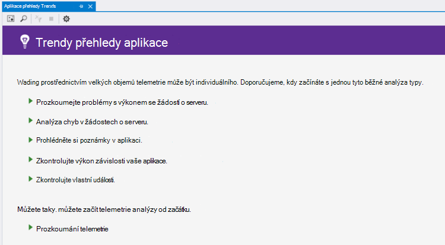
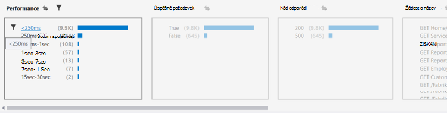
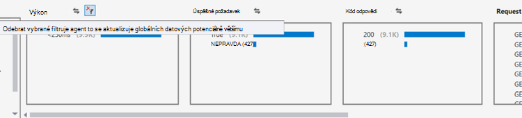
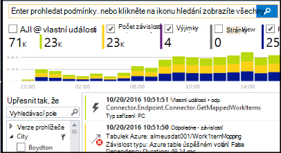
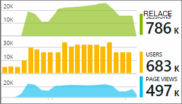

<properties 
    pageTitle="Analýza trendů ve Visual Studiu | Microsoft Azure" 
    description="Analýza, vizualizace a zkoumání trendů v aplikaci přehledy telemetrie ve Visual Studiu." 
    services="application-insights" 
    documentationCenter=".net"
    authors="numberbycolors" 
    manager="douge"/>

<tags 
    ms.service="application-insights" 
    ms.workload="tbd" 
    ms.tgt_pltfrm="ibiza" 
    ms.devlang="na" 
    ms.topic="get-started-article" 
    ms.date="10/25/2016" 
    ms.author="daviste"/>
    
# Analýza trendů v aplikaci Visual Studio

Nástroj aplikace přehledy trendů vizualizují, jak aplikace telemetrie důležité události v průběhu času mění, pomůže vám rychle identifikovat problémy a odchylky. Propojením můžete Podrobnější diagnostické informace trendů můžete zvýšit výkon vaše aplikace vysledovat příčiny výjimky a odhalit přehledy z vlastní události.

> [AZURE.NOTE] Aplikace přehledy trendů je k dispozici ve Visual Studiu 2015 aktualizace 3 a novější nebo pomocí [nástrojů pro vývojáře analýzy příponu](https://visualstudiogallery.msdn.microsoft.com/82367b81-3f97-4de1-bbf1-eaf52ddc635a) verze 5.209 a novější.

## Otevřete aplikaci přehledy trendů

Otevřete okno trendů přehledy aplikace:

* Tlačítka na panelu aplikace přehledy nástrojů, zvolte **Průzkum trendů Telemetrie**nebo
* V místní nabídce Projekt, zvolte **přehledy aplikace > průzkum trendů Telemetrie**, nebo
* V řádku nabídek aplikace Visual Studio výběr **Zobrazení > Další Windows > trendy přehledy aplikace**.

Může se zobrazit výzva k vyberte zdroj. Klikněte na možnost **Vybrat zdroje**, přihlaste se pomocí předplatné Azure a pak vyberte prostředek přehledy aplikace ze seznam, u kterého chcete analýze trendů telemetrie.

## Zvolte analýze trendů

Začínáme – zvolte jednu z pěti běžné analýzy trendů, každý analýze dat z posledních 24 hodin:

* **Problémy s výkonem zjistit s žádostí o server** - žádosti ke službě seskupené podle doby odezvy
* **Analýza chyb v žádostech serveru** - žádosti ke službě seskupené podle kód odpovědi HTTP
* **Zkontrolujte si poznámky v aplikaci** – výjimky z služby, seskupené podle typ výjimky
* **Zkontrolovat výkon aplikace závislosti** – služby s názvem vaší službou seskupené podle doby odezvy
* **Kontrola vlastní události** - vlastní události, které jste nastavili pro vaši službu seskupené podle typu události.

Tyto předem připravené analýzy jsou k dispozici později na tlačítko **Zobrazit běžných typů analýzy telemetrie** v levém horním rohu okna trendy.

## Vizualizace trendy v aplikaci

Aplikace přehledy trendů vytvoří řadu vizualizace času z telemetrie vaše aplikace. Jednotlivé vizualizace řady času slouží k zobrazení jednoho typu telemetrie seskupené podle jednu vlastnost této telemetrie přes některé časového rozsahu. Můžete třeba zobrazit požadavků na server seskupené podle země, odkud pocházejí, za posledních 24 hodin. V tomto příkladu by každé bubliny na vizualizaci představovat počet požadavky serveru pro některé země/oblasti během 1 hodinu.

Pomocí ovládacích prvků v horní části okna upravit, jaké druhy telemetrie zobrazení. Nejdřív vyberte typy telemetrie, ve kterých jste zúčastněnými:

* **Typ telemetrie** – požadavky na serveru, výjimek, depdendencies nebo vlastní události
* **Časový rozsah** – kdekoli v posledních 30 minut na posledních 3 dnů
* **Seskupit podle** - výjimce typ, ID problému, země/oblasti a další.

Potom klikněte na **Analyzovat Telemetrie** spusťte dotaz.

Pokud chcete přejít mezi bubliny ve vizualizaci:

* Kliknutím vyberte bublinový, která aktualizuje filtry v dolní části okna, vytváření souhrnů jenom události, které v průběhu určitého časového období došlo k
* Poklikejte na bublinový přejděte na nástroje hledání a zobrazit všechny jednotlivé telemetrie událostí, ke kterým došlo během tohoto časového období
* Klávesou CTRL bublinu pro zrušte výběr ve vizualizaci.

> [AZURE.TIP] Trendy a hledání nástroje nepomůže společně zdůraznit způsobuje problémy ve službě mezi tisíci telemetrie události. Pokud jeden odpoledne vaši zákazníci Všimněte si aplikaci, která má být pomaleji, začněte například trendy. Analýza žádosti ke službě za posledních několik hodin seskupené podle doba odezvy. Zjistěte, zda je clusteru pomalé žádosti o služby neobvyklého. Potom poklikejte na této bublinový přejděte na nástroje hledání filtrované na tyto žádosti o události. Z vyhledávání můžete prohlížet obsah tyto požadavky a přejděte na kód souvisejících tento problém vyřešit.

## Filtr

Seznamte se s konkrétnější trendy pomocí filtrování ovládacích prvků v dolní části okna. Pokud chcete použít filtr, klikněte na jeho název. Můžete rychle přepínat mezi různých filtrů a objevovat trendů, které může skrytí v konkrétní dimenzi vaší telemetrie. Použití filtru v jednom rozměru jako typ výjimky ještě zbývají filtry v jiných rozměry můžete kliknout, i když se zobrazí šedě. Chcete zrušit-použít filtr, klikněte na znovu. CTRL klepnutím vyberte více filtrů ve stejné dimenzi.

Co dělat, když chcete použít více filtrů? 

1. Použijte první filtr. 
2. Klikněte na tlačítko **použít vybraných filtrů a znovu dotazu** podle názvu dimenzi první filtr. Znovu to bude dotaz telemetrie pouze události, které odpovídají první filtr. 
3. Použijte filtr druhé. 
4. Zopakování tohoto postupu zobrazíte trendy v konkrétní podmnožiny vaší telemetrie. Například požadavky serveru s názvem "GET domovské/Index" _a_ , které jste dostali od Německo _a_ dostali odpovědi 500 kód. 

Chcete zrušit-použít jeden z těchto filtrů, klikněte na tlačítko **Odstranit vybrané filtry a znovu dotazu** dimenze.

## Vyhledání odchylky

Nástroj trendů můžete zvýraznit bubliny události, které jsou neobvyklých ve srovnání s jiných bubliny ve stejném časovou řadu. V rozevíracím seznamu Typ zobrazení zvolte **počtem v časového intervalu (zvýraznění odchylky)** nebo **procent v časového intervalu (zvýraznění odchylky)**. Červené bubliny jsou neobvyklých. Odchylky jsou tato pole definovány jako bubliny počty/procent vyšší než 2.1 časy směrodatnou odchylku počty/procent, které v minulosti dvě časová období (48 hodin při zobrazení posledních 24 hodin, atd.).

> [AZURE.TIP] Zvýraznění odchylky je užitečné pro hledání odlehlé hodnoty v časovou řadu malé bublin, které může vypadat jinak podobně velikosti.  

## Další kroky

||
|---|---
|**[Práce s aplikací přehledy ve Visual Studiu](app-insights-visual-studio.md)** Hledání telemetrie, zobrazení dat CodeLens a konfigurovat přehledy aplikace. Všechny aplikace Visual Studio. |
|**[Přidání dalších dat](app-insights-asp-net-more.md)** Sledovat použití dostupnost, závislosti, výjimky. Integrace od protokolování rámce. Vytvářet vlastní telemetrie. | 
|**[Práce s portálem přehledy aplikace](app-insights-dashboards.md)** Řídicí panely, výkonné diagnostické nástroje a analytické nástroje, upozornění, live závislost mapu aplikace a telemetrie exportovat. |
