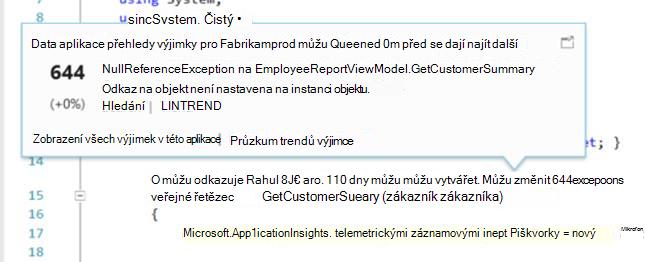

<properties 
    pageTitle="Práce s aplikací přehledy na Visual Studio" 
    description="Analýza výkonu a diagnostice během ladění a výroby." 
    services="application-insights" 
    documentationCenter=".net"
    authors="alancameronwills" 
    manager="douge"/>

<tags 
    ms.service="application-insights" 
    ms.workload="tbd" 
    ms.tgt_pltfrm="ibiza" 
    ms.devlang="na" 
    ms.topic="get-started-article" 
    ms.date="06/21/2016" 
    ms.author="awills"/>

# Práce s aplikací přehledy ve Visual Studiu

Ve Visual Studiu (2015 a novější) můžete Analýza výkonu a Diagnostika problémů s ladění i výrobní, pomocí telemetrie z [Přehledy aplikace Visual Studio](app-insights-overview.md).

Pokud jste tak dosud neučinili [Nainstalovaných aplikací přehledy v aplikaci](app-insights-asp-net.md), udělejte to teď.

## Ladění projektu

Spusťte aplikaci s F5 a vyzkoušet si: Otevřete různých stránkách generovat některé telemetrie.

Ve Visual Studiu zobrazí se počet události, které jste odhlášeni.

Kliknutím na toto tlačítko otevřete diagnostiky hledání. 

## Diagnostiky hledání

Okno hledání obsahuje události, které jste odhlášeni. (Pokud jste přihlášení k Azure při nastavování přehledy aplikace, budete moct vyhledávat stejné události na portálu.)

Hledání textu označené jako pracuje na všechna pole v události. Například vyhledejte část adresy URL stránky; Hodnota vlastnosti například město klienta; nebo nebo určitých slov v trasování protokol.

Klikněte na kterékoli události zobrazíte podrobné vlastnosti.

Můžete také otevřete kartu související položky lépe diagnostikovat neúspěšných požadavků nebo výjimky.

## Diagnostika centrální

Diagnostika centrální (ve Visual Studiu 2015 nebo novější) zobrazen telemetrie serveru přehledy aplikace, která je generováno. To funguje, i když je pouze k instalaci SDK, bez propojovacích ke zdroji na portálu Azure.

## Výjimky

Pokud jste [nastavili sledování výjimek](app-insights-asp-net-exceptions.md), výjimky sestavy se zobrazí v okně hledání. 

Klikněte na tlačítko výjimky získat zásobníku. Pokud kód aplikaci se otevře ve Visual Studiu, můžete procházet z zásobníku relevantní řádek kód.

Kromě toho v řádku kód Lens nad obou metod uvidíte počet výjimek tak, že aplikace přehledy přihlášena posledních 24h.

## Místní sledování

(Z Visual Studio aktualizace 2015 2) Pokud jste to ještě nakonfigurovali SDK telemetrie odešlete portálu přehledy aplikace (tak, aby žádný klíč přístrojového vybavení v ApplicationInsights.config) se zobrazí okno diagnostiky telemetrie od nejnovějšího ladění relace. 

Toto je vhodné, pokud už jste publikovali předchozí verze aplikace. Nechcete, aby telemetrie z vaší ladění relací kombinovaný s telemetrie na portálu aplikace přehledy z aplikace publikované.

Je také užitečné, pokud máte nějaký [vlastní telemetrie](app-insights-api-custom-events-metrics.md) , kterou chcete ladění před odesláním telemetrie k portálu.

* *Nejdřív se úplnou konfiguraci aplikace přehledy telemetrie odešlete na portálu. Ale teď chci najdete v článku telemetrie pouze ve Visual Studiu.*

 * V okně hledání nastavení je možnost Hledat místní diagnostiky i v případě, že aplikace odešle telemetrie k portálu.
 * Telemetrie odesílaného do portálu ukončíte poznámky řádku `<instrumentationkey>...` z ApplicationInsights.config. Až budete chtít znova odeslat telemetrie k portálu, zrušte komentář.

## Trendy

Trendy je nástroj pro vizualizaci chování aplikace určitou dobu. 

**Průzkum trendů Telemetrie** vyberte tlačítko na panelu nástrojů aplikace přehledy nebo okno aplikace přehledy hledání. Vyberte jednu z pěti běžné dotazy na Začínáme. Můžete analyzovat různé datové sady založené na typech telemetrie, časový rozsah a jiné vlastnosti. 

Najít odchylky ve vašich datech, zvolte jednu z možností odchylky v části "Typ zobrazení" rozevíracího seznamu. Možnosti filtrování v dolní části okna usnadnit zdokonalujte v na konkrétní podmnožiny vaší telemetrie.

[Další informace o trendy](app-insights-visual-studio-trends.md).

## Co je další krok?

||
|---|---
|**[Přidání dalších dat](app-insights-asp-net-more.md)** Sledovat použití dostupnost, závislosti, výjimky. Integrace od protokolování rámce. Vytvářet vlastní telemetrie. | 
|**[Práce s portálem přehledy aplikace](app-insights-dashboards.md)** Řídicí panely, výkonné diagnostické nástroje a analytické nástroje, upozornění, live závislost mapu aplikace a telemetrie exportovat. |

 
