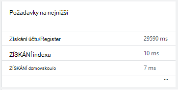

<properties 
    pageTitle="Sledování stavu vaše aplikace a použití s přehledy aplikace" 
    description="Začínáme s aplikací přehledy. Analýzu použití, dostupnost místní nebo aplikace Microsoft Azure." 
    services="application-insights" 
    documentationCenter=""
    authors="alancameronwills" 
    manager="douge"/>

<tags 
    ms.service="application-insights" 
    ms.workload="tbd" 
    ms.tgt_pltfrm="ibiza" 
    ms.devlang="na" 
    ms.topic="article" 
    ms.date="11/25/2015" 
    ms.author="awills"/>
 
# Sledování výkonu ve webových aplikacích

*Přehledy aplikace je v náhledu.*

Ujistěte se, že aplikace je dobrý a rychle zjistěte, jaké jsou všechny chyby. [Aplikace přehledy] [ start] informujte jakékoli problémy s výkonem a výjimky a najít a Diagnostika základních příčin.

Aplikace přehledy můžete sledovat Java a ASP.NET webových aplikací a služeb, služby WCF. Může být hostované místním virtuálních počítačích, nebo jako Microsoft Azure weby. 

Na straně klienta může trvat aplikace přehledy telemetrie z webové stránky a širokou škálu zařízení včetně iOS, Android a Windows Store aplikace.

## Nastavení sledování výkonu

Pokud jste zatím nepřidali přehledy aplikace do projektu (to znamená, pokud není ApplicationInsights.config), zvolte jednu z těchto způsobů, jak začít:

* [ASP.NET web apps](app-insights-asp-net.md)
 * [Přidat výjimku sledování](app-insights-asp-net-exceptions.md)
 * [Přidání sledování závislostí](app-insights-monitor-performance-live-website-now.md)
* [J2EE webové aplikace](app-insights-java-get-started.md)
 * [Přidání sledování závislostí](app-insights-java-agent.md)

## Prozkoumání měřítka

V [portálu Azure](https://portal.azure.com)přejděte do aplikace přehledy prostředek, který jste nastavili pro aplikace. Přehled zásuvné zobrazuje základní výkonu data:

Klikněte na graf zobrazíte další podrobnosti a zobrazíte výsledky delší dobu. Například, klikněte na dlaždici žádosti a vyberte časový rozsah:

Klikněte na graf rozhodnout, jaký metriky slouží k zobrazení, nebo přidejte nový graf a vyberte jeho metriky:

> [AZURE.NOTE] Pokud chcete zobrazit celou výběr, který je k dispozici **zrušte zaškrtnutí všech metriky** . Metriky spadají do skupiny. Při výběru každý člen skupiny se zobrazí jenom ostatní členy této skupiny.

## Co to znamená, že všechny? Dlaždice výkonu a sestavy

Existuje řadu měřítka, který jste dostali. Začněme s těmi, které se ve výchozím nastavení na zásuvné aplikace.

### Požadavky

Počet požadavky HTTP přijaté za určité období. Porovnejte toto s výsledky v dalších sestavách najdete v článku chování aplikace jako načíst se liší.

Požadavky HTTP zahrnout všechny GET nebo POST požadavky na stránky, data a obrázky.

Klikněte na dlaždici zobrazíte počty pro konkrétní adresy URL.

### Průměrná doba odezvy

Opatření časový interval mezi web žádost o zadání aplikace a odpovědi se vrací.

Ukazatel zobrazit klouzavý průměr. Pokud jsou spoustu požadavky, může být některé liší od průměru bez zjevných ve špičce nebo ponořit v grafu.

Vyhledejte neobvyklé píků. Obecně očekávejte doba odezvy roste s nárůst žádosti. Pokud je nepřiměřené, může aplikace zasažení limitu prostředků procesoru ATP kapacitou služeb, které používá.

Klikněte na dlaždici zobrazíte časy pro konkrétní adresy URL.

### Požadavky na nejnižší

Zobrazuje požadavky pravděpodobně bude nutné ladění výkonu.

### Žádosti o nezdařeném uložení

Počet požadavky, které vyvolal nezachycené výjimky.

Klikněte na dlaždici a zobrazit podrobnosti o konkrétní chyby a vyberte individuální žádost zobrazíte její podrobnosti. 

Zástupce vzorku selhání se zachovají individuální kontroly.

### Jiné metriky

Chcete-li zobrazit, nastavit jiné metriky můžete zobrazit, klikněte na graf a potom zrušte výběr všech metriky zobrazíte celé k dispozici. Kliknutím zobrazíte každý metrikou definic (i).

Výběr všech míru zakáže ostatním, které nelze zobrazit v jednom grafu.

## Nastavit upozornění

Aby vás upozornil e-mailem neobvyklé hodnot z libovolné míru, přidejte upozornění. Můžete buď na Odeslat e-mailu pro účet správce nebo konkrétní e-mailové adresy.

Nastavení zdroje před další vlastnosti. Nevyberete, že zdroje webtest požadovaná nastavení upozorňování na výkonu a využití metriky.

Věnujte jednotky, ve kterých se zobrazí výzva k zadání mezní hodnota.

*Proč není vidět tlačítko Přidat oznámení.* – To je skupina účet, ke kterým máte přístup jen pro čtení? Obraťte se na účtu správce.

## Diagnostika problémů

Tady je několik tipů pro hledání a Diagnostika problémů s výkonem:

* Nastavení [webových testů] [ availability] chcete být upozorněni, pokud váš web přejde nebo odpoví nesprávně nebo pomalu. 
* Porovnejte počet požadavku s jiné metriky jestlil selhání nebo pomalé odpovědi se vztahují k načtení.
* [Vložení a prohledávání příkazy trasování] [ diagnostic] v kódu pomůže určit problémy.

## Další kroky

[Web testů] [ availability] -máte web požadavky na Odeslat do aplikace v pravidelných intervalech z celého světa.

[Zachycení a prohledávání diagnostické trasování] [ diagnostic] – vložit sledování volání a procházet výsledky hledání hledejte problémy.

[Použití sledování] [ usage] – zjistěte, jak můžou uživatelé používat aplikaci.

[Poradce při potížích s] [ qna] - a Q & A

## Video

[AZURE.VIDEO performance-monitoring-application-insights]

<!--Link references-->

[availability]: app-insights-monitor-web-app-availability.md
[diagnostic]: app-insights-diagnostic-search.md
[greenbrown]: app-insights-asp-net.md
[qna]: app-insights-troubleshoot-faq.md
[redfield]: app-insights-monitor-performance-live-website-now.md
[start]: app-insights-overview.md
[usage]: app-insights-web-track-usage.md

 
