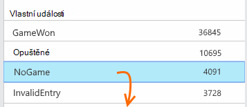

<properties 
    pageTitle="Použití analýzy pro webové aplikace s přehledy aplikace" 
    description="Přehled analýzy použití webových aplikací web apps s přehledy aplikace" 
    services="application-insights" 
    documentationCenter=""
    authors="alancameronwills" 
    manager="douge"/>

<tags 
    ms.service="application-insights" 
    ms.workload="tbd" 
    ms.tgt_pltfrm="ibiza" 
    ms.devlang="na" 
    ms.topic="article" 
    ms.date="06/12/2016" 
    ms.author="awills"/>
 
# <a name="usage-analysis-for-web-applications-with-application-insights"></a>Použití analýzy pro webové aplikace s přehledy aplikace

Víte, jak můžou uživatelé používat aplikaci můžete zaměřit vývojové práce na scénáře, které jsou důležité k nim a získat podstatu cílů, které budou najít jednodušší nebo obtížnější dosáhnout. 

Přehledy aplikace Visual Studio nabízí dvě úrovně sledování:

* **Uživatele, relace a stránky zobrazit data** - mimo pole k dispozici.  
* **Vlastní telemetrie** - [kódu] [ api] trasování vaši uživatelé prostřednictvím uživatelské rozhraní se vaše aplikace. 

## <a name="setting-up"></a>Nastavení

Otevřete aplikaci přehledy zdroje na [Portál Azure](https://portal.azure.com), klikněte na prázdný graf načtení stránky prohlížeče a postupujte podle pokynů instalačního programu.

[Víc se uč](app-insights-javascript.md) 


## <a name="how-popular-is-my-web-application"></a>Jak Oblíbené je webové aplikace?

Přihlaste se k [portálu Azure][portal], přejděte k prostředku aplikace a klikněte na použití:


* **Uživatelů:** Počet jedinečných aktivní uživatelé přes časový rozsah grafu. 
* **Relace:** Počet aktivních relací
* **Zobrazení stránky** Spočítá počet volání trackPageView(), obvykle s názvem jednou každou webovou stránku.

Klikněte na libovolný grafy si můžete prohlédnout podrobněji. Všimněte si, že můžete změnit časový rozsah graf s dílčími pruhy.

### <a name="where-do-my-users-live"></a>Kde služby live svoje uživatele?

Použití zásuvné klikněte na graf uživatelů zobrazíte více podrobností:


 
### <a name="what-browsers-or-operating-systems-do-they-use"></a>Jaké prohlížeče nebo operačních systémech budou používat?

Data skupiny (segment) tak, že vlastnost například prohlížeče, operačního systému nebo City:


## <a name="sessions"></a>Relace

Relace je základních koncepcí v aplikaci přehledech, které snaží přidružit každou událost telemetrie – například žádosti o zobrazení stránky výjimek, nebo vlastní události tento kód můžete sami - relaci určitého uživatele. 

Formátovaný kontextu informace se shromažďují o každé relace, například vlastnosti zařízení, geo umístění, operačního systému a tak dál.

Pokud nástroje klienta a serveru ([ASP.NET] [ greenbrown] nebo [J2EE][java]), SDK rozšíří id relace mezi klienta a serveru, takže můžete srovnávat události na obou stranách.

Když [Diagnostika problémů][diagnostic], můžete najít všechny telemetrie vztahující se k relaci, ve kterém došlo k potížím, včetně výjimky všechny žádosti o a všech událostí nebo trasování, které byly zaznamenány.

Relace poskytují dobrá míra oblíbenosti kontexty ATP zařízení, operační systém umístění. Zobrazuje počet relací seskupené podle zařízení, třeba můžete získat přesnější počtu intervalu toto zařízení používá s aplikací, než počítání zobrazení stránky. To bude užitečný vstupní projít a protřídit z libovolné problém specifický pro zařízení.


#### <a name="whats-a-session"></a>Co je relace?

Relace představuje dojít mezi uživatelem a aplikace. Nejjednodušším způsobem relace začíná uživatele spuštění aplikace a dokončí, když uživatel odejde aplikace. Webových aplikacích pro ve výchozím nastavení relace ukončí po 30 minutách nečinnosti nebo po 24 hodinách aktivity. 

Tato výchozí nastavení můžete změnit úpravou fragment kódu:

    <script type="text/javascript">
        var appInsights= ... { ... }({
            instrumentationKey: "...",
            sessionRenewalMs: 3600000,
            sessionExpirationMs: 172800000
        });

* `sessionRenewalMs`: Čas, v milisekundách platnosti relace kvůli nečinnosti uživatele. Výchozí: 30 minut.
* `sessionExpirationMs`: Relace maximální délka v milisekundách. Pokud uživatel zůstane po tuto dobu aktivní, se počítá jiné relaci. Výchozí: 24 hodin.

**Relace** trvá [míru] [ metrics] zobrazující časový rozsah mezi položkami první a poslední telemetrie relace. (Neobsahuje časový limit.)

**Počet relací** v některých intervalu je definována jako počet jedinečných relace s některé aktivity během tohoto intervalu. Když se podíváte na dlouhý časový rozsah počtu denní relaci pro uplynulém týdnu, to odpovídá obvykle celkový počet relací. 

Při zkoumání kratší časového rozsahu, například hodinové zrno relaci dlouhé trvající několik hodin budou počítat pro každou hodinu, ve kterém bylo aktivní relace. 

## <a name="users-and-user-counts"></a>Uživatelé a počty uživatele


Každá relace uživatele je přidružený jedinečné id uživatele. 

Ve výchozím nastavení uživatel je určen tak, že umístíte soubor cookie. Uživatelům, kteří používají více prohlížeče nebo zařízení se mají být spočítány víckrát. (Ale najdete v článku [ověřené uživatele](#authenticated-users))


**Počet uživatelů** míru v některých intervalu je tato pole definovány jako počet jedinečných uživatelů zaznamenané aktivity během tohoto intervalu. V důsledku toho uživatelé, kteří mají dlouhé relace může vykazují několikrát, když nastavte časový rozsah tak, že zrna je menší než hodiny nebo tak, aby.

**Noví uživatelé** spočítá uživatelé, jejichž první relace s aplikací došlo k během tohoto intervalu. Pokud bude použita výchozí metoda počítání uživatelé soubory cookie, to se rovněž zahrnovat uživatele kdo zrušili jejich souborů cookie, nebo používají nové zařízení a prohlížeče pro přístup k aplikaci poprvé.


### <a name="authenticated-users"></a>Ověřených uživatelů

Pokud váš web appu umožňuje uživatelům přihlásit, dostali přesnější počet poskytnutím přehledy aplikace s jedinečný identifikátor uživatele. Nemusí být jejich jména nebo stejné id, na které můžete použít v aplikaci. Jakmile aplikace byl zjištěn uživatele, použijte tento kód:


*JavaScriptu na klienta*

      appInsights.setAuthenticatedUserContext(userId);

Pokud aplikace skupiny uživatelů do účty, můžete také předáte identifikátor pro účet. 

      appInsights.setAuthenticatedUserContext(userId, accountId);

ID uživatele a účtu nesmí obsahovat mezery a znaků`,;=|`


Vytvoření grafu **Ověřené uživatele** a **účtů**v [Průzkumníkovi metriky](app-insights-metrics-explorer.md). 

## <a name="synthetic-traffic"></a>Syntetické přenosy

Syntetické zahrnují žádosti o dostupnosti a načíst testů, vyhledávacího stroje indexaci a jiných agenti. 

Aplikace pokusech přehledy snaží automaticky zjistit a klasifikovat syntetické přenosy ji a řádně podporovat. Ve většině případů syntetické přenosy vyvolat JavaScript SDK tak, aby tato činnost, nezahrne se uživatel a počítáno relace. 

U aplikace přehledy [webových testů]však[availability]uživatelské id je automaticky nastaveny na základě umístění POP a id relace je nastaveno podle id testu. Ve výchozím sestavy, syntetické přenosy odfiltrované ve výchozím nastavení vyloučí tyto uživatele a relace. Však po však započítávány syntetické přenosy může způsobit malé zvýšení v celkové uživatelů a počty relace.
 
## <a name="page-usage"></a>Použití stránky

Proklikejte grafu zobrazení stránky verzi více zvětšený se změnami společně s rozdělení nejoblíbenější stránek:


 
Z příkladu výše se z webu her. Z něho okamžitě vidíme:

* Použití nebyla vylepšení v uplynulém týdnu. Možná jsme měli vzít v úvahu optimalizaci vyhledávacích webů?
* Mnoho méně uživatelů najdete na stránkách hry než na domovskou stránku. Proč není domovské stránky zajistit všichni přehrát her?
* "Luštitele" je nejoblíbenější hry. Jsme by měl přednostně nové nápady a vylepšení tam.

## <a name="custom-tracking"></a>Vlastní sledování

Předpokládejme, že místo provádění každé hry v samostatnou webovou stránku, se rozhodnete Refaktorovat všechny do aplikace stejné jednostránkové s většina funkcí kódovaný jako JavaScriptu na webovou stránku. To umožňuje uživateli rychle přepínat mezi jeden hra nebo i několik her mít na jedné stránce. 

Rádi byste však pořád aplikace přehledy přihlásit toho, kolikrát každé hry otevřené, přesně stejným způsobem jako při byly na samostatnou webovou stránku. To je snadné: jenom vložení volání modulu telemetrie do svého JavaScript místo, kam chcete záznam, který uživatel otevřel nové "stránky":

    appInsights.trackPageView(game.Name);

## <a name="custom-events"></a>Vlastní události

Vytvářet vlastní telemetrie přihlásit zvláštní události. Zejména v aplikaci jednostránkové bude určitě zajímat, jak často uživatel provede určité akce nebo dosáhne určité cíle: 

    appInsights.trackEvent("GameEnd");

Chcete-li například přihlášení klepnutím na odkaz:

    <a href="target.htm" onclick="appInsights.trackEvent('linkClick');return true;">my link</a>


## <a name="view-counts-of-custom-events"></a>Zobrazení počty vlastní události

Otevřete Průzkumníka metriky a přidejte grafu zobrazte události. Rozdělit podle názvu:


## <a name="drill-into-specific-events"></a>Procházejte zvláštní události

Získat lepší znalost jak typický relace půjde, můžete zaměřit na relaci určitého uživatele, který obsahuje určitou druhu události. 

V tomto příkladu jsme kódovaný vlastní události "NoGame", která se nazývá, pokud se uživatel přihlásí bez skutečného zahájení hry. Proč byste měli uživatele to udělat? Pokud nám procházejte některé zvláštní události, jsme možná zobrazí chyba potvrzením. 

Vlastní události dostali z aplikace jsou uvedeny podle názvu na zásuvné základní informace:



 
Proklikejte se události úrok a vyberte poslední konkrétní výskyt:


 
Podívejme se na všechny telemetrie relaci došlo k danou NoGame událost. 


 
Došlo k žádné výjimky tak, aby uživateli nebyl zabráněno přehrávání některé selháním.
 
Jsme odfiltrovat všechny typy telemetrie kromě zobrazení stránky pro tuto relaci:


 
A teď vidíme, že tento uživatel přihlášena jednoduše ke kontrole nejnovější skóre. Možná jsme byste měli vědět vývoj příběhu uživatele, který usnadňuje to udělat. (A dojde určitého textu jsme měli implementovat vlastní událost do sestavy)

## <a name="filter-search-and-segment-your-data-with-properties"></a>Filtrování, hledání a segmentech dat s vlastnostmi
Libovolný značky a číselné hodnoty můžete připojení k události.
 

*JavaScriptu na klienta*

```JavaScript

    appInsights.trackEvent("WinGame",
        // String properties:
        {Game: currentGame.name, Difficulty: currentGame.difficulty},
        // Numeric measurements:
        {Score: currentGame.score, Opponents: currentGame.opponentCount}
    );
```

*C# na serveru*

```C#

    // Set up some properties:
    var properties = new Dictionary <string, string> 
        {{"game", currentGame.Name}, {"difficulty", currentGame.Difficulty}};
    var measurements = new Dictionary <string, double>
        {{"Score", currentGame.Score}, {"Opponents", currentGame.OpponentCount}};

    // Send the event:
    telemetry.TrackEvent("WinGame", properties, measurements);
```

*VB na serveru*

```VB

    ' Set up some properties:
    Dim properties = New Dictionary (Of String, String)
    properties.Add("game", currentGame.Name)
    properties.Add("difficulty", currentGame.Difficulty)

    Dim measurements = New Dictionary (Of String, Double)
    measurements.Add("Score", currentGame.Score)
    measurements.Add("Opponents", currentGame.OpponentCount)

    ' Send the event:
    telemetry.TrackEvent("WinGame", properties, measurements)
```

Vlastnosti připojení k zobrazení stránky stejným způsobem:

*JavaScriptu na klienta*

```JS

    appInsights.trackPageView("Win", 
        url,
        {Game: currentGame.Name}, 
        {Score: currentGame.Score});
```

Do pole diagnostiky hledání zobrazte vlastnosti po kliknutí na Procházet jednotlivé výskyt události.


 
Zobrazíte výskyty události s hodnotou nemovitosti konkrétní pomocí vyhledávacího pole.


## <a name="a--b-testing"></a>A | Testování B

Pokud si nejste jisti, jakou variantu funkce bude úspěšnější, uvolněte oba, díky každý přístupné pro jiné uživatele. Měřit úspěšnost každé a pak posuňte jednotné verzi.

Pro tento postup připojíte různých značky všechny telemetrie odesílané ve všech verzích aplikace. Můžete to udělat tak, že definování vlastností v aktivním TelemetryContext. Tyto vlastnosti výchozí se přidají do každé telemetrie zprávy, která odešle žádost – nejenom vlastní zprávy, ale i standardní telemetrie. 

Na portálu aplikace přehledy potom budete moct filtr a seskupení (segment) data značek tak, aby porovnat v různých verzích Excelu.

*C# na serveru*

```C#

    using Microsoft.ApplicationInsights.DataContracts;

    var context = new TelemetryContext();
    context.Properties["Game"] = currentGame.Name;
    var telemetry = new TelemetryClient(context);
    // Now all telemetry will automatically be sent with the context property:
    telemetry.TrackEvent("WinGame");
```

*VB na serveru*

```VB

    Dim context = New TelemetryContext
    context.Properties("Game") = currentGame.Name
    Dim telemetry = New TelemetryClient(context)
    ' Now all telemetry will automatically be sent with the context property:
    telemetry.TrackEvent("WinGame")
```

Jednotlivé telemetrie můžete změnit výchozí hodnoty.

Univerzální inicializační můžete nastavit tak, aby všechny nové TelemetryClients automaticky používat kontext.

```C#


    // Telemetry initializer class
    public class MyTelemetryInitializer : ITelemetryInitializer
    {
        public void Initialize (ITelemetry telemetry)
        {
            telemetry.Properties["AppVersion"] = "v2.1";
        }
    }
```

V inicializačním aplikace například Global.asax.cs:

```C#

    protected void Application_Start()
    {
        // ...
        TelemetryConfiguration.Active.TelemetryInitializers
        .Add(new MyTelemetryInitializer());
    }
```


## <a name="build---measure---learn"></a>Sestavení – míra – informace

Při použití technologie pro analýzu bude integrovanou součástí cyklu vývoje – stačí něco si myslíte o k řešení problémů. Tady je několik tipů:

* Určení klíčové míru aplikace. Budete chtít tolik uživatelé největšímu nebo dáváte přednost kratších seznamů všechno uživatelů? Chcete maximalizovat návštěvy nebo prodeje?
* Chcete změřit každý článek. Při vytváření náčrtků příběhu nového uživatele nebo funkce nebo plán aktualizace již existujícího vždy popřemýšlet o tom, jak bude měřit úspěšnost změny. Před kódování spustí, zeptejte se "jaký vliv bude to mít naše metrice, pokud to funguje? Vhodné jsme sledovat všechny nové zvláštní události?"
A samozřejmě, je-li funkci živou, zkontrolujte, podívejte se na analýz a pracovat na stránce výsledků. 
* Jiné metriky týkají klíčové míru. Například, pokud chcete přidat funkci "Oblíbené", rádi byste vědět, jak často uživatelé přidávat oblíbené položky. Pořád možná další zajímavé vědět, jak často se vraťte na své oblíbené položky. A co je nejdůležitější, se zákazníky, kteří používají Oblíbené položky nakonec koupit většího počtu produktů?
* Kanárských testování. Nastavte si funkce přepínač, který umožňuje vytvořit novou funkci zobrazuje jenom někteří uživatelé. Pomocí aplikace přehledy uvidíte novou funkci používá způsobem, který jste právě zamýšlená. Úpravy a potom uvolněte širší cílové skupině.
* Obraťte se na vaši uživatelé! Technologie pro analýzu není dost na vlastní, ale doplňkovou na údržbu relace dobré zákazníka.


## <a name="references"></a>Odkazy

* [Použití rozhraní API – přehled][api]
* [Rozhraní API JavaScript odkaz](https://github.com/Microsoft/ApplicationInsights-JS/blob/master/API-reference.md)

## <a name="video"></a>Video

> [AZURE.VIDEO usage-monitoring-application-insights]


<!--Link references-->

[api]: app-insights-api-custom-events-metrics.md
[availability]: app-insights-monitor-web-app-availability.md
[client]: app-insights-javascript.md
[diagnostic]: app-insights-diagnostic-search.md
[greenbrown]: app-insights-asp-net.md
[java]: app-insights-java-get-started.md
[metrics]: app-insights-metrics-explorer.md
[portal]: http://portal.azure.com/
[windows]: app-insights-windows-get-started.md

 
