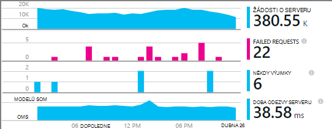
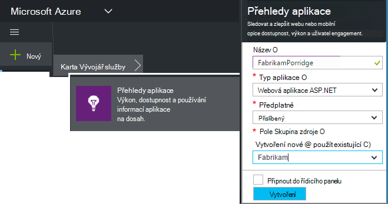
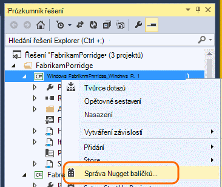
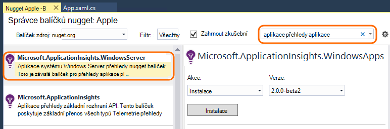
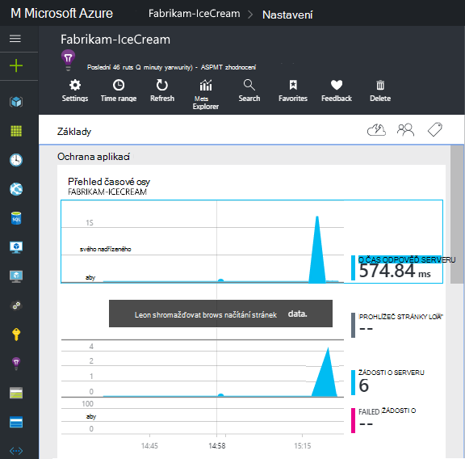
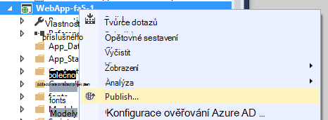

<properties
    pageTitle="Aplikace přehledy pro služby a pracovní role | Microsoft Azure"
    description="Ruční přidání SDK přehledy aplikace aplikace ASP.NET analýzu použití, dostupnosti."
    services="application-insights"
    documentationCenter=".net"
    authors="alancameronwills"
    manager="douge"/>

<tags
    ms.service="application-insights"
    ms.workload="tbd"
    ms.tgt_pltfrm="ibiza"
    ms.devlang="na"
    ms.topic="get-started-article"
    ms.date="08/30/2016"
    ms.author="awills"/>

# Ruční konfigurace aplikací přehledy pro aplikace ASP.NET 4

*Přehledy aplikace je v náhledu.*

[AZURE.INCLUDE [app-insights-selector-get-started](../../includes/app-insights-selector-get-started.md)]

Můžete ručně konfigurovat [Přehledy aplikace Visual Studio](app-insights-overview.md) můžete sledovat služby systému Windows, role pracovníka a jiných aplikacích ASP.NET. Webových aplikacích pro ruční konfigurace je alternativy se [Automatické nastavení](app-insights-asp-net.md) nabízené Visual Studio.

Přehledy aplikace umožňuje Diagnostika problémů a sledovat výkon a použití v aplikaci live.

#### Než začnete

Potřebuješ:

* Předplatné [Microsoft Azure](http://azure.com). Pokud váš tým nebo organizace má předplatné Azure, vlastník můžete přidat můžete k ní pomocí svého [účtu Microsoft](http://live.com).
* Visual Studio 2013 nebo novější.

## 1. vytvořit přehledy aplikace zdroje

Přihlaste se k [portálu Azure](https://portal.azure.com/)a vytvoření nového prostředku přehledy aplikace. Zvolte ASP.NET jako typ aplikace.

[Zdroje](app-insights-resources-roles-access-control.md) v Azure je instancí služby. Kde analyzovat a prezentovat vám telemetrie z aplikace je tento zdroj.

Volba aplikace typu nastaví výchozí obsah listy zdroje a vlastnosti v [Průzkumníkovi metriky](app-insights-metrics-explorer.md)viditelné.

#### Zkopírujte klávesu přístrojového vybavení

Klíč označuje zdroj a budete ji nainstalovat brzy bude k dispozici v SDK směrování dat tomuto zdroji.

Kroky, které už máte hotové jenom k vytvoření nového zdroje jsou užitečné při spuštění sledování libovolné aplikaci. Nyní můžete odeslat data do ní.

## 2. v aplikaci nainstalujte SDK

Instalace a konfigurace SDK přehledy aplikace liší se podle platformy, které pracujete. K aplikacím ASP.NET je snadné.

1. Ve Visual Studiu upravte balíčků NuGet projektu web app.

    

2. Instalace aplikace přehledy SDK webových aplikací pro.

    

    *Můžete použít jiné balíčky?*

    Ano. Pokud chcete odeslat vlastní telemetrie pomocí rozhraní API, zvolte rozhraní API Core (Microsoft.ApplicationInsights). Balíček systému Windows Server automaticky obsahuje rozhraní API služby základní plus několik dalších balíčků například kolekce èítaèù výkonu a sledování závislost. 

#### Upgrade na budoucí verze SDK

Jsme verze nové sady SDK od času.

Upgrade na [novou verzi SDK](https://github.com/Microsoft/ApplicationInsights-dotnet-server/releases/), otevřete NuGet balíčku znovu správce a filtru u instalovaný balíčků. Vyberte **Microsoft.ApplicationInsights.Web** a zvolte **upgradovat**.

Pokud jste provedli jakékoli úpravy ApplicationInsights.config, uložte jeho kopii před upgradem a poté sloučit změny do nové verze.

## 3. odeslat telemetrie

**Pokud jste nainstalovali pouze základní rozhraní API balíček:**

* Nastavit klíč přístrojového vybavení v kódu, například `main()`: 

    `TelemetryConfiguration.Active.InstrumentationKey = "`*kód*`";` 

* [Napište vlastní telemetrie pomocí rozhraní API](app-insights-api-custom-events-metrics.md#ikey).

**Pokud jste si nainstalovali ostatní balíčky aplikace přehledy** , můžete v případě potřeby můžete nastavit klávesu přístrojového vybavení pomocí souboru config:

* Úprava ApplicationInsights.config (který jsme přidali tak, že instalace NuGet). Vkládaný znak těsně před uzavírací značku:

    `<InstrumentationKey>`*zkopírovaný klávesu přístrojového vybavení*`</InstrumentationKey>`

* Ujistěte se, že jsou vlastnosti ApplicationInsights.config v okně Průzkumník nastavena na **Akce sestavení = obsah, kopírovat do adresáře výstup = kopírovat**.

## Spuštění projektu

Spusťte aplikaci a vyzkoušet pomocí **F5** : Otevřete různých stránkách generovat některé telemetrie.

Ve Visual Studiu zobrazí se počet události, které byly odeslány.

## Zobrazení vašeho telemetrie

Vraťte se do [portálu Azure](https://portal.azure.com/) a vyhledejte aplikaci přehledy zdroje.

Hledejte data v grafech Přehled. Nejdřív uvidíte jenom jednou nebo dvěma body. Příklad:

Proklikejte grafu zobrazíte podrobnější metriky. [Další informace o metriky.](app-insights-web-monitor-performance.md)

#### Žádná data?

* Používání aplikace otevření jiné stránky, aby vygeneruje některé telemetrie.
* Otevřete dlaždici [hledání](app-insights-diagnostic-search.md) zobrazíte jednotlivých událostí. Někdy trvá události trochu během delší dostanou přes metriky kanálu.
* Počkejte několik sekund, než a klikněte na **Aktualizovat**. Grafy aktualizovat sami pravidelně, ale můžete v případě, že tam čekáte pro některá data neprojeví ručně aktualizovat.
* Viz [Poradce při potížích](app-insights-troubleshoot-faq.md).

## Publikování aplikace

Teď nasazení aplikace k serveru nebo Azure a sledování dat nahromadit.

Při spuštění v režimu ladění telemetrie je přenos naopak průchod kanálem k odesílání, takže byste měli vidět data zobrazená vyvolané. Při nasazení aplikace v konfiguraci vydání pomaleji shromáždí data.

#### Žádná data po publikování na serveru?

Otevřete tyto porty pro odchozí přenosy dat v bráně firewall vaší serveru:

+ `dc.services.visualstudio.com:443`
+ `f5.services.visualstudio.com:443`

#### Máte potíže s na serveru vytvořit?

Přečtěte si téma [tuto položku Poradce při potížích](app-insights-asp-net-troubleshoot-no-data.md#NuGetBuild).

> [AZURE.NOTE]Pokud aplikace vygeneruje spoustu telemetrie (a používáte 2.0.0-beta3 verze technologie ASP.NET SDK nebo novější), modulu adaptivní odběr automaticky sníží hlasitost odesílané tak, že pouze zástupce zlomek události na portálu. Zvláštní události, které se vztahují k stejnou žádost o však budou vybrané nebo vybraná jako skupinu, takže je můžete přecházet mezi související události. 
> [Přečtěte si víc o odběr](app-insights-sampling.md).

## Další kroky

* Pokud chcete získat přehled úplné 360 stupňů aplikace [Přidat další telemetrie](app-insights-asp-net-more.md) .

