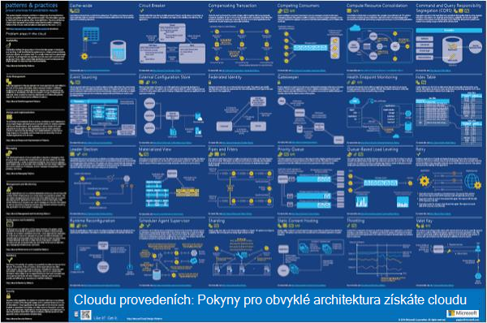
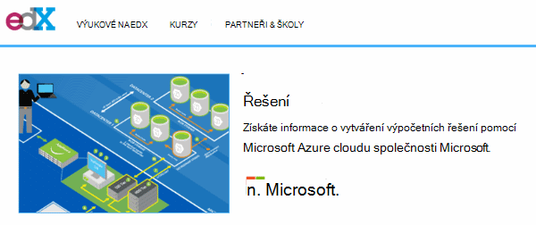
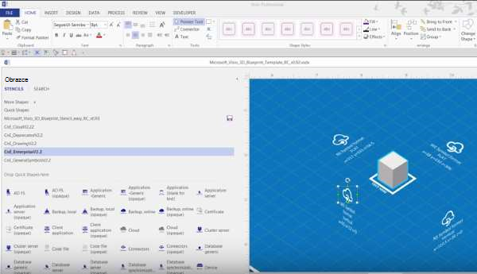
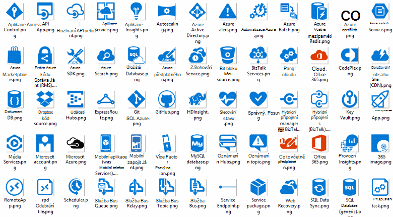
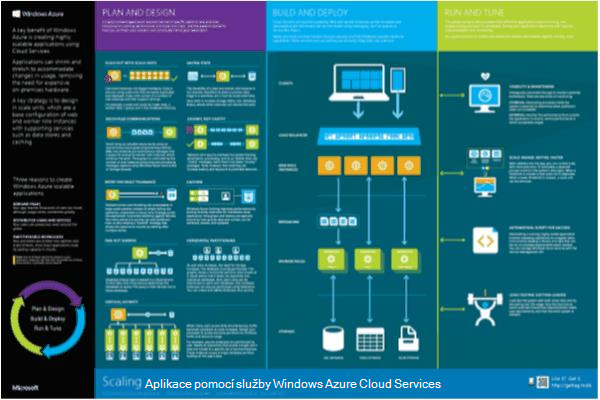

<properties 
    pageTitle="Architektura aplikací na Microsoft Azure | Microsoft Azure" 
    description="Přehled, které bude pokrývat provedeních běžné" 
    services="" 
    documentationCenter="" 
    authors="Rboucher" 
    manager="jwhit" 
    editor="mattshel"/>

<tags 
    ms.service="multiple" 
    ms.workload="na" 
    ms.tgt_pltfrm="na" 
    ms.devlang="na" 
    ms.topic="article" 
    ms.date="09/13/2016" 
    ms.author="robb"/>

#Architektura aplikací na Microsoft Azure
Zdroje pro vytváření aplikací, které používají Microsoft Azure. Tato volba zahrnuje nástroje pro kreslení diagramů vizuálně popisuje systémy softwaru. 

##Návrh vzorků plakát

Microsoft trendy a postupy publikovala knihy [Provedeních cloudu](http://msdn.microsoft.com/library/dn568099.aspx) , která je dostupná na webu MSDN i v PDF souboru ke stažení. Je také velký formát plakátu dostupná kde jsou uvedeny všechny vzorky. 

##Microsoft architektura certifikační kurzu

Společnost Microsoft vytvořila architektura kurzu podpůrných Microsoft certifikační zkušebních 70-534. Je k [dispozici zdarma na EDX.ORG](https://www.edx.org/course/architecting-microsoft-azure-solutions-microsoft-dev205x).  Použije [3D šablonu Visia přehled](#3d-blueprint-visio-template). 

##Řešení společnosti Microsoft

Microsoft publikuje sadu vysoké úrovně [architektury řešení](http://aka.ms/azblueprints) znázorňující, jak vytvářet určité typy systémů pomocí produkty společnosti Microsoft. 

V předchozích verzích Microsoft Publikovat sadu modrotisků zobrazující příklad architektury. Můžou být byly nahrazeny architektury řešení jsme zmínili dříve a odkaz na plán, podle kterého byla přesměrována tak, aby ukazovaly na ně. Pokud potřebujete přístup k předchozí materiály modrotisků z nějakého důvodu, e-mailem [CnESymbols@microsoft.com](mailto:CnESymbols@microsoft.com) s žádostí o.   

Modrotisků a diagramy architektury řešení pomocí částí [cloudu a Enterprise Symbol](#Drawing-symbol-and-icon-sets).   

##3D šablonu Visia přehled

3D verzích teď nepoužívané [Microsoft architektura modrotisků](http://aka.ms/azblueprints) původně vytvořených v nástroji jiných výrobců. Na 5 srpna 2015 jako součást [Microsoft architektura certifikační kurzu distributed na EDX.ORG](#microsoft-architecture-certification-course)položka Expedovaná šablonu Visia 2013 (a novější).

Šablona je také k dispozici mimo kurzu. 

- [Zobrazení videa školení](http://aka.ms/3dBlueprintTemplateVideo) první abyste věděli, co můžete dělat   
- Stáhněte si [Microsoft 3d šablonu Visia přehled](http://aka.ms/3DBlueprintTemplate)
- Stáhněte si [cloudu a Enterprise symboly](#drawing-symbol-and-icon-sets) pro práci s 3D šablony. 

E-mailové adrese [CnESymbols@microsoft.com](mailto:CnESymbols@microsoft.com) pro konkrétními otázkami není zodpovězené školicí materiály nebo chcete říct svůj názor. Šablony je už aktivní vyvíjí, ale je pořád užitečná a relevantními značkami, protože může použít jakékoli PNG nebo [cloudu a Enterprise symboly](#drawing-symbol-and-icon-sets), které mají být aktualizovány.  

##Symbol a ikona sady výkresu 

[Zobrazení aplikace Visio a symboly školicí video](http://aka.ms/CnESymbolsVideo) a potom [Stáhnout cloudu a nastavte Enterprise Symbol](http://aka.ms/CnESymbols) k vytvoření technické materiály, které popisují Azure, Windows Server, SQL Server a další. Pokud v knize soupravy uživatelé použít v produktech společnosti Microsoft, můžete použít symboly v architektura diagramy, školicí materiály, prezentace, datových listech, infographics, dokumenty White Paper a dokonce 3 stran publikace. Ale nejsou určeny pro použití v uživatelského rozhraní.

Symboly CnE jsou ve formátu aplikace Visio, SVG a PNG. Další informace o použití snadno pomocí symbolů v aplikaci PowerPoint jsou součástí sady. 

Symbol nastavení se dodává čtvrtletní a se aktualizuje podle vydání nové služby. 

Další symboly pro Microsoft Office a související technologie jsou dostupné v [Aplikaci Microsoft Office Visio vzorník](http://www.microsoft.com/en-us/download/details.aspx?id=35772), když nejsou optimalizované pro architektonické diagramy, jako je sada CnE.   

**Zpětné vazby:** Pokud jste vypotřebovali CnE symboly, vyplňte krátké 5 Otázka [průzkumu](http://aka.ms/azuresymbolssurveyv2) nebo e-mailové adrese [CnESymbols@microsoft.com](mailto:CnESymbols@microsoft.com) pro konkrétní otázky a problémy. Chtěli jsme vědět, co si myslíte, včetně kladné zpětnou vazbu, abychom dál investovat čas v nich. 

##Architektura Infographics

Společnost Microsoft publikuje několik architektura související plakáty/infographics. Obsahují [Vytváření reálný cloudu aplikací](https://azure.microsoft.com/documentation/infographics/building-real-world-cloud-apps/) a [Měřítko Cloudovým službám](https://azure.microsoft.com/documentation/infographics/cloud-services/) . 

