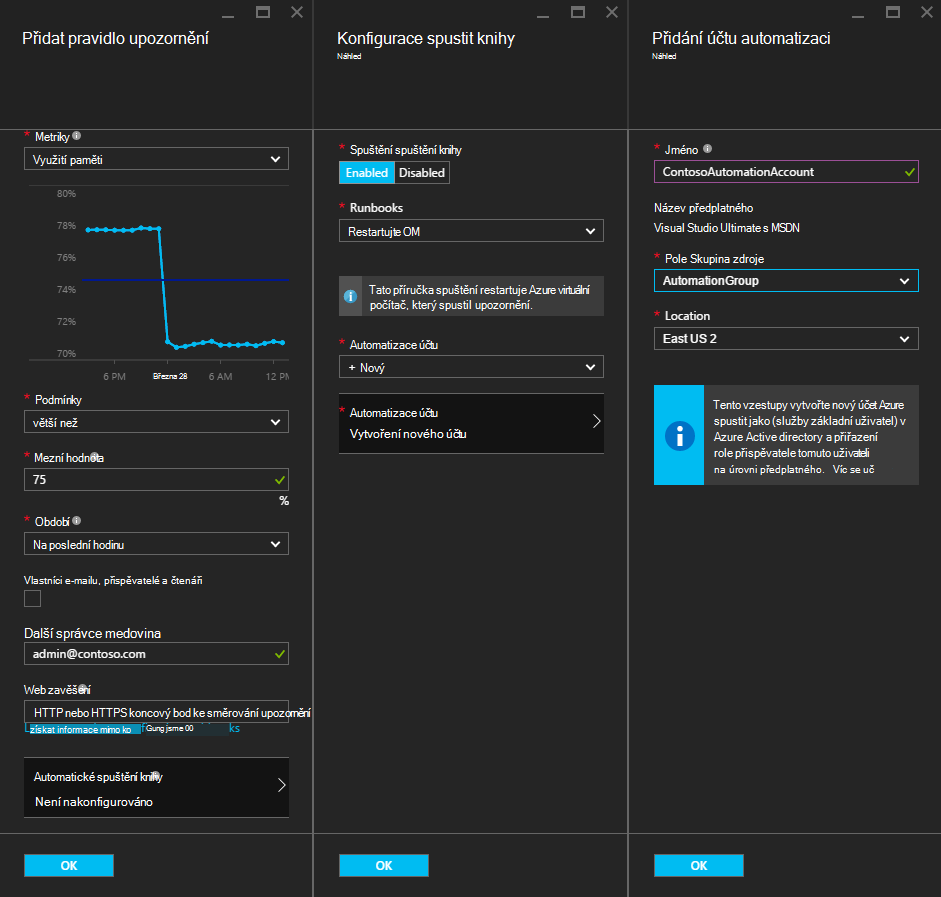

<properties
    pageTitle=" Nápravě Azure OM upozornění s automatizaci Runbooks | Microsoft Azure"
    description="Tento článek ukazuje, jak integrovat Azure automatizaci runbooks Azure virtuálního počítače upozornění a automatického napravovat problémy"
    services="automation"
    documentationCenter=""
    authors="mgoedtel"
    manager="jwhit"
    editor="tysonn" />    
<tags
    ms.service="automation"
    ms.devlang="na"
    ms.topic="article"
    ms.tgt_pltfrm="na"
    ms.workload="infrastructure-services"
    ms.date="06/14/2016"
    ms.author="csand;magoedte" />

# <a name="azure-automation-scenario---remediate-azure-vm-alerts"></a>Azure automatizaci scénář – nápravě Azure OM upozornění

Azure automatizace a Azure virtuálních počítačích byla vydána nová funkce umožňuje konfigurace upozornění virtuální Stroj spuštění runbooks automatizaci. Nová funkce umožňuje automaticky provádět standardní remediation ve výstraze OM, jako je restartování nebo zastavení OM.

Dříve při vytváření pravidla výstrahy OM bylo možné [zadat automatizaci webhook](https://azure.microsoft.com/blog/using-azure-automation-to-take-actions-on-azure-alerts/) postupu runbook ke spuštění postupu runbook pokaždé, když výstraha. Však to potřeba udělat práce pro vytváření postupu runbook, vytváření webhook postupu runbook a potom kopírování a vkládání webhook při vytváření pravidla výstrahy. V tomto nového vydání procesu totiž mnohem jednodušší přímo můžete postupu runbook ze seznamu při vytváření pravidla výstrahy a můžete si vybrat automatizaci účtu, který má být spuštěn postupu runbook nebo snadno vytvořit účet.

V tomto článku si ukážeme jak je snadné nastavení upozornění Azure OM a konfigurace automatizaci postupu runbook pro každé aktivaci upozornění. Příklady scénářů patří restartování virtuálního počítače při využití paměti překročí některé prahovou hodnotu z důvodu aplikace na OM s paměť nebo zastavení virtuálního počítače uživatelského času procesoru má po méně než 1 % minulých hodinu a se nepoužívá. Budeme se vysvětluje, jak automatické vytváření služby základní ve vašem účtu automatizaci zjednodušuje používání runbooks v Azure upozornění remediation.

## <a name="create-an-alert-on-a-vm"></a>Vytvoření upozornění na virtuálního počítače

Proveďte následující kroky pro nastavení upozornění pro snadné spuštění postupu runbook při splnění prahové hodnoty.

>[AZURE.NOTE] V této verzi pouze podporujeme V2 virtuálních počítačích a podporu pro klasické, které VMs přidají brzy bude k dispozici.  

1. Přihlaste se k portálu Azure a klikněte na **virtuálních počítačích**.  
2. Vyberte jednu z virtuálních počítačích.  Zobrazí zásuvné řídicího panelu virtuálního počítače a **Nastavení** zásuvné vpravo.  
3. Z zásuvné **Nastavení** vyberte v části sledování **upozornění pravidla**.
4. Na zásuvné **upozornění pravidla** klikněte na **Přidat upozornění**.

Otevře se zásuvné **Přidat pravidlo výstrahy** , kde můžete konfigurovat podmínky pro upozornění a zvolit jeden nebo všechny z těchto možností: někomu poslat e-mailu, použijte webhook k přeposlání upozornění k jinému systému nebo v odpovědi pokus o nápravě problém spustit postupu runbook automatizaci.

## <a name="configure-a-runbook"></a>Konfigurace postupu runbook

Abyste mohli nakonfigurovat postupu runbook Pokud došlo ke splnění upozornění mezní OM spouštět, vyberte **Postupu Runbook automatizaci**. V zásuvné **postupu runbook konfigurovat** můžete vybrat postupu runbook spustit a účtu automatické spuštění postupu runbook.



>[AZURE.NOTE] V této verzi můžete si vybrat z tři runbooks, které tato služba poskytuje – restartujte OM, zastavit OM nebo odebrání OM (odstranit).  Možnost vybrat jiné runbooks nebo jiné vlastní runbooks budou k dispozici v budoucí verzi.


Po výběru tři dostupné runbooks se zobrazí seznam rozevírací seznam **Automatické účtu** a vyberete účet automatické spuštění postupu runbook jako. Runbooks potřeba spustit v kontextu [automatizaci účtu](automation-security-overview.md) , který je v Azure předplatné. Můžete vybrat účet automatizaci, že jste již vytvořili nebo máte vytvořit nový účet automatizaci za vás.

Runbooks, které jsou k dispozici ověřit Azure pomocí služby jistinu. Pokud budete chtít spustit postupu runbook v jednom ze stávajících účtů automatizaci, automaticky vytvoříme služby základní za vás. Pokud budete chtít vytvořit nový účet automatizaci, pak automaticky vytvoříme účet a služba jistinu. V obou případech dva prostředky také se vytvoří v okně automatizaci účet – certifikát majetku s názvem **AzureRunAsCertificate** a materiálů připojení s názvem **AzureRunAsConnection**. Runbooks použije **AzureRunAsConnection** ověření s Azure k provedení akce správy proti OM.

>[AZURE.NOTE] Hlavní služby se vytvoří v rozsahu předplatné a přiřazené role přispěvatele. Tato role je nutná k účtu, který má oprávnění ke spuštění automatizaci runbooks ke správě Azure VMs.  Vytvoření účtu Automaton nebo služby základní je jednorázovou událost. Jakmile se vytvářejí, slouží ke spuštění runbooks pro ostatní upozornění Azure OM tohoto účtu.

Po klepnutí na tlačítko **OK** je nakonfigurovaný na upozornění a pokud jste vybrali možnost vytvořit nový účet automatizaci, vytváří se spolu s služby základní.  To může trvat několik sekund, než dokončete.  


Po dokončení konfigurace uvidíte název postupu runbook se zobrazí v zásuvné **Přidat pravidlo upozornění** .


Klikněte na tlačítko **OK** v **Přidat pravidlo výstrahy** zásuvné pravidlo výstrahy se vytvoří a aktivovat, pokud je počítač virtuální spuštěna.

### <a name="enable-or-disable-a-runbook"></a>Povolení nebo zakázání postupu runbook

Pokud máte postupu runbook nakonfigurován pro upozornění, můžete ho zakázat bez odebrání konfigurace postupu runbook. Díky ponechat oznámení spuštěný a případně testování některá pravidel výstrah později opětovné povolení postupu runbook.

## <a name="create-a-runbook-that-works-with-an-azure-alert"></a>Vytvoření postupu runbook, se kterými spolupracuje Azure upozornění

Při výběru postupu runbook jako součást pravidla Azure výstrahy postupu runbook musí mít logiky v něm ke správě upozornění, které je do ní data.  Když postupu runbook nakonfigurovaný v pravidle výstrahy, webhook se vytvoří postupu runbook; Tento webhook je pak použít ke spuštění postupu runbook pokaždé, když aktivaci upozornění.  Skutečné hovor zahájíte postupu runbook dosah – stačí žádost HTTP příspěvek na adresu URL webhook. Hlavním textu žádosti příspěvku o obsahuje uvedena ve správném formátu JSON objekt, který obsahuje užitečné vlastnosti týkající se upozornění.  Jak vidíte dole, upozornění data obsahují podrobnosti, jako jsou subscriptionID, resourceGroupName, resourceName a resourceType.

### <a name="example-of-alert-data"></a>Příklad oznámení dat
```
{
    "WebhookName": "AzureAlertTest",
    "RequestBody": "{
    \"status\":\"Activated\",
    \"context\": {
        \"id\":\"/subscriptions/<subscriptionId>/resourceGroups/MyResourceGroup/providers/microsoft.insights/alertrules/AlertTest\",
        \"name\":\"AlertTest\",
        \"description\":\"\",
        \"condition\": {
            \"metricName\":\"CPU percentage guest OS\",
            \"metricUnit\":\"Percent\",
            \"metricValue\":\"4.26337916666667\",
            \"threshold\":\"1\",
            \"windowSize\":\"60\",
            \"timeAggregation\":\"Average\",
            \"operator\":\"GreaterThan\"},
        \"subscriptionId\":\<subscriptionID> \",
        \"resourceGroupName\":\"TestResourceGroup\",
        \"timestamp\":\"2016-04-24T23:19:50.1440170Z\",
        \"resourceName\":\"TestVM\",
        \"resourceType\":\"microsoft.compute/virtualmachines\",
        \"resourceRegion\":\"westus\",
        \"resourceId\":\"/subscriptions/<subscriptionId>/resourceGroups/TestResourceGroup/providers/Microsoft.Compute/virtualMachines/TestVM\",
        \"portalLink\":\"https://portal.azure.com/#resource/subscriptions/<subscriptionId>/resourceGroups/TestResourceGroup/providers/Microsoft.Compute/virtualMachines/TestVM\"
        },
    \"properties\":{}
    }",
    "RequestHeader": {
        "Connection": "Keep-Alive",
        "Host": "<webhookURL>"
    }
}
```

Služba webhook automatizace obdrží příspěvek HTTP extrahuje upozornění data a předá postupu runbook na vstupní parametry WebhookData postupu runbook.  Tady je ukázka postupu runbook, který ukazuje, jak použít parametr WebhookData extrahovat upozornění data a použít ke správě Azure zdroje, který spustil upozornění.

### <a name="example-runbook"></a>Příkladu postupu runbook

```
#  This runbook will restart an ARM (V2) VM in response to an Azure VM alert.

[OutputType("PSAzureOperationResponse")]

param ( [object] $WebhookData )

if ($WebhookData)
{
    # Get the data object from WebhookData
    $WebhookBody = (ConvertFrom-Json -InputObject $WebhookData.RequestBody)

    # Assure that the alert status is 'Activated' (alert condition went from false to true)
    # and not 'Resolved' (alert condition went from true to false)
    if ($WebhookBody.status -eq "Activated")
    {
        # Get the info needed to identify the VM
        $AlertContext = [object] $WebhookBody.context
        $ResourceName = $AlertContext.resourceName
        $ResourceType = $AlertContext.resourceType
        $ResourceGroupName = $AlertContext.resourceGroupName
        $SubId = $AlertContext.subscriptionId

        # Assure that this is the expected resource type
        Write-Verbose "ResourceType: $ResourceType"
        if ($ResourceType -eq "microsoft.compute/virtualmachines")
        {
            # This is an ARM (V2) VM

            # Authenticate to Azure with service principal and certificate
            $ConnectionAssetName = "AzureRunAsConnection"
            $Conn = Get-AutomationConnection -Name $ConnectionAssetName
            if ($Conn -eq $null) {
                throw "Could not retrieve connection asset: $ConnectionAssetName. Check that this asset exists in the Automation account."
            }
            Add-AzureRMAccount -ServicePrincipal -Tenant $Conn.TenantID -ApplicationId $Conn.ApplicationID -CertificateThumbprint $Conn.CertificateThumbprint | Write-Verbose
            Set-AzureRmContext -SubscriptionId $SubId -ErrorAction Stop | Write-Verbose

            # Restart the VM
            Restart-AzureRmVM -Name $ResourceName -ResourceGroupName $ResourceGroupName
        } else {
            Write-Error "$ResourceType is not a supported resource type for this runbook."
        }
    } else {
        # The alert status was not 'Activated' so no action taken
        Write-Verbose ("No action taken. Alert status: " + $WebhookBody.status)
    }
} else {
    Write-Error "This runbook is meant to be started from an Azure alert only."
}
```

## <a name="summary"></a>Souhrn

Při konfiguraci upozornění na Azure OM nyní máte možnost snadno nakonfigurovat automatizaci postupu runbook automaticky provádět akce remediation při aktivaci upozornění. V této verzi je možné z runbooks znovu spustit, zastavit nebo odstranění OM v závislosti na upozornění nefunguje. Toto je pouze začátku podpora scénářů kde řízení akcí (oznámení, řešení problémů, remediation), které bude třeba automaticky při aktivaci upozornění.

## <a name="next-steps"></a>Další kroky

- Začínáme s grafickým runbooks, najdete v tématu [Můj první grafické postupu runbook](automation-first-runbook-graphical.md)
- Začínáme s runbooks prostředí PowerShell pracovního postupu, najdete v článku [svůj první postupu runbook prostředí PowerShell pracovního postupu](automation-first-runbook-textual.md)
- Další informace o postupu runbook typů a jejich výhody omezení, najdete v tématu [typy postupu runbook automatizaci Azure](automation-runbook-types.md)
