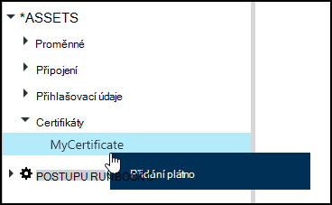
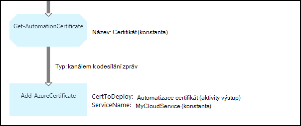

<properties 
   pageTitle="Certifikát prostředky v Azure automatizaci | Microsoft Azure"
   description="Certifikáty mohou být uloženy bezpečně v Azure automatizaci tak lze k nim runbooks nebo DSC konfigurace ověřování Azure a zdroje třetích stran.  Tento článek vysvětluje podrobnosti o certifikáty a jak pracovat s nimi v textových a grafické vytváření."
   services="automation"
   documentationCenter=""
   authors="mgoedtel"
   manager="stevenka"
   editor="tysonn" />
<tags 
   ms.service="automation"
   ms.devlang="na"
   ms.topic="article"
   ms.tgt_pltfrm="na"
   ms.workload="infrastructure-services"
   ms.date="02/23/2016"
   ms.author="magoedte;bwren" />

# Certifikát vybavení automatizaci Azure

Certifikáty mohou být uloženy bezpečně v Azure automatizaci tak lze k nim runbooks nebo DSC konfigurace použití **Get-AutomationCertificate** aktivity. Umožňuje vytvořit runbooks a konfigurace DSC využívající k ověření certifikátů nebo je přidá do Azure nebo jiných zdrojů.

>[AZURE.NOTE] Zabezpečené prostředky v Azure automatizaci zahrnují přihlašovací údaje, certifikáty, připojení a šifrované proměnné. Tato aktiva jsou zašifrovaných a uložené v Azure automatizaci pomocí jedinečné vygenerovaný pro každý účet automatizaci. Tento klíč zašifrovaných tak, že certifikát předlohy a uložené v Azure automatizaci. Před uložením zabezpečené materiálů, klíč účtu automatizaci je dešifrována pomocí předlohy certifikát a potom používaný k šifrování majetku.

## Rutiny prostředí PowerShell systému Windows

Rutiny pro správu v následující tabulce slouží k vytváření a Správa aktiv certifikát automatizaci pomocí prostředí Windows PowerShell. Odesláním jako součást [modul Azure Powershellu](../powershell-install-configure.md) , který je k dispozici pro použití v automatizaci runbooks a konfigurace DSC.

|Rutiny pro správu|Popis|
|:---|:---|
|[Get-AzureAutomationCertificate](http://msdn.microsoft.com/library/dn913765.aspx)|Načte informace o certifikátu. Samotný certifikát můžete získat jenom z Get-AutomationCertificate aktivity.|
|[Nové AzureAutomationCertificate](http://msdn.microsoft.com/library/dn913764.aspx)|Importuje do Azure automatizaci nový certifikát.|
|[Odebrat - AzureAutomationCertificate](http://msdn.microsoft.com/library/dn913773.aspx)|Odebere z Azure automatizaci certifikát.|
|[Nastavení – AzureAutomationCertificate](http://msdn.microsoft.com/library/dn913763.aspx)|Nastaví vlastnosti pro stávající certifikát včetně nahrávání souboru certifikátu a nastavení hesla pro do .pfx.|

## Aktivity pro přístup k certifikátů

Aktivity v této tabulce se používají pro přístup k certifikáty v postupu runbook nebo DSC konfigurace.

|Aktivity|Popis|
|:---|:---|
|Get-AutomationCertificate|Získá certifikát pro použití v postupu runbook nebo DSC konfigurace.|

>[AZURE.NOTE] Vyhněte se použití proměnných v – název parametru Get-AutomationCertificate vzhledem k tomu to zvětšit zjištění závislostí mezi runbooks nebo DSC konfigurace a certifikátů prostředky v době návrhu.

## Vytvoření nového certifikátu

Když vytvoříte nový certifikát, nahrajte soubor .cer nebo .pfx automatizace Azure. Pokud označíte certifikát exportovat, můžete ho přepojte z úložiště certifikátů Azure automatizaci. Pokud není možné exportovat, potom ho jenom lze podpisu v rámci postupu runbook nebo DSC konfigurace.

### Vytvoření nového certifikátu pomocí portálu Azure klasické

1. Z účtu automatizaci klikněte na **prostředky** v horní části okna.
1. V dolní části okna klikněte na **Přidat nastavení**.
1. Klikněte na **Přidat přihlašovacích údajů**.
2. V rozevíracím seznamu **Typ pověření** vyberte **certifikát**.
3. Do pole **název** zadejte název certifikát a klikněte na šipku doprava.
4. Vyhledejte soubor .cer nebo .pfx.  Pokud vyberete soubor .pfx, zadejte heslo a zda mají povoleno chcete exportovat.
1. Zaškrtněte políčko Uložit soubor certifikátu a uložení nového majetku certifikát.

### Vytvoření nového certifikátu pomocí portálu Azure

1. Z vašeho účtu automatizaci klikněte na část **majetku** otevřete zásuvné **prostředky** .
1. Klikněte na část **certifikáty** otevřete zásuvné **certifikáty** .
1. Klikněte na **Přidat certifikát** v horní části zásuvné.
2. Do pole **název** zadejte název certifikátu.
2. Klepněte na **Vybrat soubor** vyhledejte soubor .cer nebo .pfx **Nahrát soubor certifikátu** .  Pokud vyberete soubor .pfx, zadejte heslo a zda mají povoleno chcete exportovat.
1. Klikněte na **vytvořit** a uložit nový majetek certifikát.

### Vytvořit nový certifikát s prostředí Windows PowerShell

Následující ukázkové příkazy ukazují, jak vytvořit nový certifikát automatizaci a označí ji exportovat. To Importuje existující soubor .pfx.

    $certName = 'MyCertificate'
    $certPath = '.\MyCert.pfx'
    $certPwd = ConvertTo-SecureString -String 'P@$$w0rd' -AsPlainText -Force
    
    New-AzureAutomationCertificate -AutomationAccountName "MyAutomationAccount" -Name $certName -Path $certPath –Password $certPwd -Exportable

## Pomocí certifikátu

Činnost **Get-AutomationCertificate** musí slouží k použití certifikátu. Nelze použít rutinu [Get-AzureAutomationCertificate](http://msdn.microsoft.com/library/dn913765.aspx) od vrátí informace o certifikátu materiálů, ale ne certifikát.

### Ukázka textové postupu runbook

Následující ukázkový kód ukazuje, jak přidat certifikátu do cloudové služby postupu runbook. V tomto příkladu heslo je načtená z kontingenčního seznamu šifrované automation proměnná.

    $serviceName = 'MyCloudService'
    $cert = Get-AutomationCertificate -Name 'MyCertificate'
    $certPwd = Get-AutomationVariable –Name 'MyCertPassword'
    Add-AzureCertificate -ServiceName $serviceName -CertToDeploy $cert

### Ukázka grafické postupu runbook

Pravým tlačítkem myši na certifikát v podokně knihovna grafické editoru a výběrem **Přidat plátno**přidáte **Get-AutomationCertificate** grafické postupu runbook.

Následující obrázek znázorňuje příklad použití certifikát v grafické postupu runbook.  Toto je stejný předchozím příkladu pro přidání certifikátu do cloudové služby z textové postupu runbook.  

Tento příklad používá **UseConnectionObject** parametr nastaven **Odeslat TwilioSMS** aktivity, který používá objekt připojení k službě ověření.  [Propojení příležitosti](automation-graphical-authoring-intro.md#links-and-workflow) musí být použita tady od odkazu posloupnost vrátí kolekci obsahující jeden objekt, který není očekává parametr připojení.

## Viz taky

- [Odkazy v grafické vytváření](automation-graphical-authoring-intro.md#links-and-workflow) 
