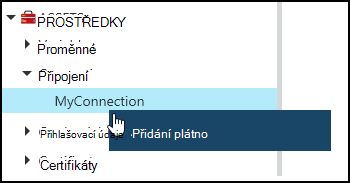
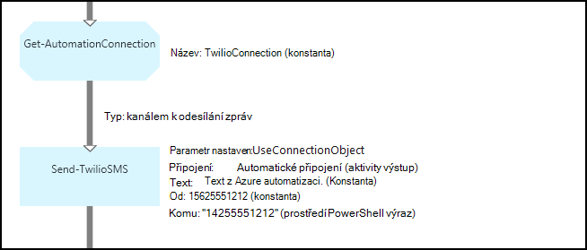
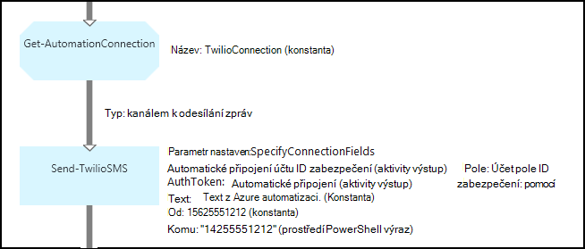

<properties 
   pageTitle="Připojení vybavení Azure automatizaci | Microsoft Azure"
   description="Připojení vybavení Azure automatizaci obsahovat informace potřebné k připojení k externím služby nebo aplikace z postupu runbook nebo DSC konfigurace. Tento článek vysvětluje podrobnosti o připojení a jak pracovat s nimi v textových a grafické vytváření."
   services="automation"
   documentationCenter=""
   authors="bwren"
   manager="stevenka"
   editor="tysonn" />
<tags 
   ms.service="automation"
   ms.devlang="na"
   ms.topic="article"
   ms.tgt_pltfrm="na"
   ms.workload="infrastructure-services"
   ms.date="01/27/2016"
   ms.author="bwren" />

# Připojení vybavení automatizaci Azure

Připojení aktivum automatizaci obsahuje informace potřebné k připojení k externím služby nebo aplikace z postupu runbook nebo DSC konfigurace. Může se jednat o informace potřebné k ověření, například uživatelské jméno a heslo kromě informace o připojení, například adresu URL nebo port. Hodnota připojení je uchovávání všechny vlastnosti připojit se pro konkrétní aplikaci v jedné materiálů namísto vytváření více proměnných. Uživatel může upravovat hodnoty pro připojení na jednom místě a předáte název připojení k postupu runbook nebo DSC konfigurace ve jeden parametr. Vlastnosti připojení můžete k nim získat přístup v postupu runbook nebo DSC konfigurace s **Get-AutomationConnection** aktivity.

Když vytvoříte připojení, je třeba určit *Typ připojení*. Typ spojení je šablonu, která definuje sadu vlastností. Připojení definuje hodnoty pro každou vlastnost definované v odpovídající připojení. Typy připojení jsou přidali k automatizaci Azure integrační moduly nebo byla vytvořená s rozhraní [API automatizaci Azure](http://msdn.microsoft.com/library/azure/mt163818.aspx). Typy pouze připojení, které jsou k dispozici, když vytvoříte připojení jsou nainstalované ve vašem účtu automatizaci.

>[AZURE.NOTE] Zabezpečené prostředky v Azure automatizaci zahrnují přihlašovací údaje, certifikáty, připojení a šifrované proměnné. Tyto prostředky jsou zašifrované a uložené v Azure automatizaci pomocí jedinečné vygenerovaný pro každý účet automatizaci. Tento klíč zašifrovaných tak, že certifikát předlohy a uložené v Azure automatizaci. Před uložením zabezpečené materiálů, klíč pro automatizaci účet je dešifrována pomocí předlohy certifikát a potom používaný k šifrování majetku.

## Rutiny prostředí PowerShell systému Windows

Rutiny pro správu v následující tabulce slouží k vytváření a Správa připojení automatizaci používat Windows PowerShell. Odesláním jako součást [modul Azure Powershellu](../powershell-install-configure.md) , který je k dispozici pro použití v automatizaci runbooks a konfigurace DSC.

|Rutina|Popis|
|:---|:---|
|[Get-AzureAutomationConnection](http://msdn.microsoft.com/library/dn921828.aspx)|Načte připojení. Obsahuje hash tabulku s hodnoty polí na připojení.|
|[Nové AzureAutomationConnection](http://msdn.microsoft.com/library/dn921825.aspx)|Vytvoří nové připojení.|
|[Odebrat AzureAutomationConnection](http://msdn.microsoft.com/library/dn921827.aspx)|Odebrání existující připojení.|
|[Nastavení AzureAutomationConnectionFieldValue](http://msdn.microsoft.com/library/dn921826.aspx)|Nastaví hodnoty určitého pole pro existující připojení.|

## Aktivity

Aktivity v této tabulce se používají pro přístup k připojení v postupu runbook nebo DSC konfigurace.

|Aktivity|Popis|
|---|---|
|Get-AutomationConnection|Získá připojení k použití. Vrátí tabulku hash s vlastnosti připojení.|

>[AZURE.NOTE] Vyhněte se použití proměnných v – název parametru **Get-AutomationConnection** od to zvětšit zjištění závislostí mezi runbooks nebo DSC konfigurace a prostředky připojení v době návrhu.

## Vytvoření nové připojení

### Vytvoření nové připojení pomocí portálu Azure klasické

1. Z účtu automatizaci klikněte na **prostředky** v horní části okna.
1. V dolní části okna klikněte na **Přidat nastavení**.
1. Klikněte na **Přidat připojení**.
2. V rozevíracím seznamu **Typ připojení** vyberte typ připojení, které chcete vytvořit.  Průvodce zobrazeného vlastností pro daný typ.
1. Dokončete průvodce a klepnutím na zaškrtávací políčko Uložit nové připojení.

### Chcete-li vytvořit nové připojení pomocí portálu Azure

1. Z účtu automatizaci klikněte na **prostředky** část otevřete zásuvné **prostředky** .
1. Klikněte na část **připojení** otevřete zásuvné **připojení** .
1. Klikněte na **Přidat připojení** v horní části zásuvné.
2. V rozevíracím seznamu **Typ** vyberte typ připojení, které chcete vytvořit. Formulář zobrazeného vlastností pro daný typ.
1. Vyplňte formulář a klikněte na **vytvořit** a uložit nové připojení.

### Chcete-li vytvořit nové připojení přes Windows PowerShell

Vytvořte nové připojení přes Windows PowerShell používání rutinu [New-AzureAutomationConnection](http://msdn.microsoft.com/library/dn921825.aspx) . Tato rutina má parametr s názvem **ConnectionFieldValues** , která předpokládá, že [Tabulka hash](http://technet.microsoft.com/library/hh847780.aspx) definování hodnoty pro jednotlivá pole vlastnosti definované podle typu připojení.

Následující ukázkové příkazy pro [Twilio](http://www.twilio.com) , které je služba telefonie, která umožňuje odesílat a přijímat textové zprávy vytvářet nové připojení.  Modul integrace vzorku, který obsahuje typ připojení Twilio je k dispozici v [Centrum skriptů](http://gallery.technet.microsoft.com/scriptcenter/Twilio-PowerShell-Module-8a8bfef8).  Tento typ připojení definuje vlastnosti pro ID účtu zabezpečení a povolení Token, které jsou potřeba k ověření účtu při připojování k Twilio.  Je třeba [Stáhnout tento modul](http://gallery.technet.microsoft.com/scriptcenter/Twilio-PowerShell-Module-8a8bfef8) a nainstalovat ve vašem účtu automatizaci pro tento ukázkový kód pro práci.

    $AccountSid = "DAf5fed830c6f8fac3235c5b9d58ed7ac5"
    $AuthToken  = "17d4dadfce74153d5853725143c52fd1"
    $FieldValues = @{"AccountSid" = $AccountSid;"AuthToken"=$AuthToken}

    New-AzureAutomationConnection -AutomationAccountName "MyAutomationAccount" -Name "TwilioConnection" -ConnectionTypeName "Twilio" -ConnectionFieldValues $FieldValues

## Pomocí připojení v postupu runbook nebo DSC konfigurace

Načtení připojení v postupu runbook nebo DSC konfigurace pomocí rutiny **Get-AutomationConnection** .  Tuto aktivitu načte hodnoty různých polí v připojení a vrátí jako [hash tabulky](http://go.microsoft.com/fwlink/?LinkID=324844) , které lze použít odpovídající příkazy v postupu runbook nebo DSC konfigurace.

### Ukázka textové postupu runbook
Následující ukázkové příkazy zobrazení, jak lze pomocí připojení Twilio v předchozím příkladu posílat textové zprávy z postupu runbook.  Odeslat TwilioSMS aktivity použité tady obsahuje dvě sady parametr každý použít jiné metody ověřování ke službě Twilio.  Jeden používá objekt připojení a jiné jednotlivé parametry ID účtu zabezpečení a jak se tak mohli ověřovat tokenu.  V tomto příkladu jsou zobrazeny obě metody.

    $Con = Get-AutomationConnection -Name "TwilioConnection"
    $NumTo = "14255551212"
    $NumFrom = "15625551212"
    $Body = "Text from Azure Automation."

    #Send text with connection object.
    Send-TwilioSMS -Connection $Con -From $NumFrom -To $NumTo -Body $Body

    #Send text with connection properties.
    Send-TwilioSMS -AccountSid $Con.AccountSid -AuthToken $Con.AuthToken -From $NumFrom -To $NumTo -Body $Body

### Grafické postupu runbook vzorky

Přidání **Get-AutomationConnection** aktivity ke grafické postupu runbook pravým tlačítkem myši na připojení v podokně knihovna grafické editoru a výběrem **Přidat plátno**.

Následující obrázek znázorňuje příklad použití připojení v grafické postupu runbook.  Toto je stejný předchozím příkladu odeslání textové zprávy pomocí Twilio z textové postupu runbook.  Tento příklad používá **UseConnectionObject** parametr nastaven **Odeslat TwilioSMS** aktivity, který používá objekt připojení k službě ověření.  [Propojení příležitosti](automation-graphical-authoring-intro.md#links-and-workflow) slouží tady od parametr připojení očekává na jeden objekt.

Důvod, proč Powershellu výraz použit hodnoty v parametru **do** místo konstantní hodnota je, že tento parametr očekává typu řetězec maticové hodnoty tak, aby bylo možné odesílat více čísel.  Výraz prostředí PowerShell umožňuje poskytovat jedinou hodnotu nebo matici.

Na následujícím obrázku vidíte, stejný jako výše uvedeném příkladu, ale používá **SpecifyConnectionFields** parametr nastavený, které očekává AccountSid a pomocí parametry, které mají být zadán jako jednotlivé namísto ověřování pomocí objekt připojení.  V tomto případě pole připojení byla vyplněná místo samotný objekt.  

## Související články

- [Odkazy v grafické vytváření](automation-graphical-authoring-intro.md#links-and-workflow)
 
