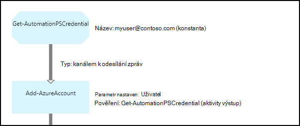

<properties 
   pageTitle="Pověření prostředky v Azure automatizaci | Microsoft Azure"
   description="Prostředky přihlašovacích údajů v Azure automatizaci obsahovat zabezpečovací přihlašovací údaje, které mohou sloužit k ověření zdroje používána postupu runbook nebo DSC konfigurace. Tento článek popisuje, jak vytvořit prostředky přihlašovací údaje a jejich použití v postupu runbook nebo DSC konfigurace."
   services="automation"
   documentationCenter=""
   authors="mgoedtel"
   manager="jwhit"
   editor="tysonn" />
<tags 
   ms.service="automation"
   ms.devlang="na"
   ms.topic="article"
   ms.tgt_pltfrm="na"
   ms.workload="infrastructure-services"
   ms.date="06/09/2016"
   ms.author="bwren" />

# Přihlašovací údaje vybavení automatizaci Azure

Aktivum pověření automatizaci obsahuje [PSCredential](http://msdn.microsoft.com/library/system.management.automation.pscredential) objekt, který obsahuje zabezpečovací přihlašovací údaje, například uživatelské jméno a heslo. Konfigurace Runbooks a DSC může použít rutinách přijmout objekt PSCredential pro ověřování nebo může extrahovat uživatelské jméno a heslo objektu PSCredential poskytovat některé aplikaci nebo službu, které vyžadují ověřování. Vlastnosti pověření bezpečně uložená v Azure automatizaci a dají se otevřít v DSC konfigurace s [Get-AutomationPSCredential](http://msdn.microsoft.com/library/system.management.automation.pscredential.aspx) aktivitu nebo postupu runbook.

>[AZURE.NOTE] Zabezpečené prostředky v Azure automatizaci zahrnují přihlašovací údaje, certifikáty, připojení a šifrované proměnné. Tato aktiva jsou zašifrovaných a uložené v Azure automatizaci pomocí jedinečné vygenerovaný pro každý účet automatizaci. Tento klíč zašifrovaných tak, že certifikát předlohy a uložené v Azure automatizaci. Před uložením zabezpečené materiálů, klíč účtu automatizaci je dešifrována pomocí předlohy certifikát a potom používaný k šifrování majetku. 

## Rutin prostředí Windows PowerShell

Rutin v následující tabulce slouží k vytváření a správa automatizaci pověření aktiv pomocí prostředí Windows PowerShell.  Odesláním jako součást [modul Azure Powershellu](../powershell-install-configure.md) , který je k dispozici pro použití v automatizaci runbooks a konfigurace DSC.

|Rutiny pro správu|Popis|
|:---|:---|
|[Get-AzureAutomationCredential](http://msdn.microsoft.com/library/dn913781.aspx)|Načte informace o přihlašovacích údajů materiálů. Můžete jenom načtete pověření přímo z **Get-AutomationPSCredential** aktivity.|
|[Nové AzureAutomationCredential](http://msdn.microsoft.com/library/azure/jj554330.aspx)|Vytvoří nový automatizaci pověření.|
|[Odebrat - AzureAutomationCredential](http://msdn.microsoft.com/library/azure/jj554330.aspx)|Odebere automatizaci pověření.|
|[Nastavení – AzureAutomationCredential](http://msdn.microsoft.com/library/azure/jj554330.aspx)|Nastaví vlastnosti pro existující automatizaci pověření.|

## Aktivity postupu Runbook

Aktivity v této tabulce se používají pro přístup k přihlašovacím údajům postupu runbook a konfigurace DSC.

|Aktivity|Popis|
|:---|:---|
|Get-AutomationPSCredential|Získá přihlašovacích údajů používat v postupu runbook nebo DSC konfigurace. Vrátí [System.Management.Automation.PSCredential](http://msdn.microsoft.com/library/system.management.automation.pscredential) objekt.|

>[AZURE.NOTE] Vyhněte se použití proměnných v – název parametru Get-AutomationPSCredential vzhledem k tomu to zvětšit zjištění závislostí mezi runbooks nebo DSC konfigurace a pověření prostředky v době návrhu.

## Vytvoření nového majetku přihlašovacích údajů

### Vytvoření nového majetku přihlašovací údaje pomocí portálu Azure klasické

1. Z účtu automatizaci klikněte na **prostředky** v horní části okna.
1. V dolní části okna klikněte na **Přidat nastavení**.
1. Klikněte na **Přidat přihlašovacích údajů**.
2. V rozevíracím seznamu **Typ pověření** vyberte **Prostředí PowerShell pověření**.
1. Dokončete průvodce a klepnutím na zaškrtávací políčko Uložit nových přihlašovacích údajů.

### Vytvoření nového majetku přihlašovací údaje pomocí portálu Azure

1. Z vašeho účtu automatizaci klikněte na část **majetku** otevřete zásuvné **prostředky** .
1. Klikněte na část **přihlašovací údaje** otevřete zásuvné **přihlašovací údaje** .
1. Klikněte na **Přidat pověření** v horní části zásuvné.
1. Vyplňte formulář a klikněte na **vytvořit** a uložit nových přihlašovacích údajů.

### Vytvoření nového majetku přihlašovacích údajů používat Windows PowerShell

Následující ukázkové příkazy ukazují, jak vytvořit nové automatizaci pověření. Objekt PSCredential nově vytvořený pomocí jména a hesla a potom použitá k vytvoření materiálů přihlašovacích údajů. Můžete taky můžete rutinu **Get-pověření** se výzva k zadání jména a hesla.

    $user = "MyDomain\MyUser"
    $pw = ConvertTo-SecureString "PassWord!" -AsPlainText -Force
    $cred = New-Object –TypeName System.Management.Automation.PSCredential –ArgumentList $user, $pw
    New-AzureAutomationCredential -AutomationAccountName "MyAutomationAccount" -Name "MyCredential" -Value $cred

## Pomocí prostředí PowerShell přihlašovacích údajů

Načtení materiálů přihlašovacích údajů v postupu runbook nebo DSC konfigurace s **Get-AutomationPSCredential** aktivity. Tento příkaz vrátí [PSCredential objekt](http://msdn.microsoft.com/library/system.management.automation.pscredential.aspx) , který můžete použít s aktivity nebo rutina, která vyžaduje PSCredential parametr. Můžete také zadat vlastnosti objektu přihlašovací údaje, který chcete použít jednotlivě. Vlastnost pro uživatelské jméno a heslo, zabezpečené má objekt nebo použijte metodu **GetNetworkCredential** vrátíte [NetworkCredential](http://msdn.microsoft.com/library/system.net.networkcredential.aspx) objekt, který vám poskytne nezabezpečenou verzi heslo.

### Ukázka textové postupu runbook

Následující ukázkové příkazy ukazují, jak pomocí Powershellu přihlašovacích údajů v postupu runbook. V tomto příkladu je načtena pověření a své uživatelské jméno a heslo přiřazená proměnné.

    $myCredential = Get-AutomationPSCredential -Name 'MyCredential'
    $userName = $myCredential.UserName
    $securePassword = $myCredential.Password
    $password = $myCredential.GetNetworkCredential().Password

### Ukázka grafické postupu runbook

Přidání **Get-AutomationPSCredential** aktivity ke grafické postupu runbook pravým tlačítkem myši na přihlašovacích údajů v podokně knihovna grafické editoru a výběrem **Přidat plátno**.

Následující obrázek znázorňuje příklad použití pověření v grafické postupu runbook.  V tomto případě se používá k zajištění ověřování postupu runbook na Azure zdroje podle popisu v [Ověření Runbooks s Azure AD uživatelský účet](automation-sec-configure-aduser-account.md).  První činnosti načte přihlašovací údaje, který má přístup k Azure předplatného.  Aktivity **Přidat AzureAccount** ověřování pro činnosti, které následují po použije toto pověření.  [Odkaz kanálem k odesílání zpráv](automation-graphical-authoring-intro.md#links-and-workflow) je tady, protože **Get-AutomationPSCredential** očekává na jeden objekt.  

## Pomocí prostředí PowerShell přihlašovacích údajů v DSC
Při konfiguraci DSC v Azure automatizaci můžete odkázat majetku přihlašovací údaje pomocí **Get-AutomationPSCredential**, pověření prostředky lze také předat v pomocí parametrů, pokud budete chtít. Další informace najdete v tématu [Konfigurace kompilace v Azure automatizaci DSC](automation-dsc-compile.md#credential-assets).

## Další kroky

- Zobrazíte další informace o odkazech v grafické vytváření tématech [v grafické vytváření](automation-graphical-authoring-intro.md#links-and-workflow)
- Různé metody ověřování s automatizaci, najdete v tématu [Azure automatizaci zabezpečení](automation-security-overview.md)
- Začínáme s grafickým runbooks, najdete v tématu [Můj první grafické postupu runbook](automation-first-runbook-graphical.md)
- Začínáme s runbooks prostředí PowerShell pracovního postupu, najdete v článku [svůj první postupu runbook prostředí PowerShell pracovního postupu](automation-first-runbook-textual.md) 

 
