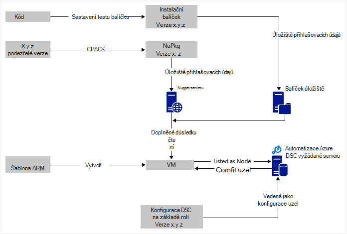
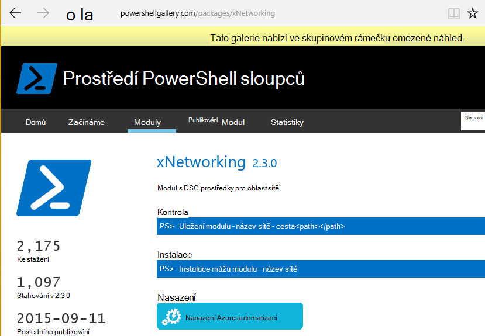

<properties
   pageTitle="Nepřetržitý nasazení Azure automatizaci DSC s Chocolatey | Microsoft Azure"
   description="Nepřetržitý nasazení DevOps pomocí Azure automatizaci DSC a Chocolatey balíčku správce.  Příklad s celou JSON ARM šablony a prostředí PowerShell zdroje."
   services="automation"
   documentationCenter=""
   authors="sebastus"
   manager="stevenka"
   editor=""/>

<tags
   ms.service="automation"
   ms.devlang="na"
   ms.topic="article"
   ms.tgt_pltfrm="vm-windows"
   ms.workload="na"
   ms.date="08/08/2016"
   ms.author="golive"/>

# Příklad použití: Nepřetržitý nasazení virtuálních počítačích pomocí automatizaci DSC a Chocolatey

Ve světě DevOps mají mnoho nástrojů kvůli usnadnění různých místech v souvislé integrace kanálu.  Konfigurace Azure automatizaci požadovaná stavu (DSC) je uvítací novinka možnosti, které můžete využít DevOps týmy.  Tento článek ukazuje nastavení nahoru nepřetržitý nasazení (disk CD) pro počítače s Windows.  Můžete snadno rozšířit postup zahrnout tolik počítače se systémem Windows podle potřeby v roli (webu, například) a v něm taky další role.

## Na vyšší úrovni

Není úplně trochu děje tady, ale naštěstí může být rozdělené dva hlavní procesy: 

  - Psaní kódu testování, vytváření a publikování balíčků pro hlavní verze a podverze systému. 
  - Vytváření a správě VMs, které se nainstaluje a spustit kód v balíčky.  

Po obou těchto základních procesech se na místě je krátké krokem k automatické aktualizaci balíček spuštěných pro konkrétní OM stejně jako nové verze vytvořili a nasazení.

## Přehled komponent

Jsou správci balíčku například [výstižný get](https://en.wikipedia.org/wiki/Advanced_Packaging_Tool) poměrně dobře známé Linux světě, ale ne tolik světě Windows.  [Chocolatey](https://chocolatey.org/) je určité věci a Jiří Hanselman [blogu](http://www.hanselman.com/blog/IsTheWindowsUserReadyForAptget.aspx) v tématu je skvělý úvod.  Ve zkratce Chocolatey umožňuje instalaci balíčků v centrálním úložišti balíčků do systému Windows pomocí příkazového řádku.  Můžete vytvářet a spravovat vlastní úložiště a Chocolatey můžete nainstalovat balíčků z libovolný počet úložiště, ke kterým určíte.

Konfigurace požadovaný stav (DSC) ([Přehled](https://technet.microsoft.com/library/dn249912.aspx)) je nástroj prostředí PowerShell, který vám umožní deklarovat konfiguraci, která chcete pro počítač.  Například řekněte, "má Chocolatey nainstalovaný, má nainstalovanou službu IIS, má port 80 otevřít, má verzi svůj web nainstalovaný 1.0.0."  DSC správce pro místní konfigurace (LCM) používá tuto konfiguraci. DSC vyžádat serveru obsahuje úložiště konfigurace pro počítače. LCM na každém počítači zkontroluje pravidelně-li jeho konfigurace použije uloženou konfiguraci. Ho vykazovat stav či pokusu zpět do zarovnání uložené konfiguraci přenést do počítače. Můžete upravit uložené konfigurace serveru vyžádané způsobit počítače nebo nastavení počítače se chystají do zarovnání s nastavením změněné.

Azure automatizace je služba spravovaných v Microsoft Azure, která umožňuje automatizace úkolů pomocí runbooks uzly, přihlašovací údaje, zdroje a materiálů, jako jsou plány a globální proměnné. Azure DSC automatizaci rozšiřuje tuto funkci Automatické zahrnout nástroje DSC Powershellu.  Tady je skvělý [Přehled](automation-dsc-overview.md).

DSC zdroje je modulu kód, který má určité funkce, například Správa sítě, služby Active Directory nebo SQL Server.  Chocolatey zdroje DSC ví, jak získat přístup k serveru NuGet (prvky), balíčků stažení, instalace balíčků a tak dále.  V [Galerii prostředí PowerShell](http://www.powershellgallery.com/packages?q=dsc+resources&prerelease=&sortOrder=package-title)jsou mnoho dalších zdrojů DSC.  Moduly vám asi nainstaluje do Azure automatizaci DSC vyžádat serveru (který) tak, aby bylo možné konfiguraci.

Šablony ARM poskytují deklarativně generování infrastrukturu – například sítí, podsítí, zabezpečení sítě a směrování načíst vyrovnávání, nic, VMs a tak dál.  Následuje [článek](../resource-manager-deployment-model.md) porovnává ARM nasazení modelu (deklarativní) se správou služby Azure (ASM nebo klasický) nasazení modelu (nezbytné).  A taky tento [článek](../virtual-machines/virtual-machines-windows-compare-deployment-models.md) o základní zdroje poskytovatelů, výpočetním, ukládání a sítě.

Jeden klíčové funkce ARM šablony je instalace příponu OM do OM, jako je zřízení.  Rozšíření OM má určité funkce, například běží vlastní skript, instalaci antivirový software nebo konfigurační skript DSC.  Existuje řada jiných typů OM rozšíření.

## Rychlé ze služební cesty kolem diagramu

Spuštění nahoře, zadejte kód, vytvářet a otestujte a pak vytvořit instalační balíček.  Chocolatey můžete dělat různé typy balení instalace, například MSI, MSU, ZIP.  A máte úplná power prostředí PowerShell samotnou instalací dělat, když je Chocolatey nativní funkce nejsou úplně nahoru.  Přepněte balíček do někam dostupný – úložišti balíčku.  Tento příklad použití používá veřejné složky v účtu úložiště objektů blob Azure, ale můžou být kdekoliv.  Chocolatey spolupracuje nativně NuGet servery a dalších pro správu balíčku metadat.  [Tento článek](https://github.com/chocolatey/choco/wiki/How-To-Host-Feed) popisuje možnosti.  Tento příklad použití používá NuGet.  Nuspec je metadata o vašich balíčků.  Nuspec jsou "kompilovaný" do prvku NuPkg a uložená na serveru NuGet.  Při konfiguraci požaduje balíčku podle názvu a odkazy na server NuGet, Chocolatey DSC zdroje (pouze u OM) získá balíček a nainstaluje za vás.  Můžete taky požádat o konkrétní verzi balíčku.

V levé dolní části obrázku je šablona Azure zdroje Manager (ARM).  V tomto příkladu použití koncovku OM zaregistruje OM s Azure Automation DSC vyžádané Server (to znamená serveru vyžádané) jako uzel.  Konfigurace je uložené na serveru vyžádané.  Skutečně, uloží se dvakrát: jednou jako prostý text a jakmile kompilovaný jako soubor MOF (u těch, které vědět o těchto věcech.)  Na portálu je soubor MOF "Konfigurace uzel" (na rozdíl od jednoduše "konfigurace").  Je artefaktu, který máte přidružený k uzel tak uzel vědět jeho konfiguraci.  Podrobnosti níže ukazují, jak přiřadit konfigurace uzel uzel.

Pravděpodobně už děláte bit začátku nebo většinu.  Vytváření nuspec, kompilace a ukládání do NuGet server je malé věc.  A už spravujete VMs.  Provedením dalšího kroku nepřetržitý nasazení vyžaduje nastavení serveru vložit (jednou), registrace uzly s ním (jednou), vytváření a ukládání konfigurace tam (počátečním).  Balíčků po upgradu a používaný k úložišti aktualizujte konfigurace a konfigurace uzel na serveru vložit (opakování v případě potřeby).

Pokud nejsou začnete s šablonou ARM, je také OK.  Existuje rutiny prostředí PowerShell navržené tak, aby vaše VMs zaregistrovali vyžádané server a všechny ostatní. Další informace najdete v tomto článku: [počítačích rychlého připojení ke správě tak, že DSC automatizaci Azure](automation-dsc-onboarding.md)

## Krok 1: Nastavení účtu serveru a automatizace vyžádané

Ověření příkazového řádku (Přidat AzureRmAccount) Powershellu: (může trvat několik minut při nastavení serveru vyžádané)

    New-AzureRmResourceGroup –Name MY-AUTOMATION-RG –Location MY-RG-LOCATION-IN-QUOTES
    New-AzureRmAutomationAccount –ResourceGroupName MY-AUTOMATION-RG –Location MY-RG-LOCATION-IN-QUOTES –Name MY-AUTOMATION-ACCOUNT 

Účtu automatizaci můžete umístit do libovolného z následujících oblastí (označovaná taky jako umístění): východoasijských USA 2, Jižní centrální cz, cz Gov Virginie, západní Evropa, jihovýchodní Asie, východ Japonsku, centrální Indie a Austrálie jihovýchodní.

## Krok 2: OM rozšíření vylepšení k šabloně ARM

Podrobnosti o OM zápis (pomocí Powershellu DSC OM rozšíření) uvedené v této [Šablony rychlý úvod Azure](https://github.com/Azure/azure-quickstart-templates/tree/master/dsc-extension-azure-automation-pullserver).  Tento krok registruje nové OM vyžádané server v seznamu DSC uzlů.  Součást této registraci je určující konfigurace uzel mohou být použity pro uzel.  Konfigurace uzel nemusí zatím na serveru vložit tak, aby je v pořádku, kde je to poprvé je krok 4.  Tady v kroku 2 se však nutné sleduje název uzel a název konfigurace.  V tomto příkladu použití uzel je "isvbox" a konfigurace je "ISVBoxConfig".  Proto uzel konfigurace (být zadán v DeploymentTemplate.json) je název "ISVBoxConfig.isvbox".  

## Krok 3: Přidání požadovaných zdrojů DSC server vyžádané

Galerie prostředí PowerShell využívá k instalaci DSC materiály ke svému účtu Azure automatizaci.  Přejděte na zdroje a kliknutím na tlačítko "Nasadit na Azure automatizaci".

Jiný postup přidaná do portálu Azure umožňuje vyžádat v nové moduly nebo aktualizovat existující moduly. Proklikejte zdroje automatizaci účtu dlaždici prostředky a nakonec na dlaždici modulů.  Ikona galerie procházet umožňuje zobrazit seznam moduly v galerii, přecházet na podrobnější údaje a nakonec naimportovat do účtu automatizaci. Toto je skvělý způsob, jak aktuálnost modulech od času. A funkci import zkontroluje závislostí s jiných modulů zajistit že nic získala nejsou synchronizovány.

Nebo je ruční přístup.  Struktura složek modulu integrace Powershellu pro počítače s Windows je mírně odlišný od očekávaný službou Azure automatizaci struktura složek.  Při této akci musí vše úprava na druhé straně.  Ale není pevné a se to dělá jenom jednou každý zdroj (Pokud chcete v budoucnu upgradovat.)  Další informace o vytváření moduly integrace Powershellu najdete v tomto článku: [Vytváření integrační moduly pro automatizaci Azure](https://azure.microsoft.com/blog/authoring-integration-modules-for-azure-automation/)

-   Nainstalujte modul, které potřebujete k počítači, následujícím způsobem:
    -   Instalace [Windows Management Framework, verze 5](http://aka.ms/wmf5latest) (není potřebné pro Windows 10)
    -   `Install-Module –Name MODULE-NAME`< – získá modulu z Galerie prostředí PowerShell 
-   Kopírování modulu složky z `c:\Program Files\WindowsPowerShell\Modules\MODULE-NAME` ke složce temp 
-   Ukázky a přečtěte následující dokumentaci pro zabránění hlavní složky 
-   ZIP hlavní složce pojmenování souborů ZIP stejně jako složce 
-   Uložte soubor ZIP do dostupný HTTP umístění, jako je třeba úložiště objektů blob v účet Azure úložiště.
-   Spusťte tento Powershellu:

        New-AzureRmAutomationModule `
            -ResourceGroupName MY-AUTOMATION-RG -AutomationAccountName MY-AUTOMATION-ACCOUNT `
            -Name MODULE-NAME –ContentLink "https://STORAGE-URI/CONTAINERNAME/MODULE-NAME.zip"
        

Součástí příklad slouží k provedení těchto kroků cChoco a xNetworking. V části [poznámky](#notes) pro zvláštní zpracování pro cChoco.

## Krok 4: Přidání uzel konfigurační server vyžádané

Není nic zvláštního o při prvním importu konfigurace do vyžádané server a kompilace.  Všechny následující import/propojejí stejnou konfigurací přesně stejný vzhled.  Pokaždé, když aktualizovat do balíčku a chcete vysunout výroby provedete v tomto kroku po zajištění správnost konfiguračního souboru – včetně nové verzi balíčku.  Tady je soubor konfigurace a Powershellu:

ISVBoxConfig.ps1:

    Configuration ISVBoxConfig 
    { 
        Import-DscResource -ModuleName cChoco 
        Import-DscResource -ModuleName xNetworking
    
        Node "isvbox" {   
    
            cChocoInstaller installChoco 
            { 
                InstallDir = "C:\choco" 
            }
    
            WindowsFeature installIIS 
            { 
                Ensure="Present" 
                Name="Web-Server" 
            }
    
            xFirewall WebFirewallRule 
            { 
                Direction = "Inbound" 
                Name = "Web-Server-TCP-In" 
                DisplayName = "Web Server (TCP-In)" 
                Description = "IIS allow incoming web site traffic." 
                DisplayGroup = "IIS Incoming Traffic" 
                State = "Enabled" 
                Access = "Allow" 
                Protocol = "TCP" 
                LocalPort = "80" 
                Ensure = "Present" 
            }
    
            cChocoPackageInstaller trivialWeb 
            {            
                Name = "trivialweb" 
                Version = "1.0.0" 
                Source = “MY-NUGET-V2-SERVER-ADDRESS” 
                DependsOn = "[cChocoInstaller]installChoco", 
                "[WindowsFeature]installIIS" 
            } 
        }    
    }

Nové-ConfigurationScript.ps1:

    Import-AzureRmAutomationDscConfiguration ` 
        -ResourceGroupName MY-AUTOMATION-RG –AutomationAccountName MY-AUTOMATION-ACCOUNT ` 
        -SourcePath C:\temp\AzureAutomationDsc\ISVBoxConfig.ps1 ` 
        -Published –Force
    
    $jobData = Start-AzureRmAutomationDscCompilationJob ` 
        -ResourceGroupName MY-AUTOMATION-RG –AutomationAccountName MY-AUTOMATION-ACCOUNT ` 
        -ConfigurationName ISVBoxConfig 
    
    $compilationJobId = $jobData.Id
    
    Get-AzureRmAutomationDscCompilationJob ` 
        -ResourceGroupName MY-AUTOMATION-RG –AutomationAccountName MY-AUTOMATION-ACCOUNT ` 
        -Id $compilationJobId

Tyto kroky výsledek vzorce vytvořeného v nové konfigurace uzel s názvem "ISVBoxConfig.isvbox" uložená na serveru vložit.  Název konfigurace uzel je vytvořená jako "configurationName.nodeName".

## Krok 5: Vytváření a udržování balíčku metadat

Pro každý balíček, která vložíte do balíčku úložiště musíte nuspec popisující ho.  Tento nuspec musí být kompilovaný a uložená na serveru NuGet. Tento postup je popsán [v tomto poli](http://docs.nuget.org/create/creating-and-publishing-a-package).  Jako NuGet server můžete MyGet.org.  Prodej tuto službu, ale máte starter SKU, která je zadarmo.  V NuGet.org najdete pokyny k instalaci NuGet serveru pro soukromé balíčků.

## Krok 6: Čímž ho propojíte vůbec

Pokaždé, když verze q & a předá a schválení pro nasazení balíčku vytvoření nuspec a nupkg aktualizují a nasazeny NuGet server.  Kromě toho konfigurace (krok 4 popsané výše) musí být aktualizovány souhlas s číslo nové verze.  Musí být odeslaných na server vyžádané a kompilovaný.  Od této chvíle je to na VMs, které jsou závislé na tuto konfiguraci přetáhněte aktualizace a nainstalujte ji.  Každá z těchto aktualizací jsou jednoduchá – jenom čáry nebo dvě stránky Powershellu.  V případě Visual Studio týmovou některé z nich jsou formát sestavení úkoly, které můžou být zřetězený dohromady ve verzi.  V tomto [článku](https://www.visualstudio.com/en-us/docs/alm-devops-feature-index#continuous-delivery) najdete další informace.  Tento [GitHub repo](https://github.com/Microsoft/vso-agent-tasks) podrobnosti nejrůznější věci k dispozici Tvůrce dotazů.

## Poznámky

V tomto příkladu použití začíná OM z obecný Windows serveru 2012 R2 obrázek z Galerie Azure.  Můžete spustit z uložené obrázek a potom doladit odtud s nastavením DSC.  Změna konfigurace, která se peče do obrázku je však mnohem složitější než dynamicky aktualizace konfiguraci pomocí DSC.

Nemusíte umožňuje použít tento postup se vaše VMs šablonu ARM a rozšíření OM.  A vaše VMs nemusí být na Azure je v části Správa CD.  Stačí nainstalované Chocolatey na je a LCM nastaven OM, aby věděli, kde je server vložit.  

Samozřejmě při aktualizaci balení na OM, která je ve výrobním musíte pomocí několika této OM mimo otočení v prostoru je nainstalovaná aktualizace.  Tento postup různý.  Například s OM za vyrovnávání zatížení Azure, můžete přidat vlastní Probe.  Při aktualizaci OM, mají koncový bod zkušební vrátit 400.  Nutné způsobit, že tato změna TweakUI mohou být uvnitř vaší konfigurace můžete TweakUI přejděte zpátky k vrácení 200 až po dokončení aktualizace.

Úplné zdroj v tomto příkladu použití je v [aktuálním Visual Studio](https://github.com/sebastus/ARM/tree/master/CDIaaSVM) na GitHub.

##Související články##

- [Azure automatizaci DSC přehled] (automatizaci overview.md dsc)
- [Azure DSC automatizaci rutiny] (https://msdn.microsoft.com/library/mt244122.aspx)
- [Rychlého připojení počítače pro správu tak, že Azure automatizaci DSC] (automatizaci onboarding.md dsc)
