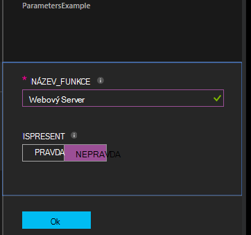

<properties 
   pageTitle="Kompilace konfigurace v Azure automatizaci DSC | Microsoft Azure" 
   description="Základní informace o dva způsoby, jak kompilaci konfigurace žádoucí konfigurace stavu (DSC): V portálu Azure a používat Windows PowerShell. " 
   services="automation" 
   documentationCenter="na" 
   authors="coreyp-at-msft" 
   manager="stevenka" 
   editor="tysonn"/>

<tags
   ms.service="automation"
   ms.devlang="na"
   ms.topic="article"
   ms.tgt_pltfrm="powershell"
   ms.workload="na" 
   ms.date="01/25/2016"
   ms.author="coreyp"/>
   
#Kompilace konfigurace v Azure automatizaci DSC#

Kompilace konfigurace žádoucí konfigurace stavu (DSC) s Azure automatizaci dvěma způsoby: V portálu Azure a používat Windows PowerShell. V následující tabulce vám pomůže určit, kdy kterou metodu podle vlastností každé použít: 

###Portál Azure náhledu###
- Nejjednodušší způsob interaktivní uživatelského rozhraní
- Formulář a zadejte hodnoty jednoduchý parametrický
- Snadno sledování stavu projektu
- Access ověřena Azure přihlášení

###Prostředí Windows PowerShell###
- Zavolat z příkazového řádku pomocí rutin prostředí Windows PowerShell
- Může být součástí automatizované řešení s několika kroky
- Zadání hodnoty parametru jednoduché i složité
- Sledování stavu projektu
- Klient je potřebný kvůli podpoře rutiny prostředí PowerShell
- Předání ConfigurationData
- Kompilace konfigurací používajících přihlašovací údaje

Jakmile jste se rozhodli o metodě kompilace, můžete sledovat odpovídajících postupy zahájíte kompilaci.

##Kompilace DSC konfigurace pomocí portálu Azure##

1.  Z účtu automatizaci klikněte na tlačítko **Konfigurace**.
2.  Klikněte na nastavení otevřete jeho zásuvné.
3.  Klikněte na tlačítko **kompilaci**.
4.  Pokud konfigurace bez parametrů, se výzva k potvrzení, jestli chcete kompilaci ho. Pokud konfigurace parametry, zásuvné **Zpracováním konfigurace** se otevře, takže je můžete zadat hodnoty parametrů. Naleznete v části <a href="#basic-parameters">**Základní parametry**</a> pod další podrobnosti o parametry.
5.  Zásuvné **Kompilace úlohy** se otevře, aby mohli sledovat stav úlohy kompilace a konfigurace uzel (MOF konfigurace dokumenty) způsobila umístit na Azure automatizaci DSC vyžádat serveru.

##Kompilace DSC konfigurace se prostředí Windows PowerShell##

Můžete použít [`Start-AzureRmAutomationDscCompilationJob`](https://msdn.microsoft.com/library/mt244118.aspx) zahájíte kompilace používat Windows PowerShell. Následující ukázkový kód spustí kompilace DSC konfigurace s názvem **SampleConfig**.

    Start-AzureRmAutomationDscCompilationJob -ResourceGroupName "MyResourceGroup" -AutomationAccountName "MyAutomationAccount" -ConfigurationName "SampleConfig" 
 
`Start-AzureRmAutomationDscCompilationJob`Vrátí objektu úlohy kompilace, která můžete sledovat její stav. Pak můžete použít tento objekt kompilace úlohu s [`Get-AzureRmAutomationDscCompilationJob`](https://msdn.microsoft.com/library/mt244120.aspx) určit stav úlohy kompilace a [`Get-AzureRmAutomationDscCompilationJobOutput`](https://msdn.microsoft.com/library/mt244103.aspx) zobrazíte jeho datových proudů (výstup). Následující ukázkový kód spustí kompilace konfigurace **SampleConfig** , čeká tak, aby byl dokončen a zobrazí se jeho datových proudů.
    
    $CompilationJob = Start-AzureRmAutomationDscCompilationJob -ResourceGroupName "MyResourceGroup" -AutomationAccountName "MyAutomationAccount" -ConfigurationName "SampleConfig"
    
    while($CompilationJob.EndTime –eq $null -and $CompilationJob.Exception –eq $null)           
    {
        $CompilationJob = $CompilationJob | Get-AzureRmAutomationDscCompilationJob
        Start-Sleep -Seconds 3
    }
    
    $CompilationJob | Get-AzureRmAutomationDscCompilationJobOutput –Stream Any 

##Základní parametry##

Deklarace parametru v konfiguraci DSC, včetně parametr typům a vlastnostem, jde použít stejné jako v Azure automatizaci runbooks. V tématu Další informace o postupu runbook parametry [spuštění postupu runbook v Azure automatizaci](automation-starting-a-runbook.md) .

Dvěma parametry s názvem **Název_funkce** a **IsPresent**, chcete-li zjistit hodnoty vlastností v konfiguraci uzel **ParametersExample.sample** generované během kompilace v následujícím příkladu.

    Configuration ParametersExample
    {
        param(
            [Parameter(Mandatory=$true)]
    
            [string] $FeatureName,
    
            [Parameter(Mandatory=$true)]
            [boolean] $IsPresent
        )
    
        $EnsureString = "Present"
        if($IsPresent -eq $false)
        {
            $EnsureString = "Absent"
        }
    
        Node "sample"
        {
            WindowsFeature ($FeatureName + "Feature")
            {
                Ensure = $EnsureString
                Name = $FeatureName
            }
        }
    }

Můžete sestavíte DSC konfigurace využívající základní parametry v portálu DSC automatizaci Azure, nebo společně s Azure Powershellu:

###Portál###

Na portálu můžete zadat hodnoty parametrů po kliknutí na **kompilaci**.

###Prostředí PowerShell###

Prostředí PowerShell vyžaduje parametrů v [hashtable](http://technet.microsoft.com/library/hh847780.aspx) klávesu shoduje s názvem parametr, kde hodnota rovna hodnotě parametr.

    $Parameters = @{
            "FeatureName" = "Web-Server"
            "IsPresent" = $False
    }
    
    
    Start-AzureRmAutomationDscCompilationJob -ResourceGroupName "MyResourceGroup" -AutomationAccountName "MyAutomationAccount" -ConfigurationName "ParametersExample" -Parameters $Parameters 
    

Informace o předáním PSCredentials jako parametrů najdete v tématu <a href="#credential-assets">**Pověření prostředky**</a> dole.

##ConfigurationData##

**ConfigurationData** umožňuje oddělit strukturální konfigurace z libovolné určité konfigurace prostředí při používání DSC Powershellu. V tématu Další informace o **ConfigurationData** [oddělení "Co" od "" v prostředí PowerShell DSC](http://blogs.msdn.com/b/powershell/archive/2014/01/09/continuous-deployment-using-dsc-with-minimal-change.aspx) .

>[AZURE.NOTE] **ConfigurationData** se dají používat při sestavování v Azure automatizaci DSC pomocí prostředí PowerShell Azure, ale ne v portálu Azure.

Následující příklad DSC konfigurace používá **ConfigurationData** prostřednictvím **$ConfigurationData** a **$AllNodes** klíčových slov. [Modul **xWebAdministration** ](https://www.powershellgallery.com/packages/xWebAdministration/) bude nutné také v tomto příkladu:

     Configuration ConfigurationDataSample
     {
        Import-DscResource -ModuleName xWebAdministration -Name MSFT_xWebsite
    
        Write-Verbose $ConfigurationData.NonNodeData.SomeMessage 
    
        Node $AllNodes.Where{$_.Role -eq "WebServer"}.NodeName
        {
            xWebsite Site
            {
                Name = $Node.SiteName
                PhysicalPath = $Node.SiteContents
                Ensure   = "Present"
            }
        }
    }

Můžete sestavíte DSC konfigurace nad pomocí prostředí PowerShell. Pod prostředí PowerShell přidá dvě konfigurace uzel Azure Automation DSC vyžádat Server: **ConfigurationDataSample.MyVM1** a **ConfigurationDataSample.MyVM3**:

    $ConfigData = @{
        AllNodes = @(
            @{
                NodeName = "MyVM1"
                Role = "WebServer"
            },
            @{
                NodeName = "MyVM2"
                Role = "SQLServer"
            },
            @{
                NodeName = "MyVM3"
                Role = "WebServer"
    
            }
    
        )
    
        NonNodeData = @{
            SomeMessage = "I love Azure Automation DSC!"
    
        }
    
    } 
    
    Start-AzureRmAutomationDscCompilationJob -ResourceGroupName "MyResourceGroup" -AutomationAccountName "MyAutomationAccount" -ConfigurationName "ConfigurationDataSample" -ConfigurationData $ConfigData

##Prostředky##

Jsou odkazy materiálů v Azure DSC automatické konfigurace a runbooks stejné. Přečtěte si následující informace:

- [Certifikáty](automation-certificates.md)
- [Připojení](automation-connections.md)
- [Přihlašovací údaje](automation-credentials.md)
- [Proměnné](automation-variables.md)

###Prostředky přihlašovacích údajů###
Při konfiguraci DSC v Azure automatizaci můžete odkázat přihlašovacích údajů aktiv pomocí **Get-AzureRmAutomationCredential**, přihlašovacích údajů aktiv lze také předat v prostřednictvím parametry, pokud budete chtít. Pokud konfigurace trvá parametr typu **PSCredential** , budete muset předat název řetězce pověření aktiva Azure automatizaci jako hodnotu tohoto parametru, nikoli PSCredential objektu. Na pozadí materiálů pověření Azure automatizaci s tímto názvem načtena a předán konfiguraci.

Zachování přihlašovacích údajů zabezpečeného v uzel konfigurace (MOF konfigurace dokumenty) vyžaduje šifrování přihlašovacích údajů v souboru konfigurace MOF uzel. Azure automatizace, která bude tento po jednotlivých krocích dál a jsou šifrovány celý soubor MOF. Však aktuálně se musí pozná, že prostředí PowerShell DSC že nevadí k zadání přihlašovacích údajů do výstupu ve formátu prostého textu během uzel konfigurace MOF generování, protože prostředí PowerShell DSC poslal, neví, že Azure automatizaci bude být šifrování celý soubor MOF po jeho generování prostřednictvím úloha kompilace.

Můžete to poznat DSC Powershellu, že je v pořádku pole v části přihlašovací údaje do výstupu ve formátu prostého textu v konfiguraci vygenerovaných uzel soubory MOF pomocí <a href="#configurationdata">**ConfigurationData**</a>. Byste měli posílat `PSDscAllowPlainTextPassword = $true` prostřednictvím **ConfigurationData** pro každý blok uzel název, který se zobrazí v konfiguraci DSC a používá přihlašovací údaje.

Následující příklad ukazuje DSC konfiguraci, která používá aktivum automatizaci přihlašovacích údajů.

    Configuration CredentialSample
    {
       $Cred = Get-AzureRmAutomationCredential -Name "SomeCredentialAsset"
    
        Node $AllNodes.NodeName
        { 
            File ExampleFile
            { 
                SourcePath = "\\Server\share\path\file.ext" 
                DestinationPath = "C:\destinationPath" 
                Credential = $Cred 
            }
        }
    }

Můžete sestavíte DSC konfigurace nad pomocí prostředí PowerShell. Pod prostředí PowerShell přidá dvě konfigurace uzel Azure Automation DSC vyžádat Server: **CredentialSample.MyVM1** a **CredentialSample.MyVM2**.

    $ConfigData = @{
        AllNodes = @(
            @{
                NodeName = "*"
                PSDscAllowPlainTextPassword = $True
            },
            @{
                NodeName = "MyVM1"
            },
            @{
                NodeName = "MyVM2"
            }
        )
    }
    
    Start-AzureRmAutomationDscCompilationJob -ResourceGroupName "MyResourceGroup" -AutomationAccountName "MyAutomationAccount" -ConfigurationName "CredentialSample" -ConfigurationData $ConfigData
