<properties
   pageTitle="Začínáme s DSC automatizaci Azure"
   description="Vysvětlení a příklady nejčastější úlohy v Azure automatické vyplňování stavu konfigurace (DSC)"
   services="automation" 
   documentationCenter="na" 
   authors="eslesar" 
   manager="dongill" 
   editor="tysonn"/>

<tags
   ms.service="automation"
   ms.devlang="na"
   ms.topic="article"
   ms.tgt_pltfrm="powershell"
   ms.workload="na" 
   ms.date="06/06/2016"
   ms.author="magoedte;eslesar"/>
   

# <a name="getting-started-with-azure-automation-dsc"></a>Začínáme s DSC automatizaci Azure

Toto téma vysvětluje, jak provádět nejčastější úkoly s Azure automatické vyplňování stavu konfigurace (DSC), například k vytváření, importovat a kompilace konfigurací počítačích rychlého připojení ke správě a zobrazení sestavy. Přehled toho, co je Azure automatizaci DSC naleznete v tématu [Přehled DSC automatizaci Azure](automation-dsc-overview.md). DSC si přečtěte následující dokumentaci najdete v článku [Přehled konfigurace prostředí Windows PowerShell žádoucí stavu](https://msdn.microsoft.com/PowerShell/dsc/overview).

Toto téma obsahuje podrobný návod, jak pomocí DSC automatizaci Azure. Pokud budete potřebovat prostředí vzorku, který je nastaven bez kroků popsaných v tomto tématu, můžete použít [následující ARM šablonu](https://github.com/azureautomation/automation-packs/tree/master/102-sample-automation-setup). Tato šablona nastaví dokončené Azure automatizaci DSC prostředí, včetně Azure OM, spravovaná službou Azure automatizaci DSC.
 
## <a name="prerequisites"></a>Zjistit předpoklady pro

Příklady v tomto tématu, dokončete následují vyžaduje:

- Účet Azure automatizaci. Pokyny týkající se vytváření účet Azure automatizaci spustit jako najdete v tématu [Azure jako účet spustit](automation-sec-configure-azure-runas-account.md).
- OM správce prostředků Azure (ne klasické) systémem Windows Server 2008 R2 nebo novější. Pokyny týkající se vytváření virtuálního počítače najdete v tématu [vytvoření první virtuální počítači se systémem Windows Azure portálu](../virtual-machines/virtual-machines-windows-hero-tutorial.md)

## <a name="creating-a-dsc-configuration"></a>Vytvoření konfigurace DSC

Vytvoříme jednoduchý [DSC konfigurace](https://msdn.microsoft.com/powershell/dsc/configurations) zajišťující přítomnosti nebo nepřítomnosti s **Webovým serverem** Windows funkce (IIS), podle toho, jak přiřadit uzlů.

1. Spusťte Windows PowerShell ISE (nebo jakémkoli textovém editoru).

2. Zadejte následující text:

    ```powershell
    configuration TestConfig
    {
        Node WebServer
        {
            WindowsFeature IIS
            {
                Ensure               = 'Present'
                Name                 = 'Web-Server'
                IncludeAllSubFeature = $true

            }
        }

        Node NotWebServer
        {
            WindowsFeature IIS
            {
                Ensure               = 'Absent'
                Name                 = 'Web-Server'

            }
        }
        }
    ```
3. Uložte soubor jako `TestConfig.ps1`.

Konfigurace hovorů jeden zdroj v každém bloku uzel [WindowsFeature zdroje](https://msdn.microsoft.com/powershell/dsc/windowsfeatureresource), který zajišťuje přítomnost nebo absence funkci **Webový Server** .

## <a name="importing-a-configuration-into-azure-automation"></a>Import Azure automatické konfigurace

Dále jsme budete import konfigurace zohledňovala automatizaci.

1. Přihlaste se k [portálu Azure](https://portal.azure.com).

2. V nabídce centrální klikněte na **všechny zdroje** a pak na název účtu automatizaci.

3. Na zásuvné **automatizaci účtu** klikněte na **DSC konfigurace**.

4. Na zásuvné **DSC konfigurace** klikněte na **Přidat konfigurace**.

5. Přejděte na zásuvné **Import konfigurace** `TestConfig.ps1` soubor v počítači.
    
    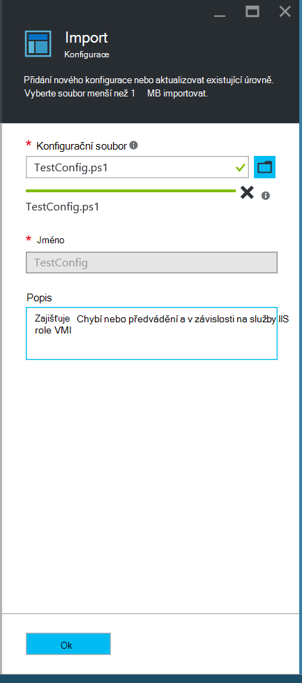
    

6. Klikněte na **OK**.

## <a name="viewing-a-configuration-in-azure-automation"></a>Zobrazení konfigurace v Azure automatizaci

Po importu konfigurace ji můžete zobrazit v portálu Azure.

1. Přihlaste se k [portálu Azure](https://portal.azure.com).

2. V nabídce centrální klikněte na **všechny zdroje** a pak na název účtu automatizaci.

3. Na zásuvné **automatizaci účtu** klikněte na tlačítko **Konfigurace DSC**

4. Na zásuvné **DSC konfigurace** klikněte na **TestConfig** (to je název konfiguraci, kterou jste importovali předchozího postupu).

5. Na zásuvné **TestConfig konfigurace** klikněte na **zobrazení konfiguraci zdroje**.

    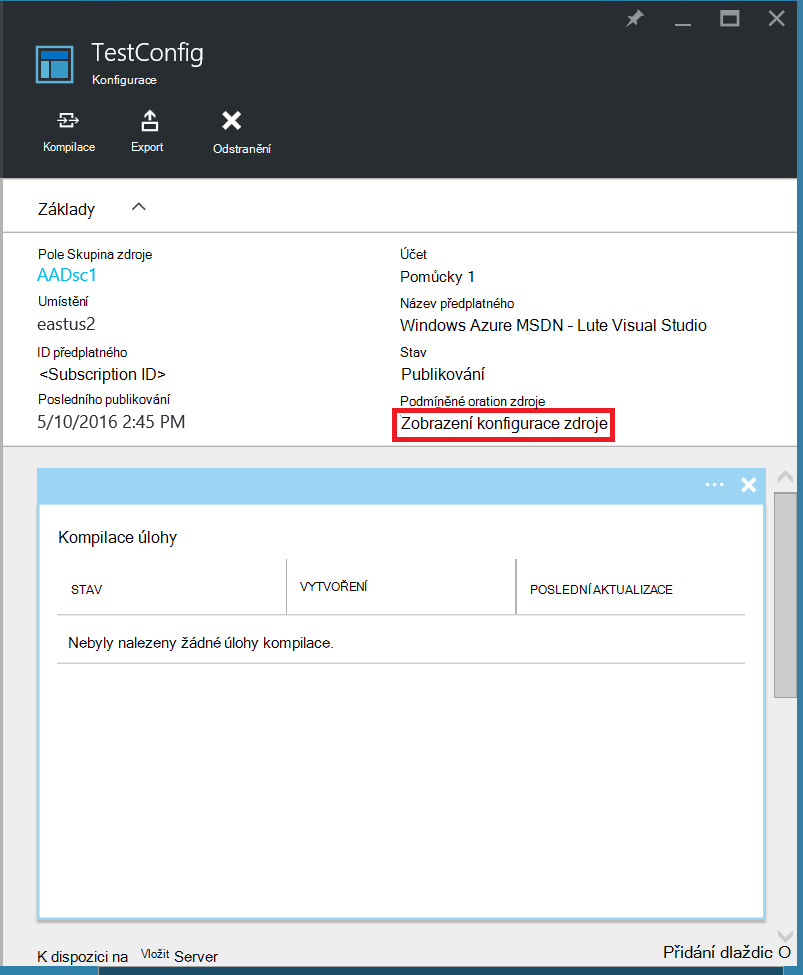
    
    **Konfigurace TestConfig zdroj** zásuvné otevře kód Powershellu pro konfiguraci.
    
## <a name="compiling-a-configuration-in-azure-automation"></a>Kompilace konfigurace v Azure automatizaci

Před instalací požadovaný stav na uzel DSC konfigurace definování státu musí kompilovaný do jednoho nebo více uzel konfigurace (MOF dokument) a klepnutím na Automation DSC vyžádat Server. Podrobnější popis kompilace konfigurace v Azure automatizaci DSC najdete v tématu [kompilace konfigurace v Azure automatizaci DSC](automation-dsc-compile.md). Další informace o sestavování konfigurace najdete v tématu [Konfigurace DSC](https://msdn.microsoft.com/PowerShell/DSC/configurations).

1. Přihlaste se k [portálu Azure](https://portal.azure.com).

2. V nabídce centrální klikněte na **všechny zdroje** a pak na název účtu automatizaci.

3. Na zásuvné **automatizaci účtu** klikněte na tlačítko **Konfigurace DSC**

4. Na zásuvné **DSC konfigurace** klikněte na **TestConfig** (jméno dříve importovaná konfigurace).

5. Na zásuvné **TestConfig konfigurace** **klepněte**a klikněte na **Ano**. Spustí se kompilace projektu.
    
    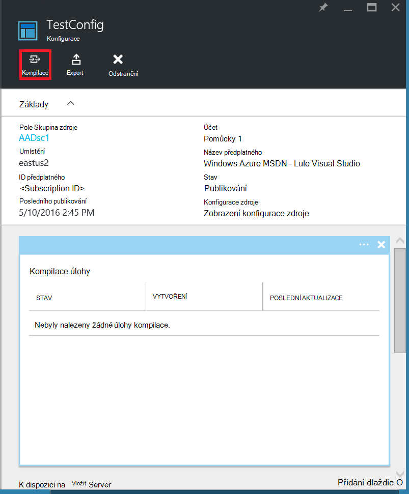
    
> [AZURE.NOTE] Při kompilaci konfigurace v Azure automatizaci nasadí automaticky všech vytvořený uzel konfigurace soubory MOF server vložit.

## <a name="viewing-a-compilation-job"></a>Zobrazení projektu kompilace

Jakmile začnete kompilace, zobrazíte v této dlaždici **kompilace úlohy** v zásuvné **Konfigurace** . Dlaždice **kompilace úlohy** zobrazuje aktuálně spuštěných, uskutečněné a failed úlohy. Při otevření zásuvné úlohy kompilace zobrazuje informace o této úlohy, včetně všech chyb a upozornění narazili, použít vstupních parametrů v konfiguraci a kompilace protokoly.

1. Přihlaste se k [portálu Azure](https://portal.azure.com).

2. V nabídce centrální klikněte na **všechny zdroje** a pak na název účtu automatizaci.

3. Na zásuvné **automatizaci účtu** klikněte na **DSC konfigurace**.

4. Na zásuvné **DSC konfigurace** klikněte na **TestConfig** (jméno dříve importovaná konfigurace).

5. Na dlaždici **kompilace úlohy** zásuvné **TestConfig konfigurace** klikněte na libovolný úloh uvedené. Otevře se **Úloha kompilace** zásuvné označené datum zahájení projektu kompilace.

    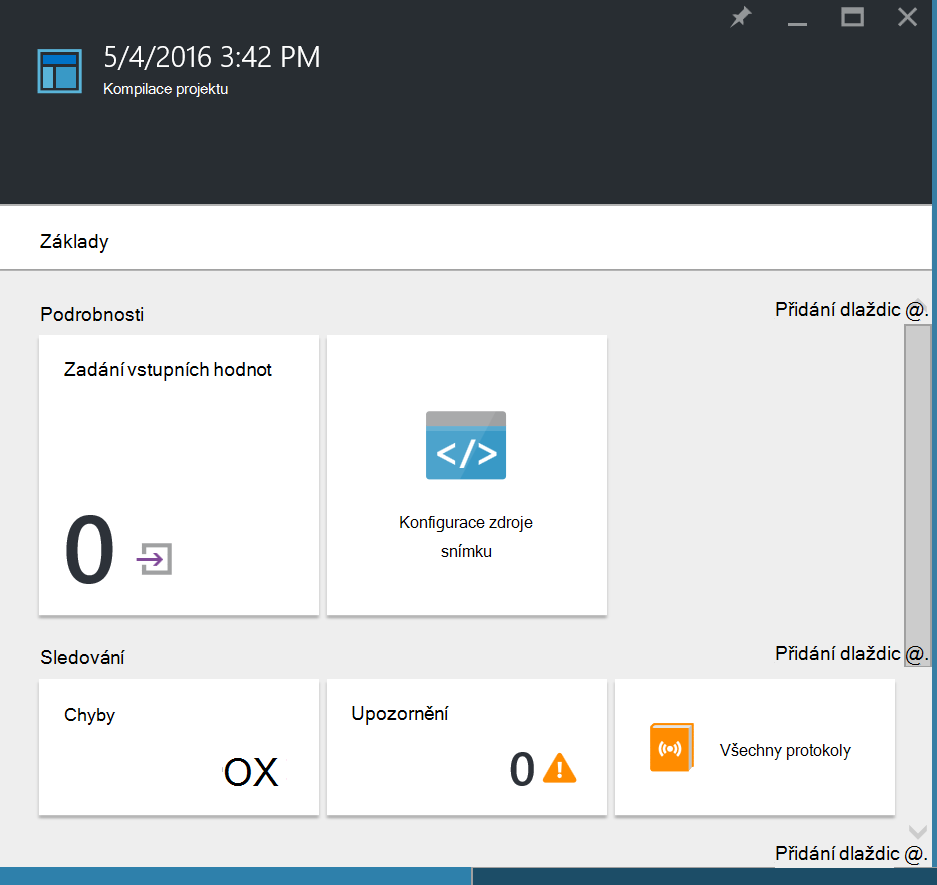
  
6. Klikněte na jakoukoliv dlaždici zásuvné **Úloha kompilace** zobrazit další podrobné informace o projektu.

## <a name="viewing-node-configurations"></a>Konfigurace zobrazení uzel

Úspěšné dokončení projektu kompilace vytvoří jeden nebo více nové uzel konfigurace. Konfigurace uzel je MOF dokument, který je nasazený vyžádané server a je připraven k doplněné a použít tak, že jeden nebo více uzlů. Konfigurace uzel můžete zobrazit ve svém účtu automatizaci v zásuvné **DSC uzel konfigurace** . Konfigurace uzel má název s formuláři *ConfigurationName*. *Název_uzlu*.

1. Přihlaste se k [portálu Azure](https://portal.azure.com).

2. V nabídce centrální klikněte na **všechny zdroje** a pak na název účtu automatizaci.

3. Na zásuvné **automatizaci účtu** klikněte na **Uzel konfigurace DSC**.

    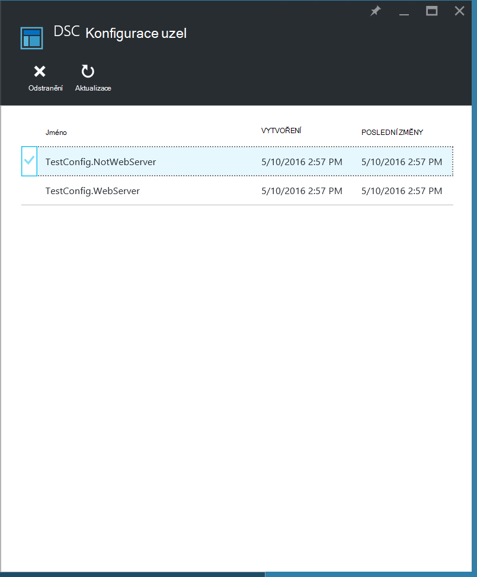
    
## <a name="onboarding-an-azure-vm-for-management-with-azure-automation-dsc"></a>Rychlého připojení OM Azure pro správu s DSC automatizaci Azure

DSC automatizaci Azure slouží ke správě Azure VMs (klasický i správce prostředků) místní VMs, Linux počítačích, AWS VMs a místní fyzických počítačů. V tomto tématu budeme zabývat těmito oblastmi jak integrovaný pouze VMs Azure správce prostředků. Informace o rychlého připojení dalších typů zařízení, najdete v článku [počítačích rychlého připojení ke správě tak, že DSC automatizaci Azure](automation-dsc-onboarding.md).

### <a name="to-onboard-an-azure-resource-manager-vm-for-management-by-azure-automation-dsc"></a>K integrované OM Azure správce prostředků pro správu tak, že DSC automatizaci Azure

1. Přihlaste se k [portálu Azure](https://portal.azure.com).

2. V nabídce centrální klikněte na **všechny zdroje** a pak na název účtu automatizaci.

3. Na zásuvné **automatizaci účtu** klikněte na **DSC uzlů**.

4. V zásuvné **DSC uzlech** klikněte na **Přidat OM Azure**.

    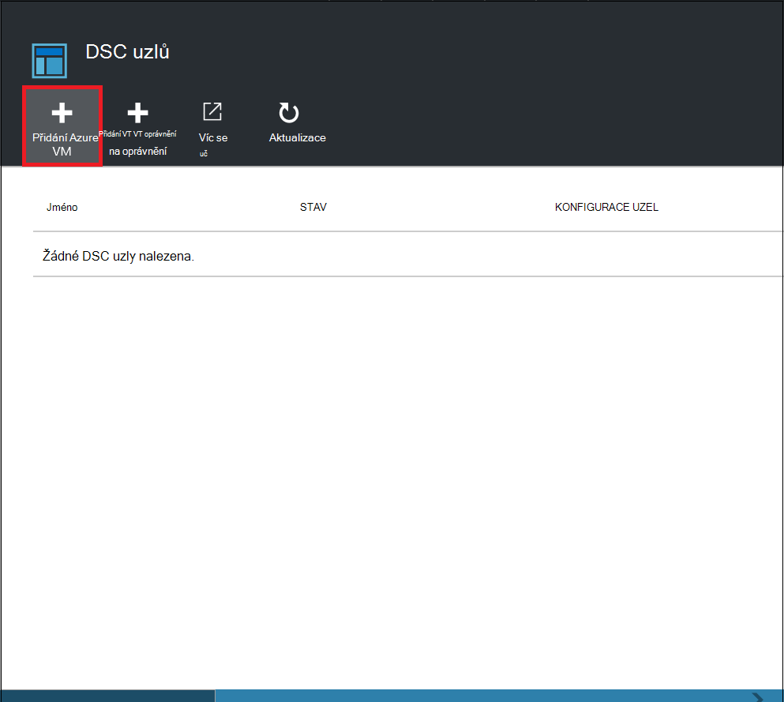

5. V zásuvné **Přidat VMs Azure** klikněte na **Výběr virtuálních počítačích na integrovaný**.

6. V **Vyberte VMs** zásuvné vyberte OM, chcete-li integrovaný a klikněte na **OK**.

    >[AZURE.IMPORTANT] Musí se jednat o OM správce prostředků Azure systémem Windows Server 2008 R2 nebo novější.
    
7. V zásuvné **Přidat VMs Azure** klikněte na **Konfigurovat registračních údajů**.

8. V zásuvné **Registrace** zadejte název, který chcete použít k OM do pole **Název konfigurace uzel** konfigurace uzel. To musí přesně shodovat název uzel konfigurace účtu automatizaci. V tomto okamžiku poskytuje název je nepovinný krok. Konfigurace přiřazené uzel po rychlého připojení uzel můžete změnit.
Zkontrolujte **Restartujte uzel v případě potřeby**a pak klikněte na **OK**.
    
    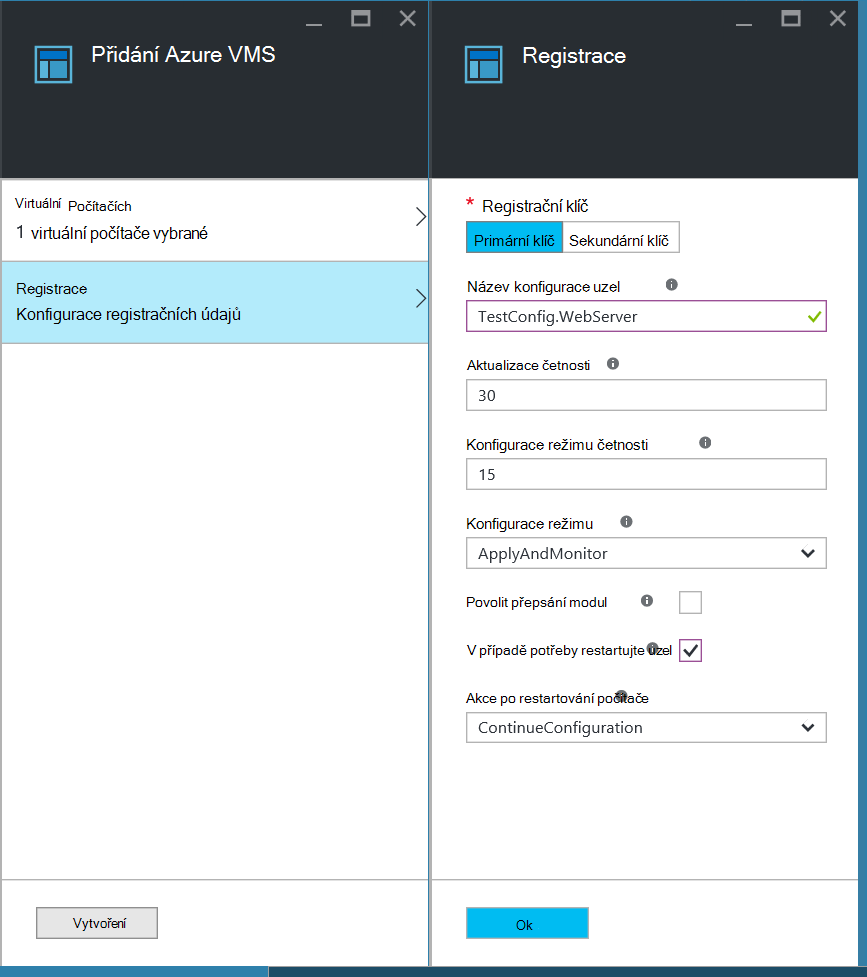
    
    Konfigurace uzel, které jste zadali použije se OM intervalech nastavil **Konfigurace režimu četnost**a OM bude zkontrolovat aktualizace: Konfigurace uzel intervalech nastavil **Aktualizace četnosti**. Další informace o použití těchto hodnot najdete v tématu [Konfigurace Správce konfigurace místní](https://msdn.microsoft.com/PowerShell/DSC/metaConfig).
    
9. V zásuvné **Přidat VMs Azure** klikněte na **vytvořit**.

Azure spustí proces rychlého připojení OM. Po dokončení OM se blok zobrazí v zásuvné **DSC uzlů** v okně automatizaci účet.

## <a name="viewing-the-list-of-dsc-nodes"></a>Zobrazení seznamu DSC uzlů

Můžete zobrazit seznam všech počítačů, které byly onboarded pro správu ve svém účtu automatizaci v zásuvné **DSC uzlů** .

1. Přihlaste se k [portálu Azure](https://portal.azure.com).

2. V nabídce centrální klikněte na **všechny zdroje** a pak na název účtu automatizaci.

3. Na zásuvné **automatizaci účtu** klikněte na **DSC uzlů**.

## <a name="viewing-reports-for-dsc-nodes"></a>Zobrazení sestav pro DSC uzly

Pokaždé, když Azure automatizaci DSC provádí kontrola konzistence na uzel spravované na uzel odešle zprávu o stavu zpět na server vložit. Tyto sestavy můžete zobrazit na zásuvné uzel.

1. Přihlaste se k [portálu Azure](https://portal.azure.com).

2. V nabídce centrální klikněte na **všechny zdroje** a pak na název účtu automatizaci.

3. Na zásuvné **automatizaci účtu** klikněte na **DSC uzlů**.

4. Na dlaždici **zprávy** klikněte na libovolný sestav v seznamu.

    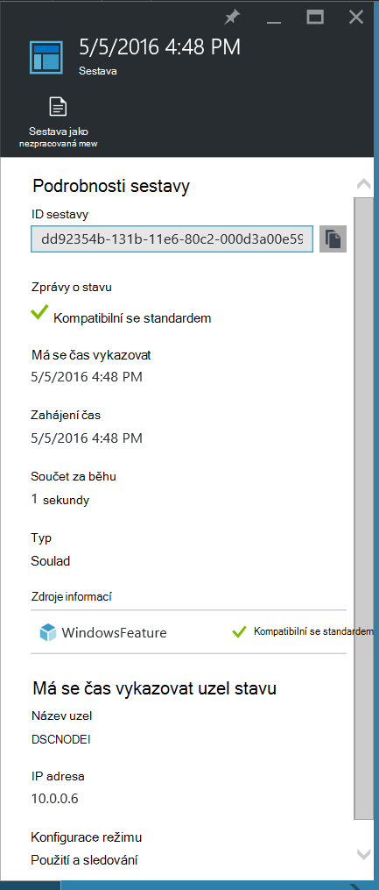

Na zásuvné jednotlivé sestavy zobrazí se následující informace o stavu pro odpovídající Kontrola konzistence:

- Sestavy stavu, zda je uzel "Vyhovuje", "Se nezdařil", konfigurace nebo uzel "Není kompatibilní s" (Pokud je uzel v režimu **applyandmonitor** a počítač není požadovaný stav).
- Počáteční datum Kontrola konzistence.
- Celková runtime pro Kontrola konzistence.
- Typ Kontrola konzistence.
- Všechny chyby, včetně kód chyby a chybové zprávy. 
- Všechny DSC zdrojů použitých v konfiguraci a stav každé zdroje (jestli uzel probíhá požadovaný stav pro daný zdroj) – kliknete na jednotlivé zdroje můžete získat další informace pro daný zdroj.
- Jméno, IP adresa a konfigurace režimu uzlu.

Můžete taky kliknout na **Zobrazit jako nezpracovaná sestavu** zobrazíte vlastních dat, která uzel odesílá na server. Další informace o použití těchto dat najdete v článku [použití DSC serveru sestav](https://msdn.microsoft.com/powershell/dsc/reportserver).

Může trvat určitou dobu, po uzel onboarded než první zpráva je k dispozici. Možná bude muset počkat až 30 minut pro první zprávu až palubě uzel.

## <a name="reassigning-a-node-to-a-different-node-configuration"></a>Přiřazení uzel konfiguraci různých uzel

Můžete přiřadit uzel použití různých uzel konfigurace než tu, kterou jste původně přiřadili.

1. Přihlaste se k [portálu Azure](https://portal.azure.com).

2. V nabídce centrální klikněte na **všechny zdroje** a pak na název účtu automatizaci.

3. Na zásuvné **automatizaci účtu** klikněte na **DSC uzlů**.

4. Na zásuvné **DSC uzly** klikněte na název uzel, který chcete znovu přiřadit.

5. Na zásuvné pro uzel klikněte na **přiřadit uzel**.

    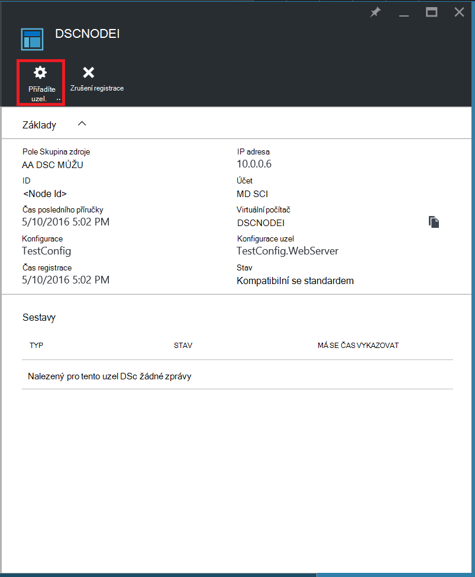

6. Na zásuvné **Přiřadit uzel konfigurace** vyberte uzel konfiguraci, ke kterému chcete přiřadit uzel a klikněte na tlačítko **OK**.

    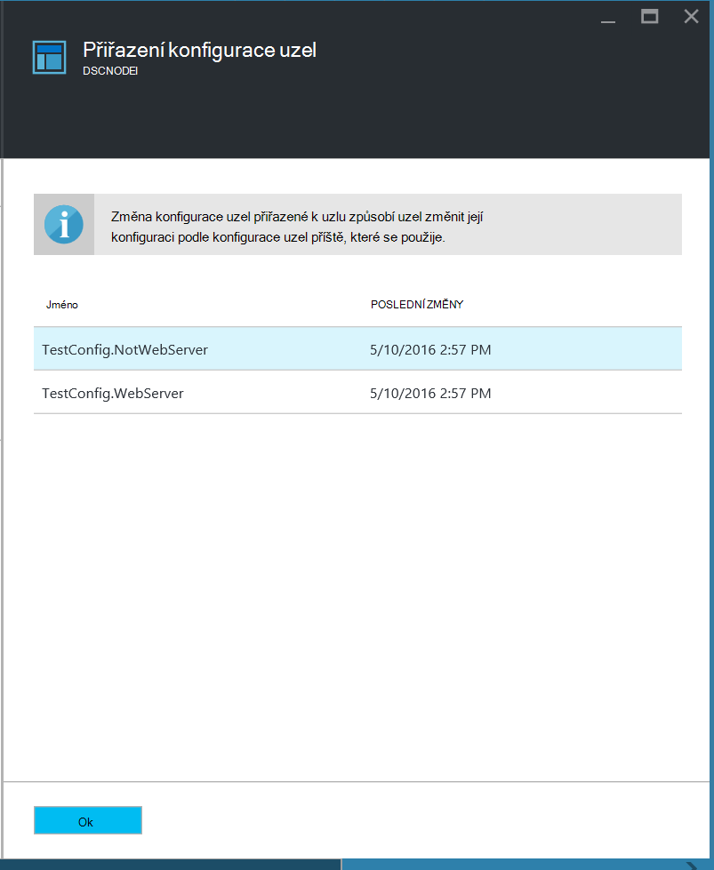
    
## <a name="unregistering-a-node"></a>Registrace uzel

Pokud už nechcete uzel spravuje DSC automatizaci Azure, můžete ho unregister.

1. Přihlaste se k [portálu Azure](https://portal.azure.com).

2. V nabídce centrální klikněte na **všechny zdroje** a pak na název účtu automatizaci.

3. Na zásuvné **automatizaci účtu** klikněte na **DSC uzlů**.

4. Na zásuvné **DSC uzly** klikněte na název, který chcete unregister uzel.

5. Na zásuvné pro uzel klikněte na **Unregister**.

    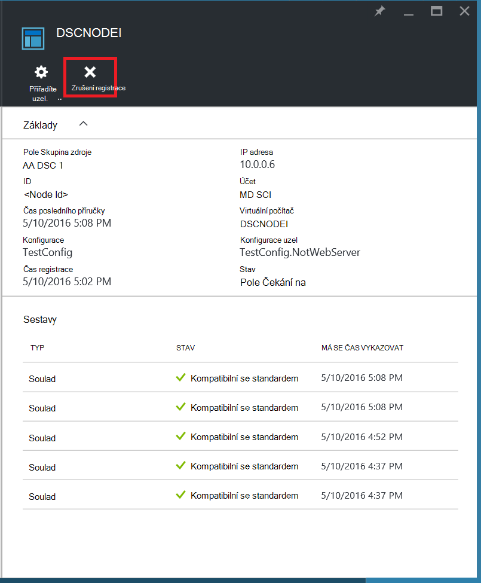

## <a name="related-articles"></a>Související články
* [Azure automatizaci DSC přehled](automation-dsc-overview.md)
* [Rychlého připojení počítače pro správu tak, že DSC automatizaci Azure](automation-dsc-onboarding.md)
* [Prostředí Windows PowerShell žádoucí Přehled konfigurace stavu](https://msdn.microsoft.com/powershell/dsc/overview)
* [Azure rutiny pro automatizaci DSC](https://msdn.microsoft.com/library/mt244122.aspx)
* [Azure automatizaci DSC ceny](https://azure.microsoft.com/pricing/details/automation/)

