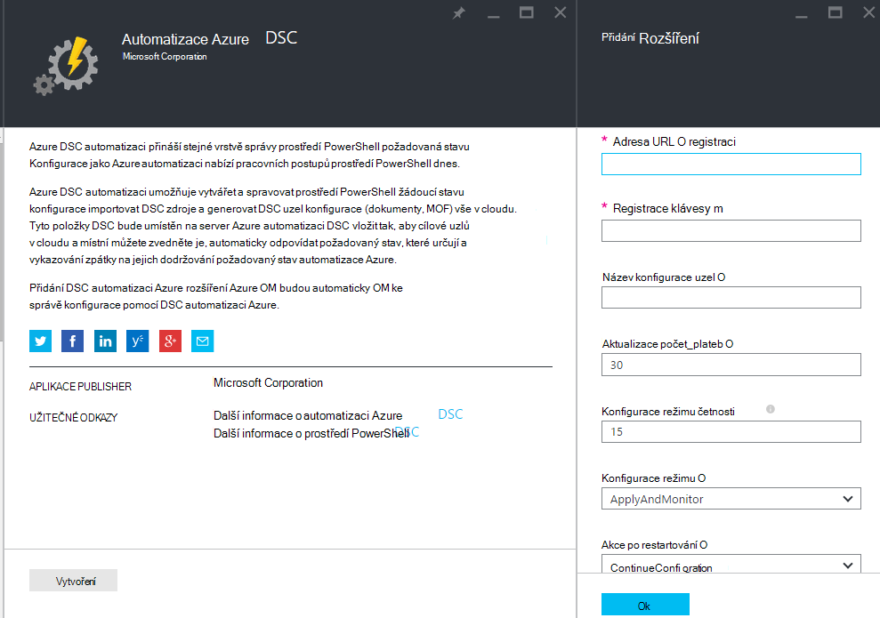
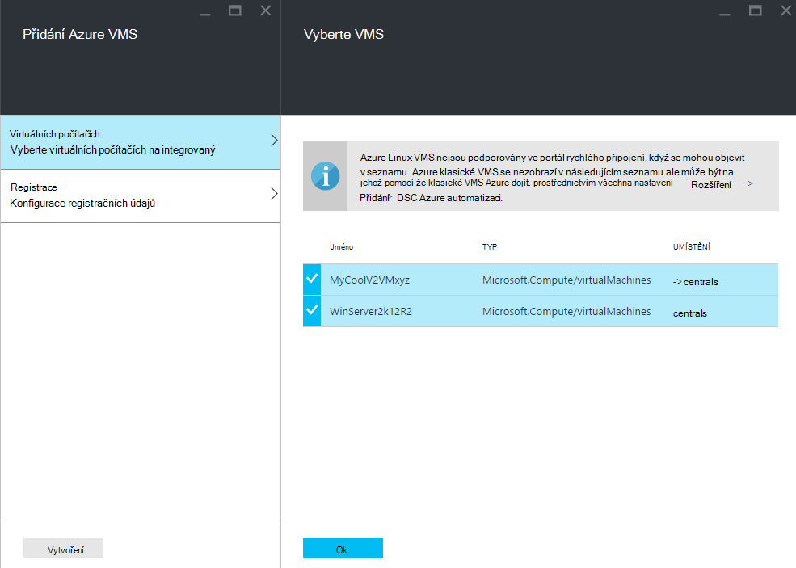
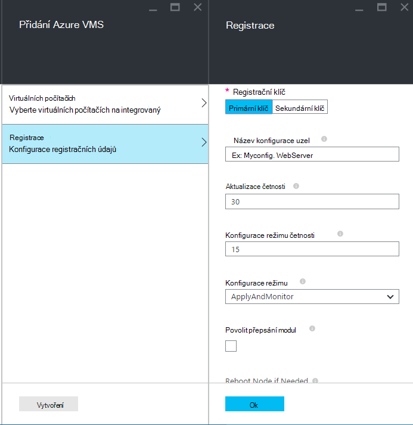
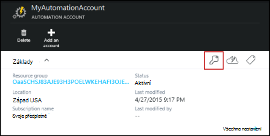
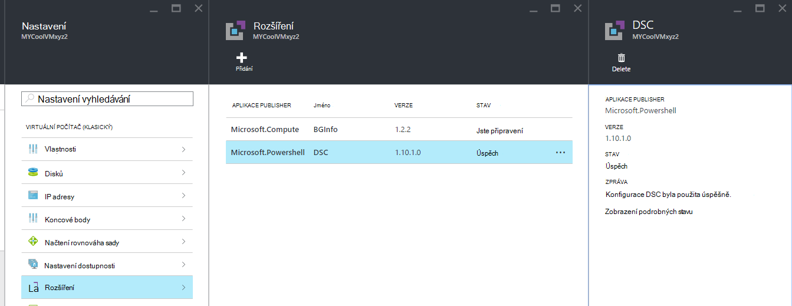

<properties 
   pageTitle="Rychlého připojení fyzické a virtuálních počítačů pro správu tak, že Azure automatizaci DSC | Microsoft Azure" 
   description="Jak nastavit počítačů pro správu s DSC automatizaci Azure" 
   services="automation" 
   documentationCenter="dev-center-name" 
   authors="coreyp-at-msft" 
   manager="stevenka" 
   editor="tysonn"/>

<tags
   ms.service="automation"
   ms.devlang="NA"
   ms.topic="article"
   ms.tgt_pltfrm="powershell"
   ms.workload="TBD" 
   ms.date="04/22/2016"
   ms.author="coreyp"/>

# Rychlého připojení počítače pro správu tak, že DSC automatizaci Azure

## Proč spravovat počítačích s DSC automatizaci Azure?

Konfigurace Azure automatické vyplňování stavu jako [Prostředí PowerShell žádoucí konfigurace stavu](https://technet.microsoft.com/library/dn249912.aspx), je služba správy jednoduché, a zároveň velmi užitečná, konfigurace DSC uzlů (fyzické a virtuálních počítačích) v cloudu a místní datacentra. Umožňuje škálovatelnost přes tisíce počítačích rychle a snadno z centrální, zabezpečené umístění. Můžete snadno integrovaný počítačích, je přiřadit je deklarativní konfigurace a zobrazení sestavy zobrazující pro každý počítač dodržování předpisů na požadovaný stav, který jste zadali. Správa vrstvy Azure automatizaci DSC je DSC, co je Azure automatizaci správy vrstvy skriptů Powershellu. Jinými slovy stejným způsobem, který automatizaci Azure umožňuje spravovat skriptů Powershellu, je taky dobré při správě konfigurace DSC. Další informace o výhodách používání Azure automatizaci DSC najdete v tématu [Přehled DSC automatizaci Azure](automation-dsc-overview.md). 

Azure DSC automatizaci lze použít ke správě různých počítačích:

*    Azure virtuálních počítačích (klasický)
*    Azure virtuálních počítačích
*    Amazon webové služby AWS virtuálních počítačích
*    Virtuální/fyzické Windows stroje místní, nebo v cloudu než Azure/AWS
*    Virtuální/fyzické Linux stroje místním v Azure nebo v cloudu než Azure

Kromě toho pokud nejste připravení ke správě konfigurace počítače z cloudu, Azure automatizaci DSC lze také jako koncový bod jen sestavy. Umožňuje nastavit požadovaná konfigurace (nabízených) až DSC místní a podrobnosti bohaté vytváření sestav na uzel dodržování požadovaný stav v Azure automatizaci.

V následujících částech popisují, jak se dá palubě jednotlivých typů počítač DSC automatizaci Azure.

## Azure virtuálních počítačích (klasický)

S Azure automatizaci DSC můžete to udělat snadno integrovaný Azure virtuálních počítačích (klasický) konfigurační řízení pomocí Azure portál, nebo Powershellu. Rozšířená a bez nutnosti vzdálené do OM Správce konfigurace stavu žádoucí OM Azure rozšíření zaregistruje OM DSC automatizaci Azure. Protože koncovku konfigurace stavu požadované OM Azure spustí asynchronní, jak sledovat jeho průběh nebo Poradce při potížích s jsou uvedeny v části [**Poradce při potížích s Azure virtuálního počítače rychlého připojení**](#troubleshooting-azure-virtual-machine-onboarding) .

### Azure portálu

V [Azure portál](http://portal.azure.com/), klikněte na **Procházet** -> **virtuálních počítačích (klasické)**. Vyberte Windows OM, chcete-li integrovaný. Na zásuvné řídicího panelu virtuálního počítače, klikněte na **všechna nastavení** -> **rozšíření** -> **Přidat** -> **Azure automatizaci DSC** -> **vytvořit**. Zadejte [hodnoty Správce konfigurace místního prostředí PowerShell DSC](https://msdn.microsoft.com/powershell/dsc/metaconfig4) muset případu použití, klíč registrace účtu automatizaci registrace URL a volitelně uzel konfigurace přiřadit bude v angličtině.

K vyhledání registrace adresy URL a klíč pro automatizace účet palubě počítač, viz oddíl níž [**zabezpečené registrace**](#secure-registration) .

### Prostředí PowerShell

    # log in to both Azure Service Management and Azure Resource Manager
    Add-AzureAccount
    Add-AzureRmAccount
    
    # fill in correct values for your VM/Automation account here
    $VMName = ""
    $ServiceName = ""
    $AutomationAccountName = ""
    $AutomationAccountResourceGroup = ""

    # fill in the name of a Node Configuration in Azure Automation DSC, for this VM to conform to
    $NodeConfigName = ""

    # get Azure Automation DSC registration info
    $Account = Get-AzureRmAutomationAccount -ResourceGroupName $AutomationAccountResourceGroup -Name $AutomationAccountName
    $RegistrationInfo = $Account | Get-AzureRmAutomationRegistrationInfo

    # use the DSC extension to onboard the VM for management with Azure Automation DSC
    $VM = Get-AzureVM -Name $VMName -ServiceName $ServiceName
    
    $PublicConfiguration = ConvertTo-Json -Depth 8 @{
      SasToken = ""
      ModulesUrl = "https://eus2oaasibizamarketprod1.blob.core.windows.net/automationdscpreview/RegistrationMetaConfigV2.zip"
      ConfigurationFunction = "RegistrationMetaConfigV2.ps1\RegistrationMetaConfigV2"

    # update these PowerShell DSC Local Configuration Manager defaults if they do not match your use case.
    # See https://technet.microsoft.com/library/dn249922.aspx?f=255&MSPPError=-2147217396 for more details
     Properties = @{
        RegistrationKey = @{
          UserName = 'notused'
          Password = 'PrivateSettingsRef:RegistrationKey'
        }
        RegistrationUrl = $RegistrationInfo.Endpoint
        NodeConfigurationName = $NodeConfigName
        ConfigurationMode = "ApplyAndMonitor"
        ConfigurationModeFrequencyMins = 15
        RefreshFrequencyMins = 30
        RebootNodeIfNeeded = $False
        ActionAfterReboot = "ContinueConfiguration"
        AllowModuleOverwrite = $False
      }
    }

    $PrivateConfiguration = ConvertTo-Json -Depth 8 @{
      Items = @{
         RegistrationKey = $RegistrationInfo.PrimaryKey
      }
    }
    
    $VM = Set-AzureVMExtension `
     -VM $vm `
     -Publisher Microsoft.Powershell `
     -ExtensionName DSC `
     -Version 2.19 `
     -PublicConfiguration $PublicConfiguration `
     -PrivateConfiguration $PrivateConfiguration `
     -ForceUpdate

    $VM | Update-AzureVM

## Azure virtuálních počítačích

Azure DSC automatizaci umožňuje snadno integrovaný Azure virtuálních počítačích ke správě konfigurace pomocí Azure portál, správce prostředků Azure šablony nebo Powershellu. Rozšířená a bez nutnosti vzdálené do OM správce registruje koncovku konfigurace stavu požadované OM Azure OM DSC automatizaci Azure. Protože koncovku konfigurace stavu požadované OM Azure spustí asynchronní, jak sledovat jeho průběh nebo Poradce při potížích s jsou uvedeny v části [**Poradce při potížích s Azure virtuálního počítače rychlého připojení**](#troubleshooting-azure-virtual-machine-onboarding) .

### Azure portálu

[Azure portál](https://portal.azure.com/)přejděte na účet Azure automatizaci místo, kam chcete integrovaný virtuálních počítačích. Na řídicím panelu automatizaci účtu, klikněte na tlačítko **DSC uzly** -> **Přidat OM Azure**.

V části **Vyberte virtuálních počítačích na integrovaný**vyberte jeden nebo více Azure virtuálních počítačích na integrovaný.

V části **Konfigurovat registračních údajů**zadejte potřebné pro případ použití a volitelně uzel konfigurace přiřazení bude v angličtině [Správce konfigurace místního prostředí PowerShell DSC hodnoty](https://msdn.microsoft.com/powershell/dsc/metaconfig4) .

 
### Azure správce prostředků šablony

Můžete nasadit Azure virtuálních počítačích a onboarded DSC automatizaci Azure pomocí Správce prostředků Azure šablony. Přečtěte si téma [Konfigurace OM prostřednictvím DSC linky a Azure automatizaci DSC](https://azure.microsoft.com/documentation/templates/dsc-extension-azure-automation-pullserver/) u šablony příklad této onboards existující OM k automatizaci DSC Azure. Najít registračního klíče a adresu URL registrace pořízené předávat na vstupu v této šabloně, viz oddíl níž [**zabezpečené registrace**](#secure-registration) .

### Prostředí PowerShell

Rutina [Register AzureRmAutomationDscNode](https://msdn.microsoft.com/library/mt603833.aspx) mohou sloužit k integrovaný virtuálních počítačích Azure portálu prostřednictvím Powershellu.

## Amazon webové služby AWS virtuálních počítačích

Je možné snadno integrovaný Amazon webovým službám virtuálních počítačích ke správě konfigurace tak, že DSC automatizaci Azure pomocí nástrojů DSC AWS. Další informace o této sady [tady](https://blogs.msdn.microsoft.com/powershell/2016/04/20/aws-dsc-toolkit/).

## Virtuální/fyzické Windows stroje místní, nebo v cloudu než Azure/AWS

Místní Windows počítačích a počítačích Windows v není Azure mračnech (například Amazon webové služby) může být také onboarded Azure automatizaci DSC dlouhou, jak mají přístup pro odchozí připojení k Internetu, pomocí několika jednoduchých krocích:

1. Zkontrolujte, jestli že je už nainstalovaná nejnovější verze [WMF 5](http://aka.ms/wmf5latest) v počítačích, které chcete integrovaný DSC automatizaci Azure.
2. Postupujte podle pokynů v části [**vytváření DSC metaconfigurations**](#generating-dsc-metaconfigurations) dole generovat složku obsahující potřebné metaconfigurations DSC.
3. Vzdálené použití metaconfiguration prostředí PowerShell DSC do počítačů, které chcete integrovaný. **Počítač, který tento příkaz spustit z musí mít nejnovější verzi nainstalovat aplikaci [WMF 5](http://aka.ms/wmf5latest) **:

    `Set-DscLocalConfigurationManager -Path C:\Users\joe\Desktop\DscMetaConfigs -ComputerName MyServer1, MyServer2`

4. DSC prostředí PowerShell metaconfigurations nelze použít vzdáleně, zkopírujte složce metaconfigurations z kroku 2 na každý počítač do integrovaný. Na každém počítači k integrovaný místně volejte **DscLocalConfigurationManager sadu** .
5. Pomocí Azure portál nebo rutin, zkontrolujte, zda počítače na integrovaný teď zobrazit jako DSC uzly registrované ve vašem účtu Azure automatizaci.

## Virtuální/fyzické Linux stroje místním v Azure nebo v cloudu než Azure

Místní Linux počítačích, Linux počítačích v Azure a Linux počítačů v není Azure mračnech mohou být také onboarded Azure automatizaci DSC dlouhou, jak mají přístup pro odchozí připojení k Internetu, pomocí několika jednoduchých krocích:

1. Zkontrolujte, jestli že je už nainstalovaná nejnovější verze [DSC Linux agent](http://www.microsoft.com/download/details.aspx?id=49150) v počítačích, které chcete integrovaný DSC automatizaci Azure.

2. Pokud [Správce konfigurace místního prostředí PowerShell DSC výchozí](https://msdn.microsoft.com/powershell/dsc/metaconfig4) nevyhovují případu použití, a chcete, aby se integrovaný stroje tak že **spotřebovávat i zprávu Azure automatizaci DSC** :

    *    Na každém počítači Linux k integrovaný DSC automatizaci Azure pomocí Register.py integrovaný pomocí Správce konfigurace místního prostředí PowerShell DSC výchozího nastavení:

        `/opt/microsoft/dsc/Scripts/Register.py <Automation account registration key> <Automation account registration URL>`

    *    Najít registračního klíče a adresu URL registrace účtu automatizaci, viz oddíl níž [**zabezpečené registrace**](#secure-registration) .

    Pokud správce konfigurace místního prostředí PowerShell DSC výchozí **proveďte** **neodpovídá, případu použití, nebo chcete integrovaný počítačích tak, aby se jenom vykazují DSC automatizaci Azure** , ale není konfigurace vyžádané nebo moduly prostředí PowerShell z něho proveďte kroky 3 až 6. V opačném přejděte přímo ke kroku 6.

3.  Postupujte podle pokynů v části [**vytváření DSC metaconfigurations**](#generating-dsc-metaconfigurations) generovat složku obsahující potřebné metaconfigurations DSC.
4.  Vzdálené použití metaconfiguration prostředí PowerShell DSC do počítačů, které chcete integrovaný:
        
        $SecurePass = ConvertTo-SecureString -String "<root password>" -AsPlainText -Force
        $Cred = New-Object System.Management.Automation.PSCredential "root", $SecurePass
        $Opt = New-CimSessionOption -UseSsl -SkipCACheck -SkipCNCheck -SkipRevocationCheck

        # need a CimSession for each Linux machine to onboard
        
        $Session = New-CimSession -Credential $Cred -ComputerName <your Linux machine> -Port 5986 -Authentication basic -SessionOption $Opt
        
        Set-DscLocalConfigurationManager -CimSession $Session –Path C:\Users\joe\Desktop\DscMetaConfigs
    
Počítač, který tento příkaz spustit z musíte mít nejnovější verzi nainstalovat aplikaci [WMF 5](http://aka.ms/wmf5latest) .

5.  Pokud není možné použít metaconfigurations prostředí PowerShell DSC dálku pro každý počítač Linux integrovaný, zkopírujte metaconfiguration odpovídající počítače ze složky v kroku 5 na počítači Linux. Zavolejte `SetDscLocalConfigurationManager.py` místně na každém počítači Linux chcete do integrovaný Azure automatizaci DSC:

    `/opt/microsoft/dsc/Scripts/SetDscLocalConfigurationManager.py –configurationmof <path to metaconfiguration file>`

6.  Pomocí Azure portál nebo rutin, zkontrolujte, zda počítače na integrovaný teď zobrazit jako DSC uzly registrované ve vašem účtu Azure automatizaci.

##Generování DSC metaconfigurations
K obecně integrovaný všechny počítače Azure automatizaci DSC DSC metaconfiguration může být přihlášení vygenerované, při použití říká agenta DSC v počítači k spotřebovávat nebo nahlásit DSC automatizaci Azure. DSC metaconfigurations pro automatizaci DSC Azure lze vytvořit pomocí prostředí PowerShell DSC konfiguraci nebo rutiny prostředí PowerShell automatizaci Azure.

**Poznámka:** DSC metaconfigurations obsahovat tajemství potřeby integrovaný počítač tak, aby automatizaci účtu pro správu. Zkontrolujte, že správně zamknout všechny DSC metaconfigurations, které vytvoříte nebo odstranění po použití.

###Pomocí konfigurace DSC
1.  Otevřete ISE PowerShell jako správce v počítači v místním prostředí. Počítač musí mít nejnovější verzi nainstalovat aplikaci [WMF 5](http://aka.ms/wmf5latest) .

2.  Zkopírujte tento skript místně. Tento skript obsahuje konfiguraci DSC Powershellu pro vytváření metaconfigurations a příkaz a spusťte tak vytváření metaconfiguration.
    
        # The DSC configuration that will generate metaconfigurations
        [DscLocalConfigurationManager()]
        Configuration DscMetaConfigs 
        { 
            param 
            ( 
                [Parameter(Mandatory=$True)] 
                [String]$RegistrationUrl,
         
                [Parameter(Mandatory=$True)] 
                [String]$RegistrationKey,

                [Parameter(Mandatory=$True)] 
                [String[]]$ComputerName,

                [Int]$RefreshFrequencyMins = 30, 
            
                [Int]$ConfigurationModeFrequencyMins = 15, 
            
                [String]$ConfigurationMode = "ApplyAndMonitor", 
            
                [String]$NodeConfigurationName,

                [Boolean]$RebootNodeIfNeeded= $False,

                [String]$ActionAfterReboot = "ContinueConfiguration",

                [Boolean]$AllowModuleOverwrite = $False,

                [Boolean]$ReportOnly
            )

    
            if(!$NodeConfigurationName -or $NodeConfigurationName -eq "") 
            { 
                $ConfigurationNames = $null 
            } 
            else 
            { 
                $ConfigurationNames = @($NodeConfigurationName) 
            }

            if($ReportOnly)
            {
               $RefreshMode = "PUSH"
            }
            else
            {
               $RefreshMode = "PULL"
            }

            Node $ComputerName
            {

                Settings 
                { 
                    RefreshFrequencyMins = $RefreshFrequencyMins 
                    RefreshMode = $RefreshMode 
                    ConfigurationMode = $ConfigurationMode 
                    AllowModuleOverwrite = $AllowModuleOverwrite 
                    RebootNodeIfNeeded = $RebootNodeIfNeeded 
                    ActionAfterReboot = $ActionAfterReboot 
                    ConfigurationModeFrequencyMins = $ConfigurationModeFrequencyMins 
                }

                if(!$ReportOnly)
                {
                   ConfigurationRepositoryWeb AzureAutomationDSC 
                    { 
                        ServerUrl = $RegistrationUrl 
                        RegistrationKey = $RegistrationKey 
                        ConfigurationNames = $ConfigurationNames 
                    }

                    ResourceRepositoryWeb AzureAutomationDSC 
                    { 
                       ServerUrl = $RegistrationUrl 
                       RegistrationKey = $RegistrationKey 
                    }
                }

                ReportServerWeb AzureAutomationDSC 
                { 
                    ServerUrl = $RegistrationUrl 
                    RegistrationKey = $RegistrationKey 
                }
            } 
        }
        
        # Create the metaconfigurations
        # TODO: edit the below as needed for your use case
        $Params = @{
             RegistrationUrl = '<fill me in>';
             RegistrationKey = '<fill me in>';
             ComputerName = @('<some VM to onboard>', '<some other VM to onboard>');
             NodeConfigurationName = 'SimpleConfig.webserver';
             RefreshFrequencyMins = 30;
             ConfigurationModeFrequencyMins = 15;
             RebootNodeIfNeeded = $False;
             AllowModuleOverwrite = $False;
             ConfigurationMode = 'ApplyAndMonitor';
             ActionAfterReboot = 'ContinueConfiguration';
             ReportOnly = $False;  # Set to $True to have machines only report to AA DSC but not pull from it
        }
        
        # Use PowerShell splatting to pass parameters to the DSC configuration being invoked
        # For more info about splatting, run: Get-Help -Name about_Splatting
        DscMetaConfigs @Params

3.  Vyplňte registračního klíče a adresu URL pro váš účet automatizaci, jakož i názvy počítače na integrovaný. Všechny ostatní parametry jsou volitelné. Najít registračního klíče a adresu URL registrace účtu automatizaci, viz oddíl níž [**zabezpečené registrace**](#secure-registration) .

4.  Pokud chcete počítače vykazování informací o stavu DSC k automatizaci DSC Azure, ale není vyžádat konfiguraci nebo prostředí PowerShell moduly, nastavte parametr **ReportOnly** true (pravda).

5.  Spusťte skript. Nyní byste měli mít složku s názvem **DscMetaConfigs** v adresáři pracovní obsahující metaconfigurations DSC Powershellu pro počítače do integrovaný.

###Používání rutin automatizaci Azure
Pokud správce konfigurace místního prostředí PowerShell DSC výchozí nevyhovují případu použití, a chcete integrovaný počítačích tak, aby se spotřebovávat i zprávu DSC automatizaci Azure, zadejte rutiny pro automatizaci Azure zjednodušené způsob, jak vytvářet metaconfigurations DSC potřeby:

1.  Otevřete konzoly PowerShell nebo ISE PowerShell jako správce v počítači v místním prostředí.

2.  Připojení k Azure správce prostředků pomocí **Přidat AzureRmAccount**

3.  Stahování metaconfigurations prostředí PowerShell DSC u počítačů, které chcete do integrovaný automatizaci účtu, do kterého chcete integrovaný uzly:

        # Define the parameters for Get-AzureRmAutomationDscOnboardingMetaconfig using PowerShell Splatting
        $Params = @{
            ResourceGroupName = 'ContosoResources'; # The name of the ARM Resource Group that contains your Azure Automation Account
            AutomationAccountName = 'ContosoAutomation'; # The name of the Azure Automation Account where you want a node on-boarded to
            ComputerName = @('web01', 'web02', 'sql01'); # The names of the computers that the meta configuration will be generated for
            OutputFolder = "$env:UserProfile\Desktop\";
        }
        
        # Use PowerShell splatting to pass parameters to the Azure Automation cmdlet being invoked
        # For more info about splatting, run: Get-Help -Name about_Splatting
        Get-AzureRmAutomationDscOnboardingMetaconfig @Params

Teď byste měli mít složku s názvem ***DscMetaConfigs***, obsahující metaconfigurations DSC Powershellu pro počítače do integrovaný.

##Zabezpečené registrace

Počítačích můžete bezpečně palubě k automatizaci Azure účtu přes protokol registrace WMF 5 DSC, který umožňuje DSC uzel ověření prostředí PowerShell DSC V2 vyžádat nebo zasílání zpráv o chybách serveru (včetně Azure automatizaci DSC). Uzel registruje k serveru **URL registrace**, ověřování pomocí **registračního klíče**. Při registraci, DSC uzel a server DSC vyžádané/pro vykazování vyjednávání certifikát jedinečné pro tento uzel pro účely ověření po registraci serveru. Tento proces zabrání onboarded uzly z jednoho jiné, například pokud uzel ohroženo zosobnění a chová speciálně. Po registraci registrační klíč pro ověřování znovu nepoužívá a se odstraní ze skupiny.

Můžete získat informace potřebné k protokolu DSC registrace z zásuvné **Správa klíčů** na portálu Azure náhled. Otevřete tento zásuvné kliknutím na ikonu klíče na panelu **Essentials** pro automatizaci účtu.

*    Symbol registrované obchodní adresa URL je do pole Adresa URL v zásuvné Správa klíčů.
*    Registrace klíč je primární klíč přístup nebo vedlejší přístupová klávesa zásuvné Správa klíčů. Buď můžete být používá.

Zvýšit zabezpečení můžete kdykoli (na zásuvné **Správa klíčů** ) nechcete, aby budoucí uzel registrace použít předchozí generováno primárních a sekundárních přístupových kláves účtu, který automatizaci.

##Poradce při potížích rychlého připojení Azure virtuálního počítače

Azure DSC automatizaci umožňuje snadno integrovaný VMs Windows Azure ke správě konfigurace. Rozšířená koncovku konfigurace stavu požadované OM Azure slouží k registraci OM DSC automatizaci Azure. Vzhledem k tomu rozšíření konfigurace stavu požadované OM Azure spuštěno asynchronní, sledovat jeho průběh a řešení potíží s jeho spuštění může být důležité. 

>[AZURE.NOTE] Jakákoli metoda rychlého připojení OM Windows Azure k DSC automatizaci Azure, který používá příponu konfigurace stavu požadované OM Azure může trvat až hodinu pro uzel zobrazíte až registrován v Azure automatizaci. Toto je kvůli instalace systému Windows Management Framework 5.0 na OM tak, že přípona Azure OM DSC požaduje pro její integrovaný OM k automatizaci DSC Azure.

Poradce při potížích s nebo můžete zobrazit stav koncovku konfigurace stavu požadované OM Azure, v Azure portál přejděte k OM právě onboarded, a klikněte na -> **všechna nastavení** -> **rozšíření** -> **DSC**. Další informace kliknete na **Zobrazit podrobný stav**.

## Vypršení platnosti certifikátu a opětovná

Po registraci do počítače jako uzel DSC v Azure automatizaci DSC, existuje spousta důvodů, proč budete muset znovu zaregistrujte uzel v budoucnu:

* Po zaregistrování automatické jednotlivých uzlech certifikát jedinečné pro ověření, že vyprší jejich platnost za jeden rok. V současné době registrační protokol prostředí PowerShell DSC nelze automaticky certifikáty obnovit po vypršení platnosti, budou se blíží, budete muset znovu zaregistrujte uzly po dobu za rok. Před novou registrací, ujistěte se, jestli je spuštěný jednotlivých uzlech Windows Management Framework 5.0 RTM. Pokud na uzel ověřovací certifikát vyprší a není znovu zaregistruje uzel, uzel nebude možné komunikovat s Azure automatizaci a budou označeny "Unresponsive." Opětovná provést 90 dní nebo menší od doby vypršení platnosti certifikátu nebo kdykoli po dobu platnosti certifikátu, výsledkem bude nový certifikát vytvářejí a použít.

* Chcete-li změnit všechny [hodnoty Správce konfigurace místního prostředí PowerShell DSC](https://msdn.microsoft.com/powershell/dsc/metaconfig4) nastavené během počáteční registrace uzel, například ConfigurationMode. V současné době můžete tyto hodnoty agent DSC změnit pouze prostřednictvím opětovná. Jedinou výjimkou je uzel konfigurace přiřazené k uzlu – to bude možné měnit v Azure automatizaci DSC přímo.

Opětovná lze provést stejným způsobem jako registrované uzel původně, použití libovolného příkazu pro rychlého připojení metod popsaných v tomto dokumentu. Není potřeba unregister uzel z Azure automatizaci DSC před novou registrací ho.

## Související články
* [Azure automatizaci DSC přehled](automation-dsc-overview.md)
* [Azure rutiny pro automatizaci DSC](https://msdn.microsoft.com/library/mt244122.aspx)
* [Azure automatizaci DSC ceny](https://azure.microsoft.com/pricing/details/automation/)

