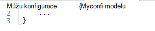
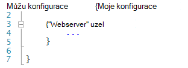
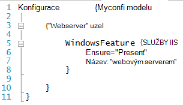
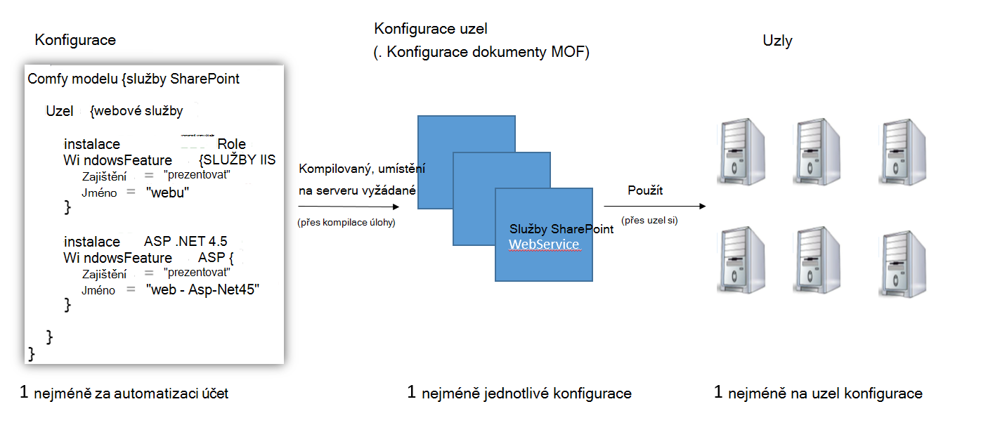
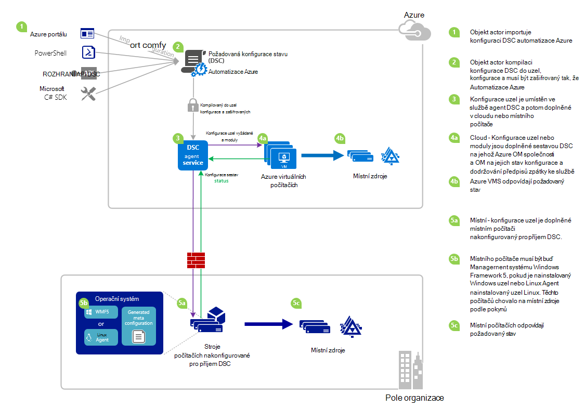

<properties 
   pageTitle="Přehled DSC Azure automatizaci | Microsoft Azure" 
   description="Přehled z Azure automatizaci žádoucí stavu konfigurace (DSC), termíny a známé problémy" 
   services="automation" 
   documentationCenter="dev-center-name" 
   authors="coreyp-at-msft" 
   manager="stevenka" 
   editor="tysonn"
   keywords="prostředí PowerShell dsc, požadovaný stav konfigurace, prostředí powershell dsc azure"/>

<tags
   ms.service="automation"
   ms.devlang="NA"
   ms.topic="article"
   ms.tgt_pltfrm="powershell"
   ms.workload="TBD" 
   ms.date="05/10/2016"
   ms.author="magoedte;coreyp"/>

# Přehled DSC Azure automatizaci #

##Co je Azure automatizaci DSC?##
Nasazení a udržování požadovaný stav serverů a prostředky aplikací může být únavné a chyby chybám. S Azure automatizaci požadovaný stav konfigurace (DSC), můžete konzistentní nasazení, problémy se spolehlivým sledovat a automaticky aktualizovat požadovaný stav zdroje IT ve velkém měřítku v cloudu. Založená na prostředí PowerShell DSC DSC automatické zarovnání konfiguraci počítače s konkrétním kraji různých fyzické a virtuálních počítačích (VMs), pomocí účtu systému Windows nebo Linux i schránkami v cloudu a místní. Můžete povolit nepřetržitý doručení služby IT ovládacímu prvku konzistentní a správa rychlé změny mezi nesourodými hybridní prostředí snadné.

Azure DSC automatizaci vytvoří nad základy zavedená v prostředí PowerShell DSC ještě snazší prostředí management konfigurace. Azure DSC automatizaci přináší stejné vrstvě správy [Prostředí PowerShell žádoucí konfigurace stavu](https://msdn.microsoft.com/powershell/dsc/overview) jako Azure automatizaci nabízí pro PowerShell skriptování dnes.

Azure DSC automatizaci umožňuje [vytvářet a spravovat prostředí PowerShell žádoucí stavu konfigurace](https://technet.microsoft.com/library/dn249918.aspx), importovat [DSC zdroje](https://technet.microsoft.com/library/dn282125.aspx)a generovat DSC uzel konfigurace (MOF dokumenty), všechny v cloudu. Tyto položky DSC bude blokovat Azure automatizaci [DSC vyžádat server](https://technet.microsoft.com/library/dn249913.aspx) tak, aby cílové uzlů (například fyzické a virtuálních počítačích) v cloudu a místní můžete zvedněte je, automaticky odpovídat požadovaný stav, které určují a vykazování zpátky na jejich dodržování požadovaný stav automatizace Azure.

Chcete raději sledování pro čtení? Podívejte se na pod videa z květen 2015, kdy nejdřív ohlásí DSC automatizaci Azure. **Poznámka:** Když koncepty a životního cyklu popisované v tomto videu nejsou správné, má Azure automatizaci DSC mnohem zvýšily od zaznamenané toto video. Je teď přístupné, má mnohem širší uživatelské rozhraní na portálu Azure a podporuje spoustu dalších možností.

> [AZURE.VIDEO microsoft-ignite-2015-heterogeneous-configuration-management-using-microsoft-azure-automation]

## Azure automatizaci DSC podmínky ##
### Konfigurace ###
DSC prostředí PowerShell zavádí nový koncept s názvem konfigurace. Konfigurace umožňuje definovat, pomocí prostředí PowerShell syntaxe požadovaný stav prostředí. DSC používá ke konfiguraci vašeho prostředí, nejdřív definovat pomocí klíčového slova konfigurace blok skriptu prostředí Windows PowerShell, a pak postupujte s identifikátorem, pak se složených závorek ({}) k oddělení blokování.

Uvnitř bloku konfigurace můžete definovat uzel konfigurace bloky popisujících požadovaná konfigurace pro sadu uzlů (počítačů) v prostředí, která má být nakonfigurováno stejně. Tímto způsobem představuje uzel konfigurace "roli" pro jeden nebo více uzlů aby stylově zapadly. Konfigurace blok uzel začíná klíčového slova uzel. Postupujte podle tohoto klíčového slova s názvem roli, který může být proměnné nebo výrazu. Za názvem rolí umožňuje složených závorek {} vymezení blok konfigurace uzel.

 
Konfigurace bloku uzel můžete definovat bloky zdroje pro nastavení konkrétních DSC zdrojů. Blokování zdrojů začíná jméno zdroje a za ním uveďte identifikátor chcete zadat pro tento blok a potom závorky {} omezíte blokování.

Podrobné informace o konfiguraci klíčové slovo, viz: [Principy konfigurace klíčových slov v žádoucí konfigurace stavu](http://blogs.msdn.com/b/powershell/archive/2013/11/05/understanding-configuration-keyword-in-desired-state-configuration.aspx "Principy konfigurace klíčových slov v žádoucí konfigurace stavu")

Spuštění (kompilace) DSC konfigurace vytvoří jeden nebo více DSC uzel konfigurace (MOF dokumenty), které jsou DSC uzly použít dodržovat požadovaný stav.

Azure DSC automatizaci umožňuje importovat, Autor, a konfigurace DSC kompilace v Azure automatizaci, jak lze importovat runbooks, podobně jako vytvořené a začít v Azure automatizaci.

>[AZURE.IMPORTANT] Konfigurace smí obsahovat pouze jeden blok konfigurace se stejným názvem jako konfigurace v Azure automatizaci DSC. 

###Konfigurace uzel###

Při konfiguraci DSC jeden nebo více uzel konfigurace je vyrobeno v závislosti na uzel bloků v konfiguraci. Konfigurace uzel je stejná jako "MOF" nebo "Konfigurační dokument" (Pokud máte zkušenosti za těchto podmínek PS DSC) a představuje "role", například webserver nebo člověku, který požadovaný stav jeden nebo více uzlů by se předpokládá nebo vyhledat dodržování předpisů proti. Názvy uzel konfigurace v Azure automatizaci DSC podobu "Konfigurace Name.NodeConfigurationBlockName".

PS DSC uzly zjistí uzel konfigurací, které měly přijmout prostřednictvím DSC nabízená nebo vložit metody. Azure DSC automatizaci závisí na metodu vyžádané DSC, kde uzly žádost o uzel konfigurace, které by měl použít z Azure automatizaci DSC vyžádat serveru. Protože uzly provést žádost DSC automatizaci Azure, může být uzly za bránách firewall, máte všechny příchozí porty skrytých atd. Potřebují odchozí přístup k Internetu (přímo nebo prostřednictvím na proxy server).

###Uzel###

DSC uzel je počítače konfigurace spravuje DSC. Může to být s Windows nebo Linux Azure OM místní OM / fyzické hostitele nebo počítači v jiné cloudové veřejné. Uzly přijmout uzel konfigurace a udržovat dodržování požadovaný stav, které definují a taky můžete sestavy zpátky na serveru sestav na jejich stav konfigurace a dodržování předpisů versus požadovaný stav.

Azure DSC automatizaci usnadňuje rychlého připojení uzlů spravovat pomocí Azure automatizaci DSC a umožňuje změna konfigurace uzel přiřazené k každý uzel straně serveru, aby příště uzel zkontroluje serveru pokyny se předpokládá jinou roli a nastavte, jak je nakonfigurované a stav complaince podle ho měli vykazovat.

###Zdroje###
DSC zdroje jsou stavební bloky, které můžete použít stanovit konfigurační Windows PowerShell žádoucí stavu konfigurace (DSC). DSC obsahuje sadu předdefinovaných zdroje, jako jsou ty pro soubory a složky, funkce serveru a role, nastavení registru, proměnné a služby a procesů. Další informace o úplný seznam předdefinované DSC zdrojů a jejich použití naleznete v tématu [Předdefinované Windows PowerShell žádoucí státních konfigurace zdrojů](https://technet.microsoft.com/library/dn249921.aspx).

DSC zdroje lze také jako součást modulů rozšiřte sadu předdefinovaných DSC zdrojů. Jiné než výchozí zdroje se doplněné DSC uzly ze serveru vyžádané DSC, pokud uzel konfigurace, které uzel má přijmout obsahuje odkazy na prostředky. Naučte se vytvářet vlastní materiály, najdete v článku [Vytvoření vlastní Windows PowerShell žádoucí státních konfigurace zdrojů](https://technet.microsoft.com/library/dn249927.aspx).

Azure DSC automatizaci se dodává se stejnou předdefinované DSC zdroje stejně jako PS DSC. Další zdroje informací lze přidat k automatizaci DSC Azure importováním modulů obsahující prostředky do Azure automatizaci.

###Kompilace projektu###
Kompilace úlohy v Azure automatizaci DSC je instancí kompilace konfigurace, můžete vytvořit jednu nebo více uzel konfigurace. Jsou podobné úlohy postupu runbook Azure automatizaci, s tím rozdílem, že budou neprovádějte skutečně všechny úkoly s výjimkou vytvoření uzel konfigurace. Konfigurace uzel vytvořil kompilace úlohy se automaticky uloží na server Azure automatizaci DSC vyžádané a přepsat předchozí verze uzel konfigurace, pokud existují pro tuto konfiguraci. Název uzel konfigurace vytvořené pomocí úloha kompilace formu "ConfigurationName.NodeConfigurationBlockName". Například kompilace pod konfigurace vytvoří konfigurace jeden uzel s názvem "MyConfiguration.webserver"

>[AZURE.NOTE] Stejně jako runbooks je možné publikovat konfigurace. To nesouvisí s umísťování DSC položek na server Azure automatizaci DSC vložit. Kompilace úlohy způsobit DSC položky umístit na server Azure automatizaci DSC vložit. Další informace o "publikování" v Azure automatizaci najdete v tématu [publikování postupu Runbook](https://msdn.microsoft.com/library/dn903765.aspx).

##Azure automatizaci DSC cyklus##
Přejít z účtu prázdné automatizaci spravované sady správně nakonfigurované uzlů zahrnuje sadu procesů pro definování konfigurací zapnutí tyto konfigurace na uzel konfigurace a rychlého připojení uzly Azure automatizaci DSC a konfigurace uzel. Následující obrázek znázorňuje životním cyklu Azure automatizaci DSC:

Následující obrázek ukazuje podrobný postup životního cyklu DSC. Zahrnuje různé způsoby konfigurace importovat a použije uzlů v Azure automatizaci součásti potřebné pro místní počítač kvůli podpoře DSC a interakce mezi různých složek. 

     

##Problematická místa / známé problémy:##

- Při upgradu na WMF 5 RTM, pokud v počítači již registrována jako uzel v Azure automatizaci DSC, unregister z Azure automatizaci DSC a znovu zaregistrujte po WMF 5 RTM upgradu.

- Azure DSC automatizaci nepodporuje částečné nebo složený konfigurace DSC v současné době. DSC složený zdroje však můžete importovat a použít v Azure automatizaci DSC konfigurace stejně jako v místním prostředí PowerShell povolení opakované použití konfigurace.

- Nejnovější verzi WMF 5 musí být nainstalovaný agenta DSC Powershellu pro systém Windows mohli komunikovat s Azure automatizaci. Linux mohli komunikovat s Azure automatizaci nainstalovali nejnovější verzi agenta prostředí PowerShell DSC Linux.

- Tradiční vyžádané serveru prostředí PowerShell DSC předpokládá, že modul Zpráva prolétne umístit na serveru vyžádané ve formátu **ModuleName_Version.zip "**. Azure automatizaci očekává modulů pro import se jmény ve formě **ModuleName.zip**. [Tento příspěvek blogu](https://azure.microsoft.com/blog/2014/12/15/authoring-integration-modules-for-azure-automation/) Další informace najdete na webu formát integrace modulu požadována modul naimportujte Azure automatizaci. 

- Moduly prostředí PowerShell importují do Azure automatizaci nesmí obsahovat souborů .doc a .docx. Tyto soubory pro účely nápovědy obsahuje některé prostředí PowerShell moduly obsahující DSC prostředky. Tyto soubory by měl být odebrány modulů kontroly, předchozí a importujte do Azure automatizaci.

- Pokud uzel nejdřív registrovaný u účet Azure automatizaci nebo uzel se změní na namapované na různé uzel konfigurace serverovou, budou její stav "Vyhovuje" i v případě stavu na uzel nevyhovuje skutečně s konfigurací uzel, na které je teď namapované. Po uzel provádí jeho první vyžádané a odešle první sestava po registraci nebo změnu uzel konfigurace mapování, může být důvěryhodný uzel stav.

- Při rychlého připojení OM Windows Azure spravovat pomocí DSC automatizaci Azure pomocí žádného z našich metody přímé rychlého připojení, může trvat na hodinu pro OM zobrazovat jako uzel DSC v Azure automatizaci. Toto je kvůli instalace systému Windows Management Framework 5.0 na OM Azure OM DSC příponu, který požaduje pro její integrovaný OM k automatizaci DSC Azure.

- Po zaregistrování automatické jednotlivých uzlech certifikát jedinečné pro ověření, že vyprší jejich platnost za jeden rok. V současné době registrační protokol prostředí PowerShell DSC nelze automaticky certifikáty obnovit po vypršení platnosti, budou se blíží, budete muset znovu zaregistrujte uzly po dobu za rok. Před novou registrací, ujistěte se, jestli je spuštěný jednotlivých uzlech Windows Management Framework 5.0 RTM. Pokud na uzel ověřovací certifikát vyprší a není znovu zaregistruje uzel, uzel nebude možné komunikovat s Azure automatizaci a budou označeny "Unresponsive." Opětovná proběhne stejným způsobem jako původně registrované uzel. Opětovná provést 90 dní nebo menší od doby vypršení platnosti certifikátu nebo kdykoli po dobu platnosti certifikátu, výsledkem bude nový certifikát vytvářejí a použít.

- Při upgradu na WMF 5 RTM, pokud v počítači již registrována jako uzel v Azure automatizaci DSC, unregister z Azure automatizaci DSC a znovu zaregistrujte po WMF 5 RTM upgradu. Před novou registrací, odstraňte soubor $env:windir\system32\configuration\DSCEngineCache.mof.

- Rutiny prostředí PowerShell DSC nemusí fungovat nainstalovanou verzí WMF 5 RTM nad WMF 5 výrobní náhled. Pokud to pokud chcete opravit, spusťte tento příkaz v zvýšenými relaci Powershellu (Spustit jako správce):`mofcomp $env:windir\system32\wbem\DscCoreConfProv.mof`
 

##Související články##

- [Rychlého připojení počítače pro správu tak, že Azure automatizaci DSC] (.. /Automation/Automation-DSC-onboarding.MD)
- [Kompilace konfigurace v Azure automatizaci DSC] (.. /Automation/Automation-DSC-Compile.MD)
- [Azure DSC automatizaci rutiny] (https://msdn.microsoft.com/library/mt244122.aspx)
- [Azure DSC automatizaci ceny] (https://azure.microsoft.com/pricing/details/automation/)
- [Nepřetržitý nasazení IaaS VMs pomocí Azure automatizace DSC a Chocolatey] (automatizaci dsc-cd-chocolatey.md)
