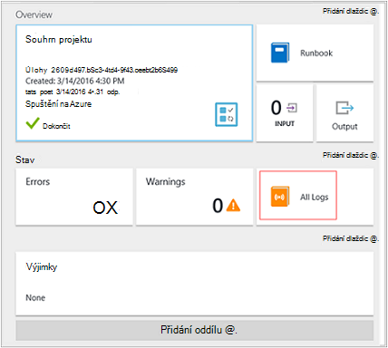
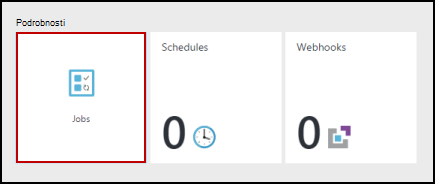
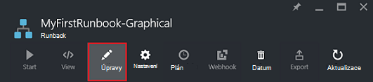

<properties
    pageTitle="Můj první grafické postupu runbook v Azure automatizaci | Microsoft Azure"
    description="Kurz, který vás provede vytváření testování a publikování od jednoduchého grafické postupu runbook."
    services="automation"
    documentationCenter=""
    authors="mgoedtel"
    manager="jwhit"
    editor=""
    keywords="postupu runbook postupu runbook šablony, postupu runbook automatizaci, azure postupu runbook"/>
<tags
    ms.service="automation"
    ms.workload="tbd"
    ms.tgt_pltfrm="na"
    ms.devlang="na"
    ms.topic="get-started-article"
    ms.date="07/06/2016"
    ms.author="magoedte;bwren"/>

# <a name="my-first-graphical-runbook"></a>Můj první grafické postupu runbook

> [AZURE.SELECTOR] - [Grafické](automation-first-runbook-graphical.md) - [Powershellu](automation-first-runbook-textual-PowerShell.md) - [Prostředí PowerShell pracovního postupu](automation-first-runbook-textual.md)

Tento kurz vás provede vystavením [grafické postupu runbook](automation-runbook-types.md#graphical-runbooks) v Azure automatizaci.  Začneme bude pomocí jednoduchého postupu runbook, který budete testovat jsme publikovat během jsme je vysvětleno, jak chcete-li sledovat stav úlohy postupu runbook.  Budeme se změňte postupu runbook skutečně spravovat Azure zdroje v tomto případě zahajování Azure virtuálního počítače.  Potom vytočit postupu runbook robustnější přidáním postupu runbook parametry a podmíněné odkazy.

## <a name="prerequisites"></a>Zjistit předpoklady pro

Tento kurz budete potřebovat.

-   Azure předplatného.  Pokud je jeden ještě nemáte, můžete [aktivovat své výhody odběratele MSDN](https://azure.microsoft.com/pricing/member-offers/msdn-benefits-details/) nebo <a href="/pricing/free-account/" target="_blank"> [registraci bezplatného účtu](https://azure.microsoft.com/free/).
-   [Azure jako účet spustit](automation-sec-configure-azure-runas-account.md) postupu runbook podržte při ověřování Azure zdroje.  Tento účet musí mít oprávnění k spustit a zastavit virtuální počítač.
-   Azure virtuálního počítače.  Jsme zastaví a spustit tento počítač, aby by neměly být výroby.


## <a name="step-1---create-new-runbook"></a>Krok 1: vytvoření nového postupu runbook

Začneme bude tak, že vytvoříte jednoduchý postupu runbook, uloží text *Vítáme*.

1.  Na portálu Azure si potřebujete založit účet automatizaci.  
    Stránku s účtem automatizaci najdete rychlý přehled zdrojů v tento účet.  Měli byste mít už některé prostředky.  Většina uživatelů je moduly, které jsou automaticky součástí nový účet automatizaci.  Měli byste mít taky popsaná v [požadavcích](#prerequisites)materiálů přihlašovacích údajů.
2.  Klikněte na dlaždici **Runbooks** otevřete seznam runbooks.<br> 
3.  Kliknutím na tlačítko **Přidat postupu runbook** a pak **vytvořit nové postupu runbook**vytvořte nové postupu runbook.
4.  Pojmenujte postupu runbook *MyFirstRunbook grafických prvků*.
5.  V tomto případě chceme vytvořit [grafické postupu runbook](automation-graphical-authoring-intro.md) tak vyberte **grafické** **Typ postupu Runbook**.<br> <br>
6.  Kliknutím na tlačítko **vytvořit** vytvořte postupu runbook a otevřete dialogové okno editor grafické.

## <a name="step-2---add-activities-to-the-runbook"></a>Krok 2 – Přidání aktivity postupu runbook

Ovládací prvek knihovny na levé straně editoru umožňuje vybrat aktivity přidat do svého postupu runbook.  Ukážeme, chcete-li přidat **Zápis výstup** rutiny výstup text z postupu runbook.

1.  V ovládacím prvku knihovny klikněte do textového pole Hledat a zadejte **Zápis výstupu**.  Výsledky hledání se zobrazí pod. <br> 
2.  Posuňte se dolů na konec seznamu.  Můžete buď klikněte pravým tlačítkem myši **Výstup zapsat** a vyberte **Přidat do plátno** nebo klikněte na elipsa vedle rutinu a pak vyberte **Přidat do plátno**.
3.  Klikněte na **Zápis výstup** aktivitu na plátno.  Otevře se zásuvné konfigurace ovládací prvek, který umožňuje konfigurace aktivity.
4.  **Popisek** výchozí hodnoty název rutiny, ale nemůžeme můžete změnit na něco víc popisný. Změňte nastavení na *Psaní Vítáme výstup*.
5.  Klepněte na tlačítko **Parametry** poskytnout hodnoty parametrů rutiny.  
    Některé rutin máte více sad parametrů a potřebujete můžete vybrat, které budete používat. V tomto případě **Zápisu výstup** obsahuje pouze jednu sadu parametr, abyste nemuseli vyberte jednu. <br> 
6.  Vyberte **InputObject** parametr.  Toto je parametr, kde jsme zadat text, který chcete odeslat výstup proudu.
7.  V rozevíracím seznamu **zdroj dat** vyberte **prostředí PowerShell výraz**.  Rozevírací seznam **zdroj dat** obsahuje různých zdrojů, které používáte k naplnění hodnotu parametru.  
    Výstup můžete použít z těchto zdrojů, jako jsou jiné aktivity, aktivum automatizaci nebo výraz Powershellu.  V tomto případě jsme chcete jenom výstup textu *Vítáme*. Můžeme pomocí výrazu prostředí PowerShell a zadejte řetězec.
8.  Do pole **výraz** zadejte *"Ahoj světe"* a klikněte na **OK** dvakrát se vraťte na plátno.<br> 
9.  Uložení postupu runbook kliknutím na **Uložit**.<br> 

## <a name="step-3---test-the-runbook"></a>Krok 3 – Test postupu runbook

Před jsme publikovat postupu runbook zpřístupnění ve výrobním, chceme vyzkoušet, abyste měli jistotu, že funguje správně.  Při testování postupu runbook spustit **pracovní** verze a interaktivně zobrazit jeho výstup.

1.  Klikněte na **Testovat podokno** otevřete zásuvné testu.<br> 
2.  Klikněte na tlačítko **Spustit** spusťte test.  To by měl být jediná možnost povolené.
3.  Je vytvořen [postupu runbook úlohy](automation-runbook-execution.md) a stav zobrazené v podokně.  
    Stav úlohy začnou jako *ve frontě* označující, že se čeká pracovního postupu runbook v cloudu k dispozici.  Ho pak přesune do *spuštění* při pracovník deklarace projekt a potom *systém* postupu runbook skutečně spuštění.  
4.  Když dokončí úloha postupu runbook, zobrazí se jeho výstup. V našem případě jsme byste měli vidět *Vítáme*.<br> 
5.  Zavřete zásuvné Test se vrátíte na plátno.

## <a name="step-4---publish-and-start-the-runbook"></a>Krok 4 – publikovat a začněte postupu runbook

Postupu runbook, který jsme vytvořili, je pořád v režimu návrhu. Potřebujeme publikujte před jsme poběží v výroby.  Při publikování postupu runbook je přepsat existující publikovaná verze verze konceptu.  V našem případě jsme publikovaná verze ještě nemáte protože jsme vytvořili postupu runbook.

1.  Klikněte na **Publikovat** publikovat postupu runbook a potom **Ano** po zobrazení výzvy.<br> 
2.  Pokud posunutí vlevo po zobrazíte postupu runbook v zásuvné **Runbooks** zobrazí **Vytváření stav** **Publikováno**.
3.  Přejděte zpátky k pravému zobrazíte zásuvné **MyFirstRunbook**.  
    Možnosti v horní části Povolit cz spuštění postupu runbook, naplánovat, aby se spouštěla někdy v budoucnu nebo vytvořit [webhook](automation-webhooks.md) , abyste mohli začít prostřednictvím protokolu HTTP volání.
4.  Chceme jednoduše začněte postupu runbook proto klikněte na tlačítko **Start** a potom na **Ano** po zobrazení výzvy.<br> 
5.  Úlohy zásuvné upraveného postupu runbook projektu, který jsme vytvořili.  Jsme zavřít tento zásuvné, ale v tomto případě jsme budete nechejte jej otevřený tak jsme můžete sledovat průběh projektu.
6.  Stav úlohy se zobrazují v **Souhrn projektu** a jsou vraceny stavy, které jsme viděli při testování postupu runbook.<br> 
7.  Jakmile se stav postupu runbook zobrazí *dokončili*, klikněte na **výstupu**. Otevření zásuvné **výstup** a vidíme naše *Vítáme* v podokně.<br>   
8.  Zavřete zásuvné výstupu.
9.  Klikněte na **Všechny protokoly** otevřete zásuvné datových proudů pro danou úlohu postupu runbook.  Vidíme by měl pouze *Vítáme* v toku výstup, ale pokud postupu runbook zapisuje na ně to můžete zobrazit datové proudy postupu runbook úlohy například podrobné a chyby.<br> 
10. Zavřete všechny protokoly zásuvné a zásuvné úlohy se vraťte do zásuvné MyFirstRunbook.
11. **Úlohy** kliknutím na tlačítko Otevřít zásuvné úlohy pro tohoto postupu runbook.  Seznam všech projektů vytvořené pomocí tohoto postupu runbook. Vidíme by měl pouze jednu úlohu uvedené od jsme pouze spuštění úlohy jednou.<br> 
12. Můžete kliknout na tuto úlohu otevřete podokno stejné projektu, aby nemůžeme zobrazit jsme spustil postupu runbook.  Umožňuje přejděte zpátky v čase a zobrazit podrobnosti projektu, který byl vytvořený pro konkrétní postupu runbook.

## <a name="step-5---create-variable-assets"></a>Krok 5 – Vytvoření proměnné prostředky

Jste testováno jsme publikované naše postupu runbook, ale zatím ho nic se neděje užitečné. Chcete mít přidávání a používání Azure zdrojů.  Před jsme nakonfigurovat postupu runbook k ověření, vytvoříme proměnnou ID předplatného, přidržte ho a odkazovat na po jsme aktivita ověření v kroku 6 následující nastavení.  Včetně odkazů na kontext předplatné umožňuje snadno pracovat mezi víc předplatných.  Než budete pokračovat, zkopírujte ID předplatného z předplatných možnost z navigačního podokna.  

1. V zásuvné automatizaci účty klikněte na dlaždici **prostředky** a opětovném otevření zásuvné **prostředky** .
2. V zásuvné prostředky klikněte na dlaždici **proměnné** .
3. Na zásuvné proměnné klikněte na **Přidat do proměnné**.<br>
4. V nové proměnné zásuvné do pole **název** zadejte **AzureSubscriptionId** a do pole **hodnota** zadejte ID předplatného.  Udržujte *řetězec* **Typ** a výchozí hodnoty pro **šifrování**.  
5. Kliknutím na **vytvořit** vytvoříte proměnné.  


## <a name="step-6---add-authentication-to-manage-azure-resources"></a>Krok 6 – přidání ověřování ke správě Azure prostředků

Teď, když máme proměnné pro uložení naše ID předplatného, jsme konfigurace naše postupu runbook ověření s spustit jako přihlašovací údaje, které jsou uvedené v [požadavky](#prerequisites).  Jsme to udělat přidáním Azure spustit jako připojení **materiálů** a **Přidat AzureRMAccount** rutinu na plátno.  

1.  Otevření editoru grafické kliknutím na příkaz **Upravit** na zásuvné MyFirstRunbook.<br> 
2.  Není potřebujeme **Zápis Vítáme výstup** zavřít, takže pravým tlačítkem myši a vyberte **Odstranit**.
3.  V ovládacím prvku knihovny rozbalte **připojení** a přidání **AzureRunAsConnection** na plátno výběrem **Přidat plátno**.
4.  Na plátno vyberte **AzureRunAsConnection** a v Ovládacích panelech konfigurace **Získat spustit jako připojení** **popisku** do textového pole zadejte.  Toto je připojení 
5.  V ovládacím prvku knihovny do textového pole Hledat zadejte **AzureRmAccount přidat** .
6.  Přidání **Přidat AzureRmAccount** na plátno.<br> 
7.  Najeďte myší na **Získání spustit jako připojení** zobrazila kruh v dolní části obrazce. Klikněte na něj a přetáhněte šipku **AzureRmAccount přidat**.  Šipka, která jste právě vytvořili je *odkaz*.  Postupu runbook začínat **Získat spustit jako připojení** a znovu spusťte **AzureRmAccount přidat**.<br> 
8.  Na plátno vyberte **Přidat AzureRmAccount** a v konfiguraci určit typ podokno **přihlášení k Azure** do textového pole **Popisek** .
9.  Klikněte na tlačítko **Parametry** a nastavením parametrů aktivity zásuvné se zobrazí. 
10.  **Přidat AzureRmAccount** má více sad parametrů, takže potřebujeme vybírat před nabízíme hodnoty parametrů.  Klikněte na **Nastavit parametr** a potom vyberte nastavit parametr **ServicePrincipalCertificate** . 
11.  Jakmile vyberete nastavení parametrů, parametry se zobrazují v zásuvné konfigurace parametr aktivity.  Klikněte na tlačítko **APPLICATIONID**.<br> 
12.  V zásuvné hodnota parametru vyberte **aktivitu výstup** pro tento **zdroj dat** a vyberte v seznamu polí v textovém poli Typ **pole cesty** **ApplicationId** **Získat spustit jako připojení** a klikněte na tlačítko **OK**.  Jsme zadáváte název vlastnosti pole cestu vzhledem k tomu aktivity výstupy objekt s více vlastností.
13.  Klikněte na **Miniatura certifikátu**a v zásuvné hodnota parametru vyberte **aktivity výstup** pro tento **zdroj dat**.  V seznamu polí v textovém poli Typ **pole cesty** **Miniatura certifikátu**, vyberte **Získat spustit jako připojení** a klikněte na **OK**. 
14.  Klikněte na **SERVICEPRINCIPAL**v zásuvné hodnota parametru vyberte **ConstantValue** pro tento **zdroj dat**, vyberte možnost **True**a klikněte na tlačítko **OK**.
15.  Klikněte na **TENANTID**a v zásuvné hodnota parametru vyberte **aktivity výstup** pro tento **zdroj dat**.  Vyberte v seznamu polí v textovém poli Typ **pole cesty** **TenantId** **Získat spustit jako připojení** a potom dvakrát klikněte na **OK** .  
16.  V ovládacím prvku knihovny do textového pole hledání zadejte **Nastavení AzureRmContext** .
17.  Přidáte **Sadu AzureRmContext** na plátno.
18.  Na plátno vyberte **Sadu AzureRmContext** a v konfiguraci určit typ podokno **Id předplatného zadejte** do textového pole **Popisek** .
19.  Klikněte na tlačítko **Parametry** a nastavením parametrů aktivity zásuvné se zobrazí. 
20. **Nastavení AzureRmContext** má více sad parametrů, takže potřebujeme vybírat před nabízíme hodnoty parametrů.  Klikněte na **Nastavit parametr** a potom vyberte nastavit **SubscriptionId** parametr.  
21.  Jakmile vyberete nastavení parametrů, parametry se zobrazují v zásuvné konfigurace parametr aktivity.  Klikněte na **SubscriptionID**
22.  V zásuvné hodnota parametru vyberte **Proměnné materiály** pro tento **zdroj dat** a vyberte **AzureSubscriptionId** ze seznamu a potom dvakrát klikněte na **OK** .   
23.  Najeďte myší na **přihlášení k Azure** zobrazila kruh v dolní části obrazce. Klikněte na něj a přetáhněte šipku **Zadat Id předplatného**.


Vaše postupu runbook by měl vypadat takto v tomto okamžiku: <br>

## <a name="step-7---add-activity-to-start-a-virtual-machine"></a>Krok 7 – přidání aktivita začít virtuálního počítače

Nyní přidáme aktivitu **Start AzureRmVM** spuštění virtuálního počítače.  Můžete vybrat libovolné virtuálního počítače v Azure předplatné a nyní jsme bude hardcoding, pojmenovat do rutiny.

1. V ovládacím prvku knihovny do textového pole hledání zadejte **Start AzureRm** .
2. Přidání **Start AzureRmVM** na plátno a klepněte na tlačítko a přetáhněte ho pod **Zadat Id předplatného**.
3. Umístěte myš nad **Zadat Id předplatného** kruhu se zobrazí v dolní části obrazce.  Klikněte na něj a přetáhněte šipku **Start AzureRmVM**. 
4.  Vyberte **Start AzureRmVM**.  Klikněte na **Parametry** a potom **Parametr nastaven** zobrazíte výše uvedené množiny **Start AzureRmVM**.  Vyberte sadu **ResourceGroupNameParameterSetName** parametr. Všimněte si, že **ResourceGroupName** a **název** obsahuje vykřičník vedle je.  Tento údaj označuje, že pocházejí požadované parametry.  Navíc nezapomeňte, že obě očekávat textových hodnot.
5.  Vyberte **název**.  Vyberte **výraz Powershellu** pro **zdroj dat** a typ název virtuálního počítače obklopená dvojitých uvozovkách, které budeme začínat tohoto postupu runbook.  Klikněte na **OK**.<br>
6.  Vyberte **ResourceGroupName**. Pomocí **prostředí PowerShell výrazu** pro **zdroj dat** a zadejte název skupiny zdrojů obklopená dvojitých uvozovkách.  Klikněte na **OK**.<br> 
8.  Klikněte na podokno Test tak, aby jsme můžete otestovat postupu runbook.
9.  Klikněte na tlačítko **Spustit** spusťte test.  Po dokončení, zkontrolujte, že byl spuštěn virtuální počítač.

Vaše postupu runbook by měl vypadat takto v tomto okamžiku: <br>

## <a name="step-8---add-additional-input-parameters-to-the-runbook"></a>Krok 8 – přidání dalších vstupních parametrů postupu runbook

Naše postupu runbook aktuálně spustí virtuálního počítače v uvedenou v rutinu **Start AzureRmVM** skupina zdroje, ale naše postupu runbook by zvýšíte jeho přínos Pokud společnost Microsoft může zadat při spuštění postupu runbook.  Nyní přidáme vstupních parametrů pro postupu runbook poskytovat tuto funkci.

1. Otevření editoru grafické po kliknutí na **Upravit** v podokně **MyFirstRunbook** .
2. Klikněte na **vstupní a výstupní** a potom **Přidat vstupní** otevřete podokno vstupní parametry postupu Runbook.<br> 
3. Určete *VMName* **název**.  Zachovat *řetězec* **Typ**, ale změnit **povinná** na hodnotu *Ano*.  Klikněte na **OK**.
4. Vytvoření druhého povinné vstupní parametry s názvem *ResourceGroupName* a potom klikněte na **OK** zavřete podokno **vstupní a výstupní** .<br> 
5. Vyberte **Start AzureRmVM** aktivitu a potom na položku **Parametry**.
6. Změnit **zdroj dat** pro **název** **postupu Runbook** vstup a pak vyberte **VMName**.<br>
7. Změnit **zdroj dat** pro **ResourceGroupName** **postupu Runbook** vstup a pak vyberte **ResourceGroupName**.<br> 
8. Uložení postupu runbook a otevřete podokno testu.  Všimněte si, že je teď můžete zadat hodnoty pro dvě vstupní proměnné použité ve sloupci podmínka.
9. Zavření podokna testu.
10. Klepnutí na tlačítko **Publikovat** novou verzi postupu runbook.
11. Vypnout virtuální počítač, kterou jste zahájili v předchozím kroku.
12. Klikněte na tlačítko **Spustit** spusťte postupu runbook.  Zadejte do pole **VMName** a **ResourceGroupName** pro virtuální počítač, který chcete spustit.<br> 
13. Po dokončení postupu runbook zkontrolujte, že byl spuštěn virtuální počítač.

## <a name="step-9---create-a-conditional-link"></a>Krok 9 – vytvoření podmíněné odkazu

Postupu runbook jsme teď upravovat tak, aby se jenom pokusí o spuštění virtuálního počítače, pokud již není spuštěná.  Jsme odvedou přidáním rutiny **Get-AzureRmVM** postupu runbook, která se zobrazí stav úrovně instance virtuálního počítače. Potom přidáme modulu kódu prostředí PowerShell pracovního postupu s názvem **Získat stav** se fragment kódu prostředí PowerShell a zjistěte, jestli stavu virtuální počítač není spuštěný nebo přestal.  Podmíněné odkazu z modulu **Získat stav** lze spustit pouze **Start AzureRmVM** zastavení aktuální stav pracovního.  Nakonec jsme vypíše zprávu, pokud byla úspěšně spuštěna OM nebo nepoužíváte rutiny prostředí PowerShell zapsat a výstup.

1. Otevřete **MyFirstRunbook** v editoru grafické.
2. Odeberte odkaz mezi **Zadat Id předplatného** a **Zahájení AzureRmVM** kliknutím na něj a stiskněte klávesu *Delete* .
3. V ovládacím prvku knihovny do textového pole Hledat zadejte **Get-AzureRm** .
4. Přidání **Get-AzureRmVM** na plátno.
5. Vyberte **Get-AzureRmVM** a **Parametr nastaven** zobrazíte výše uvedené množiny **Get-AzureRmVM**.  Vyberte sadu **GetVirtualMachineInResourceGroupNameParamSet** parametr.  Všimněte si, že **ResourceGroupName** a **název** obsahuje vykřičník vedle je.  Tento údaj označuje, že pocházejí požadované parametry.  Navíc nezapomeňte, že obě očekávat textových hodnot.
6. Ve skupinovém rámečku **zdroj dat** pro **název**vyberte **postupu Runbook zadávání** a pak vyberte **VMName**.  Klikněte na **OK**.
7. V části **zdroj dat** pro **ResourceGroupName**vyberte **postupu Runbook zadávání** a pak vyberte **ResourceGroupName**.  Klikněte na **OK**.
8. V části **zdroj dat** pro **Stav**vyberte **hodnotu konstanty** a klikněte na **hodnotu True**.  Klikněte na **OK**.  
9. Vytvoření odkazu z **Zadat Id předplatného** **Get-AzureRmVM**.
10. V ovládacím prvku knihovny rozbalte **Postupu Runbook řízení** a přidání **kódu pro** plátno.  
11. Vytvoření odkazu z **Get-AzureRmVM** **kódu**.  
12. Klikněte na **kód** a v podokně Konfigurace změňte název na **Získat stav**.
13. Parametr výběru **kód** a **Kód Editor** zásuvné se zobrazí.  
14. V editoru kód vložte následující fragment kódu:

     ```
     $StatusesJson = $ActivityOutput['Get-AzureRmVM'].StatusesText 
     $Statuses = ConvertFrom-Json $StatusesJson 
     $StatusOut ="" 
     foreach ($Status in $Statuses){ 
     if($Status.Code -eq "Powerstate/running"){$StatusOut = "running"} 
     elseif ($Status.Code -eq "Powerstate/deallocated") {$StatusOut = "stopped"} 
     } 
     $StatusOut 
     ```

15. Vytvoření odkazu z **Získat stav** **Start AzureRmVM**.<br>   
16. Vyberte odkaz a v podokně Konfigurace změnit **podmínku použít** na hodnotu **Ano**.   Poznámka: propojení změní přerušovaná čára označující cílové aktivitě bude spustit pouze v případě podmínka změní hodnotu true.  
17. **Podmínka**zadejte *$ActivityOutput ["Status získat"] - eq "Zastaveno"*.  **Zahájení AzureRmVM** teď jenom spustí zastavení virtuální počítač.
18. V ovládacím prvku knihovny rozbalte **rutiny pro správu** a pak **Microsoft.PowerShell.Utility**.
19. **Zápis výstup** plátno přidáte dvakrát.<br> 
20. Na první ovládací prvek **Výstup zapsat** klikněte na **Parametry** a změňte hodnotu **popisku** *Upozornit OM*pracovat.
21. **InputObject**změňte **zdroj dat** **výraz prostředí PowerShell** a zadejte výraz *"$VMName úspěšně spuštěna."*.
22. Na druhý ovládací prvek **Výstup zapsat** na položku **Parametry** a změňte hodnotu **popisku** na *Upozornit OM začít se nezdařila.*
23. **InputObject**změňte **zdroj dat** **výraz prostředí PowerShell** a zadejte výraz *"$VMName nelze spustit,."*.
24. Vytvoření odkazu z **Úvodní AzureRmVM** **Upozornit začátky OM** a **Upozornit OM začít se nezdařila**.
25. Vyberte odkaz **Upozornit** nejdřív OM a změnit **použít podmínky** **PRAVDA**.
26. **Podmínka**zadejte *$ActivityOutput ["Start-AzureRmVM"]. IsSuccessStatusCode - eq $true*.  Toto řízení zápisu výstup teď jenom spustí je-li virtuální počítač úspěšně spuštěna.
27. Vyberte odkaz **Upozornit OM začít se nepodařilo** a změnit **použít podmínky** **PRAVDA**.
28. **Podmínka**zadejte *$ActivityOutput ["Start-AzureRmVM"]. IsSuccessStatusCode - ne $true*.  Toto řízení zápisu výstup teď jenom spustí virtuální počítač není spuštěná úspěšně.
29. Uložení postupu runbook a otevřete podokno testu.
30. Spusťte postupu runbook s počítačem virtuální přerušili a by měly začít.

## <a name="next-steps"></a>Další kroky

-   Další informace o vytváření grafické, najdete v článku [vytváření grafické v Azure automatizaci](automation-graphical-authoring-intro.md)
-   Začínáme s runbooks Powershellu najdete v článku [svůj první postupu runbook prostředí PowerShell](automation-first-runbook-textual-powershell.md)
-   Začínáme s runbooks prostředí PowerShell pracovního postupu, najdete v článku [svůj první postupu runbook prostředí PowerShell pracovního postupu](automation-first-runbook-textual.md)
