<properties
    pageTitle="Můj první postupu runbook Powershellu v Azure automatizaci | Microsoft Azure"
    description="Kurz, který vás provede vytváření testování a publikování od jednoduchého postupu runbook Powershellu."
    services="automation"
    documentationCenter=""
    authors="mgoedtel"
    manager="jwhit"
    editor=""
    keywords="Azure powershellu, kurz skript powershellu, automatizaci prostředí powershell"/>
<tags
    ms.service="automation"
    ms.workload="tbd"
    ms.tgt_pltfrm="na"
    ms.devlang="na"
    ms.topic="get-started-article"
    ms.date="07/19/2016"
    ms.author="magoedte;sngun"/>

# <a name="my-first-powershell-runbook"></a>Moje první postupu runbook prostředí PowerShell

> [AZURE.SELECTOR] - [Grafické](automation-first-runbook-graphical.md) - [Powershellu](automation-first-runbook-textual-PowerShell.md) - [Prostředí PowerShell pracovního postupu](automation-first-runbook-textual.md)  

Tento kurz vás provede vystavením [postupu runbook Powershellu](automation-runbook-types.md#powershell-runbooks) v Azure automatizaci. Začneme bude pomocí jednoduchého postupu runbook, který budete testovat jsme publikovat během jsme je vysvětleno, jak chcete-li sledovat stav úlohy postupu runbook. Budeme se změňte postupu runbook skutečně spravovat Azure zdroje v tomto případě zahajování Azure virtuálního počítače. Potom vytočit postupu runbook robustnější přidáním postupu runbook parametry.

## <a name="prerequisites"></a>Zjistit předpoklady pro

Tento kurz budete potřebovat.

-   Azure předplatného. Pokud je jeden ještě nemáte, můžete [aktivovat své výhody odběratele MSDN](https://azure.microsoft.com/pricing/member-offers/msdn-benefits-details/) nebo <a href="/pricing/free-account/" target="_blank"> [registraci bezplatného účtu](https://azure.microsoft.com/free/).
-   [Automatizace účtu](automation-security-overview.md) postupu runbook podržte při ověřování Azure zdroje.  Tento účet musí mít oprávnění k spustit a zastavit virtuální počítač.
-   Azure virtuálního počítače. Jsme zastaví a spustit tento počítač, aby by neměly být výroby.

## <a name="step-1---create-new-runbook"></a>Krok 1: vytvoření nového postupu runbook

Začneme bude tak, že vytvoříte jednoduchý postupu runbook, uloží text *Vítáme*.

1.  Na portálu Azure si potřebujete založit účet automatizaci.  
    Stránku s účtem automatizaci najdete rychlý přehled zdrojů v tento účet. Měli byste mít už některé prostředky. Většina uživatelů je moduly, které jsou automaticky součástí nový účet automatizaci. Měli byste mít taky popsanou v [požadavcích](#prerequisites)majetku přihlašovacích údajů.
2.  Klikněte na dlaždici **Runbooks** otevřete seznam runbooks.  
      
3.  Kliknutím na tlačítko **Přidat postupu runbook** a pak **vytvořit nové postupu runbook**vytvořte nové postupu runbook.
4.  Pojmenujte postupu runbook *MyFirstRunbook Powershellu*.
5.  V tomto případě chceme vytvořit [postupu runbook prostředí PowerShell](automation-runbook-types.md#powershell-runbooks) zvolte **Powershellu** pro **Typ postupu Runbook**.  
    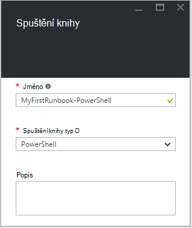  
6.  Klikněte na **vytvořit** vytvořte postupu runbook a otevřete textový editor.

## <a name="step-2---add-code-to-the-runbook"></a>Krok 2: Přidání kódu pro postupu runbook

Můžete buď kód typu přímo do postupu runbook nebo můžete vybrat rutiny runbooks a prostředky z ovládacího prvku knihovny a mít je přidán do postupu runbook se všechny související parametry. V tomto návodu jsme budete napsat přímo do postupu runbook.

1.  Náš postupu runbook je prázdné, typ *zápisu výstup "Vítáme."*.  
      
2.  Uložení postupu runbook kliknutím na **Uložit**.  
    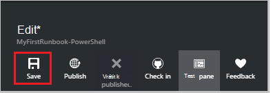  

## <a name="step-3---test-the-runbook"></a>Krok 3 – Test postupu runbook

Před jsme publikovat postupu runbook zpřístupnění ve výrobním, chceme vyzkoušet, abyste měli jistotu, že funguje správně. Při testování postupu runbook spustit **pracovní** verze a interaktivně zobrazit jeho výstup.

1.  Klikněte na **Testovat podokno** otevřete podokno testu.  
      
2.  Klikněte na tlačítko **Spustit** spusťte test. To by měl být jediná možnost povolené.
3.  Je vytvořen [postupu runbook úlohy](automation-runbook-execution.md) a jeho stav zobrazovat.  
    Stav úlohy začnou jako *ve frontě* označující, že čeká pracovního postupu runbook v cloudu do režimu dostupné. Ho pak přesune do *spuštění* při pracovník deklarace projekt a potom *systém* postupu runbook skutečně spuštění.  
4.  Když dokončí úloha postupu runbook, zobrazí se jeho výstup. V našem případě jsme byste měli vidět *Vítáme*  
    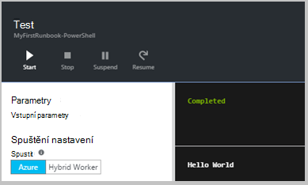  
5.  Zavření podokna Test se vrátíte na plátno.

## <a name="step-4---publish-and-start-the-runbook"></a>Krok 4 – publikovat a začněte postupu runbook

Postupu runbook, který jsme vytvořili, je pořád v režimu návrhu. Potřebujeme publikujte před jsme poběží v výroby. Při publikování postupu runbook je přepsat existující publikovaná verze verze konceptu. V našem případě jsme publikovaná verze ještě nemáte protože jsme vytvořili postupu runbook.

1.  Klikněte na **Publikovat** publikovat postupu runbook a potom **Ano** po zobrazení výzvy.  
      
2.  Pokud posunutí vlevo po zobrazíte postupu runbook v podokně **Runbooks** teď zobrazí **Vytváření stav** **Publikováno**.
3.  Přejděte zpátky k pravému zobrazíte v podokně **MyFirstRunbook Powershellu**.  
    Možnosti v horní části umožňují zahájit postupu runbook, zobrazení postupu runbook, naplánovat, aby se spouštěla někdy v budoucnu nebo vytvořit [webhook](automation-webhooks.md) , abyste mohli začít prostřednictvím protokolu HTTP volání.
4.  Chceme jednoduše začněte postupu runbook tak klikněte na tlačítko **Start** a potom klikněte na **Ok** při otevření zásuvné zahájení postupu Runbook.  
    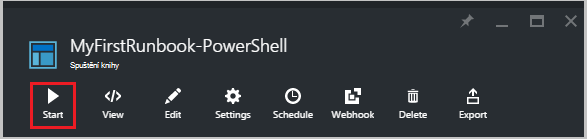  
5.  Podokno úloh upraveného postupu runbook projektu, který jsme vytvořili. Toto podokno jsme lze zavřít, ale v tomto případě jsme budete nechejte jej otevřený tak jsme můžete sledovat průběh projektu.
6.  Stav úlohy se zobrazují v **Souhrn projektu** a jsou vraceny stavy, které jsme viděli při testování postupu runbook.  
    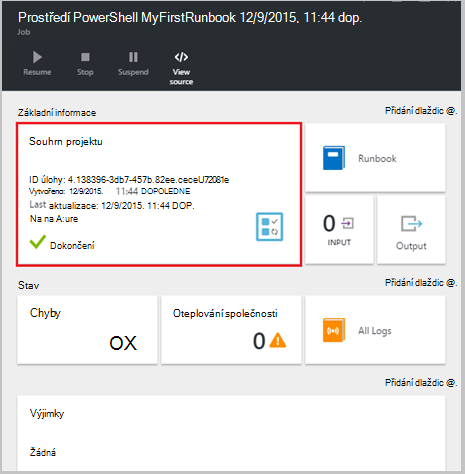  
7.  Jakmile se stav postupu runbook zobrazí *dokončili*, klikněte na **výstupu**. Zobrazí se podokno výstup a vidíme naše *Vítáme*.  
    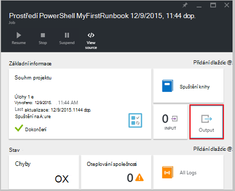
8.  Zavření podokna výstupu.
9.  Klikněte na **Všechny protokoly** otevřete podokno datových proudů pro danou úlohu postupu runbook. Vidíme by měl pouze *Vítáme* v toku výstup, ale pokud postupu runbook zapisuje na ně to můžete zobrazit datové proudy postupu runbook úlohy například podrobné a chyby.  
    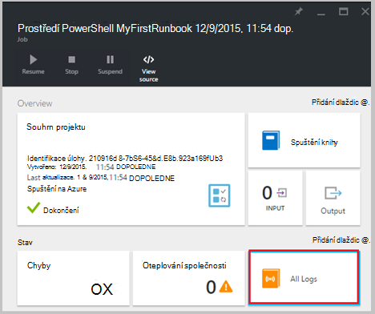  
10. Zavřete podokno datových proudů a v podokně úloh vrátili k podoknu MyFirstRunbook Powershellu.
11. Klikněte na tlačítko **úlohy** otevřete podokno úloh pro tohoto postupu runbook. Seznam všech projektů vytvořené pomocí tohoto postupu runbook. Vidíme by měl pouze jednu úlohu uvedený od jsme pouze spuštění úlohy jednou.  
    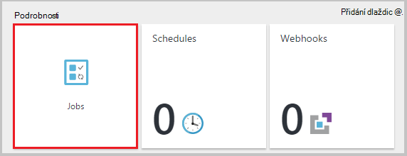  
12. Můžete kliknout na tuto úlohu otevřete podokno stejné projektu, aby nemůžeme zobrazit jsme spustil postupu runbook. Umožňuje přejděte zpátky v čase a zobrazit podrobnosti projektu, který byl vytvořený pro konkrétní postupu runbook.

## <a name="step-5---add-authentication-to-manage-azure-resources"></a>Krok 5 – Přidání ověřování ke správě Azure prostředků

Jste testováno jsme publikované naše postupu runbook, ale zatím ho nic se neděje užitečné. Chcete mít přidávání a používání Azure zdrojů. Nebude moct dělat, když Pokud máme ověřovat pomocí přihlašovacích údajů, které jsou uvedené v [požadavky](#prerequisites). Jsme to udělat pomocí rutiny **AzureRmAccount přidat** .

1.  Otevřete textový editor po kliknutí na **Upravit** v podokně MyFirstRunbook Powershellu.  
    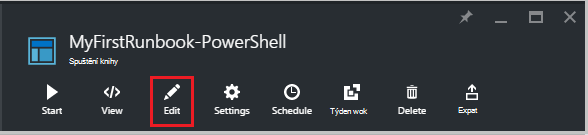  
2.  Není potřebujeme řádku **Zápisu výstupu** už, takže pokračovat a odstraňte ji.
3.  Zadejte nebo zkopírujte a vložte následující kód, který bude řešit ověřování pomocí svého účtu automatizaci spustit jako:

    ```
     $Conn = Get-AutomationConnection -Name AzureRunAsConnection 
     Add-AzureRMAccount -ServicePrincipal -Tenant $Conn.TenantID `
     -ApplicationId $Conn.ApplicationID -CertificateThumbprint $Conn.CertificateThumbprint
    ``` 
<br>
4.  Klikněte na **Testovat podokno** , aby jsme můžete otestovat postupu runbook.
5.  Klikněte na tlačítko **Spustit** spusťte test. Po dokončení, mají dostávat výstup následující zobrazující základní informace z vašeho účtu. To znamená, že pověření je platný. <br> 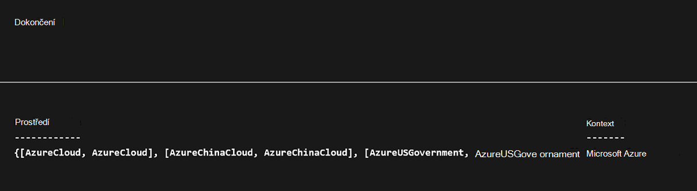

## <a name="step-6---add-code-to-start-a-virtual-machine"></a>Krok 6: Přidání kódu pro začátek virtuálního počítače

Teď naší postupu runbook je ověření naší Azure předplatného, můžete nám přidávání a používání zdrojů. Příkaz pro zahájení virtuálního počítače přidáme. Můžete vybrat libovolné virtuálního počítače v Azure předplatné a nyní jsme bude hardcoding, která název do rutiny.

1.  Po *Přidání AzureRmAccount*, zadejte *Start AzureRmVM – název "VMName" - ResourceGroupName "NameofResourceGroup"* poskytuje název a název pole Skupina zdroje virtuálního počítače začít.  
    
    ```
     $Conn = Get-AutomationConnection -Name AzureRunAsConnection 
     Add-AzureRMAccount -ServicePrincipal -Tenant $Conn.TenantID `
     -ApplicationID $Conn.ApplicationID -CertificateThumbprint $Conn.CertificateThumbprint 
     Start-AzureRmVM -Name 'VMName' -ResourceGroupName 'ResourceGroupName'
     ```
<br>
2.  Uložení postupu runbook a klikněte na **Testovat podokno** tak, aby jsme můžete otestovat.
3.  Klikněte na tlačítko **Spustit** spusťte test. Po dokončení, zkontrolujte, že byl spuštěn virtuální počítač.

## <a name="step-7---add-an-input-parameter-to-the-runbook"></a>Krok 7 – přidání vstupní parametry postupu runbook

Náš postupu runbook aktuálně spustí virtuální počítače, které jsme pevně kódovaná v postupu runbook, ale bude zvýšíte jeho přínos, můžeme určit virtuální počítač při spuštění postupu runbook. Nyní přidáme vstupních parametrů pro postupu runbook poskytovat tuto funkci.

1.  Přidat parametry pro *VMName* a *ResourceGroupName* postupu runbook a použijte tyto proměnné s rutinu **Start AzureRmVM** jako v příkladu níže.  
    
    ```
    Param(
       [string]$VMName,
       [string]$ResourceGroupName
    )
     $Conn = Get-AutomationConnection -Name AzureRunAsConnection 
     Add-AzureRMAccount -ServicePrincipal -Tenant $Conn.TenantID `
     -ApplicationID $Conn.ApplicationID -CertificateThumbprint $Conn.CertificateThumbprint 
     Start-AzureRmVM -Name $VMName -ResourceGroupName $ResourceGroupName
     ```
<br> 
2.  Uložení postupu runbook a otevřete podokno testu. Všimněte si, že je teď můžete zadat hodnoty pro dvě vstupní proměnné použité ve sloupci podmínka.
3.  Zavření podokna testu.
4.  Klepnutí na tlačítko **Publikovat** novou verzi postupu runbook.
5.  Vypnout virtuální počítač, kterou jste zahájili v předchozím kroku.
6.  Klikněte na tlačítko **Spustit** spusťte postupu runbook. Zadejte do pole **VMName** a **ResourceGroupName** pro virtuální počítač, který chcete spustit.  
    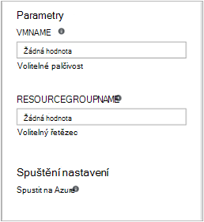  
7.  Po dokončení postupu runbook zkontrolujte, že byl spuštěn virtuální počítač.

## <a name="differences-from-powershell-workflow"></a>Rozdíly v prostředí PowerShell pracovního postupu

Prostředí PowerShell runbooks mají stejné životního cyklu, možnosti a správu jako runbooks prostředí PowerShell pracovního postupu, ale existují některé rozdíly a omezení:

1.  Runbooks prostředí PowerShell spusťte rychlé ve srovnání s runbooks prostředí PowerShell pracovního postupu jako tito uživatelé nemají kompilace kroku.
2.  Pracovní postup prostředí PowerShell runbooks podporují kontroly pomocí kontroly, runbooks prostředí PowerShell pracovního postupu lze obnovit z jakéhokoli místa postupu runbook že prostředí PowerShell runbooks lze obnovit pouze od začátku.
3.  Pracovní postup prostředí PowerShell runbooks domovské stránce podpory paralelní a sériové spouštění že prostředí PowerShell runbooks mohou pouze provádět příkazy sériově.
4.  V prostředí PowerShell pracovního postupu runbook aktivitu, příkazu nebo blok skriptu může mít vlastní prostředí runspace že postupu runbook prostředí PowerShell všechno ve skriptu spuštěna v jedné prostředí runspace. Existuje několik [syntaktickou rozdíly](https://technet.microsoft.com/magazine/dn151046.aspx) mezi nativní postupu runbook prostředí PowerShell a prostředí PowerShell pracovního postupu runbook.

## <a name="next-steps"></a>Další kroky

-   Začínáme s grafickým runbooks, najdete v tématu [Můj první grafické postupu runbook](automation-first-runbook-graphical.md)
-   Začínáme s runbooks prostředí PowerShell pracovního postupu, najdete v článku [svůj první postupu runbook prostředí PowerShell pracovního postupu](automation-first-runbook-textual.md)
-   Další informace o postupu runbook typů a jejich výhody omezení, najdete v tématu [typy postupu runbook automatizaci Azure](automation-runbook-types.md)
-   Další informace o skript Powershellu podporovat funkce najdete v článku [skriptu nativní PowerShell podpory pro automatizaci Azure](https://azure.microsoft.com/blog/announcing-powershell-script-support-azure-automation-2/)
