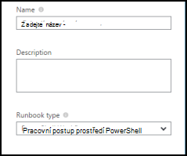
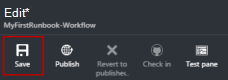
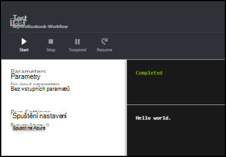
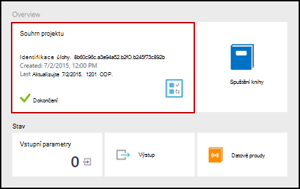
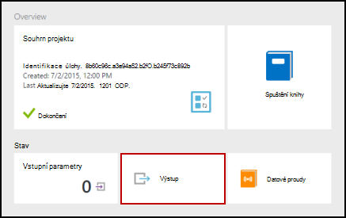
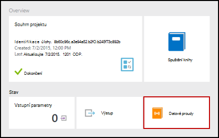
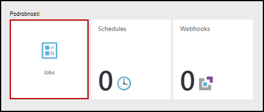
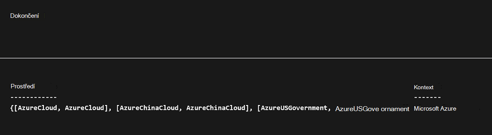
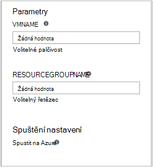

<properties
    pageTitle="Můj první postupu runbook prostředí PowerShell pracovního postupu v Azure automatizaci | Microsoft Azure"
    description="Kurz, který vás provede vytváření testování a publikování o postupu runbook prostého textu pomocí prostředí PowerShell pracovního postupu."
    services="automation"
    documentationCenter=""
    authors="mgoedtel"
    manager="jwhit"
    editor=""
    keywords="prostředí PowerShell pracovního postupu, příklady pracovních postupů prostředí powershell powershell pracovního postupu"/>
<tags
    ms.service="automation"
    ms.workload="tbd"
    ms.tgt_pltfrm="na"
    ms.devlang="na"
    ms.topic="get-started-article"
    ms.date="07/19/2016"
    ms.author="magoedte;bwren"/>

# <a name="my-first-powershell-workflow-runbook"></a>Můj první postupu runbook prostředí PowerShell pracovního postupu

> [AZURE.SELECTOR] - [Grafické](automation-first-runbook-graphical.md) - [Powershellu](automation-first-runbook-textual-PowerShell.md) - [Prostředí PowerShell pracovního postupu](automation-first-runbook-textual.md)

Tento kurz vás provede vystavením [prostředí PowerShell pracovního postupu runbook](automation-runbook-types.md#powerShell-workflow-runbooks) v Azure automatizaci. Začneme bude pomocí jednoduchého postupu runbook, který budete testovat jsme publikovat během jsme je vysvětleno, jak chcete-li sledovat stav úlohy postupu runbook. Budeme se změňte postupu runbook skutečně spravovat Azure zdroje v tomto případě zahajování Azure virtuálního počítače. Potom vytočit postupu runbook robustnější přidáním postupu runbook parametry.

## <a name="prerequisites"></a>Zjistit předpoklady pro

Tento kurz budete potřebovat.

-   Azure předplatného. Pokud je jeden ještě nemáte, můžete [aktivovat své výhody odběratele MSDN](https://azure.microsoft.com/pricing/member-offers/msdn-benefits-details/) nebo <a href="/pricing/free-account/" target="_blank"> [registraci bezplatného účtu](https://azure.microsoft.com/free/).
-   [Automatizace účtu](automation-security-overview.md) postupu runbook podržte při ověřování Azure zdroje.  Tento účet musí mít oprávnění k spustit a zastavit virtuální počítač.
-   Azure virtuálního počítače. Jsme zastaví a spustit tento počítač, aby by neměly být výroby.

## <a name="step-1---create-new-runbook"></a>Krok 1: vytvoření nového postupu runbook

Začneme bude tak, že vytvoříte jednoduchý postupu runbook, uloží text *Vítáme*.

1.  Na portálu Azure si potřebujete založit účet automatizaci.  
    Stránku s účtem automatizaci najdete rychlý přehled zdrojů v tento účet. Měli byste mít už některé prostředky. Většina uživatelů je moduly, které jsou automaticky součástí nový účet automatizaci. Měli byste mít taky popsaná v [požadavcích](#prerequisites)materiálů přihlašovacích údajů.
2.  Klikněte na dlaždici **Runbooks** otevřete seznam runbooks.<br> 
3.  Kliknutím na tlačítko **Přidat postupu runbook** a pak **vytvořit nové postupu runbook**vytvořte nové postupu runbook.
4.  Zadejte název *MyFirstRunbook pracovního*postupu runbook.
5.  V tomto případě chceme vytvoření [prostředí PowerShell pracovního postupu runbook](automation-runbook-types.md#powerShell-workflow-runbooks) zvolte **Prostředí Powershell pracovního postupu** pro **Typ postupu Runbook**.<br> 
6.  Klikněte na **vytvořit** vytvořte postupu runbook a otevřete textový editor.

## <a name="step-2---add-code-to-the-runbook"></a>Krok 2: Přidání kódu pro postupu runbook

Můžete buď kód typu přímo do postupu runbook nebo můžete vybrat rutiny runbooks a prostředky z ovládacího prvku knihovny a mít je přidán do postupu runbook se všechny související parametry. V tomto návodu jsme budete napsat přímo do postupu runbook.

1.  Náš postupu runbook je prázdné s pouze požadovaná *pracovního postupu* klíčového slova, název naše postupu runbook a složených závorek, které bude encase celý pracovního postupu. 

    ```
    Workflow MyFirstRunbook-Workflow
    {
    }
    ```

2.  Typ *zápisu výstup "Vítáme."* mezi složené závorky. 
   
    ```
    Workflow MyFirstRunbook-Workflow
    {
      Write-Output "Hello World"
    }
    ```

3.  Uložení postupu runbook kliknutím na **Uložit**.<br> 

## <a name="step-3---test-the-runbook"></a>Krok 3 – Test postupu runbook

Před jsme publikovat postupu runbook zpřístupnění ve výrobním, chceme vyzkoušet, abyste měli jistotu, že funguje správně. Při testování postupu runbook spustit **pracovní** verze a interaktivně zobrazit jeho výstup.

1.  Klikněte na **Testovat podokno** otevřete podokno testu.<br> 
2.  Klikněte na tlačítko **Spustit** spusťte test. To by měl být jediná možnost povolené.
3.  Je vytvořen [postupu runbook úlohy](automation-runbook-execution.md) a jeho stav zobrazovat.  
    Stav úlohy začnou jako *ve frontě* označující, že se čeká pracovního postupu runbook v cloudu do režimu dostupné. Ho pak přesune do *spuštění* při pracovník deklarace projekt a potom *systém* postupu runbook skutečně spuštění.  
4.  Když dokončí úloha postupu runbook, zobrazí se jeho výstup. V našem případě jsme byste měli vidět *Vítáme*.<br> 
5.  Zavření podokna Test se vrátíte na plátno.

## <a name="step-4---publish-and-start-the-runbook"></a>Krok 4 – publikovat a začněte postupu runbook

Postupu runbook, který jsme vytvořili, je pořád v režimu návrhu. Potřebujeme publikujte před jsme poběží v výroby. Při publikování postupu runbook je přepsat existující publikovaná verze verze konceptu. V našem případě jsme publikovaná verze ještě nemáte protože jsme vytvořili postupu runbook.

1.  Klikněte na **Publikovat** publikovat postupu runbook a potom **Ano** po zobrazení výzvy.<br> 
2.  Pokud posunutí vlevo po zobrazíte postupu runbook v podokně **Runbooks** teď zobrazí **Authoring stav** **Publikováno**.
3.  Přejděte zpátky k pravému zobrazíte v podokně **MyFirstRunbook**pracovního postupu.  
    Možnosti v horní části Povolit cz spuštění postupu runbook, naplánovat, aby se spouštěla někdy v budoucnu nebo vytvořit [webhook](automation-webhooks.md) , abyste mohli začít prostřednictvím protokolu HTTP volání.
4.  Chceme jednoduše začněte postupu runbook proto klikněte na tlačítko **Start** a potom na **Ano** po zobrazení výzvy.<br> 
5.  Podokno úloh upraveného postupu runbook projektu, který jsme vytvořili. Toto podokno jsme lze zavřít, ale v tomto případě jsme budete nechejte jej otevřený tak jsme můžete sledovat průběh projektu.
6.  Stav úlohy se zobrazují v **Souhrn projektu** a jsou vraceny stavy, které jsme viděli při testování postupu runbook.<br> 
7.  Jakmile se stav postupu runbook zobrazí *dokončili*, klikněte na **výstupu**. Zobrazí se podokno výstup a vidíme náš *Vítáme*.<br>   
8.  Zavření podokna výstupu.
9.  Klikněte na tlačítko **datové proudy** otevřete podokno datových proudů pro danou úlohu postupu runbook. Vidíme by měl pouze *Vítáme* v toku výstup, ale pokud postupu runbook zapisuje na ně to můžete zobrazit datové proudy postupu runbook úlohy například podrobné a chyby.<br> 
10. Zavřete podokno datových proudů a v podokně úloh vrátili k podoknu MyFirstRunbook.
11. Klikněte na tlačítko **úlohy** otevřete podokno úloh pro tohoto postupu runbook. Seznam všech projektů vytvořené pomocí tohoto postupu runbook. Vidíme by měl pouze jednu úlohu uvedené od jsme pouze spuštění úlohy jednou.<br> 
12. Můžete kliknout na tuto úlohu otevřete podokno stejné projektu, aby nemůžeme zobrazit jsme spustil postupu runbook. Umožňuje přejděte zpátky v čase a zobrazit podrobnosti projektu, který byl vytvořený pro konkrétní postupu runbook.

## <a name="step-5---add-authentication-to-manage-azure-resources"></a>Krok 5 – Přidání ověřování ke správě Azure prostředků

Jste testováno jsme publikované naše postupu runbook, ale zatím ho nic se neděje užitečné. Chcete mít přidávání a používání Azure zdrojů. Nebude moct dělat, když Pokud máme ověřovat pomocí přihlašovacích údajů, které jsou uvedené v [požadavky](#prerequisites). Jsme to udělat pomocí rutiny **AzureRMAccount přidat** .

1.  Otevřete textový editor po kliknutí na **Upravit** v podokně MyFirstRunbook pracovního postupu.<br> 
2.  Není potřebujeme řádku **Zápisu výstupu** už, takže Pojďte dále a odstraňte ji.
3.  Umístěte kurzor v prázdném řádku mezi složené závorky.
4.  Zadejte nebo zkopírujte a vložte následující kód, který bude řešit ověřování pomocí svého účtu automatizaci spustit jako:

    ```
    $Conn = Get-AutomationConnection -Name AzureRunAsConnection 
    Add-AzureRMAccount -ServicePrincipal -Tenant $Conn.TenantID `
    -ApplicationId $Conn.ApplicationID -CertificateThumbprint $Conn.CertificateThumbprint
    ```

5.  Kliknutím **otestujte podokno** jsme můžete otestovat postupu runbook.
6.  Klikněte na tlačítko **Spustit** spusťte test. Po dokončení, mají dostávat výstup následující zobrazující základní informace z vašeho účtu. To znamená, že pověření je platný.<br> 

## <a name="step-6---add-code-to-start-a-virtual-machine"></a>Krok 6: Přidání kódu pro začátek virtuálního počítače

Teď naše postupu runbook je ověření naše Azure předplatného, můžete nám přidávání a používání zdrojů. Příkaz pro zahájení virtuálního počítače přidáme. Můžete vybrat libovolné virtuálního počítače v Azure předplatné a nyní jsme bude hardcoding, pojmenovat do rutiny.

1.  Po *Přidání AzureRmAccount*, zadejte *Start AzureRmVM – název "VMName" - ResourceGroupName "NameofResourceGroup"* poskytuje název a název pole Skupina zdroje virtuálního počítače začít.  

    ```
    workflow MyFirstRunbook-Workflow
    {
      $Conn = Get-AutomationConnection -Name AzureRunAsConnection
      Add-AzureRMAccount -ServicePrincipal -Tenant $Conn.TenantID -ApplicationId $Conn.ApplicationID -CertificateThumbprint $Conn.CertificateThumbprint
      Start-AzureRmVM -Name 'VMName' -ResourceGroupName 'ResourceGroupName'
    }
    ``` 

2.  Uložení postupu runbook a klikněte na **Testovat podokno** tak, aby jsme můžete otestovat.
3.  Klikněte na tlačítko **Spustit** spusťte test. Po dokončení, zkontrolujte, že byl spuštěn virtuální počítač.

## <a name="step-7---add-an-input-parameter-to-the-runbook"></a>Krok 7 – přidání vstupní parametry postupu runbook

Náš postupu runbook aktuálně spustí virtuální počítače, které jsme pevně kódovaná v postupu runbook, ale bude zvýšíte jeho přínos, můžeme určit virtuální počítač při spuštění postupu runbook. Nyní přidáme vstupních parametrů pro postupu runbook poskytovat tuto funkci.

1.  Přidat parametry pro *VMName* a *ResourceGroupName* postupu runbook a použijte tyto proměnné s rutinu **Start AzureRmVM** jako v příkladu níže. 

    ```
    workflow MyFirstRunbook-Workflow
    {
       Param(
        [string]$VMName,
        [string]$ResourceGroupName
       )  
     $Conn = Get-AutomationConnection -Name AzureRunAsConnection 
     Add-AzureRMAccount -ServicePrincipal -Tenant $Conn.TenantID -ApplicationId $Conn.ApplicationID -CertificateThumbprint $Conn.CertificateThumbprint
     Start-AzureRmVM -Name $VMName -ResourceGroupName $ResourceGroupName
    }
    ```

2.  Uložení postupu runbook a otevřete podokno testu. Všimněte si, že je teď můžete zadat hodnoty pro dvě vstupní proměnné použité ve sloupci podmínka.
3.  Zavření podokna testu.
4.  Klepnutí na tlačítko **Publikovat** novou verzi postupu runbook.
5.  Vypnout virtuální počítač, kterou jste zahájili v předchozím kroku.
6.  Klikněte na tlačítko **Spustit** spusťte postupu runbook. Zadejte do pole **VMName** a **ResourceGroupName** pro virtuální počítač, který chcete spustit.<br> 

7.  Po dokončení postupu runbook zkontrolujte, že byl spuštěn virtuální počítač.

## <a name="next-steps"></a>Další kroky

-  Začínáme s grafickým runbooks, najdete v tématu [Můj první grafické postupu runbook](automation-first-runbook-graphical.md)
-  Začínáme s runbooks Powershellu najdete v článku [svůj první postupu runbook prostředí PowerShell](automation-first-runbook-textual-powershell.md)
-  Další informace o postupu runbook typů a jejich výhody omezení, najdete v tématu [typy postupu runbook automatizaci Azure](automation-runbook-types.md)
-  Další informace o skript Powershellu podporovat funkce najdete v článku [skriptu nativní PowerShell podpory pro automatizaci Azure](https://azure.microsoft.com/blog/announcing-powershell-script-support-azure-automation-2/)