<properties 
    pageTitle="Grafické Authoring v Azure automatizaci | Microsoft Azure"
    description="Grafické vytváření umožňuje vytvářet runbooks pro automatizaci Azure bez použití kódu. Tento článek obsahuje úvod do grafické vytváření a všechny informace potřebné k zahájení vytváření grafické postupu runbook."
    services="automation"   
    documentationCenter=""
    authors="mgoedtel"
    manager="jwhit"
    editor="tysonn" />
<tags 
    ms.service="automation"
    ms.devlang="na"
    ms.topic="article"
    ms.tgt_pltfrm="na"
    ms.workload="infrastructure-services"
    ms.date="06/03/2016"
    ms.author="magoedte;bwren" />

# Grafické authoring v Azure automatizaci

## Úvod

Vytváření grafické obsahu umožňuje vytvářet runbooks pro automatizaci Azure bez složitostí základní prostředí Windows PowerShell nebo pracovního prostředí PowerShell kód. Přidání aktivity na plátno z knihovny rutiny a runbooks, propojovat je a konfigurace k vytvoření pracovního postupu.  Pokud jste někdy pracovali s System Center Orchestrator nebo služby správy automatizaci (SMA), potom to by měl vypadat povědomá.   

Tento článek obsahuje úvod do grafické vytváření a koncepty, abyste mohli začít pracovat při vytváření grafické postupu runbook.

## Grafické runbooks

Všechny runbooks v Azure automatizaci jsou pracovní postupy Windows PowerShell.  Grafické a grafické pracovního postupu prostředí PowerShell runbooks generovat kód prostředí PowerShell, který se spustí pracovníky automatizaci, ale nemůžete ho zobrazit nebo upravovat přímo.  Grafické postupu runbook může být převeden postupu runbook grafické prostředí PowerShell pracovního postupu a naopak, ale nelze převést na textový postupu runbook. Existující textové postupu runbook nelze importovat do editoru grafické.  

## Základní informace o grafických editor

Grafické editor můžete otevřít v portálu Azure vytváření nebo úpravy grafické postupu runbook.

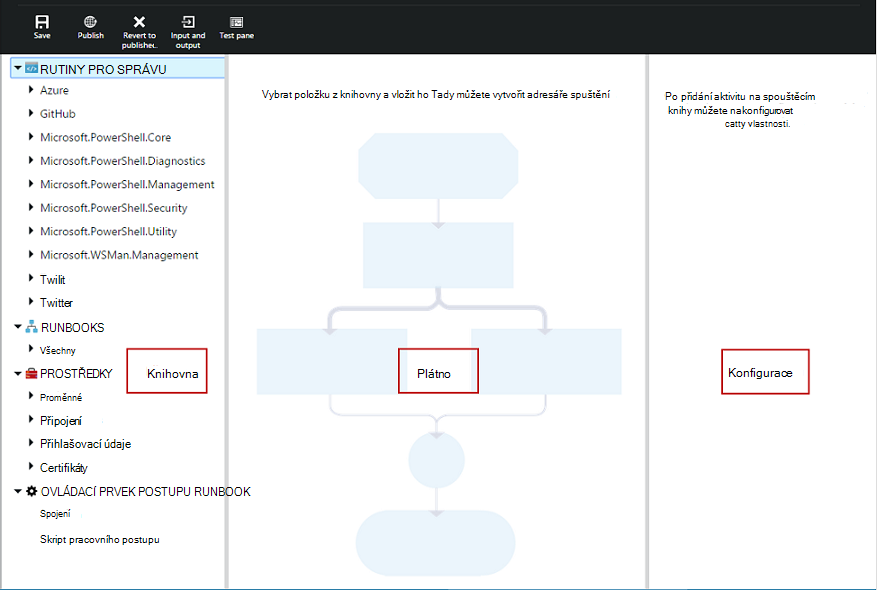

Následující oddíly popisují ovládací prvky v editoru grafické.

### Plátno
Plátno je místo, kam navrhování svého postupu runbook.  Přidání aktivit z uzlů v ovládacím prvku knihovny do postupu runbook a spojit s odkazy na definovat logickou postupu runbook.

Ovládací prvky na konci plátno umožňuje přiblížit nebo oddálit.

### Ovládací prvek knihovny

Ovládací prvek knihovny slouží k výběru [aktivity](#activities) přidat do svého postupu runbook.  Je přidat do plátno, kde je připojení k jiné činnosti.  Zahrnuje čtyři oddíly popsané v následující tabulce.

| Oddíl | Popis |
|:---|:---|
| Rutiny pro správu | Zahrnuje všechny rutinách, které lze použít ve vaší postupu runbook.  Rutiny pro jsou organizovány pomocí modulu.  Všechny moduly, které jste nainstalovali ve vašem účtu automatizaci budou k dispozici.  |
| Runbooks |  Obsahuje runbooks ve vašem účtu automatizaci. Tyto runbooks lze přidat na plátno má být použit jako podřízené runbooks. Jsou zobrazeny pouze runbooks stejného typu základní jako postupu runbook upravovaný; pro grafické runbooks pouze na základě prostředí PowerShell runbooks zobrazují, zatímco pro grafické pracovního postupu prostředí PowerShell runbooks jsou zobrazeny pouze prostředí PowerShell pracovního postupu procesory runbooks.
| Prostředky | Obsahuje [majetek automatizaci](http://msdn.microsoft.com/library/dn939988.aspx) ve vašem účtu automatizaci použitého v vaší postupu runbook.  Když přidáte aktivum postupu runbook, přidá aktivitu pracovního postupu, která získává vybrané materiálů.  V případě proměnné prostředky můžete vybrat, zda chcete přidat aktivitu získat proměnné nebo nastavit proměnnou.
| Ovládací prvek postupu Runbook | Zahrnuje postupu runbook ovládací prvek činnosti, které lze použít v aktuálním postupu runbook. *Spojovací* zabírá víc vstupů a čeká všechny dokončili před pokračováním pracovního postupu. *Kód* aktivity spustí jeden nebo více řádků prostředí PowerShell nebo pracovního prostředí PowerShell kódu v závislosti na typu grafické postupu runbook.  Tato akce můžete použít pro vlastní kód nebo funkce, které jsou obtížné dosáhnout s jinou práci.|

### Konfigurace ovládacího prvku

Ovládací prvek konfigurace je místo, kam zadáte podrobnosti pro vybraný na plátno objekt. Vlastnosti dostupné v tomto ovládacím prvku závisí na typu vybraného objektu.  Když vyberete možnost v ovládacím prvku konfigurace, otevře se další listy k poskytují další informace.

### Testování ovládacího prvku

Ovládací prvek Test nezobrazuje při prvním spuštění editoru grafické. Při otevření můžete interaktivně [testování grafické postupu runbook](#graphical-runbook-procedures).  

## Grafické postupu runbook postupy 

### Export a import grafické postupu runbook

Můžete exportovat pouze publikované verze grafické postupu runbook.  Pokud ještě nebyla publikována postupu runbook, klikněte na tlačítko **Exportovat publikované** budou zakázány.  Po kliknutí na tlačítko **Exportovat publikovaných** do místního počítače se stáhne postupu runbook.  Název souboru shoduje s názvem postupu runbook s příponou *graphrunbook* .

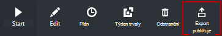

Můžete importovat grafické nebo grafický prostředí PowerShell pracovního postupu runbook tak, že vyberete možnost **importovat** při přidávání postupu runbook.   Když vyberete soubor, který chcete importovat, můžete zůstal stejný **název** nebo zadejte nový název.  Pole Typ postupu Runbook zobrazí typ postupu runbook po vyhodnocuje vybraný soubor a pokud se pokusíte vybrat jiný typ, který není správného, zpráva zobrazí zaznamenání potenciální konfliktů a při převodu, může to být z chyby syntaxe.  

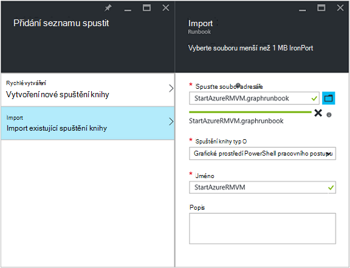

### Testování grafické postupu runbook

Můžete otestovat pracovní verze postupu runbook Azure portálu při ponechání publikované verze postupu runbook beze změny, nebo můžete otestovat nový postupu runbook před jeho publikování. Umožňuje ověřte, že postupu runbook správnou před nahrazením publikovaná verze. Při testování postupu runbook spouštět postupu runbook koncept a po dokončení všech akcí, které provede. Historie úlohy se vytvoří, ale výstup se zobrazí v podokně výstup testu. 

Otevřete ovládací prvek Test pro postupu runbook otevřením postupu runbook pro úpravy a potom klikněte na tlačítko **podokno Test** .

Ovládací prvek Test vás vyzve k vstupní parametry a začnete postupu runbook kliknutím na tlačítko **Start** .

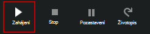

### Publikování grafické postupu runbook

Každý postupu runbook v Azure automatizaci má koncept a publikovaná verze. Pouze publikované verze je k dispozici proběhnout a pracovní verze je možné upravit. Publikovaná verze je ovlivněna změn verze konceptu. Pokud pracovní verze je připravená k dispozici, pak můžete publikovat který přepíše publikovaná verze verze konceptu.

Publikovat grafické postupu runbook otevřením postupu runbook pro úpravy a potom kliknete na tlačítko **Publikovat** .

Když postupu runbook dosud nebyly publikovány, má stav **Nový**.  Když je publikován, má stav **Publikováno**.  Pokud upravíte postupu runbook po jeho publikování a koncept a publikované verze se liší, postupu runbook má stav **na Upravit**.

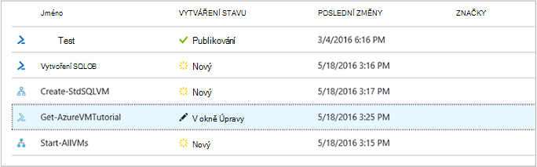 

Máte taky možnost se vrátit k publikovaná verze postupu runbook.  Vyvolá pryč všechny změny provedené od posledního publikování a nahradí pracovní verze postupu runbook publikovaná verze postupu runbook.

## Aktivity

Aktivity jsou stavebních bloků postupu runbook.  Aktivity můžou být rutiny prostředí PowerShell, postupu runbook podřízené nebo činnosti pracovního postupu.  Kliknutí pravým tlačítkem myši ho v ovládacím prvku knihovny a výběrem **Přidat plátno**přidáte aktivitu postupu runbook.  Můžete pak klepněte a přetáhněte aktivitu kdekoli na plátno, který se vám líbí.  Umístění aktivity na plátno netýká operace postupu runbook žádným způsobem.  Můžete rozložení vaší postupu runbook však pro vás nejvhodnější vizualizace jejího operace. 

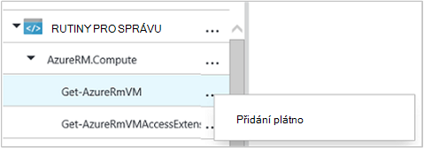

Vyberte aktivitu na plátno konfigurovat jeho vlastností a parametrů v zásuvné konfigurace.  **Popisek** aktivity můžete změnit na něco popisující vám.  Původní rutina stále probíhá, jednoduše změníte jeho zobrazované jméno, které se použije v editoru grafické.  Popisek musí být jedinečný v rámci postupu runbook. 

### Parametr sady

Nastavení parametrů definuje povinné a nepovinné parametrů, které přijímá hodnoty pro konkrétní rutinu.  Všechny rutiny alespoň jeden parametr nastaven a některé více.  Pokud rutina má více sad parametr, je nutné které z nich budete používat před můžete nakonfigurovat parametry vybrat.  Parametry, které můžete konfigurovat závisí na nastavení parametrů, které zvolíte.  Můžete změnit sadu parametr používanou aktivitu výběrem **Parametr nastaven** a výběrem jiné sady.  V tomto případě se ztratí všechny hodnoty parametrů, které jste nakonfigurovali.

V následujícím příkladu rutinu Get-AzureRmVM má tři sad parametrů.  Hodnoty parametrů nejde nakonfigurovat až po výběru jedné z výše uvedené množiny parametr.  Nastavení parametrů ListVirtualMachineInResourceGroupParamSet je k vrácení všech virtuálních počítačích ve skupině zdroje a má jeden volitelné parametr.  GetVirtualMachineInResourceGroupParamSet slouží k určení virtuální počítač chcete se vrátit a obsahuje dva povinné a jeden volitelné parametr.

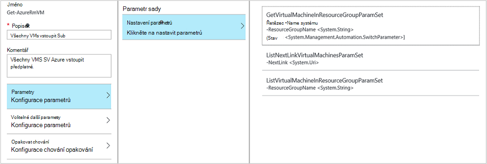

#### Hodnoty parametrů

Zadat hodnotu parametru vyberete zdroj dat a zjistit, jak bude zadané hodnoty.  Zdroje dat, které jsou dostupné pro konkrétní parametr závisí na platné hodnoty pro tento parametr.  Například hodnota Null nebudou k dispozici možnost pro parametr, který neumožňuje hodnoty null.

| Zdroj dat | Popis |
|:---|:---|
|Konstantní hodnota|Zadat hodnotu parametru.  To je dostupný jenom u těmto typům dat: Int32 Int64, řetězec, logická hodnota, data a času, přepínač. |
|Aktivity výstup|Výstup z aktivity, které předchází aktuální činnosti pracovního postupu.  Zobrazí všechny platné aktivity.  Vyberte právě aktivitu pro účely hodnota parametru jeho výstup.  Pokud aktivitu výstupy objekt s více vlastností, můžete zadat název vlastnosti po výběru aktivity.|
|Vstupní postupu Runbook |Vyberte vstupní parametry postupu runbook jako vstupů pro parametr aktivity.|  
|Proměnná majetku|Vyberte proměnné automatizaci předávat na vstupu.|  
|Přihlašovací údaje materiálů|Vyberte přihlašovacích údajů automatizaci předávat na vstupu.|  
|Certifikát materiálů|Vyberte certifikát automatizaci předávat na vstupu.|  
|Připojení materiálů|Vyberte připojení k automatizaci předávat na vstupu.| 
|Výraz prostředí PowerShell|Zadejte jednoduchý [výraz Powershellu](#powershell-expressions).  Výraz vyhodnocován před aktivity a výsledek pro hodnotu parametru.  Proměnné můžete odkázat na výstup aktivity nebo vstupní parametry postupu runbook.|
|Není nakonfigurováno|Vymaže každá hodnota, která byla dříve konfigurované.|

#### Volitelné další parametry

Rutiny pro všechny budou mít možnost poskytují další parametry.  Toto jsou běžné parametry prostředí PowerShell nebo jiné vlastní parametry.  Zobrazí s textovým polem kterého můžete přidat parametrů pomocí prostředí PowerShell syntaxe.  Například pro parametr **podrobné** běžné, zadáte **"-podrobné: $True"**.

### Opakovat aktivity

**Opakovat chování** umožňuje aktivitu proběhnout několikrát, dokud je splněné určité podmínky, podobně jako obraze.  Používáte tuto funkci pro činnosti, které by měla běžet několikrát, neobsahují chyby: chybám a může potřebovat víc než jednu pokusí praktické nebo test výstupní informace aktivity platná data.    

Pokud povolíte akci opakujte pro aktivity, můžete nastavit zpoždění a podmínky.  Zpoždění je čas (v sekundách nebo minutách), že postupu runbook počká před spuštěním aktivity znovu.  Pokud je zadána žádná prodleva, pak aktivitu se spustí znovu hned po dokončení. 

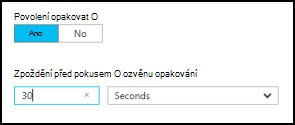

Podmínka opakovat je prostředí PowerShell výraz, který je vyhodnocen jako po každém spuštění aktivity.  Pokud výraz true (pravda), pak aktivity spustí znovu.  Převede výraz na NEPRAVDA aktivity není akci a postupu runbook slouží k přesunutí další činnost. 

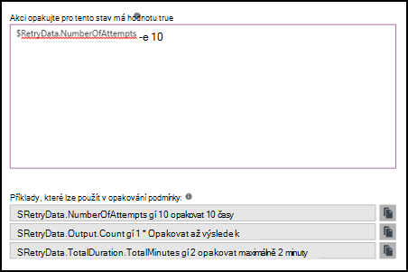

Podmínka Opakovat můžete použít proměnnou s názvem $RetryData, které poskytuje přístup k informacím o aktivitách opakování.  Tuto proměnnou má vlastnosti v následující tabulce.

| Vlastnost | Popis |
|:--|:--|
| NumberOfAttempts | Počet spuštěné aktivity.              |
| Výstup           | Výstup z posledního spuštění aktivity.                    |
| TotalDuration    | Vypršel časový limit, jež uplynuly od při prvním spuštění aktivity. |
| StartedAt        | Spustil nejdřív čas ve formátu UTC aktivity.           |

Tady jsou příklady aktivitu opakovat podmínky.

    # Run the activity exactly 10 times.
    $RetryData.NumberOfAttempts -ge 10 

    # Run the activity repeatedly until it produces any output.
    $RetryData.Output.Count -ge 1 

    # Run the activity repeatedly until 2 minutes has elapsed. 
    $RetryData.TotalDuration.TotalMinutes -ge 2

Po konfiguraci opakovat podmínky pro aktivitu aktivity obsahuje dva vizuálních pomůcek chcete upozorňovat.  Jednu jsou uvedeny v aktivity a druhý při kontrole konfigurace aktivity.

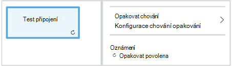

### Ovládací prvek skript pracovního postupu

Ovládací prvek kód je speciální činnost, která přijímá skriptu prostředí PowerShell nebo pracovního postupu Powershellu v závislosti na typu grafické postupu runbook vytvořen za účelem poskytovat funkce, které jinak nemusí být k dispozici.  Nemůžete přijmout parametry, ale můžete použít proměnné aktivity výstup a postupu runbook vstupních parametrů.  Výstup aktivity přibude databus Pokud nemá žádné odchozí propojení v takovém případě se přidá do výstupu postupu runbook.

Například následující kód provádí výpočty dat pomocí vstupních proměnnou postupu runbook s názvem $NumberOfDays.  Potom odešle počítané datum čas jako výstup pro použití v následné aktivity v postupu runbook.

    $DateTimeNow = (Get-Date).ToUniversalTime()
    $DateTimeStart = ($DateTimeNow).AddDays(-$NumberOfDays)}
    $DateTimeStart

## Odkazy a pracovního postupu

Na **odkaz** v části grafické postupu runbook připojí dvě aktivity.  Zobrazí se na plátno jako šipky mířící ze zdrojového aktivitu na cíl činnost.  Činnosti spustit ve směru šipky aktivitu cíl spuštění po dokončení aktivitu zdroje.  

### Vytvoření odkazu

Vytvořte propojení mezi dvěma aktivity výběrem zdroje aktivity a kliknutím na kruh v dolní části obrazce.  Přetáhněte na šipku na cíl aktivity a vydání.

Vyberte odkaz pro nastavení vlastností v zásuvné konfigurace.  Typ vazby, což je popsáno to bude obsahovat v následující tabulce.

| Typ vazby | Popis |
|:---|:---|
| Kanálem k odesílání zpráv | Aktivity cíl běží jednou pro každý objekt výstup z aktivity zdroje.  Aktivity cíl nespustí, pokud aktivity zdroj výsledkem žádný výstup.  Výstup z aktivity zdroje je k dispozici jako objekt.  |
| Pořadí | Určení aktivity spustí pouze jednou.  Pole objektů obdrží z aktivity zdroje.  Výstup aktivity zdroj k dispozici jako pole objektů. |

### Zahájení činnosti

Grafické postupu runbook bude začínat činnosti, které nemají příchozí odkaz.  Často to bude jedinou činnosti, které bude sloužit jako výchozí aktivity postupu runbook.  Pokud více aktivit nemají příchozí odkaz, postupu runbook začnou tokem poš souběžně.  Bude postupujte podle odkazy provádět jiné činnosti při každé dokončení.

### Podmínky

Při zadávání podmínky na odkaz aktivitu cíl lze spustit pouze pokud podmínka změní hodnotu true.  Obvykle použijete proměnnou $ActivityOutput ve stavu k načtení výstup z aktivity zdroje.  

Odkazu na kanál určete podmínku na jeden objekt a je podmínka vyhodnocena jako výstupního každý objekt aktivity zdroje.  Určení aktivity je spusťte pro každý objekt, který splňuje podmínky.  Například aktivitu zdroj Get-AzureRmVm tuto syntaxi může podmíněné kanálu odkazu k načtení pouze virtuálních počítačích ve skupině zdroje s názvem *Skupina 1*.  

    $ActivityOutput['Get Azure VMs'].Name -match "Group1"

Pořadí propojení je podmínka pouze vyhodnocena jednou od jedním maticovým je vrácena obsahuje všechny objekty výstup aktivity zdroje.  Z toho důvodu posloupnost odkaz není možné použít pro filtrování jako odkaz kanálem k odesílání zpráv ale jednoduše určí, zda se spustí další činnosti. Využívat například následující nastavení aktivity v naší postupu runbook Start OM.  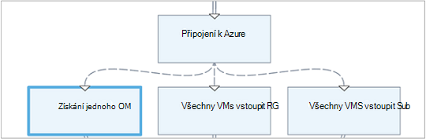 
Existují tři různé sekvence odkazy, které ověřujete hodnoty poskytnutých na dvě vstupní parametry postupu runbook představující OM název a název pole Skupina zdroje pro určení, který je odpovídající akce - spustit jednu OM, začněte všechny VMs ve skupině prostředek nebo všechny VMs v předplatné.  Pořadí propojení mezi připojit k Azure a získat jednoho OM tady je logickou podmínky:

    <# 
    Both VMName and ResourceGroupName runbook input parameters have values 
    #>
    (
    (($VMName -ne $null) -and ($VMName.Length -gt 0))
    ) -and (
    (($ResourceGroupName -ne $null) -and ($ResourceGroupName.Length -gt 0))
    )

Při použití podmíněné odkaz k dispozici zdroje aktivitu na jiné činnosti v takové pobočky data filtrovaná podle podmínku.  Zdroj, který má více vazeb mezi při aktivitu data k dispozici pro aktivity v jednotlivých větví závisí na podmínku v poli odkaz připojení k této větev.

Například, **Úvodní AzureRmVm** aktivity v následujícím postupu runbook spustí všechny virtuálních počítačích.  Má dva podmíněné odkazy.  První podmíněné odkaz využívá výraz *$ActivityOutput ["Start-AzureRmVM"]. IsSuccessStatusCode - eq $true* filtrovat Pokud aktivitu Start AzureRmVm byla úspěšně dokončena.  Druhý používá výraz *$ActivityOutput ["Start-AzureRmVM"]. IsSuccessStatusCode - ne $true* filtrovat Pokud AzureRmVm zahájení činnosti se nepodařilo spustit virtuální počítač.  

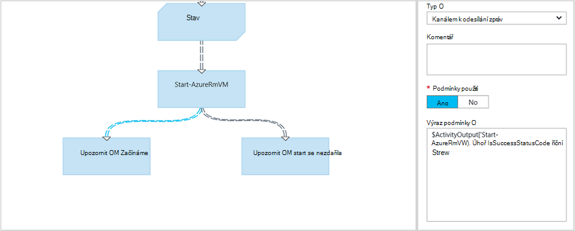

Činnosti, které BPMN první odkaz používá aktivity výstup Get-AzureVM pošle jenom virtuálních počítačích spuštěné v době, že byl spuštěn Get-AzureVM.  Činnosti, které sleduje druhý odkaz pošle jenom virtuálních počítačích, které byly zastavit v době, že byl spuštěn Get-AzureVM.  Činnosti třetí odkaz se zobrazí všechny virtuálních počítačích bez ohledu na jejich spuštěna.

### Spojení

Spojení je speciální činnost, které se bude čekat, dokud všechny příchozí větve dokončili.  To umožňuje spuštění více aktivit paralelně a ujistěte se, že všechny dokončili teprve pak přejděte na.

I když spojení může mít neomezený počet příchozí odkazy, více než jeden z těchto odkazů může být kanálů.  Počet příchozí odkazy posloupnosti není omezena.  Bylo možné vytvořit spojení s více příchozí odkazy kanálem k odesílání zpráv a jejich ukládání postupu runbook, ale se nezdaří, pokud po spuštění.

Na následujícím obrázku je součást postupu runbook začínajícím sadu virtuálních počítačích při souběžné stahování opravy u těchto počítačů.  Spojení se používá zajistit, že obou procesů dokončeny před pokračuje postupu runbook.

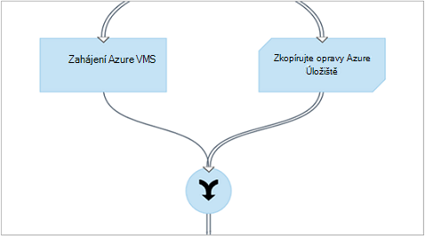

### Cykly

Cyklus při propojení aktivity cíl zpět na svou činnost zdroj nebo jinou činnost, která postupně odkazy zpátky ke zdroji.  Cyklů se aktuálně nepovoluje v grafické vytváření.  Pokud je vaše postupu runbook cyklu, uloží správně, ale dojde k chybě při spuštění.

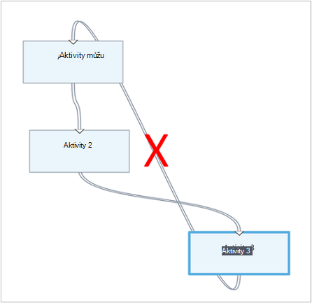

### Sdílení dat mezi aktivity

Všechna data, která je výstup aktivity s odkazem pro odchozí zapisuje *databus* pro postupu runbook.  Žádné aktivity v postupu runbook umožňuje dat v databus naplnění hodnoty parametrů nebo chcete přidat do kódu skriptu.  Aktivity zpřístupníte výstup předchozí aktivity v pracovním postupu.     

Jak data je aby došlo k zápisu databus závisí na typu odkazu na aktivitu.  Data **kanálem k odesílání zpráv**je výstup jako násobky objekty.  **Pořadí** propojení data jsou výstup jako maticový.  Pokud existuje pouze jednu hodnotu, bude výstupní jako jeden prvek matici.

Přístup k datům na databus pomocí jedné ze dvou způsobů.  Nejdřív používá zdroj dat **Výstupu aktivity** k naplnění parametru jiné činnosti.  Je-li výstup objektu, můžete použít jednu vlastnost.

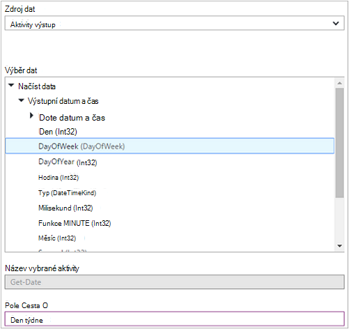

Můžete také zadat výstup aktivitu ve zdroji dat **Výraz prostředí PowerShell** nebo z aktivitu **Skript pracovního postupu** s ActivityOutput proměnné.  Je-li výstup objektu, můžete použít jednu vlastnost.  Proměnné ActivityOutput pomocí následující syntaxe.

    $ActivityOutput['Activity Label']
    $ActivityOutput['Activity Label'].PropertyName 

### Kontrolních bodů

[Kontroly](automation-powershell-workflow.md#checkpoints) v postupu runbook grafické prostředí PowerShell pracovního postupu můžete nastavit tak, že vyberete *postupu runbook kontroly* na všechny aktivity.  To způsobí, že kontrolní bod nastavení po spuštění aktivity.

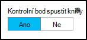

Kontroly pouze spuštěných ve runbooks grafické prostředí PowerShell pracovního postupu, není k dispozici v grafické runbooks.  Pokud postupu runbook používá Azure rutin, řiďte se kontrolní aktivity s přidat-AzureRMAccount v případě postupu runbook je pozastavené a restartování z této kontroly v různých pracovních. 

## Ověřování Azure zdroje

Runbooks v Azure automatizaci, kteří spravují Azure zdroje vyžaduje ověření Azure.  Nové funkce [Spustit jako účet](automation-sec-configure-azure-runas-account.md) (označuje také jako služby základní) je výchozí metoda k přístupu k prostředkům Azure správce ve vašem předplatném s runbooks automatizaci.  Tato funkce můžete přidat do grafické postupu runbook přidáním **AzureRunAsConnection** materiálů připojení, který používá rutinách Powershellu [Get-AutomationConnection](https://technet.microsoft.com/library/dn919922%28v=sc.16%29.aspx) a [Přidat AzureRmAccount](https://msdn.microsoft.com/library/mt619267.aspx) rutina na plátno. To je ukázáno v následujícím příkladu. 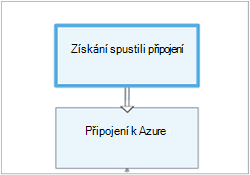 
Aktivita získat spustit jako připojení (tedy Get-AutomationConnection), je nakonfigurovaný se zdrojem dat konstanta s názvem AzureRunAsConnection. 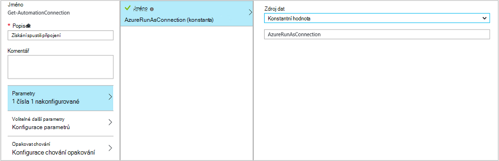 
Další aktivity přidat-AzureRmAccount přidá ověřené spustit jako účet pro použití v postupu runbook. 
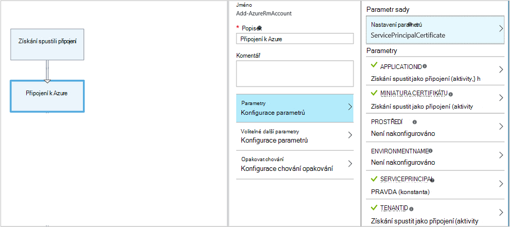 
Použití parametrů **APPLICATIONID** **Miniatura certifikátu**a **TENANTID** musíte zadat název vlastnosti pole cestu, protože aktivity výstupy objekt s více vlastností.  V opačném případě po spuštění postupu runbook selže pokusu o ověření identity.  Toto je, co je potřeba minimálně ověření vaší postupu runbook s účtem spustit jako.

Abyste zachovali zpětné kompatibility pro účastníky, kteří vytvořili automatizaci účet pomocí [účet Azure AD](automation-sec-configure-aduser-account.md) pro správu služby Azure Management (ASM) nebo správce prostředků Azure zdrojů, je metodu ověření rutinu AzureAccount přidat pomocí [přihlašovacích údajů materiálů](http://msdn.microsoft.com/library/dn940015.aspx) , které představuje uživatele služby Active Directory s přístupem k účet Azure.

Tato funkce můžete přiřadit grafické postupu runbook přidáním pověření materiálů na plátno a za ním uveďte aktivitu AzureAccount přidat.  Přidání AzureAccount používá aktivity přihlašovacích údajů o jeho zadání kritérií.  To je ukázáno v následujícím příkladu.

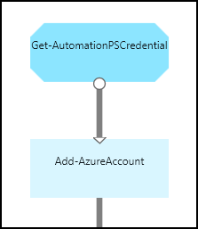

Je potřeba ověřit na začátku postupu runbook a po jednotlivých kontrolní bod.  To znamená, že přidání aktivity sčítání přidat AzureAccount po činnosti pracovního postupu kontrolní bod. Vzhledem k tomu můžete použít stejnou nepotřebujete aktivitu sčítání přihlašovacích údajů 

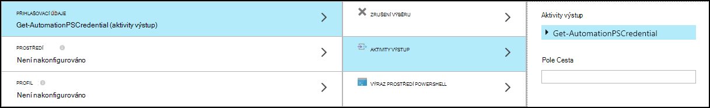

## Postupu Runbook vstupní a výstupní

### Vstupní postupu Runbook

Pokud aktuální oddíl se použije jako nadpis na podřízené úrovni, může vyžadovat postupu runbook vstupní od uživatele, kdy budou začínat postupu runbook portálu Azure nebo z jiného postupu runbook.
Pokud máte postupu runbook, který vytvoří virtuální počítač, budete muset zadat informace jako je název virtuálního počítače a jiných vlastností pokaždé, když začnete postupu runbook.  

Přijetím pozvání vstup pro postupu runbook definování jednu nebo více vstupních parametrů.  Můžete zadat hodnoty pro tyto parametry pokaždé, když se spustí postupu runbook.  Při spuštění postupu runbook pomocí portálu Azure zobrazí výzvu k zadání hodnoty pro každý vstupních parametrů postupu runbook.

Vstupní parametry postupu runbook můžete přejít kliknutím na tlačítko **vstupní a výstupní** na panelu nástrojů postupu runbook.  

 

Otevře se **vstupní a výstupní** ovládací prvek kde můžete upravit existující vstupní parametry nebo vytvořte nový účet kliknutím na **Přidat vstupní**. 

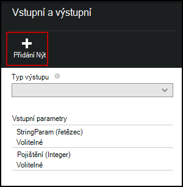

Každý vstupní parametry je definován vlastností v následující tabulce.

|Vlastnost|Popis|
|:---|:---|
| Jméno | Jedinečný název parametru.  Může obsahovat pouze alfa číslic a nesmí obsahovat mezeru. |
| Popis | Volitelný popis na vstupní parametry.  |
| Typ | Datový typ očekávaná hodnota parametru.  Portál Azure poskytnou příslušného ovládacího prvku pro datový typ pro každý parametr při zobrazení výzvy k zadání vstupních hodnot. |
| Povinné | Určuje, zda je třeba zadat hodnotu parametru.  Postupu runbook nelze zahájit, pokud nezadáte hodnoty pro každý povinné parametr, který nemá definována výchozí hodnota. |
| Výchozí hodnota | Určuje, jaké hodnoty je použitá pro parametr, pokud jeden není k dispozici.  To může být buď Null nebo určité hodnoty. |

### Výstup postupu Runbook

Vytvořil činnosti, které nemá odchozí propojení dat se přidá do [výstupu postupu runbook](http://msdn.microsoft.com/library/azure/dn879148.aspx).  Výstup se uloží pomocí postupu runbook úlohy a neexistuje nadřazený postupu runbook při postupu runbook slouží jako nadpis na podřízené úrovni.  

## Prostředí PowerShell výrazů

Jednou z výhod grafické vytváření nabízí možnost vytvořit postupu runbook s minimálními znalost Powershellu.  V současné době musíte znát přenosová prostředí PowerShell kdyby naplňovat určité [hodnoty parametrů](#activities) a odstranění nastavení [odkaz podmínky](#links-and-workflow).  V této části naleznete stručný úvod k výrazům Powershellu pro tyto uživatele, kteří se seznámíte s ním.  Podrobnosti o prostředí PowerShell jsou k dispozici [skriptování ve Windows Powershellu](http://technet.microsoft.com/library/bb978526.aspx). 

### Zdroj dat výraz prostředí PowerShell

Výraz prostředí PowerShell jako zdroj dat slouží k naplnění hodnota [parametru aktivity](#activities) s výsledky výrazu některé prostředí PowerShell kód.  Může to být jeden řádek kód, který provádí pár jednoduchých funkce nebo více řádků, které provedení některých komplexní logiky.  Výstup z příkazu, který není přiřazen proměnné je výstup hodnotu parametru. 

Následující příkaz například by výstupu aktuální datum. 

    Get-Date

Následující příkazy vytvořit řetězec od aktuálního data a přiřadit ji někomu proměnné.  Obsah proměnné jsou odeslaný do výstupu 

    $string = "The current date is " + (Get-Date)
    $string

Následující příkazy vyhodnocení aktuální datum a vrátí řetězec určující, zda dnešního dne je považováno za víkendové nebo dne v týdnu. 

    $date = Get-Date
    if (($date.DayOfWeek = "Saturday") -or ($date.DayOfWeek = "Sunday")) { "Weekend" }
    else { "Weekday" }
    
 
### Aktivity výstup

Výstup z předchozí aktivity v postupu runbook použijete proměnnou $ActivityOutput pomocí následující syntaxe.

    $ActivityOutput['Activity Label'].PropertyName

Například, bude pravděpodobně aktivitě s vlastnost, která vyžaduje název počítače virtuální v takovém případě můžete použít následující výraz.

    $ActivityOutput['Get-AzureVm'].Name

Pokud vlastnost, která vyžaduje virtuální počítač objektu místo jenom vlastnosti, budou vráceny celý objekt pomocí následující syntaxe.

    $ActivityOutput['Get-AzureVm']

Můžete taky výstup aktivitu ve výrazu složitější například následující odkazy, které zřetězí text s názvem virtuálního počítače.

    "The computer name is " + $ActivityOutput['Get-AzureVm'].Name

### Podmínky

[Relační operátory](https://technet.microsoft.com/library/hh847759.aspx) umožňuje porovnání hodnot nebo zjistit, pokud hodnota odpovídá zadanému vzorku.  Porovnání vrátí chybovou hodnotu $true nebo $false.

Například následující podmínky určuje, zda je virtuální počítač z aktivity s názvem *Get-AzureVM* aktuálně *Zastaveno*. 

    $ActivityOutput["Get-AzureVM"].PowerState –eq "Stopped"

Následující podmínky zkontroluje, jestli je stejném počítači virtuální ve všech stavu než *Zastaveno*.

    $ActivityOutput["Get-AzureVM"].PowerState –ne "Stopped"

Připojit se ke více podmínek použitím [logickým operátorem](https://technet.microsoft.com/library/hh847789.aspx) jako **- a** nebo **- nebo**.  Například následující podmínky zkontroluje, jestli je stejném počítači virtuální v předchozím příkladu ve stavu *přerušili* nebo *ukončení*.

    ($ActivityOutput["Get-AzureVM"].PowerState –eq "Stopped") -or ($ActivityOutput["Get-AzureVM"].PowerState –eq "Stopping") 

### Tabulky hash

[Tabulky hash](http://technet.microsoft.com/library/hh847780.aspx) jsou název/dvojice, které jsou vhodné k vrácení množině hodnot.  Vlastnosti pro určité činnosti očekávat hashtable místo jednoduché hodnoty.  Taky možná uvidíte jako hashtable označovaný taky jako do slovníku. 

Vytvoření hashtable pomocí následující syntaxe.  Hashtable může obsahovat libovolný počet položek, ale každý je definován název-hodnota.

    @{ <name> = <value>; [<name> = <value> ] ...}

Například následující výraz vytvoří hashtable se nemusí používat v zdroje dat pro parametr aktivity, který by měly hashtable s hodnotami vyhledávány internet.

    $query = "Azure Automation"
    $count = 10
    $h = @{'q'=$query; 'lr'='lang_ja';  'count'=$Count}
    $h

Výstup z aktivity s názvem *Získat Twitter připojení* k naplnění hashtable v následujícím příkladu.

    @{'ApiKey'=$ActivityOutput['Get Twitter Connection'].ConsumerAPIKey;
      'ApiSecret'=$ActivityOutput['Get Twitter Connection'].ConsumerAPISecret;
      'AccessToken'=$ActivityOutput['Get Twitter Connection'].AccessToken;
      'AccessTokenSecret'=$ActivityOutput['Get Twitter Connection'].AccessTokenSecret}

## Další kroky

- Začínáme s runbooks prostředí PowerShell pracovního postupu, najdete v článku [svůj první postupu runbook prostředí PowerShell pracovního postupu](automation-first-runbook-textual.md) 
- Začínáme s grafickým runbooks, najdete v tématu [Můj první grafické postupu runbook](automation-first-runbook-graphical.md)
- Další informace o postupu runbook typů a jejich výhody omezení, najdete v tématu [typy postupu runbook automatizaci Azure](automation-runbook-types.md)
- Jak ověření pomocí účtu automatizaci spustit jako, najdete v tématu [Konfigurace Azure jako účet spustit](automation-sec-configure-azure-runas-account.md)
 
