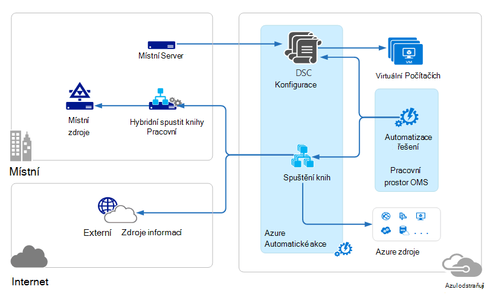
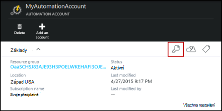
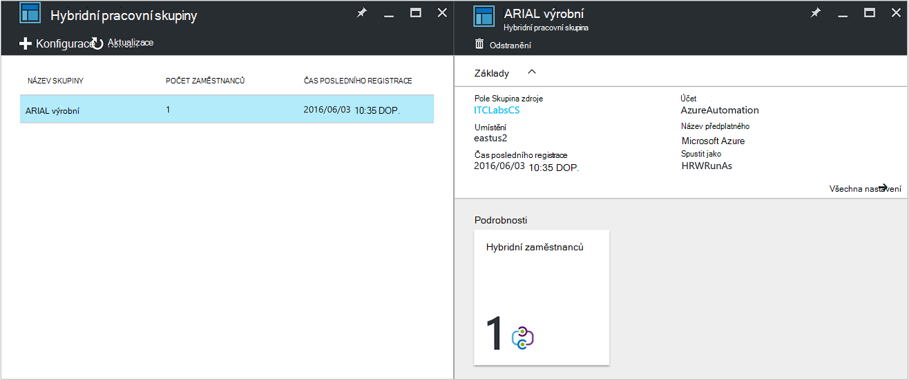
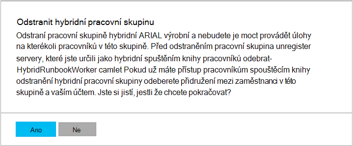

<properties
   pageTitle="Azure automatizaci hybridní postupu Runbook pracovníků | Microsoft Azure"
   description="Tento článek obsahuje informace o instalaci a použití pracovního postupu Runbook hybridní, což je funkce automatizaci Azure, která vám umožní pracovat runbooks na počítačích v Centru pro místní data."
   services="automation"
   documentationCenter=""
   authors="mgoedtel"
   manager="jwhit"
   editor="tysonn" />
<tags
   ms.service="automation"
   ms.devlang="na"
   ms.topic="article"
   ms.tgt_pltfrm="na"
   ms.workload="infrastructure-services"
   ms.date="10/14/2016"
   ms.author="bwren" />

# Azure automatizaci hybridní postupu Runbook zaměstnanců

Runbooks v Azure automatizaci přístup k prostředkům ve vašem Centru místních dat od spuštění v Azure cloudu.  Funkce pracovního postupu Runbook hybridní Azure automatizace umožňuje spustit runbooks ve počítače najdete v datovém centru pro správu místních zdrojů. Runbooks jsou uložené spravovaný v Azure automatizace a potom Doručená do jednoho nebo více místního počítače.  

Tato funkce je znázorněno na následujícím obrázku.   

Určit jeden nebo víc počítačů v datovém centru představovat pracovního postupu Runbook hybridní a spuštění runbooks z Azure automatizaci.  Každého zaměstnance vyžaduje Microsoft Agent správy s připojením k Microsoft operace správy Suite a prostředí Azure automatizaci postupu runbook.  Operace správy sadu se používá pouze k instalaci a udržovat agenta Správa a sledování funkci pracovníka.  Doručení runbooks a pokyny ke spuštění je provádí automatické Azure.

Neexistují žádné brány firewall pro příchozí požadavky na hybridní postupu Runbook pracovníky podpory. Agent v místním počítači zahájí všechny komunikaci s Azure automatizaci v cloudu. Po spuštění postupu runbook Azure automatizaci vytvoří instrukce, která se načte agentem. Agent použije pak dolů postupu runbook a všechny parametry před spuštěním.  Načte také všechny [majetku](http://msdn.microsoft.com/library/dn939988.aspx) používaném postupu runbook z Azure automatizaci.

>[AZURE.NOTE] Hybridní postupu Runbook pracovníků aktuálně nepodporují [DSC konfigurace](automation-dsc-overview.md).

## Hybridní pracovního postupu Runbook skupiny

Každý pracovního postupu Runbook hybridní je členem pracovního postupu Runbook hybridní skupiny, kterou zadáte při instalaci agent.  Skupiny můžete zahrnout jeden agent, ale můžete nainstalovat více agentů ve skupině vysoké dostupnosti.

Při spuštění postupu runbook na pracovního postupu Runbook hybridní určete skupinu, která poběží na.  Členové skupiny určí, které pracovníka bude služby žádost.  Nelze zadat konkrétní pracovní.

## Hybridní pracovního postupu Runbook požadavky

Je třeba určit minimálně jeden místním počítači spusťte hybridní postupu runbook úlohy.  Tento počítač musí mít takto:

- Windows Server 2012 nebo novějším
- Prostředí Windows PowerShell 4.0 nebo novější
- Minimálně dva jádra a 4 GB paměti RAM

Zvažte následující doporučení pro hybridní zaměstnanci: 

- Označte víc pracovníků hybridní v každé skupiny vysoké dostupnosti.  
- Hybridní zaměstnanců může existovat společně s služby správy automatizaci nebo System Center Orchestrator postupu runbook serverů.
- Zvažte použití počítače fyzicky umístěného v obrázek nebo poblíž oblasti vašeho účtu automatizaci od dat úlohy odesílány Azure automatické dokončení projektu.

>[AZURE.NOTE] Hybridní pracovního postupu Runbook verze 7.2.11136.0 momentálně podporují komunikaci prostřednictvím proxy server pouze pomocí skriptů Powershellu.  Podpora skriptů Powershellu pracovní postup bude k dispozici v budoucí verzi.  

### Konfigurace nastavení proxy serveru a brány firewall

Pro místní pracovního postupu Runbook hybridní a připojení k registraci ke službě Microsoft operace správy sady (OMS) musí mít přístup k číslo portu a adresy URL píše níže.  Toto je kromě [porty a protokoly adres URL potřebných pro Microsoft Agent sledování](../log-analytics/log-analytics-proxy-firewall.md#configure-proxy-and-firewall-settings-with-the-microsoft-monitoring-agent) se připojit k OMS. Pokud používáte proxy server pro komunikaci mezi agent a služba OMS, musíte zajistit, aby byly přístupné vhodné prostředky. Pokud používáte bránu firewall omezit přístup k Internetu, budete muset konfigurace brány firewall pro povolení přístupu. 

Následující seznam port a adresy URL, které jsou potřeba pro hybridní pracovního postupu Runbook komunikovat s automatizaci informace.

- Port: Pouze TCP 443 je nutný pro odchozí přístup k Internetu
- Globální adresa URL: *.azure-automation.net

Pokud máte účet automatizaci definované pro konkrétní oblast a chcete omezit komunikace s regionálního datacentra, následující tabulka obsahuje záznam DNS pro každou oblast.

|**Oblast**|**Záznam DNS**|
|--------------|--------------|
|Jižní centrální USA|scus-jobruntimedata výrobní su1.azure-automation.net|
|Východní USA 2|eus2-jobruntimedata výrobní su1.azure-automation.net|
|Západní Evropě|Společnost Microsoft jobruntimedata výrobní su1.azure-automation.net|
|Severní Evropě|Ne-jobruntimedata výrobní su1.azure-automation.net|
|Centrální Kanada|kopie jobruntimedata výrobní su1.azure-automation.net|
|Jihovýchodní Asie|moři – jobruntimedata výrobní su1.azure-automation.net|
|Centrální Indie|CID-jobruntimedata výrobní su1.azure-automation.net|
|Japonsko východ|JPE-jobruntimedata výrobní su1.azure-automation.net|
|Austrálie jihovýchodní|pomocného mechanismu řízení jobruntimedata výrobní su1.azure-automation.net|

## Instalace pracovního postupu Runbook hybridní

Následující postup popisuje, jak nainstalovat a nakonfigurovat hybridní pracovního postupu Runbook.  Umožňuje provádět prvních dvou kroků jednou prostředí automatizaci a zopakujete zbývající kroky pro každý počítač kolegy.

### 1. vytvořit pracovní prostor operace správy Suite

Pokud už nemáte pracovního prostoru operace správy sadu, vytvořte ho pomocí pokynů v [Nastavení pracovního prostoru](https://technet.microsoft.com/library/mt484119.aspx). Pokud ještě nemáte, můžete použít existující pracovního prostoru.

### 2. přidáte řešení automatizaci do pracovního prostoru operace správy Suite

Řešení přidat funkce operace správy sadě.  Automatizace řešení přidá funkci pro automatizaci Azure včetně podpory pro hybridní pracovního postupu Runbook.  Když přidáte řešení do pracovního prostoru, ji bude automaticky nabízená dolů součásti pracovního agent počítač, který chcete nainstalovat v dalším kroku.

Postupujte podle pokynů na [Přidat řešení pomocí Galerie řešení](../log-analytics/log-analytics-add-solutions.md) přidáte řešení **automatizaci** do pracovního prostoru operace správy sadu.

### 3. Nainstalujte Microsoft monitorování Agent

Microsoft Agent sledování připojí počítačů operace správy sadě.  Po instalaci agent na místním počítači a připojte ho do pracovního prostoru, bude automaticky stáhnout součásti potřebné pro hybridní pracovního postupu Runbook.

Postupujte podle pokynů v [počítačích Windows připojení k protokolu analýzy](../log-analytics/log-analytics-windows-agents.md) nainstalovat agent na místním počítači.  Můžete opakujte tento postup pro více počítačů přidat více pracovníků prostředí.

Když agent připojil úspěšně operace správy sadě, nebude uvedená na kartě **Připojení zdroje** podokna operace správy sadu **Nastavení** .  Můžete ověřit, že agent má správně stáhli řešení automatizaci po složky s názvem **AzureAutomationFiles** v C:\Program Files\Microsoft sledování Agent\Agent.  Abyste si ověřili verzi pracovního postupu Runbook hybridní, můžete přejít na C:\Program Files\Microsoft sledování Agent\Agent\AzureAutomation\ a poznamenejte si \\ *verze* podsložce.   

### 4. Nainstalujte prostředí postupu runbook a připojte k automatizaci Azure

Při přidání agenta operace správy sadě řešení automatizaci Posune dolů modulu **HybridRegistration** prostředí PowerShell, který obsahuje rutinu **HybridRunbookWorker přidat** .  Tahle rutina slouží nainstalovat prostředí postupu runbook v počítači a zaregistrovat s Azure automatizaci.

Otevřete relaci Powershellu v režimu správce a následující příkazy k importu modulu.

    cd "C:\Program Files\Microsoft Monitoring Agent\Agent\AzureAutomation\<version>\HybridRegistration"
    Import-Module HybridRegistration.psd1

Spusťte rutinu **HybridRunbookWorker přidat** pomocí následující syntaxe:

    Add-HybridRunbookWorker –Name <String> -EndPoint <Url> -Token <String>

Můžete získat informace potřebné pro tuto rutinu z zásuvné **Správa klíčů** Azure portálu.  Otevřete tento zásuvné kliknutím na ikonu klíče na panelu prvky pro automatizaci účtu.

- **Název** je název skupiny pracovního postupu Runbook hybridní. Pokud v účtu automatizaci již existuje tuto skupinu, do něj přidali aktuální počítač.  Pokud už neexistuje, pak je vrstva přidána.
- **Koncový bod** je do pole **Adresa URL** v zásuvné **Správa klíčů** .
- **Token** je **Primární klíč přístup** v zásuvné **Správa klíčů** .  

Použití **-podrobného** přepnutí **Přidat HybridRunbookWorker** chodily podrobné informace o instalaci.

### 5. nainstalovat moduly prostředí PowerShell

Runbooks můžete použít libovolný aktivity a rutinách podle modulů nainstalovaných v prostředí Azure automatizaci.  Moduly nejsou nasazeny automaticky místního počítače přes, tak je třeba nainstalovat ručně.  Výjimky je modul Azure, která je ve výchozím nastavení povolení přístupu rutiny pro všechny služby Azure a aktivity pro automatizaci Azure nainstalovaný.

Protože hlavním účelem funkce pracovního postupu Runbook hybridní je Správa místních zdrojů, bude nejspíš muset nainstalovat moduly, které podporují tyto materiály.  K [Instalaci moduly](http://msdn.microsoft.com/library/dd878350.aspx) naleznete další informace o instalaci moduly prostředí Windows PowerShell.

## Odebrání pracovního postupu Runbook hybridní

Odebrání jednoho nebo více pracovníků postupu Runbook hybridní ze skupiny nebo odebrat skupinu, v závislosti na vašim požadavkům.  Odebrání pracovního postupu Runbook hybridní z místního počítače, otevřete relaci Powershellu v režimu správce a spusťte tento příkaz – rutiny **HybridRunbookWorker odebrat** .  Použití **-podrobného** změňte pro podrobný protokol odebrání. 

To Microsoft Agent sledování neodstraní z počítače, funkce a konfiguraci hybridního pracovního postupu Runbook role.  

Odebrání skupiny, musíte nejdřív odebrat ze všech počítačů, který je členem skupiny pomocí příkazu uvedené výše pracovního postupu Runbook hybridní a proveďte následující kroky a odebrat skupinu.  

1. Na portálu Azure si potřebujete založit účet automatizaci.
2. Vyberte dlaždici **Hybridní pracovní skupiny** a v zásuvné **Hybridní pracovní skupiny** vyberte skupinu, kterou chcete odstranit.  Po výběru určité skupiny, zobrazí se vlastnosti zásuvné **hybridní pracovní skupina** .     
3. Na zásuvné vlastností pro vybranou skupinu klikněte na **Odstranit**.  Zprávy se zobrazí s žádostí o potvrzení tato akce a vyberte **Ano** , pokud jste si jistí, jestli že chcete pokračovat.    To může trvat několik sekund a vy můžete sledovat jeho průběh v části **oznámení** z nabídky.  

## Počáteční runbooks na pracovního postupu Runbook hybridní

[Spuštění postupu Runbook v Azure automatizaci](automation-starting-a-runbook.md) popisuje různé metody pro spuštění postupu runbook.  Pracovního postupu Runbook hybridní přidá možnost **RunOn** umístění na název skupiny pracovního postupu Runbook hybridní.  Pokud je zadána skupina je postupu runbook načtena a spusťte tak, že pracovníků v dané skupině.  Pokud tato možnost není zadán, pak spuštění v Azure automatizaci jako normálně.

Při spuštění postupu runbook Azure portálu zobrazí s možností **spuštění** místo, kam můžete vybrat **Azure** nebo **Pracovníka hybridní**.  Pokud vyberete **Hybridní pracovníka**, můžete v rozevíracím seznamu vyberte skupinu.

Použijte parametr **RunOn** následujícího příkazu můžete začít postupu runbook s názvem Test-postupu Runbook ve skupině pracovního postupu Runbook hybridní s názvem MyHybridGroup pomocí Windows Powershellu.

    Start-AzureRmAutomationRunbook –AutomationAccountName "MyAutomationAccount" –Name "Test-Runbook" -RunOn "MyHybridGroup"

>[AZURE.NOTE] Parametr **RunOn** jsme přidali rutinu **Start AzureAutomationRunbook** v 0.9.1 verzi Microsoft Azure Powershellu.  Pokud máte starší jednu nainstalovaný byste měli [Stáhnout nejnovější verzi](https://azure.microsoft.com/downloads/) .  Potřebujete jenom nainstalovat tuto verzi na workstation kde zahájíte budete postupu runbook z prostředí Windows PowerShell.  Není potřeba ji nainstalovat na počítač kolegy, pokud chcete začít runbooks z tohoto počítače.  Nemůžete spustit aktuálně postupu runbook na pracovního postupu Runbook hybridní z jiného postupu runbook od musel nejnovější verzi Azure Powershell ve vašem účtu automatizaci je třeba nainstalovat.  Nejnovější verze bude automaticky aktualizován v Azure automatizaci a automaticky odeslány zaměstnanců brzy bude k dispozici.

## Postupu Runbook oprávnění

Runbooks spuštěna pracovního postupu Runbook hybridní nelze použít stejné [metodu, která se obvykle používá pro runbooks ověřování Azure zdroje](automation-configuring.md#configuring-authentication-to-azure-resources) , od jejich otevření zdroje mimo Azure.  Postupu runbook můžete zadat buď vlastní ověřování pro místní zdroje, nebo můžete zadat RunAs účet poskytnout kontext uživatele pro všechny runbooks.

### Postupu Runbook ověřování

Ve výchozím nastavení runbooks spustí v rámci místní systémový účet na místním počítači, takže musíte zadat vlastní ověřování prostředky, které bude přistupovat.  

[Přihlašovací údaje](http://msdn.microsoft.com/library/dn940015.aspx) a [certifikát](http://msdn.microsoft.com/library/dn940013.aspx) prostředky můžete použít ve vaší postupu runbook pomocí rutin, pomocí kterých můžete zadat přihlašovací údaje, může ověřovat na jiné zdroje.  Následující příklad zobrazuje část postupu runbook restartováním počítače.  Načte přihlašovacích údajů z majetku přihlašovacích údajů a název počítače z proměnné majetku a používá tyto hodnoty s rutinu restartovat počítač.

    $Cred = Get-AzureRmAutomationCredential -ResourceGroupName "ResourceGroup01" -Name "MyCredential"
    $Computer = Get-AzureRmAutomationVariable -ResourceGroupName "ResourceGroup01" -Name  "ComputerName"

    Restart-Computer -ComputerName $Computer -Credential $Cred

Můžete taky využít [InlineScript](automation-powershell-workflow.md#inline-script) , které vám umožní spustit bloky kódu na jiném počítači pomocí přihlašovacích údajů nastavil [PSCredential běžné parametr](http://technet.microsoft.com/library/jj129719.aspx).

### RunAs účtu

Takže není nutné runbooks vlastní ověřování pro místní zdroje, můžete zadat **RunAs** účet pro hybridní pracovní skupiny.  Zadejte [přihlašovací údaje majetku](automation-credentials.md) s přístupem k místním zdrojům a všechny runbooks poběží pod těchto přihlašovacích údajů při spuštění pracovního postupu Runbook hybridní ve skupině.  

Uživatelské jméno pro přihlašovací údaje musí být v některém z následujících formátů:

- doména\uživatelské jméno 
- username@domain
- uživatelské jméno (u účtů místní na místním počítači)

Pomocí následujícího postupu můžete určit RunAs účtu pro skupinu pracovníka hybridní:

1. Vytvořte [přihlašovacích údajů majetku](automation-credentials.md) s přístupem k místních zdrojů.
2. Na portálu Azure si potřebujete založit účet automatizaci.
2. Vyberte dlaždici **Hybridní pracovní skupiny** a pak vyberte požadovanou skupinu.
3. Vyberte **všechna nastavení** a pak **Nastavení hybridního pracovní skupiny**.
4. Přejděte **spustili** z **výchozí** **vlastní**.
5. Vyberte pověření a klikněte na **Uložit**.

## Vytváření runbooks pracovního postupu Runbook hybridní

Není žádný rozdíl ve struktuře runbooks spuštěné v Azure automatizace a můžou být spuštěné v operačním systému pracovního postupu Runbook hybridní. Runbooks využívající s každým bude pravděpodobně se liší významně přes od runbooks pracovního postupu Runbook hybridní obvykle bude spravovat místních zdrojů v datovém centru, zatímco runbooks v Azure automatizaci obvykle přidávání a používání zdrojů v Azure cloudu. 

Můžete upravovat postupu runbook pracovního postupu Runbook hybridní v Azure automatizaci, ale můžete mít potíže, pokud se pokusíte testování postupu runbook v editoru.  Prostředí PowerShell moduly, které přístup ke místních zdrojů se nenainstaluje ve vašem prostředí Azure automatizaci v takovém případě test selže.  Pokud instalovat požadovaných modulů kontroly, spusťte postupu runbook, ale nebude mít přístup k místních zdrojů pro dokončení testu.

## Poradce při potížích s runbooks na pracovního postupu Runbook hybridní

[Výstup postupu Runbook a zprávy](automation-runbook-output-and-messages.md) se odesílají Azure automatizace z hybridní pracovníků stejně jako postupu runbook úloh spustit v cloudu.  Můžete taky povolit datových proudů podrobné a průběhu stejným způsobem jako u ostatních runbooks.  

Protokoly jsou uložená místně na každého zaměstnance hybridní na C:\ProgramData\Microsoft\System Center\Orchestrator\7.2\SMA\Sandboxes.

Pokud vaše runbooks completeing úspěšně a souhrnné úkoly se zobrazí stav **Suspended**, zkontrolujte článek Poradce při potížích [pracovního postupu Runbook hybridní: úlohy postupu runbook ukončí se stavem Suspended](automation-troubleshooting-hrw-runbook-terminates-suspended.md).   

## Vztah k automatizaci Správa služby

[Služba Správa automatizaci (SMA)](https://technet.microsoft.com/library/dn469260.aspx) umožňuje spuštění stejného runbooks, která podporuje automatizaci Azure v Centru pro místní data. SMA obecně nasazení společně s Windows Azure Pack Windows Azure Pack obsahuje grafického rozhraní pro správu SMA. Na rozdíl od Azure automatizaci vyžaduje SMA místní instalace, která zahrnuje webových serverů hostovat rozhraní API databáze má být runbooks a konfigurace SMA a postupu Runbook zaměstnanců a spusťte úloh postupu runbook. Azure automatizace poskytuje tyto služby v cloudu a vyžaduje pouze Udržovat pracovníky postupu Runbook hybridní v místním prostředí.

Pokud jsou stávajícímu uživateli SMA můžete přesunout vaše runbooks Azure automatizace spolu se pomocí pracovního postupu Runbook hybridní žádné změny, za předpokladu, že budou ověřování vlastní k prostředkům jako popsáno v tématu [Vytvoření runbooks pracovního postupu Runbook hybridní](#creating-runbooks-for-hybrid-runbook-worker).  Runbooks v SMA v kontextu účet služby se spouštějí na serveru pracovního, které můžete obdržet že ověřování pro runbooks.

Následující kritéria vám pomohou zjistit, zda automatizaci Azure pomocí pracovního postupu Runbook hybridní nebo služby správy automatizaci odpovídá více vašim požadavkům.

- SMA vyžaduje místních instalačních komponent připojených k Windows Azure Pack Pokud požaduje rozhraní grafické správy. Další místních zdrojů bude potřeba s vyšší náklady na údržbu než automatizaci Azure, který potřebuje pouze agent nainstalovaných zaměstnanců místní postupu runbook. Zástupci spravuje operace Management Suite další zmenšení své náklady na údržbu.
- Azure automatizaci ukládá jeho runbooks v cloudu a poskytuje pracovníkům místní hybridní postupu Runbook. Pokud svoje zásady zabezpečení neumožňuje toto chování, byste měli použít SMA.
- SMA je součástí System Center; a tedy vyžaduje licence System Center 2012 R2. Azure automatizaci vychází z modelu vrstvené předplatného.
- Azure automatizaci pokročilými funkce, jako jsou grafické runbooks, které nejsou k dispozici v SMA.

## Další kroky

- Další informace o různých způsobech, které můžete použít ke spuštění postupu runbook najdete v tématu [spuštění postupu Runbook v Azure automatizaci](automation-starting-a-runbook.md)
- Různé postupy pro práci s prostředí PowerShell a pracovních postupů prostředí PowerShell runbooks v Azure automatizaci textového editoru, najdete v tématu [Úprava postupu Runbook v Azure automatizaci](automation-edit-textual-runbook.md)

 
