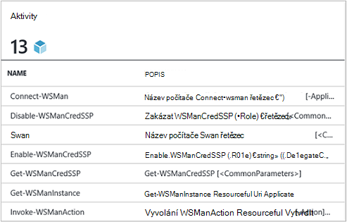
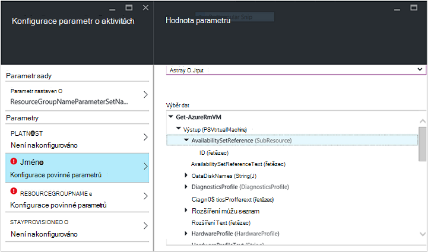
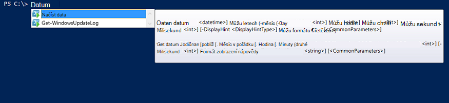

<properties
   pageTitle="Vytvoření modul Azure automatizaci integrace | Microsoft Azure"
   description="Výuková, který vás provede vytváření testování a příklad použití integrační moduly v Azure automatizaci."
   services="automation"
   documentationCenter=""
   authors="mgoedtel"
   manager="jwhit"
   editor="" />

<tags
   ms.service="automation"
   ms.workload="tbd"
   ms.tgt_pltfrm="na"
   ms.devlang="na"
   ms.topic="get-started-article"
   ms.date="09/12/2016"
   ms.author="magoedte" />

# <a name="azure-automation-integration-modules"></a>Moduly integrace Azure automatizaci

Prostředí PowerShell představuje základní technologii za Azure automatizaci. Protože Azure automatizaci založen na Powershellu, Powershellu moduly mají klíčový rozšiřitelnost Azure automatizaci. V tomto článku Nemůžeme vás provede zvláštnosti Azure automatické použití modulů prostředí PowerShell označovány jako "Integrace moduly" a osvědčené postupy pro vytváření modulech prostředí PowerShell a ujistěte se, že fungují jako integrace moduly v Azure automatizaci. 

## <a name="what-is-a-powershell-module"></a>Co je modulu prostředí PowerShell?

Modul Powershellu je skupina rutiny prostředí PowerShell jako **Get-datum** nebo **Kopírovat položku**, kterou budete moct použít z konzoly PowerShell, skripty, pracovní postupy, runbooks a prostředí PowerShell DSC zdrojů, jako jsou WindowsFeature nebo soubor, který lze použít z prostředí PowerShell DSC konfigurace. Všechny funkce prostředí PowerShell vystaven pomocí rutin a DSC zdroje a každý zdroj rutina/DSC zálohy modulem prostředí PowerShell mnoho které dodat pomocí prostředí PowerShell samotné. Například rutinu **Get-data** je součástí modulu Microsoft.PowerShell.Utility PowerShell **Kopírovat položku** rutina je součástí modulu Microsoft.PowerShell.Management PowerShell a balíčku DSC zdroje je součástí modulu PSDesiredStateConfiguration Powershellu. Obě tyto moduly dodávat pomocí prostředí PowerShell. Ale mnoho modulů není dodat jako součást prostředí PowerShell a místo toho rozdělení s produkty první nebo jiných výrobců jako správce konfigurace pro System Center 2012, nebo velká prostředí PowerShell na místech, jako jsou prostředí PowerShell galerie.  Moduly je užitečné, protože udělají složité úkoly jednodušší pomocí funkce formát.  Další informace o [prostředí PowerShell moduly na webu MSDN](https://msdn.microsoft.com/library/dd878324%28v=vs.85%29.aspx). 

## <a name="what-is-an-azure-automation-integration-module"></a>Co je modul Azure automatizaci integrace?

Modul integrace není velmi liší od modulu Powershellu. Jeho jednoduše modul prostředí PowerShell volitelně obsahující jeden další soubor - metadat soubor zadáním typu Azure automatizaci připojení pro použití se rutinách modulu v runbooks. Volitelné souboru nebo Ne, tyto Powershellu moduly lze importovat do Azure automatizaci zpřístupnit jejich rutiny pro použití v rámci runbooks a jejich DSC zdrojů k dispozici pro použití v rámci DSC konfigurace. Na pozadí Azure automatizaci ukládá moduly a na postupu runbook projektu, čas spuštění úlohy compiliation DSC načte je do karanténu Azure automatizaci runbooks zpracují kde kompilovaný DSC konfigurace.  DSC zdroje v moduly taky automaticky umístěny na serveru vyžádané automatizaci DSC tak, aby může být doplněné ve počítače pokusíte použít DSC konfigurace.  Počet Azure PowerShell moduly dodávané mimo pole v Azure automatizaci použít tak, aby mohli rovnou začít automatizace Azure správy hned, ale můžete snadno importovat prostředí PowerShell moduly pro jakéhokoliv systém služby nebo nástroje, které chcete integrovat. 

>[AZURE.NOTE] Některé moduly jsou odeslané jako "globální moduly" ve službě automatizaci. Moduly globální jsou k dispozici mimo pole při vytvoření účtu automatizaci a je někdy aktualizujeme, které automaticky je posune ke svému účtu automatizaci. Pokud nechcete, aby byly automaticky aktualizován, vždy importem stejný modul sami a který přednost globální modul verzi této moduly, které dodávané ve službě. 

Formát, ve které importujete balíčku integrace modul je komprimované soubor se stejným názvem jako modulu a příponou ZIP. Obsahuje modulu Windows PowerShell a všechny podpůrné soubory, včetně seznamu souboru (.psd1), pokud modulu nějaký použitý.

Pokud modulu by měl obsahovat typu připojení Azure automatizaci, musí obsahovat také souboru s názvem *<ModuleName>*-Automation.json, která určuje typ vlastnosti připojení. To je json soubor umístěn ve složce modul souboru mu tuhle zkomprimovanou ZIP a obsahuje pole "připojením", který je potřebný pro připojení k systému nebo služby modulu představuje. To skončily vytváření typu připojení v Azure automatizaci. Pomocí tohoto souboru můžete nastavit názvy polí zadá, a jestli pole by měl být zašifrované a / nebo pro typ připojení modulu nepovinné. Následující obrázek je šablonu ve formátu json:

```
{ 
   "ConnectionFields": [
   {
      "IsEncrypted":  false,
      "IsOptional":  false,
      "Name":  "ComputerName",
      "TypeName":  "System.String"
   },
   {
      "IsEncrypted":  false,
      "IsOptional":  true,
      "Name":  "Username",
      "TypeName":  "System.String"
   },
   {
      "IsEncrypted":  true,
      "IsOptional":  false,
      "Name":  "Password",
   "TypeName":  "System.String"
   }],
   "ConnectionTypeName":  "DataProtectionManager",
   "IntegrationModuleName":  "DataProtectionManager"
}
```

Pokud nasadili automatizace Správa služeb a vytvoření balíčků integrační moduly pro automatizaci runbooks to by měla vypadat povědomý můžete. 


## <a name="authoring-best-practices"></a>Doporučené postupy pro vytváření

Jenom proto, že integrační moduly jsou v podstatě prostředí PowerShell moduly, které neznamená, že nemáme sadu postupy kolem vytváření je. Několik věcí, doporučujeme že zvážit při vytváření modulu prostředí PowerShell usnadnit nejužitečnější v Azure automatizaci stále existuje. Některé z nich jsou Azure automatizaci konkrétní a některé z nich jsou užitečné jenom aby moduly fungují dobře v prostředí PowerShell pracovního postupu bez ohledu na to, jestli používáte automatizaci. 

1. Obsahovat i stručný popis a pomáhají URI pro každý rutinu v modulu. V prostředí PowerShell můžete definovat určitých nápovědu pro rutiny, aby se umožňují uživatelům zobrazit Nápověda k použití s rutinu **Get-Help** . Tady je například jak definovat souhrn a nápovědu můžete URI pro PowerShell modul napsané v souboru .psm1.<br>  

    ```
    <#
        .SYNOPSIS
         Gets all outgoing phone numbers for this Twilio account 
    #>
    function Get-TwilioPhoneNumbers {
    [CmdletBinding(DefaultParameterSetName='SpecifyConnectionFields', `
    HelpUri='http://www.twilio.com/docs/api/rest/outgoing-caller-ids')]
    param(
       [Parameter(ParameterSetName='SpecifyConnectionFields', Mandatory=$true)]
       [ValidateNotNullOrEmpty()]
       [string]
       $AccountSid,

       [Parameter(ParameterSetName='SpecifyConnectionFields', Mandatory=$true)]
       [ValidateNotNullOrEmpty()]
       [string]
       $AuthToken,

       [Parameter(ParameterSetName='UseConnectionObject', Mandatory=$true)]
       [ValidateNotNullOrEmpty()]
       [Hashtable]
       $Connection
    )

    $cred = CreateTwilioCredential -Connection $Connection -AccountSid $AccountSid -AuthToken $AuthToken

    $uri = "$TWILIO_BASE_URL/Accounts/" + $cred.UserName + "/IncomingPhoneNumbers"
    
    $response = Invoke-RestMethod -Method Get -Uri $uri -Credential $cred

    $response.TwilioResponse.IncomingPhoneNumbers.IncomingPhoneNumber
    }
    ```
<br> 
Poskytující tyto informace o neobjeví pouze tento nápovědu k používání rutinu **Get-Help** v konzole Powershellu, bude taky vystavit tuto funkci Nápověda v rámci Azure automatizace, například při vkládání aktivit při vytváření postupu runbook. Kliknutím na "Zobrazit podrobnou nápovědu" se otevře Nápověda URI na jinou kartu webový prohlížeč, který používáte pro přístup k automatizaci Azure.<br>
2. Pokud modulu spustí vzdálený systém. Soubor modulu integrace metadata, který definuje informace potřebné k připojení ke vzdálené systém, což znamená typ připojení by měl obsahovat. b. Každý rutina v modulu by měla pořizování v objekt připojení (instance tohoto typu připojení) jako parametr.  
    Lze používat v Azure automatizaci Pokud povolíte předávání objekt s poli Typ připojení jako parametr rutině snadněji rutin v modulu. Tento způsob, jak uživatelé nemají přiřadit parametry majetku připojení rutina odpovídající parametry pokaždé, když volají rutiny. Podle výše uvedeném příkladu postupu runbook používala materiálů připojení Twilio s názvem CorpTwilio přístup k Twilio a vrátí všechna telefonní čísla v okně účet.  Všimněte si, jak to je mapování polí připojení parametrů rutiny?<br>

    ```
    workflow Get-CorpTwilioPhones
    {
      $CorpTwilio = Get-AutomationConnection -Name 'CorpTwilio'
    
      Get-TwilioPhoneNumbers 
        -AccountSid $CorpTwilio.AccountSid  
        -AuthToken $CorptTwilio.AuthToken
    }
    ```
<br>
Jednodušší a lepší způsob, jak řešit to je přímo předá objekt připojení rutině-

    ```
    workflow Get-CorpTwilioPhones
    {
      $CorpTwilio = Get-AutomationConnection -Name 'CorpTwilio'

      Get-TwilioPhoneNumbers -Connection $CorpTwilio
    }
    ```
<br>
Povolit chování takto pro vaše rutiny povolením přijmout objekt připojení přímo jako parametr, místo pouze připojení pole parametrů. Obvykle je vhodné parametr nastaven pro jednotlivá pole, aby uživatel nepoužíváte Azure automatizaci upoutat vaší rutiny bez výpočtu hashtable má fungovat jako objekt připojení. Parametr sadu **SpecifyConnectionFields** dole slouží k předání připojení vlastnosti pole jeden po druhém. **UseConnectionObject** umožňuje předat rovné přes připojení. Jak vidíte, odeslat TwilioSMS rutin v [prostředí Twilio PowerShell modul](https://gallery.technet.microsoft.com/scriptcenter/Twilio-PowerShell-Module-8a8bfef8) umožňuje předávání oběma způsoby: 

    ```
    function Send-TwilioSMS {
      [CmdletBinding(DefaultParameterSetName='SpecifyConnectionFields', `
      HelpUri='http://www.twilio.com/docs/api/rest/sending-sms')]
      param(
         [Parameter(ParameterSetName='SpecifyConnectionFields', Mandatory=$true)]
         [ValidateNotNullOrEmpty()]
         [string]
         $AccountSid,

         [Parameter(ParameterSetName='SpecifyConnectionFields', Mandatory=$true)]
         [ValidateNotNullOrEmpty()]
         [string]
         $AuthToken,

         [Parameter(ParameterSetName='UseConnectionObject', Mandatory=$true)]
         [ValidateNotNullOrEmpty()]
         [Hashtable]
         $Connection

       )
    }
    ```
<br>
3. Definujte typ výstup pro všechny rutin v modulu. Definování typu výstup pro rutinu umožňuje návrh IntelliSense vám pomohou zjistit vlastnosti výstup rutiny pro použití při vytváření. Je užitečné zejména během automatizaci postupu runbook grafické vytváření, kde znalostí design čas je klíčová k jednoduché uživatelské prostředí modulem.<br> <br> Toto je podobná funkci "Zadejte rovnou" výstupu rutin v prostředí PowerShell ISE aniž by bylo nutné ho spusťte.<br> <br>
4. Rutiny pro správu v modulu neměli trvat typy složité objektů parametrů. Prostředí PowerShell pracovního postupu se liší od Powershellu v tom, že ukládá komplexní typy rekonstruované formuláře. Základní typy zůstane jako základní, ale komplexní typy se převedou na jejich rekonstruované verzí, které jsou v podstatě balíku vlastností. Například pokud jste použili rutinu **Get-obrázku** postupu runbook (nebo pracovního prostředí PowerShell pro věci), budou vráceny objekt typu [Deserialized.System.Diagnostic.Process], nikoli očekávané typ [System.Diagnostic.Process]. Tento typ má stejné vlastnosti jako typ rekonstruován, ale žádné metody. A pokud se pokusíte předat tuto hodnotu jako parametr rutina, kde rutinu očekává hodnotu [System.Diagnostic.Process] pro tento parametr, se zobrazí následující chyba: *se nedají zpracovat argument transformace pro parametr "proces". Chyba: "nejde převést hodnotu"System.Diagnostics.Process (CcmExec)"typ"Deserialized.System.Diagnostics.Process"zadejte"System.Diagnostics.Process".*   Toto je, protože je neshodu typu mezi očekávaného typu [System.Diagnostic.Process] a daného typu [Deserialized.System.Diagnostic.Process]. Řešením tohoto problému se zajistit že rutiny modulu neprovádět komplexních typů parametrů. Tady je špatně vytisknete na to.

    ```
    function Get-ProcessDescription {
      param (
            [System.Diagnostic.Process] $process
      )
      $process.Description
    }
    ``` 
<br>
A tady je správné způsobem, přičemž v základní, který může používat interně rutinu uchopte složité objektu a jeho použití. Protože rutiny spustit v kontextu Powershellu, bude není prostředí PowerShell pracovního postupu, uvnitř rutinu $process správný typ [System.Diagnostic.Process].  

    ```
    function Get-ProcessDescription {
      param (
            [String] $processName
      )
      $process = Get-Process -Name $processName

      $process.Description
    }
    ```
<br>
Připojení vybavení runbooks jsou tabulky hash, které jsou komplexní typ, a ještě tyto tabulky hash zdá se moct předaným rutiny pro jejich – parametr připojení dokonale, s výjimkou žádné cast. Některé typy Powershellu, můžou se správně převést z jejich sériové formuláře rekonstruované formuláře a proto lze předat do rutiny pro přijetí mimo rekonstruované typ parametrů. Hashtable je jeden z těchto článků. Je možné Autor modulu definované typy provádět způsobem, který můžete správně rekonstruovat i, ale existují některé nevýhody provádět. Typ musí mít výchozí konstruktor, budou všech jeho vlastností veřejné a máte PSTypeConverter. Však pro typy už definované uživatelem, které není vlastníkem Autor modulu, nejde žádným způsobem "vyřešit", tedy doporučení Chcete-li předejít komplexních typů parametrů najednou. Vytváření postupu Runbook tip: Pokud pro některé důvod vaší rutiny Potřebuju parametr složité typu nebo používáte odesílatele moduly, které vyžaduje komplexní typ parametrů, alternativní řešení: v prostředí PowerShell pracovního postupu runbooks a PowerShel pracovní postupy v místním prostředí PowerShell je zabalit rutinu generovaný komplexní typ a rutinu spotřebovává komplexní typ na stejnou činnost InlineScript. Protože InlineScript spustilo obsah jako prostředí PowerShell spíše než prostředí PowerShell pracovního postupu, rutinu vytvářet složité typ vytvoří tento správný typ není rekonstruované komplexní typ.
5. Proveďte všechny rutin v modulu příslušnosti. Prostředí PowerShell pracovní postup spuštěn každé rutina s názvem v pracovním postupu v jiné relaci. To znamená, že rutinách závisí na stav relace vytvořili / Autor jiných rutin v modulu stejné nefungují v runbooks prostředí PowerShell pracovního postupu.  Tady je příklad co má dělat.

    ```
    $globalNum = 0
    function Set-GlobalNum {
       param(
           [int] $num
       )
      
       $globalNum = $num
    }
    function Get-GlobalNumTimesTwo {
       $output = $globalNum * 2
     
       $output
    }
    ```
<br>
6. Modul by měly být plně obsaženy Xcopy možné balíček. Protože Azure automatizaci moduly jsou úměrně karanténu automatizaci při runbooks nutné provést, budou muset pracovat bez ohledu na hostiteli, které pracují na. Co to znamená, že by měl být moct Zip nahoru balíček modul nepřesunete do jiných hostitelské prostředí PowerShell verzí stejného nebo novější a mít ji fungovat normálnímu při importu do prostředí PowerShell svého hostitele. Aby, stát neměli modulu záviset na všechny soubory mimo složku modul (složce, které získá ZIP nahoru při importu do Azure automatizaci) nebo na všechna nastavení jedinečných registru hostitel, třeba můžou být nastavil instalaci produktu. Pokud tento doporučený postup nedojde k přechodu, nebudou modulu použitelných Azure automatizaci.  

## <a name="next-steps"></a>Další kroky

- Začínáme s runbooks prostředí PowerShell pracovního postupu, najdete v článku [svůj první postupu runbook prostředí PowerShell pracovního postupu](automation-first-runbook-textual.md)
- Další informace o vytváření moduly Powershellu najdete v tématu [psaní modulu Windows PowerShell](https://msdn.microsoft.com/library/dd878310%28v=vs.85%29.aspx)