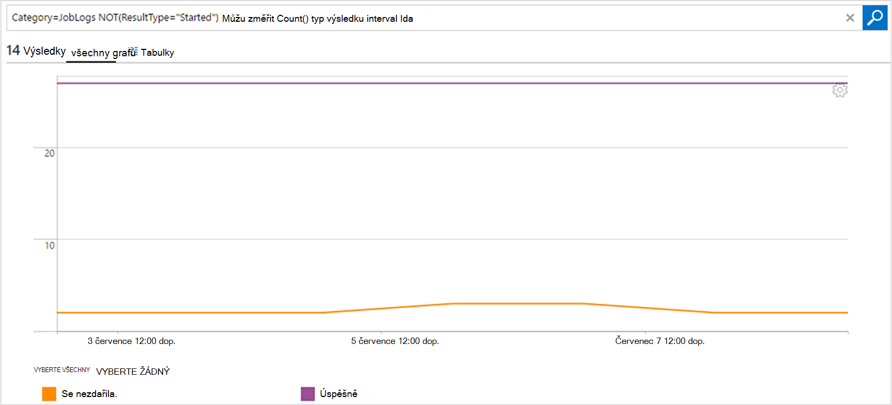

<properties
    pageTitle="Předání dál proudy úlohy a stav úlohy z automatizaci analýzy protokolu (OMS) | Microsoft Azure"
    description="Tento článek ukazuje, jak poslat stavu úlohy a postupu runbook úlohy proudy Microsoft operace správy sadu protokolu technologie pro analýzu vydávat další přehled a správy."
    services="automation"
    documentationCenter=""
    authors="MGoedtel"
    manager="jwhit"
    editor="tysonn" />
<tags
    ms.service="automation"
    ms.devlang="na"
    ms.topic="article"
    ms.tgt_pltfrm="na"
    ms.workload="infrastructure-services"
    ms.date="09/22/2016"
    ms.author="magoedte" />

# Předání dál proudy úlohy a stav úlohy z automatizaci analýzy protokolu (OMS)

Automatizace odesílat postupu runbook úlohy stav a úlohy proudy do pracovního prostoru protokolu analýzy Microsoft operace správy sady (OMS).  Když zobrazíte tyto informace na portálu Azure nebo pomocí prostředí PowerShell tak, že stav jednotlivé úlohy nebo všechny úlohy určitého účtu automatizaci, něco rozšířené možnosti pro podporu provozní požadavky vyžaduje vytváření vlastních skriptů Powershellu.  Nyní se protokolu Anaytics můžete:

- Získejte přehled automatizace úloh 
- Aktivační událost-mailu nebo upozornění podle postupu runbook stavu úloh (například se nepodařilo nebo pozastavené) 
- Psaní rozšířené dotazy přes datových proudů projektu 
- Sladit u účtů automatizace úloh 
- Vizualizace historie úlohy v čase     

## Předpoklady a nasazení kritéria

Odesílání protokolů automatizaci protokolu analýzy zahájíte musí mít takto:

1. Předplatné OMS. Další informace najdete v tématu [Začínáme s protokolu analýzy](../log-analytics/log-analytics-get-started.md).  

    >[AZURE.NOTE]Pracovní prostor OMS a automatizaci účtu musí být ve stejném předplatném Azure v pořadí pro tuto konfiguraci fungovat správně. 
  
2. [Účet Azure úložiště](../storage/storage-create-storage-account.md).  
   
    >[AZURE.NOTE]Účet úložiště, *musí* být ve stejné oblasti účtem automatizaci. 
 
3. Azure Powershellu s verzí 1.0.8 nebo novější rutin provozní přehledy. Informace o této verzi a jak ji nainstalovat najdete v tématu [instalace a konfigurace prostředí PowerShell Azure](../powershell-install-configure.md).
4. Azure Diagnostic and protokolu analýzy Powershellu.  Další informace o této verzi a jak ji nainstalovat najdete v článku [Azure Diagnostic and protokolu analýzy](https://www.powershellgallery.com/packages/AzureDiagnosticsAndLogAnalytics/0.1).  
5. Stáhněte si skript Powershellu **Povolit AzureDiagnostics.ps1** z [Galerie Powershellu](https://www.powershellgallery.com/packages/Enable-AzureDiagnostics/1.0/DisplayScript). Tento skript nastaví její konfiguraci a takto:
 - Účet úložiště pro uložení postupu runbook úlohy stav a toku dat pro automatizaci účtu, který určíte.
 - Povolení kolekce tato data ze svého účtu automatizaci ho chcete uložit na účtu úložiště objektů Blob Azure ve formátu JSON.
 - Konfigurace shromažďování dat ze svého účtu úložiště objektů Blob OMS protokolu analýzy.
 - Povolte řešení automatizaci protokolu analýzy OMS pracovního prostoru.   

**Povolit AzureDiagnostics.ps1** skript vyžaduje následujících parametrů při spuštění:

- *AutomationAccountName* – název účtu automatizaci
- *LogAnalyticsWorkspaceName* – název OMS pracovního prostoru

K nalezení hodnoty parametru *AutomationAccountName*, na portálu Azure vyberte svůj účet automatizaci z zásuvné **automatizaci účtu** a vyberte **všechna nastavení**.  Z zásuvné **všechna nastavení** v části **Nastavení účtu** vyberte **Vlastnosti**.  Ve **Vlastnosti** zásuvné můžete poznamenat tyto hodnoty.  .

## Nastavení integrace se službou protokolu analýzy

1. Na vašem počítači spusťte **Windows PowerShell** z obrazovky **Start** .  
2. Z příkazového řádku prostředí PowerShell přejděte do složky, která obsahuje skript stáhnout a spustit jej změnit hodnoty parametrů *- AutomationAccountName* a *- LogAnalyticsWorkspaceName*.

    >[AZURE.NOTE] Zobrazí se výzva k ověření s Azure po spuštění skriptu.  **Musíte** se přihlásit pomocí účtu, který je členem role správce předplatné a dalších správce předplatného.   
    
        .\Enable-AzureDiagnostics -AutomationAccountName <NameofAutomationAccount> `
        -LogAnalyticsWorkspaceName <NameofOMSWorkspace> `

3. Po dokončení tohoto skriptu byste měli vidět záznamů v protokolu analýzy asi 30 minut po nová diagnostiky data k základnímu úložišti.  Pokud záznamy není k dispozici po tuto dobu v nápovědě k části Poradce při potížích v [JSON soubory v úložišti objektů blob](../log-analytics/log-analytics-azure-storage-json.md#troubleshooting-configuration-for-azure-diagnostics-written-to-blob-in-json).

### Ověřte konfiguraci

Abyste si ověřili, že skript byl úspěšně nakonfigurován automatizaci účet a OMS wokspace, můžete provádět následující kroky v prostředí PowerShell.  Než to uděláte, a zjistit, že hodnoty název pracovního prostoru OMS a název skupiny zdrojů z portálu Microsoft Azure, přejděte do analýzy protokolu (OMS) a zásuvné protokolu analýzy (OMS) všimněte hodnoty **název** a **Pole Skupina zdroje**.   použijeme těchto dvou hodnot, jsme ověřte konfiguraci v OMS pracovního prostoru pomocí rutiny Powershellu [Get-AzureRmOperationalInsightsStorageInsight](https://msdn.microsoft.com/library/mt603567.aspx).

1.  Z portálu Microsoft Azure přejděte na úložiště účty a hledejte následující účtu úložiště, který používá konvence - *AutomationAccountNameomsstorage*.  Po postupu runbook dokončí úloha, krátce navíc byste měli vidět dva objektů Blob kontejnery vytvořili – **přehledy protokoly joblogs** a **interpretaci protokoly jobstreams**.  

2.  Z prostředí PowerShell, spusťte následující kód prostředí PowerShell změnou hodnoty parametrů **ResourceGroupName** a **WorkspaceName** , který jste zkopírovali nebo bylo uvedeno dříve.  

    Přihlášení AzureRmAccount Get-AzureRmSubscription - SubscriptionName "SubscriptionName" | Nastavení AzureRmContext Get-AzureRmOperationalInsightsStorageInsight - ResourceGroupName "OMSResourceGroupName" "-pracovního prostoru"OMSWorkspaceName" 

    Vrátí přehled úložiště zadaný OMS pracovního prostoru.  Chceme potvrďte přehled úložiště pro automatizaci účet, který jsme dříve zadané existuje a **Stavový** objekt zobrazuje hodnotu **OK**.  .

## Technologie pro analýzu záznamů protokolu

Automatizace vytvoří dva typy záznamů v úložišti OMS.

### Protokoly projektu

Vlastnost | Popis|
----------|----------|
Čas | Datum a čas provedení úlohy postupu runbook.|
resourceId | Určuje typ zdroje v Azure.  Hodnota pro automatizaci, je automatizaci účet spojený s postupu runbook.|
Název operace | Určuje typ operace v Azure.  Pro automatizaci bude hodnota práce.|
resultType | Stav úlohy postupu runbook.  Možné hodnoty jsou: -Začínáme -Stopped -Pozastavené -Se nezdařila. -Bylo úspěšné|
resultDescription | Popisuje výsledek stavu úlohy postupu runbook.  Možné hodnoty jsou: -Zahájení úlohy -Úlohy se nezdařila. -Úloha dokončena|
CorrelationId | Identifikátor GUID, která je Id korelace, které úlohy postupu runbook.|
Kategorie | Klasifikace typu data.  Hodnota pro automatizaci, je JobLogs.|
RunbookName | Název postupu runbook.|
JobId | GUID, který je Id úlohy postupu runbook.|
Volající |  Kdo, které iniciuje operaci.  Možné hodnoty jsou-mailovou adresu nebo systém naplánovaných úloh.|

### Toky projektu
Vlastnost | Popis|
----------|----------|
Čas | Datum a čas provedení úlohy postupu runbook.|
resourceId | Určuje typ zdroje v Azure.  Hodnota pro automatizaci, je automatizaci účet spojený s postupu runbook.|
Název operace | Určuje typ operace v Azure.  Pro automatizaci bude hodnota práce.|
resultType | Stav úlohy postupu runbook.  Možné hodnoty jsou: -Probíhající|
resultDescription | Obsahuje tok výstup z postupu runbook.|
CorrelationId | Identifikátor GUID, která je Id korelace, které úlohy postupu runbook.|
Kategorie | Klasifikace typu data.  Hodnota pro automatizaci, je JobStreams.|
RunbookName | Název postupu runbook.|
JobId | GUID, který je Id úlohy postupu runbook.|
Volající | Kdo, které iniciuje operaci.  Možné hodnoty jsou-mailovou adresu nebo systém naplánovaných úloh.| 
StreamType | Typ projektu proudu. Možné hodnoty jsou: -Průběh -Výstup -Upozornění : Chyba -Ladění -Komentářem|

## Zobrazení automatizaci protokoly do protokolu analýzy 

Teď začnete posílat analýzy protokolu protokolů úlohy automatizaci zjistěme, jaké máte možnosti s tyto protokoly uvnitř OMS.   

### Odeslání e-mailu po úlohy postupu runbook selže nebo pozastaví 

Jednu horní zákazníky dotazem je pro možnost posílat e-mailu nebo text, když dojde k chybě pomocí postupu runbook úlohy.   

Pokud chcete vytvořit pravidlo výstrahy, začněte vytvořením protokolu vyhledejte záznamy postupu runbook práce, které by měl vyvolat upozornění.  Tlačítko **upozornění** pak bude k dispozici, můžete vytvořit a nakonfigurovat pravidlo výstrahy.

1.  Na stránce Přehled OMS klikněte na **Hledat protokolu**.
2.  Vytvoření vyhledávacího dotazu protokolu výstrahy tak, že zadáte v poli dotaz následující kroky: `Category=JobLogs (ResultType=Failed || ResultType=Suspended)`.  Můžete taky seskupovat data RunbookName pomocí: `Category=JobLogs (ResultType=Failed || ResultType=Suspended) | measure Count() by RunbookName_s`.   
  
    Pokud jste nastavili protokoly z víc než jednoho účtu automatizaci nebo předplatného do pracovního prostoru, možná by vás zájem seskupení upozornění tak, že předplatné nebo automatizaci účtu.  Název účtu automatizaci můžete odvozeno z pole zdrojů do pole Hledat JobLogs.  

3.  Klikněte na **upozornění** v horní části stránky otevřete obrazovce **Přidat pravidlo výstrahy** .  Další informace o možnosti pro nastavení upozornění najdete v článku [upozornění v protokolu analýzy](../log-analytics/log-analytics-alerts.md#creating-an-alert-rule).

### Najít všechny úlohy, které jste dokončili s chybami 

Kromě upozornění na základě mimo k chybám, pravděpodobně chcete vědět, kdy postupu runbook úloha byla chybu bez ukončení (prostředí PowerShell vytvoří toku chyba, ale bez ukončení chyby nezpůsobí práce pozastavit nebo selhání).    

1. Na portálu OMS klikněte na **Hledat protokolu**.
2. V poli dotaz zadejte `Category=JobStreams StreamType_s=Error | measure count() by JobId_g` a potom klikněte na **Hledat**.

### Zobrazení projektu datových proudů projektu  

Při ladění úlohy, mohou také chcete-li do datových proudů projektu.  Následující dotaz zobrazuje všechny proudy jednu úlohu s GUID 2ebd22ea e05e-4eb9 – 9d 76-d73cbd4356e0:   

`Category=JobStreams JobId_g="2ebd22ea-e05e-4eb9-9d76-d73cbd4356e0" | sort TimeGenerated | select ResultDescription` 

### Zobrazení historie úlohy stavu 

Nakonec je vhodné vizualizace historie úlohy v čase.  Pomocí tohoto dotazu můžete hledat stavu úloh určitou dobu. 

`Category=JobLogs NOT(ResultType="started") | measure Count() by ResultType interval 1day`  
   

## Souhrn

Tak, že vaše automatizaci úlohy stav a toku dat protokolu analýzy, můžete získat lepší přehled o stavu úloh automatizaci tak, že nastavení upozornění pro oznámí, že je problém a vlastní řídicí panely pomocí rozšířené dotazy vizualizovat výsledky postupu runbook stavu úloh postupu runbook a související klíčové indikátory nebo jiných metriky.  To vám pomůže zadat větší provozní viditelnost a adresa incidentem rychlejší.  

## Další kroky

- Další informace o tom, jak vytvářet jiné vyhledávací dotazy a protokolech úlohy automatizaci s protokolu analýzy najdete v tématu [protokolu vyhledávání v protokolu analýzy](../log-analytics/log-analytics-log-searches.md)
- Jak vytvořit a získat výstup chybových zpráv a od runbooks, najdete v tématu [postupu Runbook výstup a zprávy](automation-runbook-output-and-messages.md) 
- Další informace o postupu runbook spuštění, jak sledovat postupu runbook úlohy a další technické podrobnosti najdete v tématu [Sledování postupu runbook projektu](automation-runbook-execution.md)
- Další informace o OMS protokolu technologie pro analýzu a shromažďování zdrojů dat, najdete v článku [shromažďování Azure úložiště dat v protokolu analýzy přehled](../log-analytics/log-analytics-azure-storage.md)