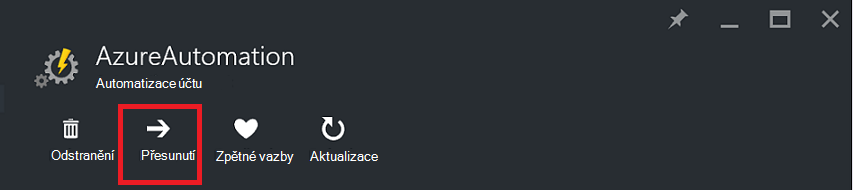
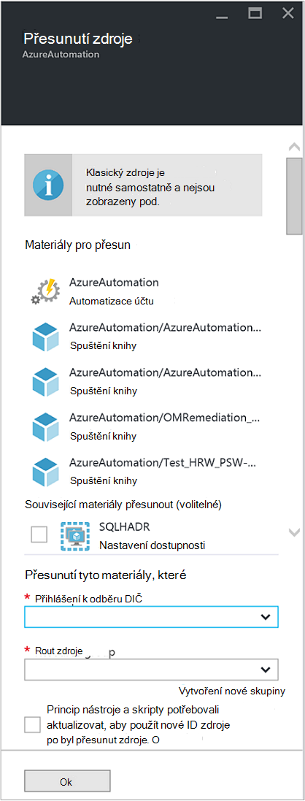

<properties
   pageTitle="Migrace automatizaci účtu a zdroje | Microsoft Azure"
   description="Tento článek popisuje, jak přesunout účet automatizaci v Azure automatizace a přidružené prostředky ze jedno předplatné."
   services="automation"
   documentationCenter=""
   authors="MGoedtel"
   manager="jwhit"
   editor="tysonn" />
<tags
   ms.service="automation"
   ms.devlang="na"
   ms.topic="article"
   ms.tgt_pltfrm="na"
   ms.workload="infrastructure-services"
   ms.date="07/07/2016"
   ms.author="magoedte" />

# <a name="migrate-automation-account-and-resources"></a>Migrace automatizaci účtu a zdrojů

Pro automatizaci účty a jeho přidružené prostředky (tedy prostředky runbooks, moduly, atd.), které jste vytvořili v portálu Azure a chcete se migrovat z jednoho pole Skupina zdroje do druhého nebo z předplatných do druhého lze provést jednoduše s funkcí k dispozici v Azure portálu [Přesunutí zdroje](../resource-group-move-resources.md) . Však před pokračováním tuto akci, nejdřív přečtěte si následující [Kontrolní seznam teprve pak přejděte zdroje](../resource-group-move-resources.md#Checklist-before-moving-resources) a navíc seznamu pod specifické pro automatizaci.   

1.  Cílové skupině předplatné/zdroje musí být ve stejné oblasti jako zdroj.  Jen, automatizaci účty nejdou přesunout přes oblastí.
2.  Při přesunu zdrojů (například runbooks úlohy, atd.), skupině zdrojové a cílové skupiny jsou zamknuté po celou dobu operace. Psaní a odstraňování blokované ve skupinách až do dokončení přesunout.  
3.  Runbooks nebo proměnné, které odkazují na zdroj nebo předplatného ID ze stávajícího předplatného muset aktualizovat po dokončení migrace.   


>[AZURE.NOTE] Tato funkce nepodporuje přesunutí klasické automatizaci zdroje.

## <a name="to-move-the-automation-account-using-the-portal"></a>Přesunutí automatizaci účtu na portálu

1. Z účtu automatizaci klikněte na **Přesunout** v horní části zásuvné.<br> <br> 
2. Na zásuvné **přesuňte prostředky** poznamenejte prezentuje prostředky vztahující se k účtu automatizaci a skupin zdroje.  Vyberte **předplatné** a **pole Skupina zdroje** z rozevíracích seznamů, nebo vyberte možnost **vytvořit novou skupinu zdroje** a zadejte název nové skupiny prostředků do příslušného pole.  
3. Zkontrolujte a zaškrtnutím políčka potvrďte můžete *pochopit nástroje a skripty bude potřeba aktualizovat pro použití nového prostředku ID po zdroje byly přesunuté* a potom klikněte na **OK**.<br> <br>   

Tato akce bude trvat několik minut.  V části **oznámení**, zobrazí se stavem každou akci, která se provede – ověření, migraci a potom nakonec po dokončení.     

## <a name="to-move-the-automation-account-using-powershell"></a>Chcete-li přesunout automatizaci účet pomocí prostředí PowerShell

Přesunout existujících zdrojů automatizaci jiného pole Skupina zdroje nebo předplatného, získáte pomocí rutiny **Get-AzureRmResource** dosáhnete očekávaného konkrétní automatizaci účet a potom **Přesunout AzureRmResource** rutina provádět přesunutí.

První příklad ukazuje, jak přesunout účet automatizaci do nové skupiny prostředků.

   ```
    $resource = Get-AzureRmResource -ResourceName "TestAutomationAccount" -ResourceGroupName "ResourceGroup01"
    Move-AzureRmResource -ResourceId $resource.ResourceId -DestinationResourceGroupName "NewResourceGroup"
   ``` 

Po spuštění výše uvedený příklad kód se výzva k ověření, že chcete tuto akci provádět.  Po kliknutím na **Ano** a povolit skript, který chcete pokračovat, nebudete dostávat žádná upozornění při je provedení migrace.  

Přesunout k novému předplatnému, zadat hodnotu parametru *DestinationSubscriptionId* .

   ```
    $resource = Get-AzureRmResource -ResourceName "TestAutomationAccount" -ResourceGroupName "ResourceGroup01"
    Move-AzureRmResource -ResourceId $resource.ResourceId -DestinationResourceGroupName "NewResourceGroup" -DestinationSubscriptionId "SubscriptionId"
   ``` 

Stejně jako v předchozím příkladu, zobrazí se výzva k potvrzení přesunutí.  

## <a name="next-steps"></a>Další kroky

- Další informace o přesunutí zdrojů do nové skupiny prostředků nebo předplatné najdete v článku [přesunutí zdrojů do nové skupiny prostředků nebo předplatného](../resource-group-move-resources.md)
- Další informace o řízení přístupu na základě rolí v Azure automatizaci najdete v příručce [řízení přístupu na základě rolí v Azure automatizaci](../automation/automation-role-based-access-control.md).
- Další informace o rutinách Powershellu pro správu předplatného najdete v tématu [přes Azure pomocí Správce prostředků](../powershell-azure-resource-manager.md)
- Další informace o portálu funkcí pro správu předplatného najdete v tématu [použití Azure portálu pro přidávání a používání zdrojů](../azure-portal/resource-group-portal.md). 
