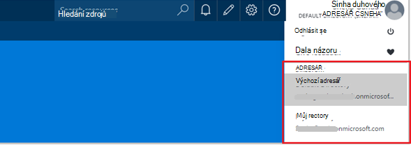

<properties 
   pageTitle="Řízení přístupu na základě rolí v Azure automatizaci | Microsoft Azure"
   description="Řízení přístupu na základě rolí (RBAC) umožňuje správu přístupu pro Azure zdroje. Tento článek popisuje, jak nastavit RBAC v Azure automatizaci."
   services="automation"
   documentationCenter=""
   authors="mgoedtel"
   manager="jwhit"
   editor="tysonn"
   keywords="automatizace rbac azure rbac řízení přístupu na základě rolí" />
<tags 
   ms.service="automation"
   ms.devlang="na"
   ms.topic="get-started-article"
   ms.tgt_pltfrm="na"
   ms.workload="infrastructure-services"
   ms.date="09/12/2016"
   ms.author="magoedte;sngun"/>

# Řízení přístupu na základě rolí v Azure automatizaci

## Řízení přístupu na základě rolí

Řízení přístupu na základě rolí (RBAC) umožňuje správu přístupu pro Azure zdroje. [RBAC](../active-directory/role-based-access-control-configure.md)můžete oddělit úkolů v rámci týmu a udělit jenom množství přístup uživatelů, skupin a aplikace, které potřebují k provedení své práce. Na základě rolí access lze udělit uživatelů pomocí portálu Azure, Azure nástroje příkazového řádku nebo API správy Azure.

## RBAC v automatizaci účty

V Azure automatizaci přístup, která přiřazením odpovídající roli RBAC uživatelé, skupiny a aplikací v oboru automatizaci účtu. Tady jsou integrované role automatizaci účet podporuje:  

|**Role** | **Popis** |
|:--- |:---|
| Vlastník | Role vlastníka umožňuje přístup ke všem zdroje a akce v rámci účet automatizaci včetně poskytnutí přístupu jiných uživatelů, skupin a aplikací na Spravovat účet automatizaci. |
| Skupiny přispěvatelů | Role přispěvatele umožňuje spravovat všechno kromě úpravami jiný uživatel oprávnění k automatizaci účtu. |
| Čtečky | Roli Čtenář umožňuje zobrazit všechny zdroje na automatizaci účtu, ale nemůžete proveďte požadované změny.|
| Automatizace operátor | Automatizace operátor roli umožňuje provozní úkoly třeba spustit, zastavit, pozastavení, obnovení a naplánovat úlohy. Tato role je užitečné, pokud chcete zamknout vašeho účtu automatizaci zdrojů, jako jsou pověření majetek i runbooks prohlédnutí nebo změnit, ale přesto povolit členy vaší organizace, provést tyto runbooks. |
| Správce přístup uživatelů | Role správce přístup uživatelů umožňuje spravovat přístup uživatelů k automatizaci Azure účtům. |

>[AZURE.NOTE] Nelze udělit oprávnění na konkrétní postupu runbook nebo runbooks, jenom pro zdroje a akce v rámci automatizaci účtu.  

V tomto článku Nemůžeme vás provede jednotlivými nastavíte RBAC v Azure automatizaci. Ale nejdřív Podívejme bližší pohled na vaše jednotlivých oprávnění Přispěvatel, Reader, automatizaci operátor a správce přístup uživatelů tak, aby jsme získat dobře porozumět před udělením kdokoliv práva k automatizaci účtu.  V opačném případě může vést k před nechtěným nebo nežádoucí důsledky.     

## Oprávnění role přispěvatele

V následující tabulce jsou uvedeny konkrétní akce, které lze vykonat role přispěvatele v automatizaci.

| **Pole Typ zdroje** | **Pro čtení** | **Zápis** | **Odstranění** | **Jiné akce** |
|:--- |:---|:--- |:---|:--- |
| Účet Azure automatizaci |  |  |  | | 
| Automatizace certifikát majetku |  |  |  | |
| Automatické připojení materiálů |  |  |  | | 
| Automatické připojení typ materiálů |  |  |  | | 
| Automatizace pověření materiálů |  |  |  | |
| Automatizace plánu materiálů |  |  |  | |
| Automatizace proměnné materiálů |  |  |  | |
| Automatické vyplňování stavu konfigurace | | | |  |
| Typ zdroje pracovního postupu Runbook hybridní |  | |  | | 
| Azure automatizace úloh |  |  | |  | 
| Automatizace úloh toku |  | | | | 
| Automatizace plánu projektu |  |  |  | |
| Automatizace modul |  |  |  | |
| Postupu Runbook Azure automatizaci |  |  |  |  |
| Automatizace postupu Runbook koncept |  | | |  |
| Automatizace postupu Runbook koncept testovací úlohy |  |  | |  | 
| Automatizace Webhook |  |  |  |  |

## Oprávnění role Readeru

V následující tabulce jsou uvedeny konkrétní akce, které lze vykonat roli Čtenář v automatizaci.

| **Pole Typ zdroje** | **Pro čtení** | **Zápis** | **Odstranění** | **Jiné akce** |
|:--- |:---|:--- |:---|:--- |
| Správce klasický předplatného |  | | | 
| Správa zámek |  | | | 
| Oprávnění |  | | |
| Operace poskytovatele |  | | | 
| Přiřazování rolí |  | | | 
| Definice role |  | | | 

## Oprávnění role automatizaci operátor

V následující tabulce jsou uvedeny konkrétní akce, které lze vykonat roli automatizaci operátor v automatizaci.

| **Pole Typ zdroje** | **Pro čtení** | **Zápis** | **Odstranění** | **Jiné akce** |
|:--- |:---|:--- |:---|:--- |
| Účet Azure automatizaci |  | | | 
| Automatizace certifikát majetku | | | |
| Automatické připojení materiálů | | | |
| Automatické připojení typ materiálů | | | |
| Automatizace pověření materiálů | | | |
| Automatizace plánu materiálů |  |  | | |
| Automatizace proměnné materiálů | | | |
| Automatické vyplňování stavu konfigurace | | | | |
| Typ zdroje pracovního postupu Runbook hybridní | | | | | 
| Azure automatizace úloh |  |  | |  | 
| Automatizace úloh toku |  | | |  
| Automatizace plánu projektu |  |  | | |
| Automatizace modul | | | |
| Postupu Runbook Azure automatizaci |  | | | |
| Automatizace postupu Runbook koncept | | | |
| Automatizace postupu Runbook koncept testovací úlohy | | | |  
| Automatizace Webhook | | | |

Další podrobnosti [automatizaci operátor akce](../active-directory/role-based-access-built-in-roles.md#automation-operator) jsou uvedeny akce nepodporuje roli automatizaci operátor na automatizaci účtu a jeho zdroje.

## Oprávnění role správce přístup uživatelů

V následující tabulce jsou uvedeny konkrétní akce, které lze vykonat roli správce přístup uživatelů v automatizaci.

| **Pole Typ zdroje** | **Pro čtení** | **Zápis** | **Odstranění** | **Jiné akce** |
|:--- |:---|:--- |:---|:--- |
| Účet Azure automatizaci |  | | | |
| Automatizace certifikát majetku |  | | | |
| Automatické připojení materiálů |  | | | |
| Automatické připojení typ materiálů |  | | | |
| Automatizace pověření materiálů |  | | | |
| Automatizace plánu materiálů |  | | | |
| Automatizace proměnné materiálů |  | | | |
| Automatické vyplňování stavu konfigurace | | | | |
| Typ zdroje pracovního postupu Runbook hybridní |  | | | | 
| Azure automatizace úloh |  | | | | 
| Automatizace úloh toku |  | | | | 
| Automatizace plánu projektu |  | | | |
| Automatizace modul |  | | | |
| Postupu Runbook Azure automatizaci |  | | | |
| Automatizace postupu Runbook koncept |  | | | |
| Automatizace postupu Runbook koncept testovací úlohy |  | | | | 
| Automatizace Webhook |  | | |

## Konfigurace RBAC účtu automatizaci portálu Azure

1.  Přihlaste se k [Portálu Azure](https://portal.azure.com/) a otevřete svůj účet automatizaci z zásuvné automatizaci účty.  

2.  Klikněte na ovládací prvek **přístup** v pravém horním rohu. Otevře se **Uživatelé** zásuvné, kde můžete přidat nové uživatele, skupiny a aplikací spravovat svůj účet automatizaci a zobrazit role stávajících nakonfigurované pro automatizaci účet.  

      

>[AZURE.NOTE] **Správci předplatné** již existuje jako výchozího uživatele. Skupiny správců služby active directory předplatné zahrnuje správci služby a co-administrator(s) předplatného Azure. Správce služeb je vlastník předplatného Azure a jeho zdrojů a bude role vlastníka převzít pro automatizaci účty příliš. To znamená, že přístup **Inherited** pro **Správce služby a dalších správců** předplatné a jeho **přiřazené** pro všechny ostatní uživatele. Klikněte na **předplatné správci** zobrazíte další informace o jeho oprávnění.  

### Přidání nového uživatele a přiřadit roli

1.  V zásuvné uživatelé klikněte na **Přidat** otevřete **zásuvné přístup přidat** místo, kam můžete přidat uživatele, skupinu nebo aplikace a přiřadit roli na ně.  

      

2.  Vyberte roli ze seznamu dostupných rolí. Jsme zvolí roli **Čtenář** , ale můžete vybrat některé z dostupných předdefinovaných role, které podporuje automatizaci účet nebo vlastní roli, kterou může definovali.  

      

3.  Klikněte na **Přidat uživatele** otevřete zásuvné **Přidat uživatele** . Pokud jste přidali uživatelů, skupin nebo aplikací pro správu předplatného a pak jsou uvedeny tyto uživatele a můžete je přidat přístup vyberte. Pokud nejsou k dispozici všech uživatelů, kteří jsou, nebo pokud uživatel vás zajímají přidání nenajdete pak klikněte na **Pozvat** otevřete **pozvání Host** zásuvné, kde můžete pozvat uživatele s platnou adresu e-mailu účet Microsoft jako je Outlook.com, OneDrive nebo Xbox Live ID. Jakmile jste zadali e-mailovou adresu uživatele, klikněte na **Vyberte** přidat uživatele, a pak klikněte na **OK**. 

      
 
    Teď byste měli vidět uživatel přidaný zásuvné **Uživatelé** s přiřazenou roli **Readeru** .  

      

    Můžete také přiřadit role uživatele z **role** zásuvné. 

1. Klikněte na položku **role** uživatele zásuvné otevřete **zásuvné role**. Z tohoto zásuvné můžete zobrazit název roli, počet uživatelů a skupin k tuto roli přiřadit.

      
   
    >[AZURE.NOTE] Řízení přístupu na základě rolí můžete nastavit jenom na úrovni automatizaci účtu a ne všechny zdroje pod účtem automatizaci.

    Přiřadit víc než jednu roli uživateli, skupině nebo aplikace. Například pokud roli **Automatizaci operátor** spolu s **role Čtenář** přidat uživatele, pak je můžete zobrazit všechny zdroje automatizaci, jakož i spusťte úloh postupu runbook. Můžete rozbalit rozevírací seznam všech role přiřazené uživateli.  

      
 
### Odebrání uživatele

Můžete odebrat oprávnění k přístupu pro uživatele, který není Správa účtu automatizaci nebo kdo nepracuje pro organizaci. Následující najdete postup, jak odebrat uživatele: 

1.  Z zásuvné **uživatele** vyberte přiřazování rolí, kterou chcete odebrat.

2.  Kliknutím na tlačítko **Odebrat** v zásuvné podrobnosti o přiřazení.

3.  Klikněte na **Ano** potvrďte odebrání. 

      

## Role přiřazené uživateli

Když se uživateli přiřadí role přihlášení k účtu automatizaci, teď vidí vlastníka účet v seznamu **Výchozí adresářů**. Abyste mohli zobrazit automatizaci účet, který jste přidali do jejich musí přejděte v adresáři výchozí vlastníka výchozí adresář.  

  

### Uživatelské prostředí pro automatizaci operátor rolí

Pokud uživatel, kterému je přiřazena zobrazení roli automatizaci operátor automatizaci účet, který kterému jsou přiřazené, můžete zobrazit pouze seznam runbooks, postupu runbook úlohy a plánů vytvořili v účtu automatizaci ale nedá se zobrazit jejich definice. Budou začít, ukončit, pozastavení, obnovení nebo plánování úlohy postupu runbook. Uživatel nebude mít přístup k dalším automatizaci materiálům například konfigurací hybridního pracovní skupiny nebo DSC uzlů.  

  

Poté, co uživatel klikne na postupu runbook, příkazy pro zobrazení zdroje nebo upravit postupu runbook nejsou podle role operátor automatizaci neumožňuje k nim přístup.  

  

Uživatel bude mít přístup k zobrazení a k vytváření plánů, ale nebudete mít přístup k jiný typ materiálů.  

  

Tento uživatel taky nemá přístup k zobrazení webhooks přidružené postupu runbook

  

## Konfigurace RBAC účtu automatizaci pomocí prostředí PowerShell Azure

Také je možné konfigurovat přístupu na základě rolí k automatizaci účtu pomocí následující [rutiny prostředí PowerShell Azure](../active-directory/role-based-access-control-manage-access-powershell.md).

• [Get-AzureRmRoleDefinition](https://msdn.microsoft.com/library/mt603792.aspx) obsahuje seznam všech RBAC role, které jsou k dispozici v Azure Active Directory. Chcete-li zobrazit všechny akce, které můžete provádět konkrétní rolí můžete tento příkaz spolu s vlastnost **název** .  
    **Příklad:**  
      

• [Get-AzureRmRoleAssignment](https://msdn.microsoft.com/library/mt619413.aspx) seznamy Azure AD RBAC přiřazování rolí v zadaném oboru. Bez parametrů tento příkaz vrátí všechna přiřazení rolí podle předplatného. Použít parametr **ExpandPrincipalGroups** přiřazení seznamu přístupu pro zadaný uživatel i skupiny uživatel členem.  
    **Příklad:** Pomocí následujícího příkazu seznam všech uživatelů a jejich role obchodního vztahu automatizaci.

    Get-AzureRMRoleAssignment -scope “/subscriptions/<SubscriptionID>/resourcegroups/<Resource Group Name>/Providers/Microsoft.Automation/automationAccounts/<Automation Account Name>” 

• [Nový AzureRmRoleAssignment](https://msdn.microsoft.com/library/mt603580.aspx) přiřadit přístup uživatelů, skupin a aplikací pro určitý obor.  
    **Příklad:** Pomocí následujícího příkazu přiřadit roli "Automatizaci operátor" pro uživatele v rozsahu automatizaci účtu.

    New-AzureRmRoleAssignment -SignInName <sign-in Id of a user you wish to grant access> -RoleDefinitionName "Automation operator" -Scope “/subscriptions/<SubscriptionID>/resourcegroups/<Resource Group Name>/Providers/Microsoft.Automation/automationAccounts/<Automation Account Name>”  

• Umožňuje [Odebrat AzureRmRoleAssignment](https://msdn.microsoft.com/library/mt603781.aspx) odeberte přístup zadaný uživatel, skupiny nebo aplikace určitý obor.  
    **Příklad:** Pomocí následujícího příkazu odebrat uživatele z role "Automatizaci operátor" rozsahu automatizaci účtu.

    Remove-AzureRmRoleAssignment -SignInName <sign-in Id of a user you wish to remove> -RoleDefinitionName "Automation Operator" -Scope “/subscriptions/<SubscriptionID>/resourcegroups/<Resource Group Name>/Providers/Microsoft.Automation/automationAccounts/<Automation Account Name>”

V předchozích příkladech nahraďte **Id**, **předplatné Id**, **název skupiny prostředků** a **název účtu automatizaci** podrobnosti o účtu. Zvolte **Ano** potvrďte před pokračováním odebrat přiřazování rolí uživatele.   

## Další kroky
-  Informace o různých způsobech konfigurace RBAC pro automatizaci Azure najdete v příručce [Správa RBAC s Azure Powershellu](../active-directory/role-based-access-control-manage-access-powershell.md).
- Podrobnosti o různé způsoby, jak začít postupu runbook najdete v tématu [spuštění postupu runbook](automation-starting-a-runbook.md)
- Informace o různých postupu runbook typech naleznete v příručce [Azure automatizaci postupu runbook typy](automation-runbook-types.md)

