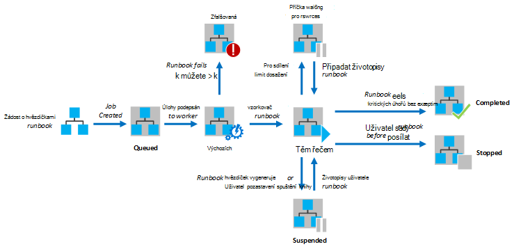
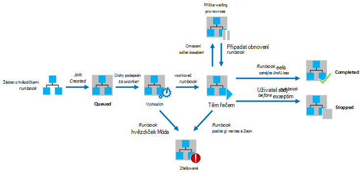

<properties
   pageTitle="Spuštění postupu Runbook v Azure automatizaci"
   description="Popisuje podrobnosti o zpracování postupu runbook v Azure automatizaci."
   services="automation"
   documentationCenter=""
   authors="mgoedtel"
   manager="stevenka"
   editor="tysonn" />
<tags
   ms.service="automation"
   ms.devlang="na"
   ms.topic="article"
   ms.tgt_pltfrm="na"
   ms.workload="infrastructure-services"
   ms.date="03/21/2016"
   ms.author="bwren" />

# Spuštění postupu Runbook v Azure automatizaci

Když začnete postupu runbook v Azure automatizaci, je vytvořen projektu. Úlohy je instancí jednoho spuštění dotazu postupu runbook. Automatizace Azure pracovní se přiřadí ke spuštění jednotlivé úlohy. Během zaměstnanci jsou sdíleny více účtů Azure, úlohy z různých účtů automatizaci jsou izolovaný od sebe. Nemáte publikum nemůže ovládat které pracovníka bude služby žádost o svoji práci.  Jeden postupu runbook může obsahovat více úlohami najednou. Když zobrazíte seznam runbooks na portálu Azure, zobrazí seznam stav poslední úlohy, který byl spuštěn pro každou postupu runbook. Abyste mohli sledovat stav každé můžete zobrazit seznam úloh pro každý postupu runbook. Popis různých úlohy stavy najdete v tématu [Stavy projektu](#job-statuses).

Na následujícím obrázku vidíte životním cyklu projektu postupu runbook pro [grafické runbooks](automation-runbook-types.md#graphical-runbooks) a [runbooks prostředí PowerShell pracovního postupu](automation-runbook-types.md#powershell-workflow-runbooks).

Na následujícím obrázku vidíte životním cyklu projektu postupu runbook pro [runbooks Powershellu](automation-runbook-types.md#powershell-runbooks).

Vaše úlohy bude mít přístup k prostředkům Azure tím, že připojení k předplatnému Azure. Bude pouze mají přístup ke zdrojům v datovém centru jsou-li tyto materiály přístupné z veřejné cloudu.

## Zobrazit stavy projektu

Následující tabulka popisuje různé stavy, které je možné projektu.

| Stav| Popis|
|:---|:---|
|Dokončení|Úloha byla úspěšně dokončena.|
|Se nezdařila.| Pro [grafické a pracovních postupů prostředí PowerShell runbooks](automation-runbook-types.md)postupu runbook kompilace se nezdařila.  [Skript Powershellu runbooks](automation-runbook-types.md)postupu runbook se nepodařilo spustit nebo úlohy zjistil výjimku. |
|Selže, čeká se na zdroje|Protože limitu [podílet](#fairshare) třikrát a spuštění ze stejného kontrolní bod a od začátku postupu runbook pokaždé, když se nepovedlo projektu.|
|Ve frontě|Úloha čeká na zdroje automatizaci pracovníka do režimu dostupné tak, aby mohli začít.|
|Spuštění|Úlohy přiřadila pracovník, je systém a při spuštění.|
|Obnovení|Systém je po bylo pozastavené obnovení projektu.|
|Spuštění|Je spuštěná úloha.|
|Systém, čeká se na zdroje|Úlohy bylo uvolnit, protože ho limitu [reálnou sdílet](#fairshare) . Bude pokračovat krátce z poslední kontroly.|
|Přerušili|Úlohy zastavil uživatelem před dokončením.|
|Zastavení|Jestli chcete systém je ukončení projektu.|
|Pozastavené|Projekt byl pozastaví uživatelem systému a příkazem v postupu runbook. Úlohy, která je pozastavené můžete znova a obnoví od jeho posledního kontrolní bod a od začátku postupu runbook má žádné kontroly. Postupu runbook se pozastaví pouze systém v případě výjimku. Ve výchozím nastavení ErrorActionPreference nastavena na **pokračovat** význam spuštěný úlohy bude mít na chybu. Pokud tuto proměnnou předvoleb nastavena na **Ukončit** úlohu pozastavit na chybu.  Platí jenom pro [grafické a pracovních postupů prostředí PowerShell runbooks](automation-runbook-types.md) .|
|Pozastavení|Systém pokouší za účelem pozastavení úlohy na žádost uživatele. Postupu runbook musí být doručena jeho další kontrolní bod, než může být pozastaveno. Pokud již uplynul poslední kontroly, potom ho dokončí před může být pozastaveno.  Platí jenom pro [grafické a pracovních postupů prostředí PowerShell runbooks](automation-runbook-types.md) .|

## Zobrazení stavu úlohy na portálu Správa Azure

### Automatizace řídicího panelu

Na řídicím panelu Automatické zobrazuje souhrn všech akcí runbooks konkrétní automatizaci účtu. Obsahuje taky přehled použití účtu. Souhrnné graf zobrazuje počet celková práce pro všechny runbooks zadané jednotlivé stavy přes daný počet hodin nebo dnů. Můžete vybrat časový rozsah v pravém horním rohu grafu. S časovou osou graf se změní podle typu časového rozsahu, kterou jste vybrali. Můžete zvolit, zda mají být zobrazena řádek pro určitý stav kliknutím v horní části obrazovky.

Následující postup slouží k zobrazení řídicího panelu automatizaci.

1. Na portálu Správa Azure vyberte **automatizace** a potom klikněte na položku název účtu, který automatizaci.
1. Vyberte kartu **řídicího panelu** .

### Řídicí panel postupu Runbook

Řídicí panel postupu Runbook zobrazuje souhrn pro jeden postupu runbook. Souhrnné graf zobrazuje počet celková práce pro postupu runbook zadané jednotlivé stavy přes daný počet hodin nebo dnů. Můžete vybrat časový rozsah v pravém horním rohu grafu. S časovou osou grafu se změní podle typu časového rozsahu, kterou jste vybrali. Můžete zvolit, zda mají být zobrazena řádek pro určitý stav kliknutím v horní části obrazovky.

Následující postup slouží k zobrazení řídicího panelu postupu Runbook.

1. Na portálu Správa Azure vyberte **automatizace** a potom klikněte na položku název účtu, který automatizaci.
1. Klikněte na název postupu runbook.
1. Vyberte kartu **řídicího panelu** .

### Souhrn projektu

Můžete zobrazit seznam všech projektů, vytvořené pro konkrétní postupu runbook a poslední stav. Můžete filtrovat tento seznam podle stavu úlohy a rozsah dat pro poslední změnu k projektu. Klikněte na název projektu zobrazíte podrobné informace a jeho výstup. Podrobný přehled projektu zahrnuje hodnoty parametrů postupu runbook, které jsou poskytovány pro tento projekt.

Podle těchto kroků můžete použít k zobrazení úloh postupu runbook.

1. Na portálu Správa Azure vyberte **automatizace** a potom klikněte na položku název účtu, který automatizaci.
1. Klikněte na název postupu runbook.
1. Vyberte kartu **projekty** .
1. Klikněte na sloupec **Vytvořen projektu** pro projekt zobrazíte její podrobnosti a výstupu.

## Načítání stav úlohy pomocí Windows Powershellu

[Get-AzureAutomationJob](http://msdn.microsoft.com/library/azure/dn690263.aspx) slouží k načtení úlohy vytvoří postupu runbook a podrobnosti o určitý projekt. Pokud začnete postupu runbook s použitím [Počáteční AzureAutomationRunbook](http://msdn.microsoft.com/library/azure/dn690259.aspx)prostředí Windows PowerShell, pak vrátí výsledné projektu. Výstup projektu pomocí [Get-AzureAutomationJob](http://msdn.microsoft.com/library/azure/dn690263.aspx)výstupu.

Následující ukázkové příkazy načte poslední práce postupu runbook vzorku a zobrazí její stav hodnoty poskytovat postupu runbook parametry a výstup projektu.

    $job = (Get-AzureAutomationJob –AutomationAccountName "MyAutomationAccount" –Name "Test-Runbook" | sort LastModifiedDate –desc)[0]
    $job.Status
    $job.JobParameters
    Get-AzureAutomationJobOutput –AutomationAccountName "MyAutomationAccount" -Id $job.Id –Stream Output

## Veletrhu sdílet

Abyste mohli sdílení zdrojů mezi všechny runbooks v cloudu, Azure automatizaci bude dočasně jeho uvolnění z paměti všechny úlohy po spuštěna 3 hodiny.    [Grafické](automation-runbook-types.md#graphical-runbooks) a [Pracovních postupů prostředí PowerShell](automation-runbook-types.md#powershell-workflow-runbooks) runbooks bude obnoven od jeho posledního [kontrolní bod](http://technet.microsoft.com/library/dn469257.aspx#bk_Checkpoints). Během této doby úkoly se zobrazí stav spuštění, čeká se na zdroje. Pokud postupu runbook má žádné kontrolních bodů nebo úlohy nebyly dosažení první kontrolní bod před vyložení, restartujte bude od začátku.  [Prostředí PowerShell](automation-runbook-types.md#powershell-runbooks) runbooks jsou vždy nerestartuje od začátku od nepodporují kontrolních bodů.

>[AZURE.NOTE] Limit podílet není k dispozici postupu runbook úlohy provádějící na hybridní postupu Runbook zaměstnanců.

Pokud postupu runbook restartování ze stejného kontrolní bod nebo od začátku postupu runbook třikrát po sobě jdoucí bude ukončena se stavem vadný, čeká se na zdroje. Toto je chránit před runbooks spuštění donekonečna udržovat bez dokončení, jako není možné provést další kontrolní bod bez vyložení znovu. V tomto případě získáte následující výjimku se chyba.

*Úkoly se nemůžou dál systémem, protože byl opakovaně odstraněn ze stejného kontrolní bod. Ujistěte se, že vaše postupu Runbook neprovádí delších operací bez uchování jeho stavu.*

Když vytvoříte postupu runbook, ujistěte se, že čas spuštění všech činností mezi dvěma kontroly nesmí překročit 3 hodiny. Budete muset přidat kontrolních bodů do svého postupu runbook zajistit, že ho není dosažení maximálního počtu 3 hodiny nebo rozdělit dlouhé spuštění operace. Například váš postupu runbook může provádět nové indexování velké databáze SQL. Pokud tento jednotlivá mezích podílet nedokončí, pak úlohy bude vyloženo a restartování od začátku. V tomto případě by měl rozdělit operaci nové indexování do několik kroků, například přeindexovávat tabulkami najednou a vložte kontrolní bod po každém, aby úlohy může obnovit až po poslední operaci dokončete.

## Další kroky

- [Spuštění postupu runbook v Azure automatizaci](automation-starting-a-runbook.md)
