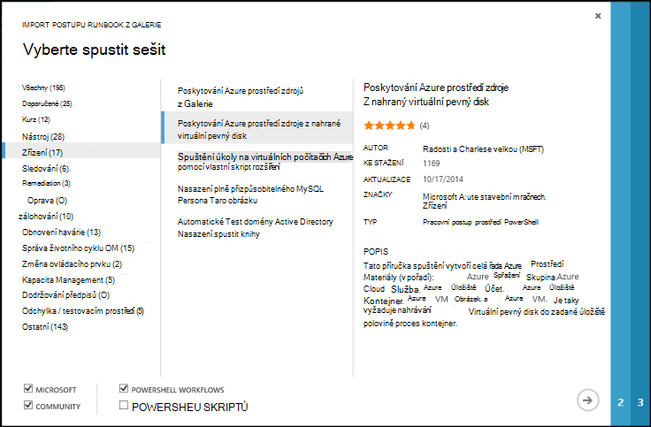
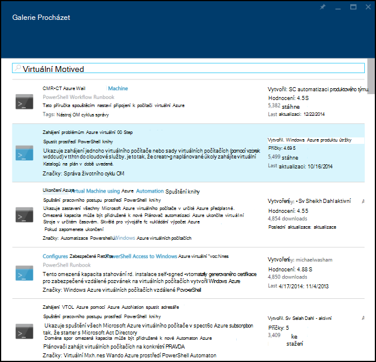
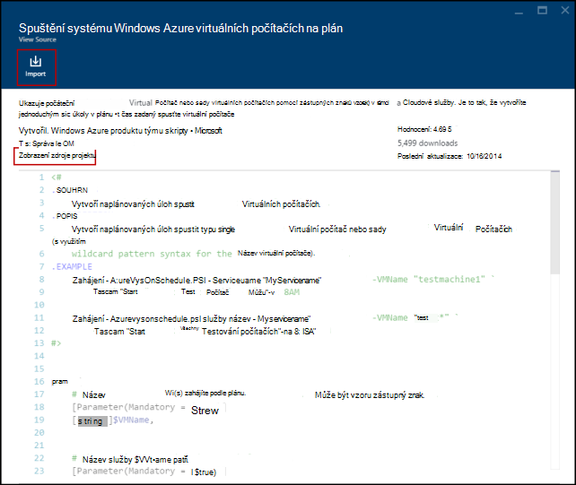
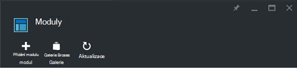
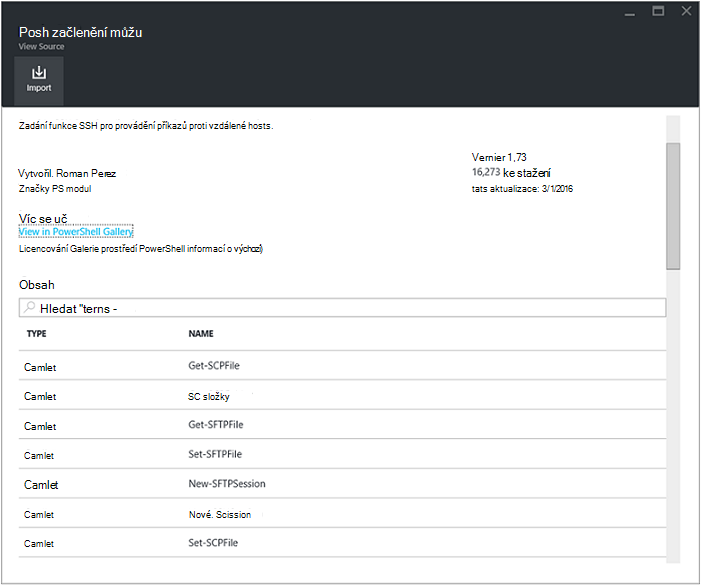
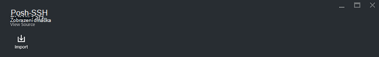
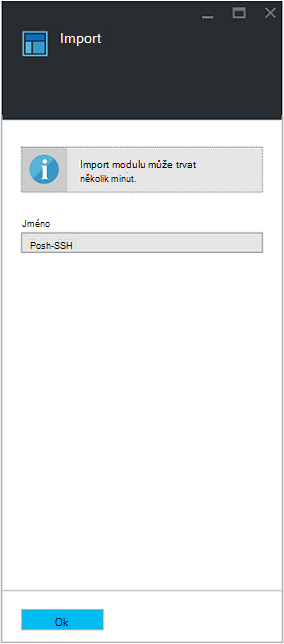

<properties
    pageTitle="Galerie postupu Runbook a modulu pro automatizaci Azure | Microsoft Azure"
    description="Runbooks a moduly společnostmi Microsoft a komunity jsou k dispozici a nelze nainstalovat a používat ve vašem prostředí Azure automatizaci.  Tento článek popisuje, jak lze získat přístup k tyto materiály a přispívat runbooks do galerie."
    services="automation"
    documentationCenter=""
    authors="mgoedtel"
    manager="jwhit"
    editor="tysonn" />
<tags
    ms.service="automation"
    ms.devlang="na"
    ms.topic="article"
    ms.tgt_pltfrm="na"
    ms.workload="infrastructure-services"
    ms.date="09/18/2016"
    ms.author="magoedte;bwren" />

# Galerie postupu Runbook a modulu pro automatizaci Azure

Místo vytvoření vlastního runbooks a moduly v Azure automatizaci, můžete využít řadu možností, které již byly vytvořeny společností Microsoft a komunity.  Můžete použít buď podobnému sledu beze změny nebo můžete použít jako výchozí bod a upravovat zvolenou.

Runbooks můžete získat z [Galerie postupu Runbook](#runbooks-in-runbook-gallery) a moduly z [Galerie Powershellu](#modules-in-powerShell-gallery).  Se můžete taky do komunity přispívat sdílením scénáře, které vytváříte.

## Runbooks v galerii postupu Runbook

[Galerie postupu Runbook](http://gallery.technet.microsoft.com/scriptcenter/site/search?f[0].Type=RootCategory&f[0].Value=WindowsAzure&f[1].Type=SubCategory&f[1].Value=WindowsAzure_automation&f[1].Text=Automation) nabízí mnoho runbooks společnostmi Microsoft a komunity, která můžete importovat do Azure automatizaci. Můžete buď stažení postupu runbook z galerie, který je hostovaný na stránce [Centrum skriptů TechNet](http://gallery.technet.microsoft.com/)nebo runbooks můžete importovat přímo z Galerie z Azure klasický portál nebo Azure portál.

Lze importovat pouze přímo z Galerie postupu Runbook pomocí Azure klasické portál nebo Azure portálu. Nelze provést tuto funkci používat Windows PowerShell.

>[AZURE.NOTE] Je třeba ověřit obsah žádné runbooks dostat z Galerie postupu Runbook a opatrně v instalace a spuštění v pracovním prostředí. |

### Import postupu runbook z Galerie postupu Runbook pomocí portálu Azure klasické

1. Na portálu Azure klikněte na, **novou** **aplikaci služby**, **automatizaci**, **postupu Runbook**, **Z Galerie**.
2. Vyberte kategorii související runbooks a vyberte postupu runbook zobrazíte její podrobnosti. Když vyberete postupu runbook, které chcete, klikněte na tlačítko šipka vpravo.

    

3. Zkontrolujte obsah postupu runbook a poznamenejte si požadavky v popisu. Až budete hotovi, klikněte na tlačítko se šipkou.
4. Zadejte podrobnosti o postupu runbook a klikněte na tlačítko se zaškrtnutím. Název postupu runbook už vyplní.
5. Postupu runbook se zobrazí na kartě **Runbooks** pro automatizaci účet.

### Import postupu runbook z Galerie postupu Runbook pomocí portálu Azure

1. Na portálu Azure si potřebujete založit účet automatizaci.
2. Klikněte na dlaždici **Runbooks** otevřete seznam runbooks.
3. Klikněte na tlačítko **Procházet Galerie** .

    

4. Vyhledejte položku Galerie a vybrat zobrazíte její podrobnosti.

    

4. Klikněte na **zobrazení zdroje projektu** zobrazíte položky na stránce [Centrum skriptů TechNet](http://gallery.technet.microsoft.com/).
5. Pokud chcete importovat položky, klikněte na ni zobrazit podrobnosti a pak klikněte na tlačítko **importovat** .

    

6. V případě potřeby změňte název postupu runbook a potom klikněte na tlačítko **OK** k importu postupu runbook.
5. Postupu runbook se zobrazí na kartě **Runbooks** pro automatizaci účet.

### Přidání postupu runbook do Galerie postupu runbook

Microsoft doporučuje přidání runbooks do Galerie postupu Runbook, které by podle vás mohly být užitečné ostatním zákazníkům.  [Nahrávání a Centrum skriptů](http://gallery.technet.microsoft.com/site/upload) s ohledem na tyto údaje můžete přidat postupu runbook.

- *Windows Azure* zadejte pro **kategorii** a *automatizaci* **podkategorie** pro postupu runbook zobrazený v průvodci.  

- Nahrávání musí být jeden soubor .ps1 nebo .graphrunbook.  Vyžaduje-li postupu runbook modulů kontroly, podřízené runbooks nebo prostředky, měli ty, do pole Popis podávání a v části komentáře postupu runbook seznamu.  Pokud máte situace vyžadující více runbooks nahrát každý zvlášť a seznam názvů související runbooks ve všech svých popisy. Ujistěte se, použít stejné značky tak, aby se nezobrazovaly v kategorii stejné. Uživatel bude mít zobrazíte popis vědět, že ostatní runbooks jsou potřeba scénáře práce.

- Přidání značky "GraphicalPS" při publikování **grafické postupu runbook** (ne grafické pracovního postupu). 

- Vložení prostředí PowerShell nebo pracovního postupu prostředí PowerShell fragment kódu do popis pomocí ikony **vložte část kódu** .

- Souhrn pro nahrávání zobrazí se ve výsledcích postupu Runbook Galerie tak by měl obsahovat podrobné informace, které vám pomůže identifikovat funkce postupu runbook uživatele.

- Měli byste přiřadit jeden až tři následující značky nahrávání.  V Průvodci podle kategorií, které odpovídají její značky se zobrazí postupu runbook.  Průvodcem budou ignorovat značky není v tomto seznamu. Pokud nezadáte odpovídající značky, postupu runbook uvedené v části jiné kategorie.

 - Zálohování
 - Správa kapacity
 - Změna ovládacího prvku
 - Dodržování předpisů
 - Odchylka / testovacím prostředí
 - Obnovení havárie
 - Sledování
 - Oprava
 - Zřízení
 - Remediation
 - Správa životního cyklu OM

- Automatizace se aktualizuje v galerii jednou za hodinu, takže neuvidíte své příspěvky okamžitě.

## Moduly v galerii prostředí PowerShell

Prostředí PowerShell moduly obsahují rutin, které můžete použít ve vaší runbooks a existující moduly, které můžete nainstalovat v Azure automatizaci jsou dostupné v [Galerii Powershellu](http://www.powershellgallery.com).  Spuštění této galerii z portálu Microsoft Azure a nainstalujte je přímo do automatizaci Azure nebo můžete stáhnout a nainstalovat ručně.  Nejde nainstalovat moduly přímo z portálu Microsoft Azure klasické, ale můžete stáhnout nainstalujte je jako všechny ostatní moduly.

### K importu modulu z Galerie automatizaci modul Azure portálem

1. Na portálu Azure si potřebujete založit účet automatizaci.
2. Klikněte na dlaždici **prostředky** otevřete seznam prostředky.
3. Klikněte na dlaždici **modulů** otevřete seznam moduly.
4. Klikněte na tlačítko **Procházet Galerie** a spuštění zásuvné Galerie Procházet.

      
5. Po spuštění zásuvné Galerie Procházet můžete hledat podle následujících polí:

   - Název modulu
   - Značky
   - Autor
   - Název rutiny/DSC zdroje

6. Najděte modul, který vás zajímá a vyberte ji zobrazíte její podrobnosti.  
Při procházení datových krychlí konkrétní modul, můžete zobrazit další informace o modulu, včetně odkaz zpět do Galerie prostředí PowerShell jakékoli povinné závislostí a všechny ostatní rutiny a/nebo DSC prostředky, které obsahuje modulu.

      

7. Instalace modulu přímo do Azure automatizaci, klikněte na tlačítko **importovat** .

    

8. Když kliknete na tlačítko importovat, zobrazí se modul název, který chcete importovat. Pokud máte nainstalované všechny závislosti, bude aktivní na tlačítko **OK** . Pokud chybí závislosti, budete muset importovat můžou být před importem tento modul.
9. Klikněte na tlačítko **OK** k importu modulu a spustí zásuvné moduly. V případě Azure automatizaci importuje modulu ke svému účtu, extrahuje metadata modulu a rutiny.

    

    Může to trvat několik minut, protože jednotlivých aktivit je potřeba neextrahují.
10. Zobrazí se oznámení, že modul nasazuje a oznámení po dokončení.
11. Po importu modulu uvidíte dostupných aktivit a můžete využít jeho zdroje v runbooks a konfigurace stavu žádoucí.

## Žádosti o postupu runbook nebo modulu

Odesílají požadavky na [Uživatele hlasovou](https://feedback.azure.com/forums/246290-azure-automation/).  Pokud potřebujete pomoc, psaní postupu runbook nebo máte otázku o prostředí PowerShell, odešlete dotaz na naše [Fórum komunity](http://social.msdn.microsoft.com/Forums/windowsazure/en-US/home?forum=azureautomation&filter=alltypes&sort=lastpostdesc).

## Další kroky

- Začínáme s runbooks, najdete v tématu [vytváření nebo import postupu runbook v Azure automatizaci](automation-creating-importing-runbook.md)
- Rozdíly mezi prostředí PowerShell a prostředí PowerShell pracovního postupu s runbooks, najdete v tématu [Naučná Powershellu pracovního postupu](automation-powershell-workflow.md)
