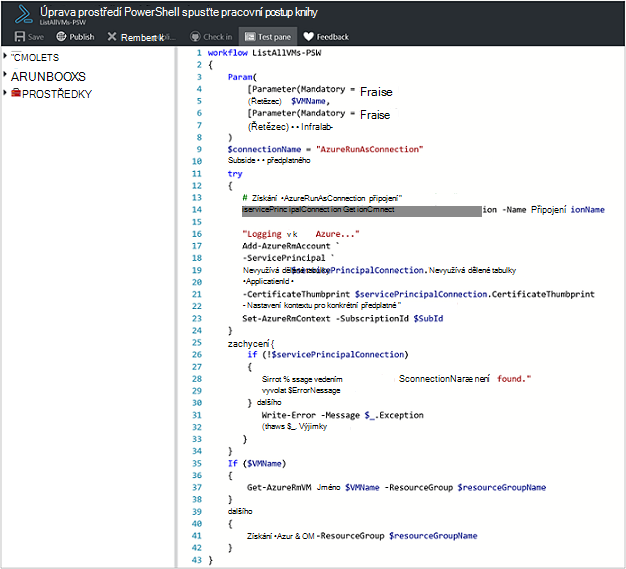

<properties
   pageTitle="Postupu Runbook vstupní parametry | Microsoft Azure"
   description="Vstupní parametry postupu Runbook zvyšte flexibilitu runbooks tím, že jste k předání dat postupu runbook po spuštění. Tento článek popisuje různé scénáře použití vstupních parametrů v runbooks."
   services="automation"
   documentationCenter=""
   authors="MGoedtel"
   manager="jwhit"
   editor="tysonn" />
<tags
   ms.service="automation"
   ms.devlang="na"
   ms.topic="article"
   ms.tgt_pltfrm="na"
   ms.workload="infrastructure-services"
   ms.date="10/11/2016"
   ms.author="sngun"/>

# <a name="runbook-input-parameters"></a>Postupu Runbook vstupních parametrů

Vstupní parametry postupu Runbook zvyšte flexibilitu runbooks tím, že jste k předání dat se po spuštění. Parametry povolit postupu runbook akce, které mají být určených pro konkrétní scénáře a prostředí. V tomto článku Nemůžeme vás provede jednotlivými různých scénářích použití vstupních parametrů v runbooks.

## <a name="configure-input-parameters"></a>Konfigurace vstupních parametrů

V prostředí PowerShell, prostředí PowerShell pracovního postupu a grafické runbooks je možné konfigurovat vstupních parametrů. Postupu runbook můžou obsahovat více parametrů s různými datovými typy nebo bez parametrů vůbec. Vstupní parametry může být povinné a nepovinné a můžete přiřadit výchozí hodnotu pro volitelné parametry. Při spuštění přes některé z dostupných metod, můžete přiřadit hodnoty na vstupní parametry postupu runbook. Těchto postupů patří postupu runbook počínaje portálu nebo webové služby. Můžete taky spustit jednu jako podřízené postupu runbook, která se nazývá textu v jiném postupu runbook.

## <a name="configure-input-parameters-in-powershell-and-powershell-workflow-runbooks"></a>Konfigurace vstupních parametrů v prostředí PowerShell a pracovních postupů prostředí PowerShell runbooks

Prostředí PowerShell a [runbooks prostředí PowerShell pracovního postupu](automation-first-runbook-textual.md) v Azure automatizaci podporují vstupních parametrů, které jsou definované pomocí následující atributy.  

| **Vlastnost** | **Popis** |
|:--- |:---|
| Typ | Povinné. Datový typ očekávaná hodnota parametru. Libovolný typ .NET je platný. |
| Jméno | Povinné. Název parametru. To musí být jedinečný v rámci postupu runbook a mohou obsahovat jenom písmena, čísla nebo podtržítka. Musí začínat písmenem. |
| Povinné | Volitelné. Určuje, zda je třeba zadat hodnotu parametru. Pokud má argument to **$true**, poté hodnoty třeba zadat při spuštění postupu runbook. Pokud má argument to **$false**, hodnota je nepovinný krok. |
| Výchozí hodnota | Volitelné.  Určuje hodnotu, která se použije pro parametr, pokud není hodnota předaný při spuštění postupu runbook. Výchozí hodnoty pro zadání parametru lze nastavit a automaticky provede parametr volitelné bez ohledu na nastavení povinné. |

Prostředí Windows PowerShell podporuje další atributy vstupních parametrů než můžou být uvedený tady, jako je ověřování, aliasy, a parametr určuje. Automatizace Azure však aktuálně podporuje pouze vstupních parametrů výše uvedené.

Definice parametrů v prostředí PowerShell pracovního postupu runbooks obsahuje následující obecné formuláři, kde jsou více parametrů oddělte je čárkami.

   ```
     Param
     (
         [Parameter (Mandatory= $true/$false)]
         [Type] Name1 = <Default value>,

         [Parameter (Mandatory= $true/$false)]
         [Type] Name2 = <Default value>
     )
   ```

>[AZURE.NOTE] Když definujete parametry, pokud nezadáte **povinný** atribut, pak ve výchozím nastavení parametru je nepovinná. Také pokud nastavit výchozí hodnotu parametru v prostředí PowerShell pracovního postupu runbooks ho se použije pomocí prostředí PowerShell jako volitelný parametr, bez ohledu na hodnotu **povinný** atribut.

Jako příklad nakonfigurujte si vstupních parametrů pro PowerShell pracovního postupu runbook, která zobrazí podrobnosti o virtuálních počítačích, OM jednoho nebo všech VMs v rámci skupiny zdrojů. Tohoto postupu runbook obsahuje dva parametry, jak je vidět na následující snímek obrazovky: název virtuálního počítače a název skupiny zdrojů.



Tento parametr definice parametrů **$VMName** a **$resourceGroupName** způsoby typu String jednoduchého parametry. Prostředí PowerShell a pracovních postupů prostředí PowerShell runbooks však podporují všechny jednoduché typy a komplexních typů, například **objekt** nebo **PSCredential** vstupních parametrů.

Pokud vaše postupu runbook vstupní parametr typu objektu, pak pomocí prostředí PowerShell hashtable s (jméno, hodnotu) dvojice předat hodnotu. Pokud například máte následujících parametrů v postupu runbook:

     [Parameter (Mandatory = $true)]
     [object] $FullName

Můžete pak předat parametr následující hodnotu:

    @{"FirstName"="Joe";"MiddleName"="Bob";"LastName"="Smith"}


## <a name="configure-input-parameters-in-graphical-runbooks"></a>Konfigurace vstupních parametrů v grafické runbooks

[Konfigurace grafické postupu runbook](automation-first-runbook-graphical.md) s vstupních parametrů Vytvořme grafické postupu runbook, která zobrazí podrobnosti o virtuálních počítačích, OM jednoho nebo všech VMs v rámci skupiny zdrojů. Konfigurace postupu runbook obsahuje dva hlavní aktivity, podle níže uvedeného popisu.

[**Ověření Runbooks s účtem Azure spustit jako**](automation-sec-configure-azure-runas-account.md) ověření s Azure.

[**Get-AzureRmVm**](https://msdn.microsoft.com/library/mt603718.aspx) zobrazíte vlastnosti virtuálních počítačích.

Aktivity [**Zápisu výstup**](https://technet.microsoft.com/library/hh849921.aspx) umožňuje výstup názvy virtuálních počítačích. Aktivity **Get-AzureRmVm** přijme dvěma parametry, **virtuální počítač název** a **název skupiny prostředků**. Protože tyto parametry může vyžadovat různé hodnoty při každém spuštění postupu runbook, můžete přidat vstupní parametry do svého postupu runbook. Tady je postup přidání vstupních parametrů:

1. Vyberte grafické postupu runbook zásuvné **Runbooks** a potom klikněte na [**Upravit**](automation-graphical-authoring-intro.md) ho.

2. V editoru postupu runbook klikněte na **vstupní a výstupní** otevřete zásuvné **vstupní a výstupní** .

    

3. **Vstupní a výstupní** zásuvné zobrazuje seznam vstupních parametrů, které jsou definované pro postupu runbook. V tomto zásuvné můžete přidat nové vstupní parametry nebo upravit konfigurace existující vstupní parametry. Pokud chcete přidat nový parametr postupu runbook, klikněte na **Přidat vstupní** otevřete zásuvné **vstupní parametry postupu Runbook** . Tady můžete nakonfigurovat následující parametry:

  	| **Vlastnost** | **Popis** |
  	|:--- |:---|
  	| Jméno | Povinné.  Název parametru. To musí být jedinečný v rámci postupu runbook a mohou obsahovat jenom písmena, čísla nebo podtržítka. Musí začínat písmenem. |
  	| Popis | Volitelné. Popis účelu vstupní parametry. |
  	| Typ | Volitelné. Datový typ, který je očekávaná hodnota parametru. Typy podporovaného parametrů jsou **řetězce**, **Int32**, **Int64**, **desetinné**, **Boolean**, **data a času**a **objektu**. Pokud není vybrána datový typ, ve výchozím nastavení **řetězec**. |
  	| Povinné | Volitelné. Určuje, zda je třeba zadat hodnotu parametru. Pokud se rozhodnete **Ano**, pak hodnotu třeba zadat při spuštění postupu runbook. Pokud se rozhodnete **žádné**, pak hodnota není potřeba při spuštění postupu runbook a může nastavit výchozí hodnotu. |
  	| Výchozí hodnota | Volitelné. Určuje hodnotu, která se použije pro parametr, pokud není hodnota předaný při spuštění postupu runbook. Výchozí hodnoty můžete nastavit pro parametr, který není povinný. Chcete-li nastavit výchozí hodnotu, zvolte **vlastní**. Tato hodnota se používá, pokud není jinou hodnotu je při spuštění postupu runbook. Vyberte **žádný** , pokud nechcete, aby k poskytování každá výchozí hodnota. |  

    

4. Vytvořte dva parametry s následujícími vlastnostmi, které se použije **Get-AzureRmVm** aktivity:

    - **Parametr1:**
      - Název - VMName
      - Typ - řetězec
      - Povinná – ne

    - **Parametr2:**
      - Název - resourceGroupName
      - Typ - řetězec
      - Povinný – ne
      - Výchozí hodnota - vlastní
      - Vlastní výchozí hodnotu - \<název skupiny zdroje, které obsahuje virtuálních počítačích >

5. Jakmile přidáte parametry, klikněte na **OK**.  Můžete teď tyto informace zobrazit v **vstupní a výstupní zásuvné**. Klikněte na tlačítko **OK** a potom klikněte na **Uložit** a **Publikovat** svůj postupu runbook.

## <a name="assign-values-to-input-parameters-in-runbooks"></a>Přiřazení hodnot a ty pak zadat parametrů v runbooks

Předáte hodnot a ty pak vstupní parametry v runbooks v následujících scénářích.

### <a name="start-a-runbook-and-assign-parameters"></a>Spusťte postupu runbook a přiřadit parametry

Postupu runbook mohli začít mnoha způsoby: pomocí portálu Azure s webhook, pomocí rutin prostředí PowerShell, pomocí rozhraní REST API nebo se v SDK. Tady vidíte probereme tato témata různé metody uzavřená postupu runbook do přiřazení parametry.

#### <a name="start-a-published-runbook-by-using-the-azure-portal-and-assign-parameters"></a>Spusťte publikované postupu runbook pomocí portálu Azure a přiřadit parametry

Při [zahájení postupu runbook](automation-starting-a-runbook.md#starting-a-runbook-with-the-azure-portal)otevře zásuvné **Zahájení postupu Runbook** a konfigurace hodnoty parametrů, které jste právě vytvořili.


V popisku pod vstupním poli vidí atributy nastavené pro parametr. Atributy zahrnují povinné a nepovinné, typ a výchozí hodnota. V bublině nápovědy vedle název parametru zobrazí se všechny klíčové informace, které je potřeba rozhodovat o vstupní hodnoty parametrů. Tyto informace zahrnují zda parametru je povinné a nepovinné. Obsahuje taky typ a výchozí hodnota (pokud existuje) a další užitečné poznámky.


>[AZURE.NOTE] Parametry typu řetězec podporují **prázdné** hodnoty řetězce.  Zadání **[prázdný řetězec]** do pole vstupní parametry předá prázdný řetězec parametr. Parametry typu řetězec také nepodporují **prázdných** hodnot, které se předávají funkcím. Pokud není předáte každá hodnota parametru řetězce, pak prostředí PowerShell budou interpretovat ho jako hodnota null.

#### <a name="start-a-published-runbook-by-using-powershell-cmdlets-and-assign-parameters"></a>Pomocí rutin prostředí PowerShell spusťte publikované postupu runbook a přiřadit parametry

  - **Správce prostředků azure rutin:** Automatizace postupu runbook, vytvořený ve skupině zdrojů pomocí [Start AzureRmAutomationRunbook](https://msdn.microsoft.com/library/mt603661.aspx)můžete začít.

    **Příklad:**

   ```
    $params = @{“VMName”=”WSVMClassic”;”resourceGroupeName”=”WSVMClassicSG”}
 
    Start-AzureRmAutomationRunbook -AutomationAccountName “TestAutomation” -Name “Get-AzureVMGraphical” –ResourceGroupName $resourceGroupName -Parameters $params
   ```

  - **Rutiny pro správu služby azure:** Automatizace postupu runbook, vytvořený ve výchozí skupině zdrojů pomocí [Start AzureAutomationRunbook](https://msdn.microsoft.com/library/dn690259.aspx)můžete začít.

    **Příklad:**

   ```
    $params = @{“VMName”=”WSVMClassic”; ”ServiceName”=”WSVMClassicSG”}

    Start-AzureAutomationRunbook -AutomationAccountName “TestAutomation” -Name “Get-AzureVMGraphical” -Parameters $params
   ```

>[AZURE.NOTE] Když začnete postupu runbook pomocí rutin prostředí PowerShell, parametr výchozí **MicrosoftApplicationManagementStartedBy** vznikne s hodnotou **Powershellu**. Tento parametr můžete zobrazit v zásuvné **Podrobnosti projektu** .  

#### <a name="start-a-runbook-by-using-an-sdk-and-assign-parameters"></a>Zahájit postupu runbook pomocí SDK a přiřadit parametry

  - **Správce prostředků azure metoda:** Zahájit postupu runbook pomocí SDK programovací jazyk. Níže je C# kódu pro spuštění postupu runbook ve vašem účtu automatizaci. Celý kód můžete zobrazit v naší [GitHub úložiště](https://github.com/Azure/azure-sdk-for-net/blob/master/src/ResourceManagement/Automation/Automation.Tests/TestSupport/AutomationTestBase.cs).  

   ```
     public Job StartRunbook(string runbookName, IDictionary<string, string> parameters = null)
        {
          var response = AutomationClient.Jobs.Create(resourceGroupName, automationAccount, new JobCreateParameters
           {
              Properties = new JobCreateProperties
               {
                  Runbook = new RunbookAssociationProperty
                   {
                     Name = runbookName
                   },
                     Parameters = parameters
               }
           });
        return response.Job;
        }
   ```

  - **Způsob správy služby azure:** Zahájit postupu runbook pomocí SDK programovací jazyk. Níže je C# kódu pro spuštění postupu runbook ve vašem účtu automatizaci. Celý kód můžete zobrazit v naší [GitHub úložiště](https://github.com/Azure/azure-sdk-for-net/blob/master/src/ServiceManagement/Automation/Automation.Tests/TestSupport/AutomationTestBase.cs).

   ```      
    public Job StartRunbook(string runbookName, IDictionary<string, string> parameters = null)
      {
        var response = AutomationClient.Jobs.Create(automationAccount, new JobCreateParameters
      {
        Properties = new JobCreateProperties
           {
             Runbook = new RunbookAssociationProperty
           {
             Name = runbookName
                },
                  Parameters = parameters
                }
         });
        return response.Job;
      }
   ```

  Tento způsob zahájíte vytvořte slovník pro ukládání parametry postupu runbook, **VMName** a **resourceGroupName**a jejich hodnoty. Spusťte postupu runbook. Níže je C# fragment kódu pro volání metodu, která je definován nad.

   ```
    IDictionary<string, string> RunbookParameters = new Dictionary<string, string>();

    // Add parameters to the dictionary.
    RunbookParameters.Add("VMName", "WSVMClassic");
    RunbookParameters.Add("resourceGroupName", "WSSC1");

    //Call the StartRunbook method with parameters
    StartRunbook(“Get-AzureVMGraphical”, RunbookParameters);
   ```

#### <a name="start-a-runbook-by-using-the-rest-api-and-assign-parameters"></a>Zahájit postupu runbook pomocí rozhraní REST API a přiřadit parametry

Úlohy postupu runbook lze vytvořit a pracovat s REST API automatizaci Azure pomocí metody **umístění** s následující požadavek URI.

    https://management.core.windows.net/<subscription-id>/cloudServices/<cloud-service-name>/resources/automation/~/automationAccounts/<automation-account-name>/jobs/<job-id>?api-version=2014-12-08`

V pozvánce na schůzku URI nahraďte následujících parametrů:

  - **id předplatného:** ID Azure předplatného.  
  - **název cloudové služby:** Název cloudové služby, na kterém má být žádost odeslána.  
  - **automatizaci název účtu:** Název účtu automatizaci, který je umístěn na zadaný cloudovou službu.  
  - **id úlohy:** Identifikátor GUID pro daný úkol. GUID v prostředí PowerShell můžete vytvořený s využitím **[GUID]::NewGuid(). ToString()** příkaz.

K předání parametrů postupu runbook projektu, použijte požadavku. Trvá následující dvě vlastnosti podle formátu JSON:

  - **Postupu Runbook název:** Povinné. Název postupu runbook úlohy na spustit.  
  - **Postupu Runbook parametry:** Volitelné. Slovník seznamu parametrů v (jméno, hodnotu) formátování kde název by měl být typu řetězec a hodnota může být libovolná platná hodnota JSON.

Pokud chcete začít postupu runbook **Get-AzureVMTextual** , který byl vytvořený pomocí **VMName** a **resourceGroupName** jako parametry, použijte v tomto formátu JSON pro požadavku.

   ```
    {
      "properties":{
        "runbook":{
        "name":"Get-AzureVMTextual"},
      "parameters":{
         "VMName":"WSVMClassic",
         "resourceGroupName":”WSCS1”}
        }
    }
   ```

Pokud úloha úspěšně vytvořena, bude vrácena 201 HTTP stavový kód. Další informace o záhlaví odpověď a těle odpovědi naleznete v článku o tom, jak [vytvoření postupu runbook úlohy pomocí rozhraní REST API.](https://msdn.microsoft.com/library/azure/mt163849.aspx)

### <a name="test-a-runbook-and-assign-parameters"></a>Test postupu runbook a přiřadit parametry

Při [testování pracovní verze vaší postupu runbook](automation-testing-runbook.md) pomocí možnosti test otevře zásuvné **otestujte** a můžete nakonfigurovat hodnoty parametrů, které jste právě vytvořili.


### <a name="link-a-schedule-to-a-runbook-and-assign-parameters"></a>Odkaz postupu runbook plán a přiřadit parametry

Můžete [Odkaz plánu](automation-schedules.md) vaší postupu runbook tak, aby postupu runbook začíná určitou dobu. Vstupní parametry přiřadíte při vytváření plánu a postupu runbook bude použijte tyto hodnoty, pokud je spuštěn podle plánu. Plán nelze uložit, dokud všechny hodnoty povinné parametrů jsou k dispozici.


### <a name="create-a-webhook-for-a-runbook-and-assign-parameters"></a>Vytvoření webhook pro postupu runbook a přiřadit parametry

Můžete vytvořit [webhook](automation-webhooks.md) pro vaše postupu runbook a konfigurace vstupních parametrů postupu runbook. Webhook nelze uložit, dokud všechny hodnoty povinné parametrů jsou k dispozici.


Po spuštění postupu runbook pomocí webhook předdefinovanou vstupní parametry odeslání **[Webhookdata](automation-webhooks.md#details-of-a-webhook)** , spolu s vstupních parametrů, které jste definovali. Klikněte na tlačítko rozbalte parametr **WebhookData** další podrobnosti.


## <a name="next-steps"></a>Další kroky

- Další informace o postupu runbook vstupní a výstupní najdete v tématu [Azure automatizace: postupu runbook vstupní výstup a vnořené runbooks](https://azure.microsoft.com/blog/azure-automation-runbook-input-output-and-nested-runbooks/).
- Podrobnosti o různé způsoby, jak začít postupu runbook najdete v tématu [spuštění postupu runbook](automation-starting-a-runbook.md).
- Chcete-li upravit textový postupu runbook, v nápovědě k [textové runbooks úpravy](automation-edit-textual-runbook.md).
- Upravit grafické postupu runbook, podívejte se do [grafické authoring v Azure automatizaci](automation-graphical-authoring-intro.md).
