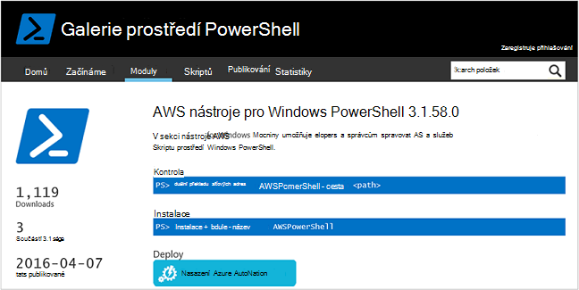
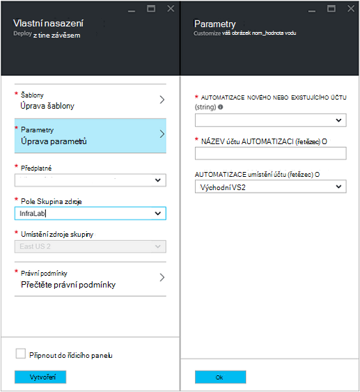
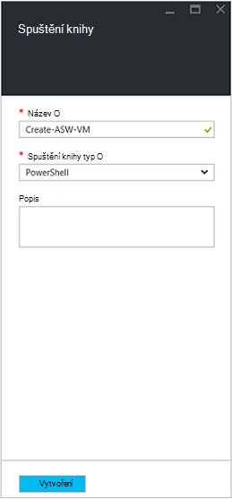
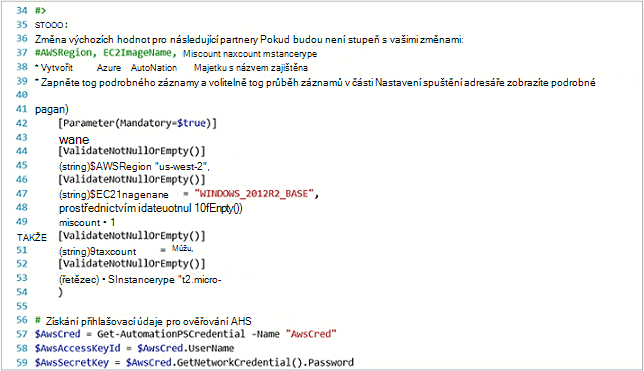
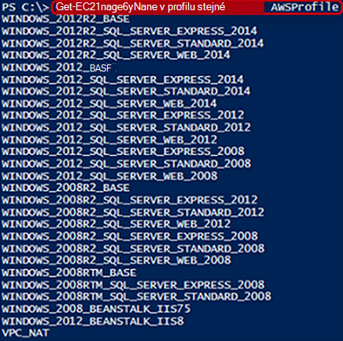
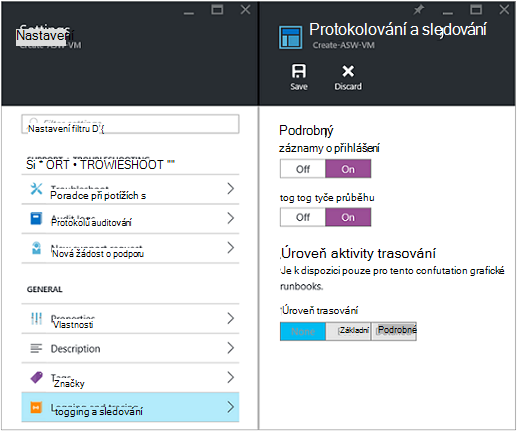
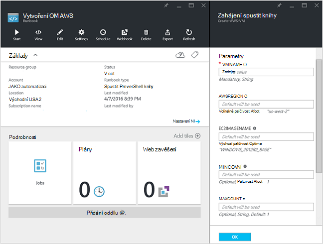
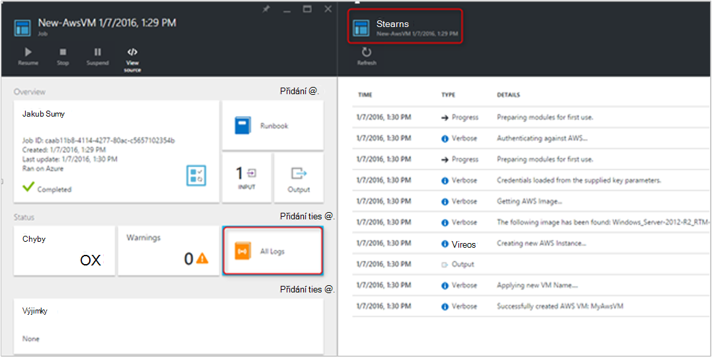
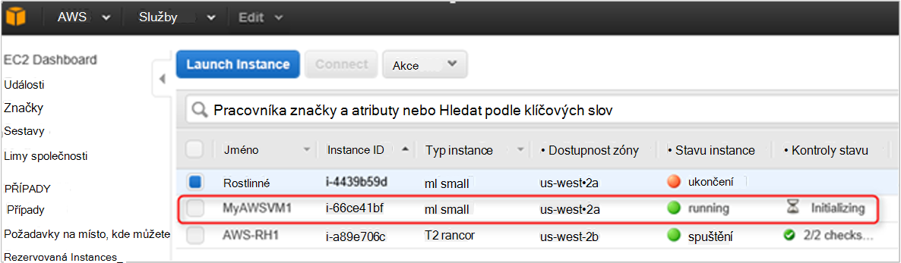

<properties
   pageTitle="Automatizace nasazení OM ve webových službách Amazon | Microsoft Azure"
   description="Tento článek ukazuje, jak pomocí Azure automatizaci automatizovat vytváření poštovních OM Amazon webové služby"
   services="automation"
   documentationCenter=""
   authors="mgoedtel"
   manager="jwhit"
   editor="" />
<tags
   ms.service="automation"
   ms.devlang="na"
   ms.topic="article"
   ms.tgt_pltfrm="na"
   ms.workload="na"
   ms.date="08/17/2016"
   ms.author="tiandert; bwren" />

# <a name="azure-automation-scenario---provision-an-aws-virtual-machine"></a>Azure automatizaci scénář – poskytování AWS virtuálního počítače 

V tomto článku jsme ukazují, jak můžete využít Azure automatizaci zřízení virtuálního počítače v předplatném Amazon webové služby AWS a pojmenujte této OM konkrétní – který AWS odkazuje jako "označování" OM.

## <a name="prerequisites"></a>Zjistit předpoklady pro

Pro účely tohoto článku musíte mít účet Azure automatizaci a předplatné AWS. Další informace o nastavení účet Azure automatizaci a konfiguraci pomocí svých přihlašovacích údajů předplatné AWS kontrola [Konfigurace ověřování pomocí Amazon webové služby](../automation/automation-sec-configure-aws-account.md).  Tento účet by měl vytvořila nebo aktualizovala pomocí svých přihlašovacích údajů předplatné AWS než budete pokračovat, protože jsme bude odkazovat tento účet v následujících krocích.


## <a name="deploy-amazon-web-services-powershell-module"></a>Nasazení modul Powershellu Amazon webové služby

Náš OM zřizování postupu runbook bude využít modulu AWS PowerShell dělat svou práci. Proveďte následující kroky přidání modulu ke svému účtu automatizaci nakonfigurovaný pomocí svých přihlašovacích údajů AWS předplatného.  

1. Otevřete webový prohlížeč a přejděte do [Galerie prostředí PowerShell](http://www.powershellgallery.com/packages/AWSPowerShell/) a klikněte na **instalovat na tlačítko Automatické Azure**.<br> 

2. Přejdete na Azure přihlašovací stránku a po ověření, můžete se přesměrované do portálu Azure a zobrazí následující zásuvné.<br> 

3. Skupina zdroje vyberte z rozevíracího seznamu **Skupina zdroje** a na zásuvné parametry, zadejte následující informace:
   * V rozevíracím seznamu **nové nebo existující automatizaci účtu (řetězec)** vyberte **existující**.  
   * Do pole **Název účtu automatizaci (řetězec)** zadejte přesný název automatizaci účet, který obsahuje přihlašovací údaje pro vaše předplatné AWS.  Pokud jste vytvořili vyhrazený účet s názvem **AWSAutomation**, pak, která je například zadejte do pole.
   * Vyberte příslušnou oblast z rozevíracího seznamu **Umístění automatizaci účtu** .

4. Po dokončení zadávání požadovaných informací klikněte na **vytvořit**.

    >[AZURE.NOTE]Při importu modulu prostředí PowerShell do Azure automatizaci, ho je také extrahování rutin a tyto činnosti se nezobrazí, dokud modulu proběhla úplně import a extrahování rutiny. Tento proces může trvat několik minut.  
<br>
5. Na portálu Azure otevřete svůj účet automatizaci odkazuje v kroku 3.
6. Klikněte na dlaždici **prostředky** a na zásuvné **prostředky** , vyberte dlaždici **modulů** .
7. Na zásuvné **moduly** uvidíte modulu **AWSPowerShell** v seznamu.

## <a name="create-aws-deploy-vm-runbook"></a>Vytvoření AWS nasazení postupu runbook OM

Po nasazení modulu PowerShell AWS vytváříme můžete nyní postupu runbook k automatizaci zřizování virtuálního počítače v AWS pomocí skriptů Powershellu. Postupem ukazují, jak můžete využít nativní skript Powershellu v Azure automatizaci.  

>[AZURE.NOTE] Další možnosti a informace týkající se tohoto skriptu navštivte [Galerie Powershellu](https://www.powershellgallery.com/packages/New-AwsVM/DisplayScript).


1. Stažení skriptu prostředí PowerShell New-AwsVM z Galerie prostředí PowerShell otevřením relaci Powershellu a zadáním následujících akcí:<br>
   ```
   Save-Script -Name New-AwsVM -Path \<path\>
   ```
<br>
2. Z portálu Microsoft Azure si potřebujete založit účet automatizaci a klikněte na dlaždici **Runbooks** .  
3. Z zásuvné **Runbooks** vyberte **Přidat postupu runbook**.
4. Na zásuvné **Přidat postupu runbook** vyberte možnost **Vytvořit** (vytvoření nového postupu runbook).
5. Na zásuvné vlastnosti **postupu Runbook** zadejte název do pole název pro vaše postupu runbook a od **postupu Runbook typ** rozevíracím seznamu vyberte **Powershellu**a klikněte na **vytvořit**.<br> 
6. Když se zobrazí zásuvné upravit postupu Runbook Powershellu, zkopírujte a vložte skript Powershellu postupu runbook vytváření plátno.<br> <br>

    >[AZURE.NOTE] Dejte pozor následující při práci s obrázky v příkladu skript Powershellu:
    >
    > - Postupu runbook obsahuje počet výchozí hodnoty parametrů. Vyhodnocení všechny výchozí hodnoty a upravte v případě potřeby.
    > - Pokud uložených přihlašovacích údajů AWS jako jiný název než **AWScred**majetek přihlašovacích údajů, budou potřebujete aktualizovat skriptu na řádek 57 podle příslušným způsobem.  
    > - Při práci s příkazy AWS rozhraní příkazového řádku v prostředí PowerShell, zejména v tomto příkladu postupu runbook, je nutné zadat oblasti AWS. V opačném rutin se nezdaří.  Umožňuje zobrazte AWS téma [Určit oblast AWS](http://docs.aws.amazon.com/powershell/latest/userguide/pstools-installing-specifying-region.html) AWS nástroje pro dokument prostředí PowerShell další podrobnosti.  
<br>
7. Načtěte seznam jmen obrázek ze svého předplatného AWS, spusťte PowerShell ISE a importujte modul AWS Powershellu.  Ověřování AWS nahrazením **Get-AutomationPSCredential** ve vašem prostředí ISE s **AWScred = Get-pověření**.  To zobrazí výzvu pro svoje přihlašovací údaje a můžete zadáte svoje **ID klíče přístup** pro uživatelské jméno a **Tajná přístupová klávesa** k zadání hesla.  Viz následující příklad:

        #Sample to get the AWS VM available images
        #Please provide the path where you have downloaded the AWS PowerShell module
        Import-Module AWSPowerShell
        $AwsRegion = "us-west-2"
        $AwsCred = Get-Credential
        $AwsAccessKeyId = $AwsCred.UserName
        $AwsSecretKey = $AwsCred.GetNetworkCredential().Password

        # Set up the environment to access AWS
        Set-AwsCredentials -AccessKey $AwsAccessKeyId -SecretKey $AwsSecretKey -StoreAs AWSProfile
        Set-DefaultAWSRegion -Region $AwsRegion

        Get-EC2ImageByName -ProfileName AWSProfile
   Vrátí následující výstup:<br>
     
8. Zkopírujte a vložte je názvy obrázků automatizaci proměnné jako odkazovaného v postupu runbook jako **$InstanceType**. Protože jsou v tomto příkladu jsme pomocí bezplatné AWS vrstveny předplatného, použijeme **t2.micro** našem příkladu postupu runbook.
9. Uložení postupu runbook a potom klikněte na **Publikovat** publikovat postupu runbook a potom **Ano** po zobrazení výzvy.


### <a name="testing-the-aws-vm-runbook"></a>Testování postupu runbook AWS OM
Před pokračováním s testování postupu runbook, potřebujeme ověření několik věcí. Konkrétně:

   -  Aktiva pro ověřování AWS byl vytvořen jen **AWScred** nebo aktualizoval skript neodkazuje název materiálů přihlašovacích údajů.  
   -  Importoval modulu AWS PowerShell v Azure automatizaci
   -  Vytvořila nové postupu runbook a hodnoty parametrů byly ověření a podle potřeby je aktualizován
   -  **Protokol podrobného** a volitelně **protokolu průběh záznamů** podle postupu runbook nastavení **protokolování a sledování** nastaveno na **zapnuto**.<br> 

1. Chceme zahájení postupu runbook, takže klikněte na tlačítko **Start** a až se otevře zásuvné zahájení postupu Runbook klepněte na tlačítko **OK** .
2. Na zásuvné postupu Runbook Start zadejte **VMname**.  Přijměte výchozí hodnoty parametrů, které můžete automaticky předem nakonfigurovaná ve skriptu dříve.  Kliknutím na **OK** spusťte úlohy postupu runbook.<br> 
3. Podokno úloh upraveného postupu runbook projektu, který jsme vytvořili. Zavřete toto podokno.
4. Můžete zobrazit průběh úlohy a zobrazení výstupních **datových proudů** tak, že vyberete **Všechny protokoly** dlaždice z zásuvné úlohy postupu runbook.<br> 
5. Abyste si ověřili, že máte jsou k dispozici OM, přihlaste se k AWS Management Console Pokud nejste přihlášeni aktuálně.<br> 

## <a name="next-steps"></a>Další kroky
-   Začínáme s grafickým runbooks, najdete v tématu [Můj první grafické postupu runbook](automation-first-runbook-graphical.md)
-   Začínáme s runbooks prostředí PowerShell pracovního postupu, najdete v článku [svůj první postupu runbook prostředí PowerShell pracovního postupu](automation-first-runbook-textual.md)
-   Další informace o postupu runbook typů a jejich výhody omezení, najdete v tématu [typy postupu runbook automatizaci Azure](automation-runbook-types.md)
-   Další informace o skript Powershellu podporovat funkce najdete v článku [skriptu nativní PowerShell podpory pro automatizaci Azure](https://azure.microsoft.com/blog/announcing-powershell-script-support-azure-automation-2/)
