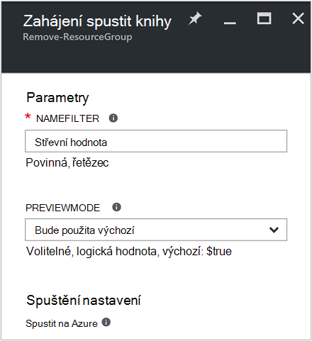
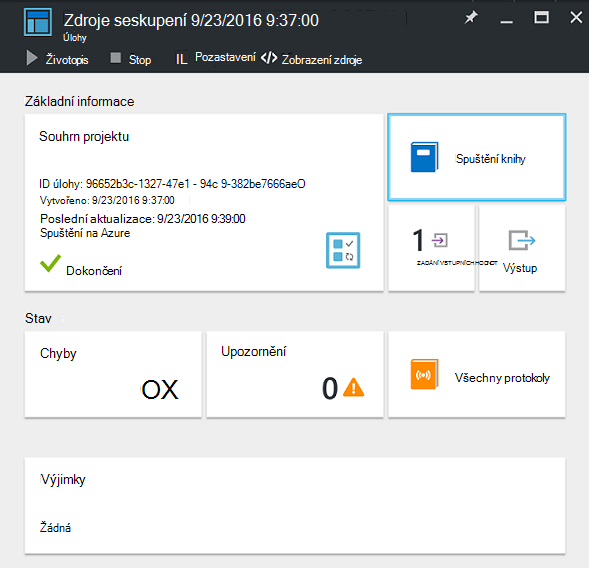
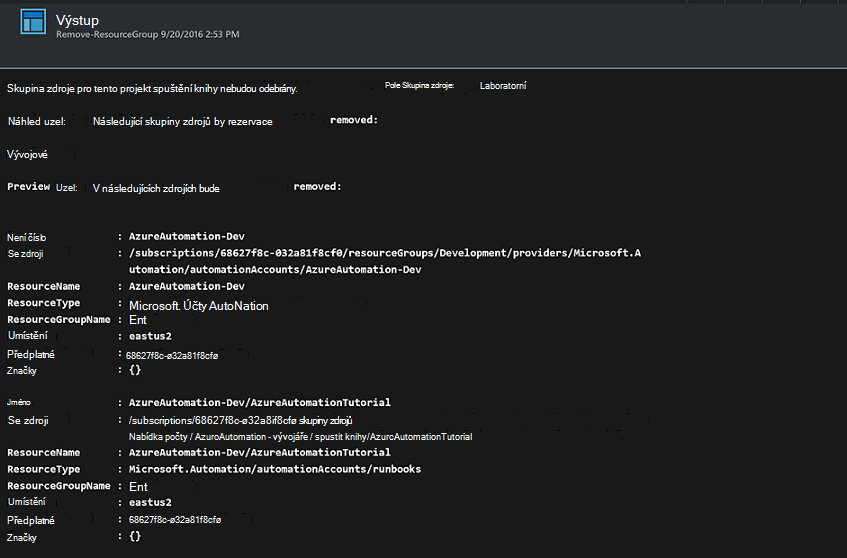

<properties
    pageTitle="Automatizace odebrání skupiny zdrojů | Microsoft Azure"
    description="Verze pracovního postupu prostředí PowerShell scénáři automatizaci Azure včetně runbooks odebrat všechny skupiny prostředků ve vašem předplatném."
    services="automation"
    documentationCenter=""
    authors="MGoedtel"
    manager="jwhit"
    editor=""
    />
<tags
    ms.service="automation"
    ms.workload="tbd"
    ms.tgt_pltfrm="na"
    ms.devlang="na"
    ms.topic="get-started-article"
    ms.date="09/26/2016"
    ms.author="magoedte"/>

# Azure automatizaci scénář – automatizovat odebrání skupiny zdrojů

Množství zákazníků vytvořit maximálně jedno pole Skupina zdroje. Některé asi zvyklí pro správu produkční aplikace a ostatní mohou sloužit jako vývoj, testování a pracovní prostředí. Automatizace nasazení tyto materiály jednoho sloupce, ale schopnosti vyřadit skupina zdroje kliknutím na tlačítko druhého. Pomocí funkce Azure automatizace můžete zjednodušit této běžné úlohy správy. Toto je užitečné v případě, že pracujete s předplatným Azure výdajů limit pomocí nabídky k člena jako MSDN nebo program Microsoft Partner Network Cloud Essentials.

Tento scénář se podle postupu runbook prostředí PowerShell a slouží k odebrání jednu nebo více skupin zdroje, které určíte ze svého předplatného. Výchozí nastavení postupu runbook je otestovat, než budete pokračovat. Zajistíte tím, že není odstraníte omylem skupina zdroje předtím, než si budete chtít tento postup.   

## Získání scénáře

Tento scénář se skládá z prostředí PowerShell postupu runbook, který si můžete stáhnout z [Galerie Powershellu](https://www.powershellgallery.com/packages/Remove-ResourceGroup/1.0/DisplayScript). Můžete taky importovat ho přímo z [Galerie postupu Runbook](automation-runbook-gallery.md) Azure portálu.  

Postupu Runbook | Popis|
----------|------------|
Odebrat ResourceGroup | Odebere jeden nebo více skupin Azure zdrojů a přidružené prostředky z předplatného.  
 
Následující vstupních parametrů jsou definované pro tohoto postupu runbook:

Parametr | Popis|
----------|------------|
NameFilter (povinné) | Určuje název filtru můžete omezit skupiny zdrojů, které chcete, aby byla o odstranění. Předáte více hodnot pomocí seznamu hodnotami oddělenými čárkou. Filtr není velká a malá písmena a budou shodovat libovolné pole Skupina zdroje, který obsahuje řetězec.|
PreviewMode (volitelné) | Spustí postupu runbook zobrazíte skupiny zdroje, které chcete odstranit, ale trvá žádná akce. Výchozí hodnota je **PRAVDA** se tím vyhnout náhodného odstranění jednoho nebo více skupin zdrojů předaný postupu runbook.  

## Nainstalujte a nakonfigurujte tento scénář

### Zjistit předpoklady pro

Tohoto postupu runbook ověří [Azure spustit jako účet](automation-sec-configure-azure-runas-account.md).    

### Instalace a publikovat runbooks

Po stažení postupu runbook importujete ho pomocí postupu v [Import postupu runbook postupy](automation-creating-importing-runbook.md#importing-a-runbook-from-a-file-into-Azure-Automation). Po byly bezpečně naimportované do vašeho účtu automatizaci publikujte postupu runbook.

## Pomocí postupu runbook

Podle těchto kroků vás provede jednotlivými plnění tohoto postupu runbook a pomozte seznámit se s jak to funguje. Můžete se jenom být testování postupu runbook v tomto příkladu odstranění nejsou skutečně skupiny zdrojů.  

1. Z portálu Microsoft Azure si potřebujete založit účet automatizaci a klikněte na **Runbooks**.
2. Vyberte **Odebrat ResourceGroup** postupu runbook a klikněte na tlačítko **Start**.
3. Při spuštění postupu runbook zásuvné **Zahájení postupu Runbook** otevře a nakonfigurujte parametry. Do vašeho předplatného, můžete použít k testování a bude poškodit žádné omylem odstranili zadejte jména skupiny zdrojů.  

    >[AZURE.NOTE] Zkontrolujte, že **Previewmode** je nastavený na **hodnotu true** pro předcházení odstranění vybraných skupin zdrojů.  **Poznámka:** , že tohoto postupu runbook neodebere skupina zdroje, který obsahuje účet automatizaci, na kterém běží tohoto postupu runbook.  

4. Po dokončení konfigurace všechny parametr hodnoty, klikněte na tlačítko **OK**a postupu runbook bude ve frontě pro spuštění.  

Pokud chcete zobrazit podrobnosti o postupu runbook úlohy **Odebrat ResourceGroup** na portálu Azure, vyberte **úlohy** v postupu runbook. Souhrnné úkoly zobrazí vstupní parametry a toku výstup kromě obecné informace o projektu a požadované výjimky došlo k chybě.  .

**Souhrn projektu** zahrnuje zprávy z výstupu, upozornění a datových proudů chyby. Vyberte **výstup** zobrazíte podrobné výsledky spuštění postupu runbook.  

## Další kroky

- Začít vytvářet vlastní postupu runbook, najdete v článku [Vytvoření nebo do ní importují postupu runbook v Azure automatizaci](automation-creating-importing-runbook.md).
- Začít pracovat s runbooks prostředí PowerShell pracovního postupu, najdete v tématu [Můj první prostředí PowerShell pracovního postupu runbook](automation-first-runbook-textual.md).
