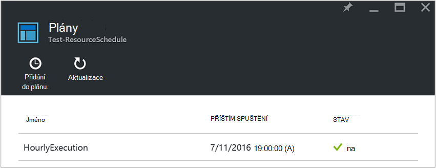
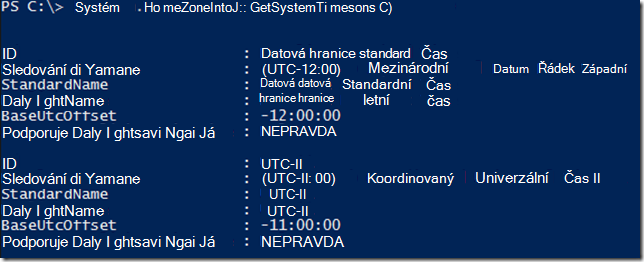
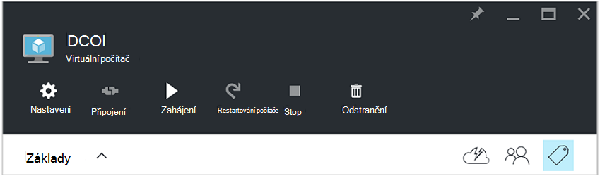
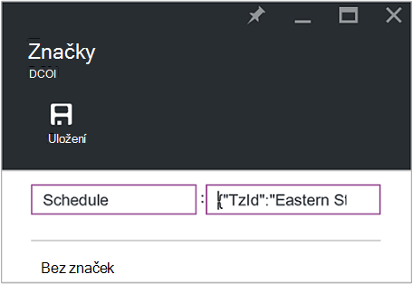
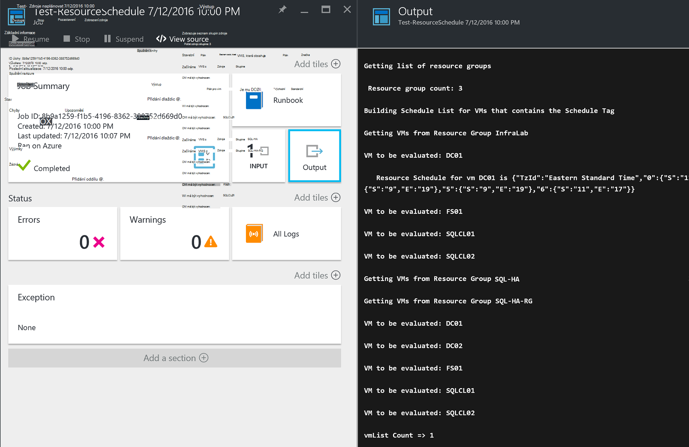

<properties
   pageTitle="Použití formátu JSON značky k vytvoření plánu pro Azure OM spuštění a ukončení | Microsoft Azure"
   description="Tento článek ukazuje, jak používat JSON řetězce značek k automatizaci plánování OM spuštění a ukončení."
   services="automation"
   documentationCenter=""
   authors="MGoedtel"
   manager="jwhit"
   editor="tysonn" />
<tags
   ms.service="automation"
   ms.devlang="na"
   ms.topic="article"
   ms.tgt_pltfrm="na"
   ms.workload="infrastructure-services"
   ms.date="07/18/2016"
   ms.author="magoedte;paulomarquesc" />

# Azure automatizaci scénáře: použití formátu JSON značky k vytvoření plánu pro Azure OM spuštění a ukončení

Zákazníci se často chcete naplánovat při spuštění a ukončení virtuálních počítačích a pomůže snížit náklady předplatné nebo podporu ve firmě a technické požadavky.  

Následující scénář umožňuje nastavit automatické spuštění a ukončení svého VMs pomocí značku s názvem plán na úrovni virtuálního počítače v Azure nebo úrovně seskupení zdrojů. Tento kalendář je možné konfigurovat od pondělí až neděle s uvedením času spouštění a čas ukončení.  

Máme možnostmi mimo pole. Jedná se o:
-  Pomocí nastavení automatické měřítko, které vám umožní zobrazit či oddálení [Nastaví měřítko virtuálního počítače](../virtual-machine-scale-sets/virtual-machine-scale-sets-overview.md) .
- Služba [DevTest Labs](../devtest-lab/devtest-lab-overview.md) , která obsahuje předdefinované možnosti plánování operace při spuštění a ukončení.

Však tyto možnosti podporují pouze konkrétních situacích a nemohou být použity k VMs infrastruktury jako-service (IaaS).   

Když použijete značku plánu je skupina zdroje, použije se také na všechny virtuálních počítačích do tohoto pole Skupina zdroje. Pokud plán platí taky přímo do virtuálního počítače, na poslední plán přednost v následujícím pořadí:

1.  Plán použité pro skupinu zdrojů
2.  Plán použité u pole Skupina zdroje a virtuálního počítače ve skupině zdroje
3.  Plán použité u virtuálního počítače

Tento scénář v podstatě JSON řetězec s zadaného formátu a přidá jako hodnota pro značku s názvem plánu. Klikněte postupu runbook obsahuje seznam všech skupin zdrojů a virtuálních počítačích a identifikuje plány pro každou OM podle výše uvedených scénáře. Potom prochází VMs, které mají plány připojené a vyhodnotí, jakou akci by měla být přijata. Například zjistí, které VMs potřeba zastavit, vypněte nebo ignorována.

Tyto runbooks ověřovat pomocí [Azure spustit jako účet](../automation/automation-sec-configure-azure-runas-account.md).

## Stáhněte si runbooks scénáře

Tento scénář se skládá ze čtyř runbooks pracovního postupu Powershellu, které si můžete stáhnout z [Galerie TechNet](https://gallery.technet.microsoft.com/Azure-Automation-Runbooks-84f0efc7) nebo [GitHub](https://github.com/paulomarquesdacosta/azure-automation-scheduled-shutdown-and-startup) úložiště pro tento projekt.

Postupu Runbook | Popis
----------|----------
Test-ResourceSchedule | Zkontroluje, každý plán virtuálního počítače a provede vypnout nebo při spuštění v závislosti na plán.
Přidání ResourceSchedule | Přidá značku plánu do skupiny OM nebo zdroje.
Aktualizace ResourceSchedule | Existující značku plán upraví nahrazením novou.
Odebrat ResourceSchedule | Odebere značku plánu ze skupiny OM nebo zdroje.

## Nainstalujte a nakonfigurujte tento scénář

### Instalace a publikovat runbooks

Po stažení runbooks, můžete je importovat pomocí postupu v [vytváření nebo do ní importují postupu runbook v Azure automatizaci](automation-creating-importing-runbook.md#importing-a-runbook-from-a-file-into-Azure-Automation).  Publikování jednotlivých postupu runbook po byly bezpečně naimportované do vašeho účtu automatizaci.

### Přidání plánu postupu runbook Test ResourceSchedule

Tímto postupem povolit plán zkušební ResourceSchedule postupu runbook. Toto je postupu runbook, který ověřuje, které virtuálních počítačích by měly začít, vypnout nebo zachovány.

1. Z portálu Microsoft Azure si potřebujete založit účet automatizace a potom klikněte na dlaždici **Runbooks** .
2. Na zásuvné **Test ResourceSchedule** klikněte na dlaždici **plány** .
3. Na zásuvné **plány** klikněte na **Přidat do plánu**.
4. Na zásuvné **plány** vyberte **Odkaz plánu pro váš postupu runbook**. Vyberte možnost **vytvořit nový plán**.
5.  Na zásuvné **nového plánu** zadejte název tohoto plánu, například: *HourlyExecution*.
6. K plánu **spuštění**nastavení času spuštění přírůstek hodinu.
7. Vyberte **opakování**a pak pro **každé intervalu opakování**, vyberte hodnotu **1 hodina**.
8. Ověřte, že **vypršení platnosti nastavení** je nastavený na hodnotu **Ne**a potom klikněte na **vytvořit** a uložit nový plán.
9. Na zásuvné možnosti **Postupu Runbook plán** vyberte **parametry a spustit nastavení**. V zásuvné Test ResourceSchedule **Parametry** zadejte název vašeho předplatného v poli **SubscriptionName** .  To je jediný parametr potřebného pro postupu runbook.  Až skončíte, klikněte na **OK**.  

Plán postupu runbook by měl vypadat následujícím po dokončení:

 

## Formátovací řetězec JSON

Toto řešení v podstatě přijímá JSON řetězec s zadaného formátu a přidá jako hodnota pro značku s názvem plánu. Klikněte postupu runbook obsahuje seznam všech skupin zdrojů a virtuálních počítačích a identifikuje plány pro každý virtuální počítač.

Postupu runbook cykly přes virtuálních počítačích, které mají plány připojené a zkontroluje, co je třeba vzít. Následující obrázek je příkladem formátování řešení:

    {
       "TzId": "Eastern Standard Time",
        "0": {  
           "S": "11",
           "E": "17"
        },
        "1": {
           "S": "9",
           "E": "19"
        },
        "2": {
           "S": "9",
           "E": "19"
        },
    }

Tady jsou některé podrobné informace o tuto strukturu:

1. Formát tuto strukturu JSON optimalizován informace k alternativním řešením omezení 256 znaků jednu značku hodnoty v Azure.

2. *TzId* představuje časové pásmo virtuálního počítače. Toto ID můžete dosáhnout pomocí třídy TimeZoneInfo .NET v relaci Powershellu –**[System.TimeZoneInfo]:: GetSystemTimeZones()**.

    

    - Pracovní dny reprezentuje s číselnou hodnotu nula až 6. Nulovou hodnotou se rovná neděli.
    - Počáteční čas představuje **S** atributem a jeho hodnota je v 24hodinovém formátu.
    - End nebo vypnutí čas představuje s atributem **E** a jeho hodnota je v 24hodinovém formátu.

    Hodnota nula (0) máte atributy **S** a **přirozeného logaritmu E** zůstane za současného stavu virtuálního počítače v době hodnocení.   

3. Pokud chcete přeskočit hodnocení pro určitý den v týdnu, nepřidávat oddíl pro daný den v týdnu. V následujícím příkladu pouze pondělí Vyhodnocená každá její položka a jiných dny v týdnu ignorovány:

        {
          "TzId": "Eastern Standard Time",
           "1": {
             "S": "11",
             "E": "17"
           }
        }

## Skupiny zdrojů značky nebo VMs

Vypnutí VMs, budete muset označení VMs nebo skupiny zdrojů, ve kterých jsou umístěny. Nejsou vyhodnocen virtuálních počítačích, ve kterých není značku plánu. Proto nejsou zahájením nebo vypnout.

Existují dva způsoby značku zdroje skupinám nebo VMs s toto řešení. Můžete to udělat přímo na portálu. Nebo můžete přidat ResourceSchedule, aktualizace ResourceSchedule a odebrat ResourceSchedule runbooks.

### Označení prostřednictvím portálu

Tímto postupem označení virtuálního počítače nebo skupina zdroje na portálu:

1. Sloučit řetězce JSON a ověřte, že nejsou žádné mezery.  Řetězec JSON by měl vypadat takto:

        {"TzId":"Eastern Standard Time","0":{"S":"11","E":"17"},"1":{"S":"9","E":"19"},"2": {"S":"9","E":"19"},"3":{"S":"9","E":"19"},"4":{"S":"9","E":"19"},"5":{"S":"9","E":"19"},"6":{"S":"11","E":"17"}}

2. Vyberte ikonu **značky** OM nebo zdroje skupinu, do které použít tento kalendář.

    
3. Značky jsou definované po pár klíč/hodnota. Do pole **klíč** zadejte **plán** a potom vložte řetězec JSON do pole **hodnota** . Klikněte na **Uložit**. Nová značka by teď měla zobrazovat na seznam značek pro zdroj.

### Značka z prostředí PowerShell

Všechny importovaných runbooks obsahovat nápovědu začínají skriptu, který popisuje, jak provádět runbooks přímo z prostředí PowerShell. Zavolat runbooks ScheduleResource přidání a aktualizace ScheduleResource z prostředí PowerShell. To uděláte předáním požadovaných parametrů, které vám umožní vytvoření nebo aktualizace značku plán ve skupině OM nebo zdroje mimo na portálu.  

Pokud chcete vytvořit, přidejte a odstraňte značky pomocí prostředí PowerShell, nejprve musíte nastavit [prostředí PowerShell pro Azure](../powershell-install-configure.md). Po dokončení instalace, můžete přejít pomocí následujícího postupu.

### Vytvoření plánu značku pomocí prostředí PowerShell

1. Otevřete relaci Powershellu. Ověřovat pomocí svého účtu spustit jako a určete předplatné, použijte v následujícím příkladu:   

        Conn = Get-AutomationConnection -Name AzureRunAsConnection
        Add-AzureRMAccount -ServicePrincipal -Tenant $Conn.TenantID `
        -ApplicationId $Conn.ApplicationID -CertificateThumbprint $Conn.CertificateThumbprint
        Select-AzureRmSubscription -SubscriptionName "MySubscription"

2. Definice tabulky hash plánu. Tady je příklad jak by měl vytvořen:

        $schedule= @{ "TzId"="Eastern Standard Time"; "0"= @{"S"="11";"E"="17"};"1"= @{"S"="9";"E"="19"};"2"= @{"S"="9";"E"="19"};"3"= @{"S"="9";"E"="19"};"4"= @{"S"="9";"E"="19"};"5"= @{"S"="9";"E"="19"};"6"= @{"S"="11";"E"="17"}}

3. Definice parametrů, která jsou potřebná podle postupu runbook. V následujícím příkladu jsme směrujete virtuálního počítače:

        $params = @{"SubscriptionName"="MySubscription";"ResourceGroupName"="ResourceGroup01"; `
        "VmName"="VM01";"Schedule"=$schedule}

    Pokud značek skupina zdroje *VMName* parametr odeberte z tabulky hash $params následujícím způsobem:

        $params = @{"SubscriptionName"="MySubscription";"ResourceGroupName"="ResourceGroup01"; `
        "Schedule"=$schedule}

4. Spusťte postupu runbook ResourceSchedule přidat pomocí následujících parametrů vytvořit značku plánu:

        Start-AzureRmAutomationRunbook -Name "Add-ResourceSchedule" -Parameters $params `
        -AutomationAccountName "AutomationAccount" -ResourceGroupName "ResourceGroup01"

5. Aktualizovat pole Skupina zdroje nebo značky virtuálního počítače, proveďte **Aktualizaci ResourceSchedule** postupu runbook pomocí následujících parametrů:

        Start-AzureRmAutomationRunbook -Name "Update-ResourceSchedule" -Parameters $params `
        -AutomationAccountName "AutomationAccount" -ResourceGroupName "ResourceGroup01"

### Odebrat značku plánu pomocí prostředí PowerShell

1. Otevřete relaci Powershellu a spusťte následujícím postupem ověření účtu spustit jako a vyberte a zadejte předplatného:

        Conn = Get-AutomationConnection -Name AzureRunAsConnection
        Add-AzureRMAccount -ServicePrincipal -Tenant $Conn.TenantID `
        -ApplicationId $Conn.ApplicationID -CertificateThumbprint $Conn.CertificateThumbprint
        Select-AzureRmSubscription -SubscriptionName "MySubscription"

2. Definice parametrů, která jsou potřebná podle postupu runbook. V následujícím příkladu jsme směrujete virtuálního počítače:

        $params = @{"SubscriptionName"="MySubscription";"ResourceGroupName"="ResourceGroup01" `
        ;"VmName"="VM01"}

    Pokud se chystáte odebrat značku ze skupiny zdrojů, odebrání parametr *VMName* tabulky hash $params následujícím způsobem:

        $params = @{"SubscriptionName"="MySubscription";"ResourceGroupName"="ResourceGroup01"}

3. Spuštění odebrat ResourceSchedule postupu runbook odebrat značku plánu:

        Start-AzureRmAutomationRunbook -Name "Remove-ResourceSchedule" -Parameters $params `
        -AutomationAccountName "AutomationAccount" -ResourceGroupName "ResourceGroup01"

4. Aktualizovat pole Skupina zdroje nebo značky virtuálního počítače, spusťte postupu runbook odebrat ResourceSchedule pomocí následujících parametrů:

        Start-AzureRmAutomationRunbook -Name "Remove-ResourceSchedule" -Parameters $params `
        -AutomationAccountName "AutomationAccount" -ResourceGroupName "ResourceGroup01"

>[AZURE.NOTE] Doporučujeme včasným sledovat tyto runbooks (a států virtuální počítač) pro ověření, že se právě ukončit virtuálních počítačích dolů a začít příslušným způsobem.  

Pokud chcete zobrazit podrobnosti o postupu runbook úlohy Test ResourceSchedule Azure portálu, vyberte dlaždici **úlohy** postupu runbook. Pokud k nim došlo zobrazí souhrnné úkoly vstupní parametry a výstup toku kromě obecné informace o projektu a požadované výjimky.  

**Souhrn projektu** zahrnuje zprávy z výstupu, upozornění a datových proudů chyby. Vyberte dlaždici **výstup** zobrazíte podrobné výsledky spuštění postupu runbook.

  

## Další kroky

-  Začít pracovat s runbooks prostředí PowerShell pracovního postupu, najdete v tématu [Můj postupu runbook první prostředí PowerShell pracovního postupu](automation-first-runbook-textual.md).
-  Další informace o postupu runbook typů a jejich výhody a omezení, najdete v tématu [typy Azure automatizaci postupu runbook](automation-runbook-types.md).
-  Další informace o skript Powershellu podporovat funkce najdete v tématu [skriptu nativní PowerShell podpory pro automatizaci Azure](https://azure.microsoft.com/blog/announcing-powershell-script-support-azure-automation-2/).
-  Další informace o postupu runbook protokolování a výstup, najdete v článku [postupu Runbook výstup a zprávy v Azure automatizaci](automation-runbook-output-and-messages.md).
-  Další informace o účtu Azure spustit jako a jak ověřit vaše runbooks tak, že s ním pracovat, najdete v článku [Ověřit runbooks s Azure spustit jako účet](../automation/automation-sec-configure-azure-runas-account.md).
