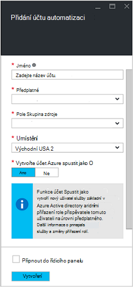
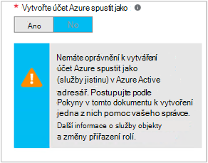

<properties
   pageTitle="Konfigurace Azure AD uživatelský účet | Microsoft Azure"
   description="Tento článek popisuje, jak nakonfigurovat Azure AD uživatelských účtů pověření runbooks v Azure automatizaci k ověřování ARM a ASM."
   services="automation"
   documentationCenter=""
   authors="MGoedtel"
   manager="jwhit"
   editor="tysonn"
   keywords="služby Azure active directory, azure Správa azure ad uživatelské účty služeb" />
<tags
   ms.service="automation"
   ms.devlang="na"
   ms.topic="get-started-article"
   ms.tgt_pltfrm="na"
   ms.workload="infrastructure-services"
   ms.date="09/12/2016"
   ms.author="magoedte" />

# Ověření Runbooks s Azure služba Správa a správce zdrojů

Tento článek popisuje kroky, které je třeba provést konfigurace Azure AD uživatelský účet pro automatizaci Azure runbooks spuštění služby Azure Management (ASM) nebo Azure zdroje Manager (ARM) zdrojů.  Když to nadále identitu podporovaného ověřování pro rukou na základě runbooks, doporučený postup je použít nový účet Azure spustit jako.       

## Vytvoření nového uživatele služby Azure Active Directory

1. Přihlaste se k portálu klasické Azure jako správce služby Azure předplatného, které chcete spravovat.
2. Vyberte **Služby Active Directory**a pak vyberte název vaší organizace adresáře.
3. Vyberte kartu **uživatele** a pak v oblasti příkaz vyberte **Přidat uživatele**.
4. Na stránce **námi o tohoto uživatele** ve skupinovém rámečku **Typ uživatele**vyberte **nového uživatele ve vaší organizaci**.
5. Zadejte uživatelské jméno.  
6. Vyberte název adresáře, který je spojený s předplatným Azure na stránce služby Active Directory.
7. Na stránce **profilu uživatele** zadejte první a poslední název popisný název a uživatele ze seznamu **role** .  Proveďte **Povolit Vícefaktorové ověřování**.
8. Poznámka: celé jméno uživatele a dočasné heslo.
9. Vyberte **Nastavení > správci > Přidat**.
10. Zadejte úplné uživatelské jméno uživatele, který jste vytvořili.
11. Vyberte předplatné, které má uživatel spravovat.
12. Odhlaste se od Azure a potom se znovu přihlaste zpátky účtem, který jste právě vytvořili. Zobrazí se výzva ke změně hesla uživatele.

## Vytvořte účet automatizaci klasické portálu Azure
V této části provedením následujících kroků můžete vytvořit nový účet Azure automatizaci na portálu Azure něhož s vaší runbooks řízení zdrojů v režimu ASM a ARM.  

>[AZURE.NOTE] Automatizace účtů vytvořených pomocí portálu klasické Azure dá se ovládat klasické Azure a Azure portál i buď sady rutin. Po vytvoření účtu nezáleží na tom jak vytvořit a spravovat zdroje v rámci účtu. Pokud se chystáte používat portál klasické Azure, měli byste použít ho místo portálu Azure vytvořit libovolný automatizaci účtů.

1. Přihlaste se k portálu klasické Azure jako správce služby Azure předplatného, které chcete spravovat.
2. Zvolte **automatizaci**.
3. Na stránce **Automatické** vyberte **vytvořit účet automatizaci**.
4. V dialogovém okně **vytvořit automatizaci účet** zadejte do pole název k vašemu novému účtu automatizaci a vyberte **oblast** z rozevíracího seznamu.  
5. Klikněte na **OK** potvrďte svoje nastavení a vytvořit účet.
6. Po vytvoření otevřela nebude uvedená na stránce **automatizaci** .
7. Klikněte na účet a se vrátíte na stránku řídicího panelu.  
8. Na stránce automatické řídicího panelu vyberte **prostředky**.
9. Na stránce **prostředky** vyberte **Přidat nastavení** nachází v dolní části stránky.
10. Na stránce **Přidat nastavení** vyberte **Přidat pověření**.
11. Na stránce **Definovat přihlašovacích údajů** v rozevíracím seznamu **Typ pověření** vyberte **Pověření systému Windows PowerShell** a zadejte název pro přihlašovací údaje.
12. Na následující **Definovat pověření** stránky zadejte do pole username uživatelského účtu AD vytvořili dříve do pole **Uživatelské jméno** a heslo do pole **heslo** a **Ověřit heslo** . Klikněte na **OK** uložte provedené změny.

## Vytvořte účet automatizaci na portálu Azure

V této části provedením následujících kroků můžete vytvořit nový účet Azure automatizaci na portálu Azure, která se používat ke správě zdrojům runbooks v režimu ARM.  

1. Přihlaste se k portálu Azure jako správce služby Azure předplatného, které chcete spravovat.
2. Vyberte **účty automatizaci**.
3. V zásuvné automatizaci účty klikněte na **Přidat**. 
2. V zásuvné **Přidat účet automatizace** do pole **název** zadejte do pole název k vašemu novému účtu automatizaci.
5. Pokud máte víc předplatných, zadejte pro nový účet, stejně jako nové nebo existující **pole Skupina zdroje** a Azure datacentra **umístění**.
3. Vyberte hodnotu **Ne** pro možnost **vytvořit Azure spustit jako účet** a klikněte na tlačítko **vytvořit** .  

    >[AZURE.NOTE] Pokud se rozhodnete není vytvořit účet Spustit jako tak, že vyberete možnost **žádný**, zobrazí se zpráva s upozorněním na zásuvné **Přidat účet automatizaci** .  Účet je vytvořené a přiřazené role **přispěvatele** v předplatného, nebude mít odpovídající ověření identity v rámci svého předplatného adresářové služby a tedy bez přístupu k prostředkům ve vašem předplatném.  Zabráníte tím všechny runbooks odkazování na tento účet je moct ověřování a úkoly týkající se ARM zdroje.

    

4. Během Azure vytvoří automatizaci účet, můžete sledovat průběh v části **oznámení** z nabídky.

Po dokončení vystavením pověření se pak potřebujete vytvořit materiálů přihlašovací údaje k účtu automatizaci přidružit AD uživatelský účet dříve vytvořili.  Mějte na paměti, jsme pouze vytvořený účet automatizaci a není přidružený k identitě ověřování.  Provedení kroků uvedených v [prostředky přihlašovacích údajů v článku automatické Azure](../automation/automation-credentials.md#creating-a-new-credential) a zadejte hodnotu pro **uživatelské jméno** ve formátu **doména\uživatelské**.

## Použití přihlašovacích údajů v postupu runbook

Můžete načíst přihlašovacích údajů v postupu runbook použití [Get-AutomationPSCredential](http://msdn.microsoft.com/library/dn940015.aspx) aktivity a připojení k předplatnému Azure ho použít s [AzureAccount přidat](http://msdn.microsoft.com/library/azure/dn722528.aspx) . Pokud je pověření správce víc předplatných Azure, pak taky, používejte [Vyberte AzureSubscription](http://msdn.microsoft.com/library/dn495203.aspx) zadejte správná. To je ukázáno v ukázkové prostředí Windows PowerShell níže, která se obvykle zobrazí v horní části většiny runbooks Azure automatizaci.

    $cred = Get-AutomationPSCredential –Name "myuseraccount.onmicrosoft.com"
    Add-AzureAccount –Credential $cred
    Select-AzureSubscription –SubscriptionName "My Subscription"

Tyto řádky má opakovat za všechny [kontroly](http://technet.microsoft.com/library/dn469257.aspx#bk_Checkpoints) ve vaší postupu runbook. Pokud postupu runbook je pozastavené a pak obnoví na jiného pracovníka, bude nutné ověřování znovu.

## Další kroky
* Seznamte se s typy různých postupu runbook a kroků pro vytvoření vlastního runbooks v následujícím článku [typy postupu runbook automatizaci Azure](../automation/automation-runbook-types.md)
