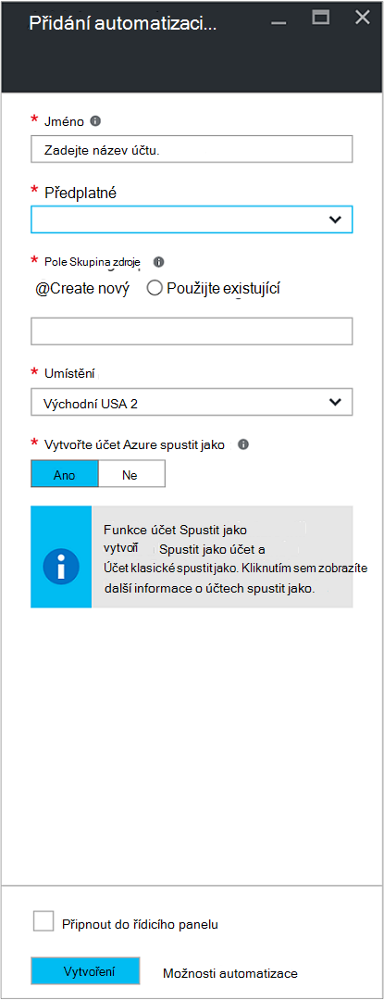
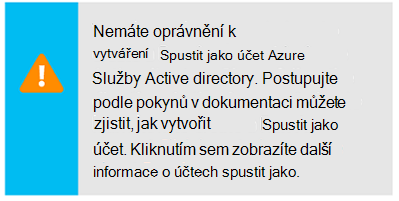
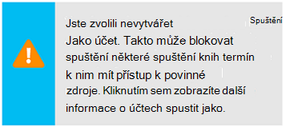
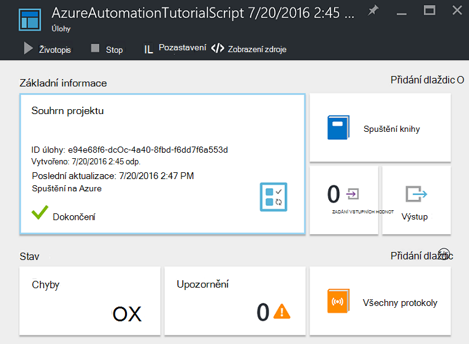
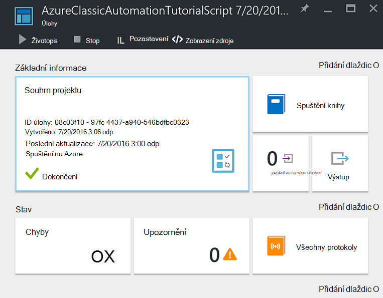
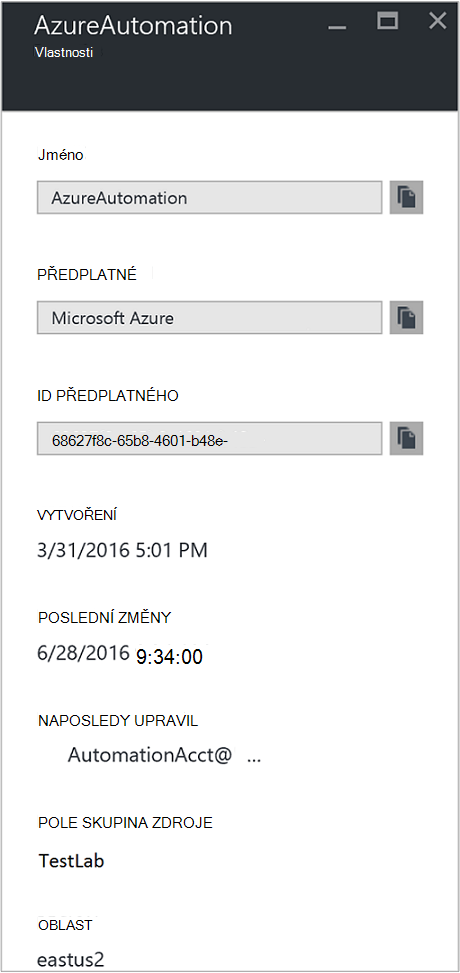

<properties
    pageTitle="Konfigurace Azure spustit jako účet | Microsoft Azure"
    description="Výuková, který vás provede vytváření testování a příklad použití hlavní ověření zabezpečení v Azure automatizaci."
    services="automation"
    documentationCenter=""
    authors="mgoedtel"
    manager="jwhit"
    editor=""
    keywords="hlavní název služby, setspn, azure ověřování"/>
<tags
    ms.service="automation"
    ms.workload="tbd"
    ms.tgt_pltfrm="na"
    ms.devlang="na"
    ms.topic="get-started-article"
    ms.date="08/17/2016"
    ms.author="magoedte"/>

# Ověření Runbooks s Azure spustit jako účet

Toto téma vám ukáže, jak konfigurovat účet automatizaci z portálu Microsoft Azure pomocí funkce účet Spustit jako ověření runbooks správy zdrojů správce prostředků Azure nebo Správa služby Azure.

Při vytváření nového účtu automatizaci Azure portálu se automaticky vytvoří:

- Spustit jako účet, který vytvoří nový objekt zabezpečení služby Azure Active Directory, certifikát a přiřadí řízení přístupu na základě rolí přispěvatelů (RBAC), které bude sloužící ke správě zdrojů správce prostředků prostřednictvím runbooks.   
- Klasický spustit jako účet uložením správy certifikát, který bude sloužící ke správě Správa služby Azure nebo klasická zdrojů prostřednictvím runbooks.  

Tato funkce zjednodušuje proces pro vás a pomáhá rychle začnete vytvářet a nasazení runbooks podporuje automatizaci potřeb.      

Pomocí účtu spustit jako a klasické spustit jako, máte tyto možnosti:

- Umožňují standardizovaným ověření s Azure při správě správce prostředků Azure nebo Správa služby Azure zdrojů z runbooks Azure portálu.  
- Automatizace využívání globální runbooks konfigurovat Azure upozornění.

>[AZURE.NOTE] Azure [funkce upozornění integrace](../monitoring-and-diagnostics/insights-receive-alert-notifications.md) s globální Runbooks automatizaci vyžaduje automatizaci účet, který je nakonfigurovaný spustit jako a klasické spustit jako účet. Můžete vybrat automatizaci účtu, který už má účet Spustit jako a klasické spustit definované nebo vytvořit novou.

Můžeme ukazují, jak vytvořit účet automatizaci z portálu Microsoft Azure, aktualizovat automatizaci účtu pomocí prostředí PowerShell a ukazuje, jak lze ověřit v vaší runbooks.

Než jsme je dostala, kde používáte několik věcí, které mají porozumět a myslet před pokračováním.

1. To nemá vliv na existující účty automatizaci již vytvořené v klasickou nebo správce prostředků nasazení modelu.  
2. To použít pouze pro automatizaci účty vytvořený prostřednictvím portálu Azure.  Vytváření účtu z portálu Microsoft klasické nebude replikovat konfigurace účtu spustit jako.
3. Pokud máte aktuálně runbooks a prostředky (tedy plány proměnných, atd.) dřív vytvořili ke správě klasické prostředků a chcete tyto runbooks ověření s nový účet klasické spustit jako, musíte se migrace do nového účtu automatizaci nebo aktualizovat vašemu stávajícímu účtu pomocí skriptu prostředí PowerShell dole.  
4. Ověření pomocí nového účtu spustit jako a klasické spustit jako automatizaci účtu, musíte změnit existující runbooks s kódem v příkladu níže.  **Všimněte si prosím** spustit jako účet je pro ověření správce prostředků zdrojů prostřednictvím služeb na základě certifikátu zabezpečení a účet klasické spustit jako je ověřování služba Správa zdrojů pomocí certifikátu správy.     

## Vytvoření nového účtu automatizaci z portálu Microsoft Azure

V této části provedením následujících kroků můžete vytvořit nový účet Azure automatizaci z portálu Microsoft Azure.  Tím vytvoříte spustit jako i klasické spustit jako účet.  

>[AZURE.NOTE] Uživatel provedením těchto kroků *musíte* být členem role správce předplatné a dalších správce předplatného, které je udělení přístupu k předplatnému uživatele.  Uživatel musí být přidán také jako uživatel, který předplatná výchozí Active Directory. účet není nutné k privilegovaných roli přiřadit.

1. Přihlaste se k portálu Azure pomocí účtu, který je členem role správce předplatné a dalších správce předplatného.
2. Vyberte **účty automatizaci**.
3. V zásuvné automatizaci účty klikněte na **Přidat**. 

    >[AZURE.NOTE]Pokud se zobrazí následující upozornění na zásuvné **Přidat účet automatizaci** , je to proto není váš účet členem role správce předplatného a co správu předplatného. 

4. V zásuvné **Přidat účet automatizace** do pole **název** zadejte do pole název k vašemu novému účtu automatizaci.
5. Pokud máte víc předplatných, zadat jeden pro nový účet, stejně jako nové nebo existující **pole Skupina zdroje** a Azure datacentra **umístění**.
6. Ověření hodnotu, kterou je vybraná možnost **Ano** pro možnost **vytvořit Azure spustit jako účet** a klikněte na tlačítko **vytvořit** .  

    >[AZURE.NOTE] Pokud se rozhodnete není vytvořit účet Spustit jako tak, že vyberete možnost **žádný**, zobrazí se zpráva s upozorněním na zásuvné **Přidat účet automatizaci** .  Při vytvoření účtu na portálu Azure nemají odpovídající ověření identity v rámci vaší klasické nebo správce prostředků předplatné adresářové služby a tedy bez přístupu k prostředkům ve vašem předplatném.  Zabráníte tím všechny runbooks odkazování na tento účet je moct ověřování a úkoly týkající se zdroje v těchto modelů nasazení.

    > 
Není vytvoření hlavního uživatele služby nebude mít přiřazené role přispěvatele.

7. Během Azure vytvoří automatizaci účet, můžete sledovat průběh v části **oznámení** z nabídky.

### Prostředků

Vytvoření účtu automatizaci úspěšně, se automaticky vytvoří několika zdrojů.  Následující tabulka shrnuje materiály pro účet Spustit jako. 

Zdroje|Popis
--------|-----------
Postupu AzureAutomationTutorial Runbook|Příklad prostředí PowerShell postupu runbook, který ukazuje, jak ověření pomocí účtu spustit jako a získá všechny zdroje správce prostředků.
Postupu AzureAutomationTutorialScript Runbook|Příklad prostředí PowerShell postupu runbook, který ukazuje, jak ověření pomocí účtu spustit jako a získá všechny zdroje správce prostředků.
AzureRunAsCertificate|Certifikát majetku automaticky vytvořené při vytváření účtu automatizaci nebo pomocí skriptů Powershellu pod pro existující účet.  Umožňuje ověřování pomocí Azure, správce prostředků Azure zdroje můžete spravovat z runbooks.  Tento certifikát musí životnost jeden rok.
AzureRunAsConnection|Připojení materiálů automaticky vytvořené při vytváření účtu automatizaci nebo pomocí skriptů Powershellu pod pro existující účet.

Následující tabulka shrnuje materiály pro klasické spustit jako účet. 

Zdroje|Popis
--------|-----------
Postupu AzureClassicAutomationTutorial Runbook|Příkladu postupu runbook které získá klasické VMs v předplatného pomocí klasické spustit jako účet (certifikát) a poté uloží OM název a stav.
Postupu Runbook AzureClassicAutomationTutorial skriptu|Příkladu postupu runbook které získá klasický VMs v předplatného pomocí klasického spustit jako účet (certifikát) a poté uloží OM název a stav.
AzureClassicRunAsCertificate|Certifikát materiálů automaticky vytvoří použitém k jeho ověření s Azure, Azure klasické zdroje můžete spravovat z runbooks.  Tento certifikát musí životnost jeden rok.
AzureClassicRunAsConnection|Připojení materiálů automaticky vytvoří použitém k jeho ověření s Azure, Azure klasické zdroje můžete spravovat z runbooks.  

## Ověření pomocí ověřování spustit jako

Další jsme bude testu malé potvrďte, že se nacházíte úspěšném ověření pomocí nového účtu spustit jako.     

1. Na portálu Azure si potřebujete založit účet automatizaci dříve vytvořili.  
2. Klikněte na dlaždici **Runbooks** otevřete seznam runbooks.
3. Vyberte postupu runbook **AzureAutomationTutorialScript** a klikněte na tlačítko **Spustit** spusťte postupu runbook.  Zobrazí se výzva ověřit, jestli že chcete spustit postupu runbook.
4. Vytvoření [postupu runbook úlohy](automation-runbook-execution.md) projektu se zobrazí zásuvné a stavu projektu zobrazené v této dlaždici **Souhrn projektu** .  
5. Stav úlohy začnou jako *ve frontě* označující, že se čeká pracovního postupu runbook v cloudu k dispozici. Ho pak přesune do *spuštění* při pracovník deklarace projekt a potom *systém* postupu runbook skutečně spuštění.  
6. Až se dokončí úloha postupu runbook vidíme by měl stav **Dokončeno**.   
7. Podrobné výsledky postupu runbook zobrazíte kliknutím na dlaždici **výstupu** .
8. V zásuvné **výstup** byste měli vidět má úspěšně ověřené a seznam všech zdrojů k dispozici ve skupině zdroje.
9. Zavřete zásuvné **výstup** se vraťte do zásuvné **Souhrn projektu** .
13. Zavřete **Souhrn projektu** a odpovídající zásuvné **AzureAutomationTutorialScript** postupu runbook.

## Ověření pomocí ověřování klasické spustit jako

Další jsme bude testu malé potvrďte, že se nacházíte úspěšném ověření pomocí nového účtu klasické spustit jako.     

1. Na portálu Azure si potřebujete založit účet automatizaci dříve vytvořili.  
2. Klikněte na dlaždici **Runbooks** otevřete seznam runbooks.
3. Vyberte postupu runbook **AzureClassicAutomationTutorialScript** a klikněte na tlačítko **Spustit** spusťte postupu runbook.  Zobrazí se výzva ověřit, jestli že chcete spustit postupu runbook.
4. Vytvoření [postupu runbook úlohy](automation-runbook-execution.md) projektu se zobrazí zásuvné a stavu projektu zobrazené v této dlaždici **Souhrn projektu** .  
5. Stav úlohy začnou jako *ve frontě* označující, že se čeká pracovního postupu runbook v cloudu k dispozici. Ho pak přesune do *spuštění* při pracovník deklarace projekt a potom *systém* postupu runbook skutečně spuštění.  
6. Až se dokončí úloha postupu runbook vidíme by měl stav **Dokončeno**.   
7. Podrobné výsledky postupu runbook zobrazíte kliknutím na dlaždici **výstupu** .
8. V zásuvné **výstup** byste měli vidět má úspěšně ověřené a vrátí seznam všech klasické OM uživatele v předplatného.
9. Zavřete zásuvné **výstup** se vraťte do zásuvné **Souhrn projektu** .
13. Zavřete **Souhrn projektu** a odpovídající zásuvné **AzureClassicAutomationTutorialScript** postupu runbook.

## Aktualizace automatizaci účtu pomocí prostředí PowerShell

Tady vám poskytneme možnost pomocí prostředí PowerShell můžete aktualizovat vašemu stávajícímu účtu automatizaci, pokud:

1. Vytvoření účtu automatizaci, ale k odmítnutí vytvořte účet Spustit jako
2. Už máte účet automatizaci pro přidávání a používání zdrojů správce prostředků a chcete aktualizovat tak, aby obsahovala na Spustit jako účtu v postupu runbook ověřování
2. Už máte nastavený účet automatizaci ke správě klasický prostředků a chcete aktualizujte klasické spustit jako místo vytvoření nového účtu a migraci runbooks a prostředky k němu   

Než budete pokračovat, ověřte následující:

1. Můžete stáhnout a nainstalovat [Windows (Management Framework WMF) 4.0](https://www.microsoft.com/download/details.aspx?id=40855) , pokud používáte Windows 7.   
    Pokud používáte Windows serveru 2012 R2 Windows Server 2012, Windows 2008 R2, Windows 8.1 a Windows 7 s aktualizací SP1, [Windows Management Framework 5.0](https://www.microsoft.com/download/details.aspx?id=50395) je k dispozici pro instalaci.
2. Azure PowerShell 1.0. Informace o této verzi a jak ji nainstalovat najdete v tématu [instalace a konfigurace prostředí PowerShell Azure](../powershell-install-configure.md).
3. Vytvoření účtu automatizaci.  Tento účet bude uváděný jako hodnoty parametrů – AutomationAccountName a ApplicationDisplayName – v obou skripty dole.

Pokud chcete získávat hodnoty ovládacího *SubscriptionID* *ResourceGroup*a *AutomationAccountName*, které jsou potřeba parametry skripty na portálu Azure vyberte svůj účet automatizaci z zásuvné **automatizaci účtu** a vyberte **všechna nastavení**.  Z zásuvné **všechna nastavení** v části **Nastavení účtu** vyberte **Vlastnosti**.  Ve **Vlastnosti** zásuvné můžete poznamenat tyto hodnoty.    

### Vytvořit skript Powershellu spustit jako účet

Skript Powershellu dole nastaví její konfiguraci a takto:

- Azure AD aplikace, která bude ověřování pomocí certifikátu podepsaného svým držitelem v Azure AD můžete vytvořit účet služby základní k této aplikaci a přiřazené role přispěvatele (můžete změnit to vlastník nebo další roli) tohoto účtu do aktuálního předplatného.  Další informace najdete v článku [řízení přístupu na základě rolí v Azure automatizaci](../automation/automation-role-based-access-control.md) .
- Aktivum automatizaci certifikát v okně zadaný automatizaci účet s názvem **AzureRunAsCertificate**, který obsahuje certifikát používaný službou hlavní.
- Aktivum automatizaci připojení v okně zadaný automatizaci účet s názvem **AzureRunAsConnection**, který obsahuje applicationId, tenantId, subscriptionId a Miniatura certifikátu.    

Postupem vás provede procesem skriptu.

1. Uložte tento skript ve svém počítači.  V tomto příkladu uložte ho **AzureServicePrincipal.ps1 nový**název souboru.  

        #Requires -RunAsAdministrator
        Param (
        [Parameter(Mandatory=$true)]
        [String] $ResourceGroup,

        [Parameter(Mandatory=$true)]
        [String] $AutomationAccountName,

        [Parameter(Mandatory=$true)]
        [String] $ApplicationDisplayName,

        [Parameter(Mandatory=$true)]
        [String] $SubscriptionId,

        [Parameter(Mandatory=$true)]
        [String] $CertPlainPassword,

        [Parameter(Mandatory=$false)]
        [int] $NoOfMonthsUntilExpired = 12
        )

        Login-AzureRmAccount
        Import-Module AzureRM.Resources
        Select-AzureRmSubscription -SubscriptionId $SubscriptionId

        $CurrentDate = Get-Date
        $EndDate = $CurrentDate.AddMonths($NoOfMonthsUntilExpired)
        $KeyId = (New-Guid).Guid
        $CertPath = Join-Path $env:TEMP ($ApplicationDisplayName + ".pfx")

        $Cert = New-SelfSignedCertificate -DnsName $ApplicationDisplayName -CertStoreLocation cert:\LocalMachine\My -KeyExportPolicy Exportable -Provider "Microsoft Enhanced RSA and AES Cryptographic Provider"

        $CertPassword = ConvertTo-SecureString $CertPlainPassword -AsPlainText -Force
        Export-PfxCertificate -Cert ("Cert:\localmachine\my\" + $Cert.Thumbprint) -FilePath $CertPath -Password $CertPassword -Force | Write-Verbose

        $PFXCert = New-Object -TypeName System.Security.Cryptography.X509Certificates.X509Certificate -ArgumentList @($CertPath, $CertPlainPassword)
        $KeyValue = [System.Convert]::ToBase64String($PFXCert.GetRawCertData())

        $KeyCredential = New-Object  Microsoft.Azure.Commands.Resources.Models.ActiveDirectory.PSADKeyCredential
        $KeyCredential.StartDate = $CurrentDate
        $KeyCredential.EndDate= $EndDate
        $KeyCredential.KeyId = $KeyId
        $KeyCredential.Type = "AsymmetricX509Cert"
        $KeyCredential.Usage = "Verify"
        $KeyCredential.Value = $KeyValue

        # Use Key credentials
        $Application = New-AzureRmADApplication -DisplayName $ApplicationDisplayName -HomePage ("http://" + $ApplicationDisplayName) -IdentifierUris ("http://" + $KeyId) -KeyCredentials $keyCredential

        New-AzureRMADServicePrincipal -ApplicationId $Application.ApplicationId | Write-Verbose
        Get-AzureRmADServicePrincipal | Where {$_.ApplicationId -eq $Application.ApplicationId} | Write-Verbose

        $NewRole = $null
        $Retries = 0;
        While ($NewRole -eq $null -and $Retries -le 6)
        {
           # Sleep here for a few seconds to allow the service principal application to become active (should only take a couple of seconds normally)
           Sleep 5
           New-AzureRMRoleAssignment -RoleDefinitionName Contributor -ServicePrincipalName $Application.ApplicationId | Write-Verbose -ErrorAction SilentlyContinue
           Sleep 10
           $NewRole = Get-AzureRMRoleAssignment -ServicePrincipalName $Application.ApplicationId -ErrorAction SilentlyContinue
           $Retries++;
        }

        # Get the tenant id for this subscription
        $SubscriptionInfo = Get-AzureRmSubscription -SubscriptionId $SubscriptionId
        $TenantID = $SubscriptionInfo | Select TenantId -First 1

        # Create the automation resources
        New-AzureRmAutomationCertificate -ResourceGroupName $ResourceGroup -AutomationAccountName $AutomationAccountName -Path $CertPath -Name AzureRunAsCertificate -Password $CertPassword -Exportable | write-verbose

        # Create a Automation connection asset named AzureRunAsConnection in the Automation account. This connection uses the service principal.
        $ConnectionAssetName = "AzureRunAsConnection"
        Remove-AzureRmAutomationConnection -ResourceGroupName $ResourceGroup -AutomationAccountName $AutomationAccountName -Name $ConnectionAssetName -Force -ErrorAction SilentlyContinue
        $ConnectionFieldValues = @{"ApplicationId" = $Application.ApplicationId; "TenantId" = $TenantID.TenantId; "CertificateThumbprint" = $Cert.Thumbprint; "SubscriptionId" = $SubscriptionId}
        New-AzureRmAutomationConnection -ResourceGroupName $ResourceGroup -AutomationAccountName $AutomationAccountName -Name $ConnectionAssetName -ConnectionTypeName AzureServicePrincipal -ConnectionFieldValues $ConnectionFieldValues

2. Na vašem počítači spusťte **Windows PowerShell** z obrazovky **Start** se zvýšenými oprávněními.
3. Z zvýšenými příkazového řádku prostředí PowerShell přejděte do složky, která obsahuje skript vytvořili v kroku 1 a proveďte změny hodnoty parametrů skript *– ResourceGroup* *-AutomationAccountName*, *- ApplicationDisplayName*, *- SubscriptionId*a *- CertPlainPassword*. 

    >[AZURE.NOTE] Zobrazí se výzva k ověření s Azure po spuštění skriptu. Musíte se přihlásit pomocí účtu, který je členem role správce předplatného a co správu předplatného.

        .\New-AzureServicePrincipal.ps1 -ResourceGroup <ResourceGroupName>
        -AutomationAccountName <NameofAutomationAccount> `
        -ApplicationDisplayName <DisplayNameofAutomationAccount> `
        -SubscriptionId <SubscriptionId> `
        -CertPlainPassword "<StrongPassword>"  
 

Po úspěšném dokončení skript v nápovědě k [ukázkový kód](#sample-code-to-authenticate-with-resource-manager-resources) následující ověření se zdroji správce prostředků a ověřte konfiguraci přihlašovacích údajů.

### Vytvoření účtu klasické spustit jako skript Powershellu

Skript Powershellu dole nastaví její konfiguraci a takto:

- Aktivum automatizaci certifikát v okně zadaný automatizaci účet s názvem **AzureClassicRunAsCertificate**, který obsahuje certifikát používaný k ověření vaší runbooks.
- Aktivum automatizaci připojení v okně zadaný automatizaci účet s názvem **AzureClassicRunAsConnection**, který obsahuje název předplatného, subscriptionId a certifikát materiálů.

Skript vytvořit certifikát podepsaný svým držitelem správy a si ji uložit do složka dočasných souborů v počítači ve skupinovém rámečku použít k provedení relaci Powershellu - *%USERPROFILE%\AppData\Local\Temp*profilů uživatelů.  Po spuštění skriptu je třeba odeslat certifikát Azure správy do Správa úložiště u předplatného účtu automatizaci byla vytvořená v.  Postupem vás provede procesem skriptu a nahrávání certifikát.  

1. Uložte tento skript ve svém počítači.  V tomto příkladu uložte ho **AzureClassicRunAsAccount.ps1 nový**název souboru.

        #Requires -RunAsAdministrator
        Param (
        [Parameter(Mandatory=$true)]
        [String] $ResourceGroup,

        [Parameter(Mandatory=$true)]
        [String] $AutomationAccountName,

        [Parameter(Mandatory=$true)]
        [String] $ApplicationDisplayName,

        [Parameter(Mandatory=$true)]
        [String] $SubscriptionId,

        [Parameter(Mandatory=$true)]
        [String] $CertPlainPassword,

        [Parameter(Mandatory=$false)]
        [int] $NoOfMonthsUntilExpired = 12
        )

        Login-AzureRmAccount
        Import-Module AzureRM.Resources
        $Subscription = Select-AzureRmSubscription -SubscriptionId $SubscriptionId
        $SubscriptionName = $subscription.Subscription.SubscriptionName

        $CurrentDate = Get-Date
        $EndDate = $CurrentDate.AddMonths($NoOfMonthsUntilExpired)
        $KeyId = (New-Guid).Guid
        $CertPath = Join-Path $env:TEMP ($ApplicationDisplayName + ".pfx")
        $CertPathCer = Join-Path $env:TEMP ($ApplicationDisplayName + ".cer")

        $Cert = New-SelfSignedCertificate -DnsName $ApplicationDisplayName -CertStoreLocation cert:\LocalMachine\My -KeyExportPolicy Exportable -Provider "Microsoft Enhanced RSA and AES Cryptographic Provider"

        $CertPassword = ConvertTo-SecureString $CertPlainPassword -AsPlainText -Force
        Export-PfxCertificate -Cert ("Cert:\localmachine\my\" + $Cert.Thumbprint) -FilePath $CertPath -Password $CertPassword -Force | Write-Verbose
        Export-Certificate -Cert ("Cert:\localmachine\my\" + $Cert.Thumbprint) -FilePath $CertPathCer -Type CERT | Write-Verbose

        # Create the automation resources
        $ClassicCertificateAssetName = "AzureClassicRunAsCertificate"
        New-AzureRmAutomationCertificate -ResourceGroupName $ResourceGroup -AutomationAccountName $AutomationAccountName -Path $CertPath -Name $ClassicCertificateAssetName  -Password $CertPassword -Exportable | write-verbose

        # Create a Automation connection asset named AzureClassicRunAsConnection in the Automation account. This connection uses the ClassicCertificateAssetName.
        $ConnectionAssetName = "AzureClassicRunAsConnection"
        Remove-AzureRmAutomationConnection -ResourceGroupName $ResourceGroup -AutomationAccountName $AutomationAccountName -Name $ConnectionAssetName -Force -ErrorAction SilentlyContinue
        $ConnectionFieldValues = @{"SubscriptionName" = $SubscriptionName; "SubscriptionId" = $SubscriptionId; "CertificateAssetName" = $ClassicCertificateAssetName}
        New-AzureRmAutomationConnection -ResourceGroupName $ResourceGroup -AutomationAccountName $AutomationAccountName -Name $ConnectionAssetName -ConnectionTypeName AzureClassicCertificate -ConnectionFieldValues $ConnectionFieldValues

        Write-Host -ForegroundColor red "Please upload the cert $CertPathCer to the Management store by following the steps below."
        Write-Host -ForegroundColor red "Log in to the Microsoft Azure Management portal (https://manage.windowsazure.com) and select Settings -> Management Certificates."
        Write-Host -ForegroundColor red "Then click Upload and upload the certificate $CertPathCer"

2. Na vašem počítači spusťte **Windows PowerShell** z obrazovky **Start** se zvýšenými oprávněními.  
3. Z zvýšenými příkazového řádku prostředí PowerShell přejděte do složky, která obsahuje skript vytvořili v kroku 1 a proveďte změny hodnoty parametrů skript *– ResourceGroup* *-AutomationAccountName*, *- ApplicationDisplayName*, *- SubscriptionId*a *- CertPlainPassword*. 

    >[AZURE.NOTE] Zobrazí se výzva k ověření s Azure po spuštění skriptu. Musíte se přihlásit pomocí účtu, který je členem role správce předplatného a co správu předplatného.

        .\New-AzureClassicRunAsAccount.ps1 -ResourceGroup <ResourceGroupName>
        -AutomationAccountName <NameofAutomationAccount> `
        -ApplicationDisplayName <DisplayNameofAutomationAccount> `
        -SubscriptionId <SubscriptionId> `
        -CertPlainPassword "<StrongPassword>"

Po úspěšném dokončení skript, musíte zkopírovat certifikát vytvořený ve složce **Temp** profilu uživatele.  Postupujte podle kroků pro [odeslání certifikát rozhraní API Správa](../azure-api-management-certs.md) portálu Azure klasické a pak se podívejte [ukázkového kódu](#sample-code-to-authenticate-with-service-management-resources) ověřte konfiguraci přihlašovací údaje pomocí služby správy zdrojů.

## Ukázkový kód ověření s správce zdrojů

Můžete níže, aktualizované ukázkový kód věnovat z příkladu postupu runbook **AzureAutomationTutorialScript** , ověření pomocí účtu spustit jako ke správě správce prostředků zdroje s vaší runbooks.   

    $connectionName = "AzureRunAsConnection"
    $SubId = Get-AutomationVariable -Name 'SubscriptionId'
    try
    {
       # Get the connection "AzureRunAsConnection "
       $servicePrincipalConnection=Get-AutomationConnection -Name $connectionName         

       "Logging in to Azure..."
       Add-AzureRmAccount `
         -ServicePrincipal `
         -TenantId $servicePrincipalConnection.TenantId `
         -ApplicationId $servicePrincipalConnection.ApplicationId `
         -CertificateThumbprint $servicePrincipalConnection.CertificateThumbprint
       "Setting context to a specific subscription"  
       Set-AzureRmContext -SubscriptionId $SubId             
    }
    catch {
        if (!$servicePrincipalConnection)
        {
           $ErrorMessage = "Connection $connectionName not found."
           throw $ErrorMessage
         } else{
            Write-Error -Message $_.Exception
            throw $_.Exception
         }
    }

Skript zahrnuje dva další řádky kódu pro podporu odkazování na kontextu předplatného, budete moct snadno pracovat mezi víc předplatných. Proměnná majetku s názvem SubscriptionId obsahuje ID předplatné a po rutina příkazu přidat AzureRmAccount [rutinu Set-AzureRmContext](https://msdn.microsoft.com/library/mt619263.aspx) uvedeny s parametr nastaven *- SubscriptionId*. Pokud je příliš obecné proměnná název, můžete upravit název proměnné zahrnout předpony nebo jiných konvence pro snazší identifikaci podle vašich představ. Můžete taky můžete použít parametr nastaven SubscriptionName – místo - SubscriptionId s odpovídajícím proměnné materiálů.  

Všimněte si, že rutině pro ověřování v postupu runbook – **Přidat AzureRmAccount**používá sadu parametr *ServicePrincipalCertificate* .  Ověří pomocí služby základní certifikátu, ne přihlašovací údaje.  

## Ukázkový kód ověření pomocí služby správy zdrojů

Můžete níže, aktualizované ukázkový kód věnovat z příkladu postupu runbook **AzureClassicAutomationTutorialScript** , ověření pomocí účtu klasické spustit jako ke správě klasické zdroje s vaší runbooks.

    $ConnectionAssetName = "AzureClassicRunAsConnection"
    # Get the connection
    $connection = Get-AutomationConnection -Name $connectionAssetName        

    # Authenticate to Azure with certificate
    Write-Verbose "Get connection asset: $ConnectionAssetName" -Verbose
    $Conn = Get-AutomationConnection -Name $ConnectionAssetName
    if ($Conn -eq $null)
    {
       throw "Could not retrieve connection asset: $ConnectionAssetName. Assure that this asset exists in the Automation account."
    }

    $CertificateAssetName = $Conn.CertificateAssetName
    Write-Verbose "Getting the certificate: $CertificateAssetName" -Verbose
    $AzureCert = Get-AutomationCertificate -Name $CertificateAssetName
    if ($AzureCert -eq $null)
    {
       throw "Could not retrieve certificate asset: $CertificateAssetName. Assure that this asset exists in the Automation account."
    }

    Write-Verbose "Authenticating to Azure with certificate." -Verbose
    Set-AzureSubscription -SubscriptionName $Conn.SubscriptionName -SubscriptionId $Conn.SubscriptionID -Certificate $AzureCert
    Select-AzureSubscription -SubscriptionId $Conn.SubscriptionID

## Další kroky

- Další informace o služby objekty podívejte se do [aplikace a služby jistinu objekty](../active-directory/active-directory-application-objects.md).
- Další informace o řízení přístupu na základě rolí v Azure automatizaci najdete v příručce [řízení přístupu na základě rolí v Azure automatizaci](../automation/automation-role-based-access-control.md).
- Další informace o certifikáty a služby Azure najdete v příručce [Přehled certifikátů pro službu Azure Cloud Services](../cloud-services/cloud-services-certs-create.md)
