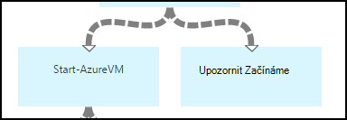

<properties 
    pageTitle="Spuštění a ukončení virtuálních počítačích - grafu | Microsoft Azure"
    description="Verze pracovního postupu prostředí PowerShell scénář automatizaci Azure včetně runbooks spuštění a ukončení klasické virtuálních počítačích."
    services="automation"
    documentationCenter=""
    authors="mgoedtel"
    manager="jwhit"
    editor="tysonn" />
<tags 
    ms.service="automation"
    ms.devlang="na"
    ms.topic="article"
    ms.tgt_pltfrm="na"
    ms.workload="infrastructure-services"
    ms.date="07/06/2016"
    ms.author="bwren" />

# Azure automatizaci scénář – spuštění a ukončení virtuálních počítačích

Tento scénář Azure automatizaci obsahuje runbooks spuštění a ukončení klasické virtuálních počítačích.  Použijte tento scénář z některého z následujících akcí:  

- Použití runbooks beze změny ve vlastních prostředí. 
- Úprava runbooks provést vlastní funkce.  
- Zavolejte runbooks z jiného postupu runbook jako součást celkovém řešení. 
- Použijte runbooks jako výukové programy pro další postupu runbook vytváření koncepty. 

> [AZURE.SELECTOR]
- [Grafické](automation-solution-startstopvm-graphical.md)
- [Pracovní postup prostředí PowerShell](automation-solution-startstopvm-psworkflow.md)

Toto je grafický postupu runbook verzi tento scénář. Je také k dispozici pomocí [prostředí PowerShell pracovního postupu runbooks](automation-solution-startstopvm-psworkflow.md).

## Získání scénáře

Tento scénář se skládá ze dvou dva grafické runbooks, které si můžete stáhnout z následujících odkazů.  Zobrazte [verzi pracovního postupu prostředí PowerShell](automation-solution-startstopvm-psworkflow.md) tento scénář odkazy na runbooks prostředí PowerShell pracovního postupu.

| Postupu Runbook | Odkaz | Typ | Popis |
|:---|:---|:---|:---|
| StartAzureClassicVM | [Zahájení grafické postupu Runbook Azure klasické OM](https://gallery.technet.microsoft.com/scriptcenter/Start-Azure-Classic-VM-c6067b3d) | Grafické | Spustí všechny klasické virtuálních počítačích v Azure předplatného nebo všechny virtuálních počítačích s názvem konkrétní službu. |
| StopAzureClassicVM | [Ukončení grafické postupu Runbook Azure klasické OM](https://gallery.technet.microsoft.com/scriptcenter/Stop-Azure-Classic-VM-397819bd) | Grafické | Ukončí všechny virtuálních počítačích v účtu automatizaci nebo všechny virtuálních počítačích s názvem konkrétní službu.  |

## Instalace a konfigurace scénáře

### 1. runbooks instalace

Po stažení runbooks, můžete importovat pomocí postupu v [postupech grafické postupu runbook](automation-graphical-authoring-intro.md#graphical-runbook-procedures).

### 2. Seznamte se s popis a požadavky
Runbooks zahrnout aktivity s názvem **Readme** , který obsahuje popis a požadované prostředky.  Tyto informace můžete zobrazit tak, že vyberete aktivity **Přečtení** a potom parametr **Skript pracovního postupu** .  Můžete taky dostanete stejné informace v tomto článku. 

### 3. konfigurace prostředky
Runbooks vyžadují následující prostředky, které musí vytvořit a naplnění s příslušnými hodnotami.  Názvy jsou výchozí.  Můžete majetku s různými názvy, pokud zadáte názvy v [vstupních parametrů](#using-the-runbooks) při spuštění postupu runbook.

| Typ majetku | Výchozí název | Popis |
|:---|:---|:---|:---|
| [Přihlašovací údaje](automation-credentials.md) | AzureCredential | Obsahuje přihlašovacích údajů pro účet, který má oprávnění spustit a zastavit virtuálních počítačích v Azure předplatného.  |
| [Proměnná](automation-variables.md) | AzureSubscriptionId | ID předplatného předplatného Azure obsahuje. |

## Použití scénáře

### Parametry

Runbooks každý mít takto [vstupních parametrů](automation-starting-a-runbook.md#runbook-parameters).  Nutné zadat hodnoty všech parametrů, povinná a volitelně můžete zadat hodnoty pro ostatní parametry v závislosti na vašim požadavkům.

| Parametr | Typ | Povinné | Popis |
|:---|:---|:---|:---|
| Název_služby | řetězec | Ne | Pokud hodnota je k dispozici, a pak začít nebo ukončit všechny virtuálních počítačích s tímto názvem služby.  Pokud je zadána žádná hodnota, jsou všechny klasické virtuálních počítačích v Azure předplatného začít nebo ukončit. |
| AzureSubscriptionIdAssetName | řetězec | Ne | Obsahuje název [proměnné materiálů](#installing-and-configuring-the-scenario) , který obsahuje ID předplatného předplatného Azure.  Pokud nezadáte hodnoty, použije se *AzureSubscriptionId* .  |
| AzureCredentialAssetName | řetězec | Ne | Obsahuje název [pověření materiálů](#installing-and-configuring-the-scenario) , která obsahuje přihlašovací údaje pro postupu runbook používat.  Pokud nezadáte hodnoty, použije se *AzureCredential* .  |

### Spuštění runbooks

Můžete metod při [spouštění postupu runbook v Azure automatizaci](automation-starting-a-runbook.md) buď runbooks začít v tomto článku.

Následující ukázkové příkazy používá prostředí Windows PowerShell spusťte **StartAzureClassicVM** spuštění všech virtuálních počítačích s názvem služby *MyVMService*.

    $params = @{"ServiceName"="MyVMService"}
    Start-AzureAutomationRunbook –AutomationAccountName "MyAutomationAccount" –Name "StartAzureClassicVM" –Parameters $params

### Výstup

Runbooks bude [výstupní zprávy](automation-runbook-output-and-messages.md) pro každý virtuální počítač označující též úspěšně odeslána pokyny k zahájení nebo ukončení.  Můžete vyhledávat určitý řetězec do výstupu rozhodnout, bude výsledek pro každou postupu runbook.  V následující tabulce jsou uvedeny řetězců možné výstupu.

| Postupu Runbook | Podmínky | Zpráva |
|:---|:---|:---|
| StartAzureClassicVM | Virtuální počítač se systémem  | MyVM už je spuštěný. |
| StartAzureClassicVM | Zahájení žádosti o úspěšném odeslání virtuálního počítače | Spustila MyVM |
| StartAzureClassicVM | Žádost o spuštění virtuálního počítače se nezdařila.  | MyVM se nepodařilo spustit |
| StopAzureClassicVM | Virtuální počítač se systémem  | Zastaven MyVM |
| StopAzureClassicVM | Zahájení žádosti o úspěšném odeslání virtuálního počítače | Spustila MyVM |
| StopAzureClassicVM | Žádost o spuštění virtuálního počítače se nezdařila.  | MyVM se nepodařilo spustit |

Toto je obrázek **StartAzureClassicVM** podle [postupu runbook podřízené](automation-child-runbooks.md) v ukázkové grafické postupu runbook.  To používá podmíněné odkazů v následující tabulce.

| Odkaz | Kritéria |
|:---|:---|
| Odkaz úspěch | $ActivityOutput [StartAzureClassicVM]-jako "\* byl spuštěn"    |
| Chyba odkaz   | $ActivityOutput [StartAzureClassicVM]-notlike "\* byl spuštěn" |

## Podrobný rozpis

Následuje podrobný rozpis runbooks v tomto scénáři.  Tyto informace slouží k přizpůsobení runbooks nebo chci jen další z nich pro vytváření vlastních automatizaci scénáře.
 

### Ověřování

Postupu runbook začíná aktivity nastavit [přihlašovací údaje](automation-configuring.md#configuring-authentication-to-azure-resources) a Azure předplatné, které se použije pro zbytek postupu runbook.

První dvě aktivity **Získat Id předplatného** a **Získat pověření Azure**načíst [prostředky](#installing-the-runbook) , které využívají dalších dvou aktivity.  Tyto aktivity může přímo zadat aktiva, ale potřebují jména materiálů.  Protože jsme jsou umožňuje uživateli určit názvy v [vstupní parametry](#using-the-runbooks), potřebujeme tyto činnosti k načtení aktiva s názvem nastavil vstupní parametry.

**Přidat AzureAccount** nastaví její přihlašovací údaje, které se použije pro zbytek postupu runbook.  Materiály pověření načítající z **Získat pověření Azure** musí mít přístup k spustit a zastavit virtuálních počítačích v Azure předplatného.  Předplatné, které se používá zaškrtnuté podle **Vyberte AzureSubscription** , který využívá předplatné Id z **Získat Id předplatného**.

### Získání virtuálních počítačích

Postupu runbook musí určit, které budou pracovat s virtuálních počítačích a jestli jsou už spuštění nebo zastavení (podle postupu runbook).   Jednu ze dvou činností načte VMs.  **Získání VMs služby** spustí obsahuje-li na vstupní parametry *Název_služby* pro postupu runbook hodnotu.  **Zobrazí všechny VMs** se spustí, pokud na vstupní parametry *Název_služby* pro postupu runbook neobsahuje hodnoty.  Tato logika provádí podmíněné odkazy před každý aktivity.

Obě aktivity získáte pomocí rutiny **Get-AzureVM** .  **Zobrazí všechny VMs** parametrem **ListAllVMs** nastavení se vrátíte všechny virtuálních počítačích.  **Získání VMs služby** používá sadu parametr **GetVMByServiceAndVMName** a poskytuje na vstupní parametry **Název_služby** parametru **Název_služby** .  

### Sloučení VMs

**Sloučení VMs** aktivity požaduje pro její obohacení **Start AzureVM** , které potřebuje název a název služby vm(s) začít.  Tento vstup získávány z **Získat všechny VMs** nebo **Získat VMs služby**, ale **Start AzureVM** můžete zadat pouze jeden aktivitou pro vstupní.   

Scénář je vytvořit **Sloučení VMs** , která běží **Zápisu výstup** rutiny.  Je parametrem **InputObject** pro tuto rutinu Powershellu výraz, který kombinuje vstupní předchozí dva aktivity.  Pouze jeden z těchto činností se spustí pouze jednu sadu výstup očekává.  **Zahájení AzureVM** můžete použít výstupu vstupních parametrů. 

### Spuštění nebo zastavení virtuálních počítačích

 

V závislosti postupu runbook další aktivity pokus o spuštění nebo zastavení pomocí **AzureVM zahájení** nebo **Ukončení AzureVM**postupu runbook.  Protože aktivity předchází odkaz kanálem k odesílání zpráv, se jednou spustí pro každý objekt vrácených **Sloučit VMs**.  Propojení je podmíněné tak, aby aktivity spustí, pouze pokud *RunningState* virtuálního počítače je *Zastaveno* pro **Zahájení AzureVM** a *Začínáme* pro **AzureVM zastavit**. Pokud není splněná tato podmínka, **Upozornit už spustili** nebo **Upozornit zastaven** je spusťte odeslání zprávy pomocí **Zápisu výstupu**.

### Odeslání výstupu

 

Posledním krokem postupu runbook je k odeslání výstupu, zda zahájení nebo ukončení pro každý počítač virtuální byla úspěšně žádosti. Existuje samostatný aktivity **Zápisu výstup** pro jednotlivá pole, a můžeme zjistit, které z nich pro práci s podmíněným odkazy.  **Upozornit OM zahájením** nebo **Upozornit přerušili OM** je provádět, pokud je *OperationStatus* *byl úspěšný*.  Pokud *OperationStatus* je libovolná hodnota, potom je spuštěn **Oznámí se nepodařilo k zahájení** nebo **Oznámí se nepodařilo zastavit** .

## Další kroky

- [Grafické authoring v Azure automatizaci](automation-graphical-authoring-intro.md)
- [Podřízené runbooks v Azure automatizaci](automation-child-runbooks.md) 
- [Výstup postupu Runbook a zprávy v Azure automatizaci](automation-runbook-output-and-messages.md)