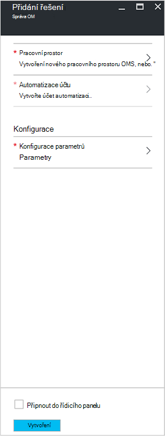

<properties
    pageTitle="Spuštění nebo zastavení VMs při řešení která [Preview] | Microsoft Azure"
    description="Řešení pro správu OM spustí a přestane virtuálních počítačích správce prostředků Azure při plánování včasným a sledovat a od protokolu analýzy."
    services="automation"
    documentationCenter=""
    authors="MGoedtel"
    manager="jwhit"
    editor=""
    />
<tags
    ms.service="automation"
    ms.workload="tbd"
    ms.tgt_pltfrm="na"
    ms.devlang="na"
    ms.topic="get-started-article"
    ms.date="10/07/2016"
    ms.author="magoedte"/>

# Spuštění nebo zastavení VMs při řešení která [Preview] v automatizaci

Spuštění nebo zastavení VMs při řešení která [Preview] spustí a přestane virtuálních počítačích správce prostředků Azure při plánování uživatelem definovaných a poskytuje přehled o úspěchu automatizace úloh, které spustit a zastavit virtuálních počítačích s OMS protokolu analýzy.  

## Zjistit předpoklady pro

- Runbooks pracovat s [Azure spustit jako účet](automation-sec-configure-azure-runas-account.md).  Účet Spustit jako je upřednostňované ověřování, protože ho používá ověřování certifikátů místo heslo, které mohou platnost nebo se často mění.  

- Toto řešení můžete spravovat pouze VMs, které jsou ve stejném předplatném a pole Skupina zdroje jako kde jsou uložená automatizaci účtu.  

- Toto řešení nasazuje pouze na následující Azure oblasti - Austrálie jihovýchodní, východoasijských USA, jihovýchodní Asie a západní Evropy.  Runbooks, kteří spravují plánu OM možné zacílit VMs v jakékoli oblasti.  

- Pokud chcete poslat e-mailová oznámení při dokončování OM runbooks spuštění a ukončení, požaduje podnikový předplatného Office 365.  

## Součásti řešení

Tato řešení se skládá z následujících materiálů, které budou importovány a přidala do vašeho účtu automatizaci.

### Runbooks

Postupu Runbook | Popis|
--------|------------|
CleanSolution MS Správa OM | Tohoto postupu runbook odeberete veškerý zdrojů a plány při přechodu řešení odstranit ze svého předplatného.|  
SendMailO365-MS-Správa | Tohoto postupu runbook odešle e-mailu přes Office 365 Exchange.|
StartByResourceGroup MS Správa OM | Tohoto postupu runbook slouží ke spuštění VMs (obě klasické a ARM VMs), který je umístěn v dané seznam skupin Azure zdroje.
StopByResourceGroup MS Správa OM | Tohoto postupu runbook určena k ukončení VMs (obě klasické a ARM VMs), který je umístěn v dané seznam skupin Azure zdroje.|
 

### Proměnné

Proměnná | Popis|
---------|------------|
**SendMailO365-MS-Správa** Postupu Runbook ||
SendMailO365 IsSendEmail MS Správa | Určuje, pokud StartByResourceGroup MS Správa OM a StopByResourceGroup MS Správa OM runbooks můžete poslat e-mailového oznámení po dokončení.  Vyberte **PRAVDA** pro povolení a **Nepravda** zakázat výstrahy e-mailu. Výchozí hodnota je **False**.| 
**StartByResourceGroup MS Správa OM** Postupu Runbook ||
StartByResourceGroup-položka ExcludeList-MS-Správa OM | Zadejte jména OM, pokud chcete vyloučit z správy operace; oddělte názvy pomocí semi-colon(;). Zástupný znak (hvězdička) je podporované a hodnoty jsou malá a velká písmena.|
StartByResourceGroup-SendMailO365-EmailBodyPreFix-MS-Správa | Text, který může být přidán na začátek textu e-mailové zprávy.|
StartByResourceGroup-SendMailO365-EmailRunBookAccount-MS-Správa | Určuje název automatizaci účet, který obsahuje e-mailu postupu runbook.  **Neměňte tuto proměnnou.**|
StartByResourceGroup-SendMailO365-EmailRunbookName-MS-Správa | Určuje název postupu runbook e-mailu.  StartByResourceGroup MS Správa OM a StopByResourceGroup MS Správa OM runbooks slouží k odeslání e-mailu.  **Neměňte tuto proměnnou.**|
StartByResourceGroup-SendMailO365-EmailRunbookResourceGroup-MS-Správa | Určuje název, který obsahuje e-mailu postupu runbook skupina zdroje.  **Neměňte tuto proměnnou.**|
StartByResourceGroup-SendMailO365-PředmětE-mailu MS-Správa | Určuje text na řádku Předmět e-mailu.|  
StartByResourceGroup-SendMailO365-EmailToAddress-MS-Správa | Určuje příjemců e-mailu.  Zadejte samostatné názvy pomocí semi-colon(;).|
StartByResourceGroup-TargetResourceGroups-MS-Správa OM | Zadejte jména OM, pokud chcete vyloučit z správy operace; oddělte názvy pomocí semi-colon(;). Zástupný znak (hvězdička) je podporované a hodnoty jsou malá a velká písmena.  Výchozí hodnota (hvězdička) bude obsahovat všechny skupiny prostředků v předplatného.|
StartByResourceGroup-TargetSubscriptionID-MS-Správa OM | Určuje předplatné, které obsahuje VMs spravuje toto řešení.  Musí být stejného předplatného kde jsou uložená automatizaci účet toto řešení.|
**StopByResourceGroup MS Správa OM** Postupu Runbook ||
StopByResourceGroup-položka ExcludeList-MS-Správa OM | Zadejte jména OM, pokud chcete vyloučit z správy operace; oddělte názvy pomocí semi-colon(;). Zástupný znak (hvězdička) je podporované a hodnoty jsou malá a velká písmena.|
StopByResourceGroup-SendMailO365-EmailBodyPreFix-MS-Správa | Text, který může být přidán na začátek textu e-mailové zprávy.|
StopByResourceGroup-SendMailO365-EmailRunBookAccount-MS-Správa | Určuje název automatizaci účet, který obsahuje e-mailu postupu runbook.  **Neměňte tuto proměnnou.**|
StopByResourceGroup-SendMailO365-EmailRunbookResourceGroup-MS-Správa | Určuje název, který obsahuje e-mailu postupu runbook skupina zdroje.  **Neměňte tuto proměnnou.**|
StopByResourceGroup-SendMailO365-PředmětE-mailu MS-Správa | Určuje text na řádku Předmět e-mailu.|  
StopByResourceGroup-SendMailO365-EmailToAddress-MS-Správa | Určuje příjemců e-mailu.  Zadejte samostatné názvy pomocí semi-colon(;).|
StopByResourceGroup-TargetResourceGroups-MS-Správa OM | Zadejte jména OM, pokud chcete vyloučit z správy operace; oddělte názvy pomocí semi-colon(;). Zástupný znak (hvězdička) je podporované a hodnoty jsou malá a velká písmena.  Výchozí hodnota (hvězdička) bude obsahovat všechny skupiny prostředků v předplatného.|
StopByResourceGroup-TargetSubscriptionID-MS-Správa OM | Určuje předplatné, které obsahuje VMs spravuje toto řešení.  Musí být stejného předplatného kde jsou uložená automatizaci účet toto řešení.|  
 

### Plány

Plán | Popis|
---------|------------|
StartByResourceGroup plánu MS Správa | Plán pro postupu runbook StartByResourceGroup, která provádí spuštění VMs spravuje toto řešení.|
StopByResourceGroup plánu MS Správa | Plán pro postupu runbook StopByResourceGroup, která provádí vypnutí VMs spravuje toto řešení.|

### Přihlašovací údaje

Přihlašovací údaje | Popis|
-----------|------------|
O365Credential | Určuje platný uživatelský účet Office 365 odeslání e-mailu.  Povinné pouze pokud proměnné SendMailO365-IsSendEmail-MS-Správa nastavena na **hodnotu True**.

## Konfigurace

Proveďte následující kroky přidání VMs spuštění nebo zastavení při řešení která [Preview] ke svému účtu automatizace a potom i konfiguraci proměnné přizpůsobení řešení.

1. Na stránce Domů – klikněte na portálu Azure vyberte dlaždici **Marketplace** .  Pokud na dlaždici se Připne už vaše úvodní obrazovce v levém navigačním podokně vyberte **Nový**.  
2. V zásuvné Marketplace zadejte **OM začněte** do vyhledávacího pole a potom vyberte řešení **Spuštění nebo zastavení VMs která [Preview]** z pole výsledky hledání.  
3. V zásuvné **Spuštění nebo zastavení VMs která [Preview]** vybraného řešení zkontrolujte souhrnné informace a potom klikněte na **vytvořit**.  
4. Kde se zobrazí výzva ke konfiguraci řešení před importujte ho na předplatného automatizaci se zobrazí zásuvné **Přidat řešení** .     
5.  Na zásuvné **Přidat řešení** vyberte **pracovní prostor** a tady vyberete OMS workspace, která je propojená s stejné Azure předplatného, který automatizaci účet je v nebo vytvořit nový pracovní prostor OMS.  Pokud nemáte pracovního prostoru OMS, můžete vybrat **Vytvořit nový pracovní prostor** a na zásuvné **Pracovního prostoru OMS** proveďte následující kroky: 
   - Zadejte název nového **Pracovního prostoru OMS**.
   - Vyberte **předplatné** propojit tak, že vyberete z rozevíracího seznamu, pokud není vhodná výchozí vybrané.
   - **Pole Skupina zdroje**můžete vytvářet nové skupiny prostředků nebo vyberte existující skupiny zdrojů.  
   - Vyberte **umístění**.  Pouze místech určených pro výběr jsou aktuálně **Austrálie jihovýchodní**, **Východoasijských USA**, **jihovýchodní Asie**a **Západní Europe**.
   - Vyberte **vrstvy ceny**.  Řešení je k dispozici v dvou úrovní: uvolněte a OMS zaplacený osy.  Bezplatné osy má omezení na množství dat shromážděných denně doba uchovávání informací a postupu runbook úlohy runtime minut.  Vrstvy OMS zaplacený není omezena na množství dat shromážděných denně.  

        > [AZURE.NOTE]
        > Během samostatného zaplacený osy se zobrazí jako jednu z možností, není vhodná.  Pokud jste ho vyberte a pokračovat ve vytváření toto řešení ve vašem předplatném, se nezdaří.  To bude určeno úředně vydáním toto řešení. Pokud používáte toto řešení, bude pouze pomocí automatizace úloh minut a přihlášení požití.  Řešení nepřidá další uzly OMS prostředí.  

6. Po zadání požadované informace na zásuvné **OMS pracovního prostoru** , klikněte na **vytvořit**.  Ověření informací a pracovní prostor vytvořený, můžete sledovat průběh v části **oznámení** z nabídky.  Vrátíte se na zásuvné **Přidat řešení** .  
7. Na zásuvné **Přidat řešení** vyberte **Automatizaci účet**.  Pokud vytváříte nový pracovní prostor OMS, budete vyzváni k taky vytvořit nový účet automatizaci, který bude přidružený s novou OMS pracovní prostor uvedena, včetně Azure předplatného, skupina zdroje a oblast.  Můžete vybrat **vytvořit účet automatizaci** a na zásuvné **Přidat automatizaci účtu** zadejte následujících akcí: 
  - Do pole **název** zadejte název účtu automatizaci.

    Všechny ostatní možnosti jsou automaticky zobrazovat na pracovní prostor OMS vybraná a tyto možnosti nelze změnit.  Účet Azure spustit jako je výchozí metoda ověřování runbooks zahrnuté do tohoto řešení.  Po kliknutí na tlačítko **OK**ověření možnosti konfigurace a vytvoření účtu automatizaci.  V nabídce můžete sledovat jeho průběh v části **oznámení** . 

    Jinak můžete vybrat existující účet automatizaci spustit jako.  Poznámka: aby účet, který vyberete nelze už propojit do jiného pracovního prostoru OMS, jinak zprávy se budou prezentovat zásuvné informující o.  Pokud už je propojený se potřebujete vyberte jiný účet automatizaci spustit jako nebo vytvořte nový účet.    

8. Nakonec na zásuvné **Přidat řešení** vyberte **Konfigurace** a zobrazuje se zásuvné **Parametry** .  Na zásuvné **Parametry** vás systém vyzve k:  
   - Zadejte **Cílových ResourceGroup názvů**, což je zdroje název skupiny, který obsahuje VMs spravuje toto řešení.  Můžete zadat víc než jeden název a jednotlivé pomocí středníku (hodnoty jsou malá a velká písmena).  Pokud chcete cílové VMs ve všech skupinách zdroje v předplatné je podporované použití zástupný znak.
   - Vyberte **plán** , což je opakované data a času pro spuštění a ukončení v cílové skupiny zdroje OM.  

10. Po dokončení konfigurace požadované počáteční nastavení pro řešení vyberte **vytvořit**.  Všechna nastavení bude ověření a potom se pokusí pro nasazení řešení ve vašem předplatném.  To může trvat několik sekund a vy můžete sledovat jeho průběh v části **oznámení** z nabídky. 

## Kolekce četnosti

Automatizace protokolu a úlohy toku dat úlohy je požití do úložiště OMS každých pět minut.  

## Použití řešení

Když přidáte řešení pro správu OM, v pracovním prostoru OMS **StartStopVM zobrazení** vedle sebe se přidá do řídícího OMS.  Této dlaždici se zobrazují počet a grafické znázornění runbooks úloh řešení, která jste zahájili a mít byla úspěšně dokončena.     

Ve vašem účtu automatizaci můžete získat přístup k a spravovat řešení tak, že vyberete dlaždici **řešení** a od zásuvné **řešení** výběrem řešení **Start OM zastavit [pracovního prostoru]** ze seznamu.     

Výběr řešení se prezentace zobrazí zásuvné řešení **Start OM zastavit [pracovního prostoru]** , kde můžete zkontrolovat důležité podrobnosti, například dlaždici **StartStopVM** podobně jako v pracovním prostoru OMS, které zobrazuje počet a grafické znázornění runbooks úloh řešení, která jste zahájili a mít byla úspěšně dokončena.     

Tady můžete taky otevřete OMS pracovního prostoru a další analýza záznamy práce.  Jednoduše klikněte na **všechna nastavení**a v zásuvné **Nastavení** vyberte **Rychlý Start** a zvolte **OMS portál**v zásuvné **Rychlý Start** .   Otevřete novou kartu nebo novou relaci prohlížeče a prezentovat pracovního prostoru OMS přidružený k automatizaci účtu a předplatné.  

### Konfigurace e-mailová oznámení

Chcete-li povolit e-mailová oznámení spuštění a ukončení OM runbooks dokončené, že budete muset změnit **O365Credential** pověření a alespoň následující proměnné:

 - SendMailO365 IsSendEmail MS Správa
 - StartByResourceGroup-SendMailO365-EmailToAddress-MS-Správa
 - StopByResourceGroup-SendMailO365-EmailToAddress-MS-Správa

Konfigurace přihlašovacích údajů **O365Credential** , proveďte následující kroky:

1. Z účtu automatizaci klikněte na **Všechna nastavení** v horní části okna. 
2. Na zásuvné **Nastavení** v části **Automatické zdroje**vyberte **prostředky**. 
3. Na zásuvné **prostředky** vyberte dlaždici **přihlašovací údaje** a od zásuvné **přihlašovacích údajů** vyberte **O365Credential**.  
4. Zadejte platný Office 365 uživatelské jméno a heslo a klepněte na tlačítko **Uložit** uložte provedené změny.  

Abyste mohli nakonfigurovat proměnné zvýrazněným dříve, proveďte následující kroky:

1. Z účtu automatizaci klikněte na **Všechna nastavení** v horní části okna. 
2. Na zásuvné **Nastavení** v části **Automatické zdroje**vyberte **prostředky**. 
3. Na zásuvné **prostředky** vyberte dlaždici **proměnné** a od zásuvné **proměnné** zvolte proměnnou výše uvedené a potom změňte jeho hodnotu následující popis je uvedena v části [proměnné](##variables) .  
4. Klepnutím na tlačítko **Uložit** uložte změny do proměnné.   

### Úprava plánu při spuštění a ukončení

Správa při spuštění a ukončení plánování v tomto řešení sleduje stejným způsobem, jak je uvedeno v [plánování postupu runbook v Azure automatizaci](automation-scheduling-a-runbook.md).  Mějte na paměti, nebude možné upravit konfiguraci plánu.  Musíte zakázat existující plán a vytvořte místo něj nový a potom propojení **StartByResourceGroup MS Správa OM** nebo postupu runbook **StopByResourceGroup MS Správa OM** požadovaný plán vyrovnat.   

## Technologie pro analýzu záznamů protokolu

Automatizace vytvoří dva typy záznamů v úložišti OMS.

### Protokoly projektu

Vlastnost | Popis|
----------|----------|
Volající |  Kdo, které iniciuje operaci.  Možné hodnoty jsou-mailovou adresu nebo systém naplánovaných úloh.|
Kategorie | Klasifikace typu data.  Hodnota pro automatizaci, je JobLogs.|
CorrelationId | Identifikátor GUID, která je Id korelace, které úlohy postupu runbook.|
JobId | GUID, který je Id úlohy postupu runbook.|
Název operace | Určuje typ operace v Azure.  Pro automatizaci bude hodnota práce.|
resourceId | Určuje typ zdroje v Azure.  Hodnota pro automatizaci, je automatizaci účet spojený s postupu runbook.|
ResourceGroup | Určuje název skupiny zdroje úlohy postupu runbook.|
ResourceProvider | Určuje, z něhož pochází zdroje můžete nasazovat a spravovat službu Azure.  Hodnota pro automatizaci, je Azure automatizaci.|
ResourceType | Určuje typ zdroje v Azure.  Hodnota pro automatizaci, je automatizaci účet spojený s postupu runbook.|
resultType | Stav úlohy postupu runbook.  Možné hodnoty jsou: -Začínáme -Stopped -Pozastavené -Se nezdařila. -Bylo úspěšné|
resultDescription | Popisuje výsledek stavu úlohy postupu runbook.  Možné hodnoty jsou: -Zahájení úlohy -Úlohy se nezdařila. -Úloha dokončena|
RunbookName | Určuje název postupu runbook.|
SourceSystem | Určuje systém zdroj dat odeslaný.  Pro automatizaci, bude hodnota: OpsManager|
StreamType | Určuje typ události. Možné hodnoty jsou: -Komentářem -Výstup : Chyba -Upozornění|
SubscriptionId | Určuje ID předplatného úlohy.
Čas | Datum a čas provedení úlohy postupu runbook.|

### Toky projektu

Vlastnost | Popis|
----------|----------|
Volající |  Kdo, které iniciuje operaci.  Možné hodnoty jsou-mailovou adresu nebo systém naplánovaných úloh.|
Kategorie | Klasifikace typu data.  Hodnota pro automatizaci, je JobStreams.|
JobId | GUID, který je Id úlohy postupu runbook.|
Název operace | Určuje typ operace v Azure.  Pro automatizaci bude hodnota práce.|
ResourceGroup | Určuje název skupiny zdroje úlohy postupu runbook.|
resourceId | Určuje zdroje Id v Azure.  Hodnota pro automatizaci, je automatizaci účet spojený s postupu runbook.|
ResourceProvider | Určuje, z něhož pochází zdroje můžete nasazovat a spravovat službu Azure.  Hodnota pro automatizaci, je Azure automatizaci.|
ResourceType | Určuje typ zdroje v Azure.  Hodnota pro automatizaci, je automatizaci účet spojený s postupu runbook.|
resultType | Výsledek postupu runbook úlohy v době, kdy byl vytvořen události.  Možné hodnoty jsou: -Probíhající|
resultDescription | Obsahuje tok výstup z postupu runbook.|
RunbookName | Název postupu runbook.|
SourceSystem | Určuje systém zdroj dat odeslaný.  Pro automatizaci bude hodnota OpsManager|
StreamType | Typ projektu proudu. Možné hodnoty jsou: -Průběhu -Výstup -Upozornění : Chyba -Ladění -Komentářem|
Čas | Datum a čas provedení úlohy postupu runbook.|

Při hledání všechny protokol, který vrací záznamy kategorie **JobLogs** nebo **JobStreams**, můžete vybrat zobrazení **JobLogs** nebo **JobStreams** , které vám zobrazí několik dlaždic shrnutí aktualizace nalezené.

## Ukázka protokolu hledání

Následující tabulka obsahuje ukázkové protokolu vyhledá záznamy úloh shromážděná toto řešení. 

Dotaz | Popis|
----------|----------|
Vyhledat postupu runbook StartVM, který úspěšně dokončené práce | Kategorie = JobLogs RunbookName_s = "StartByResourceGroup-MS-Správa OM" ResultType = úspěšně & #124; míra count() tak, že JobId_g|
Najít úlohy pro postupu runbook StopVM, který máte byla úspěšně dokončena | Kategorie = JobLogs RunbookName_s = "StartByResourceGroup-MS-Správa OM" ResultType = se nepodařilo & #124; míra count() tak, že JobId_g
Zobrazení stavu úlohy v čase pro StartVM a StopVM runbooks | Kategorie = JobLogs RunbookName_s = "StartByResourceGroup-MS-Správa OM" nebo "StopByResourceGroup-MS-Správa OM" NOT(ResultType="started") | Změřte Count() ResultType intervalu 1 den|

## Další kroky

- Další informace o tom, jak vytvářet jiné vyhledávací dotazy a protokolech úlohy automatizaci s protokolu analýzy najdete v tématu [protokolu vyhledávání v protokolu analýzy](../log-analytics/log-analytics-log-searches.md)
- Další informace o postupu runbook spuštění, jak sledovat postupu runbook úlohy a další technické podrobnosti najdete v tématu [Sledování postupu runbook projektu](automation-runbook-execution.md)
- Další informace o OMS protokolu technologie pro analýzu a shromažďování zdrojů dat, zobrazení [dat úložiště shromažďování Azure přehled analýzy protokolu](../log-analytics/log-analytics-azure-storage.md)

   

