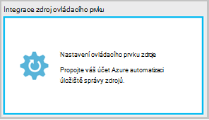
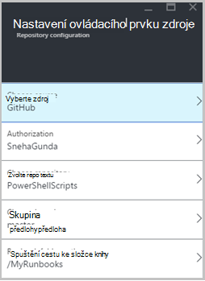
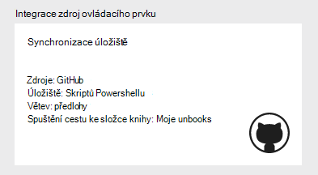
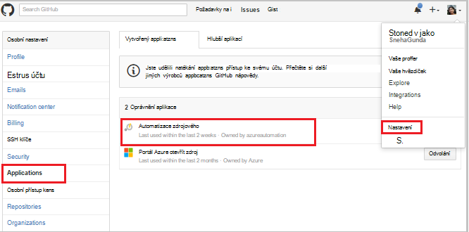
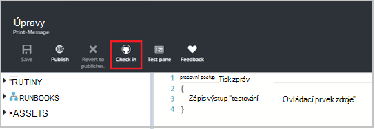
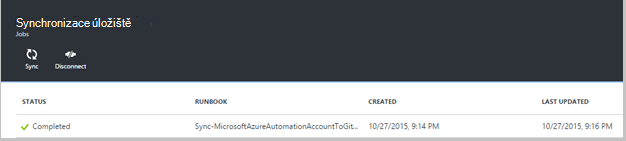
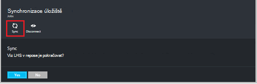
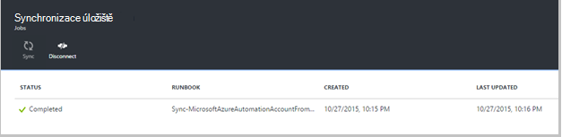
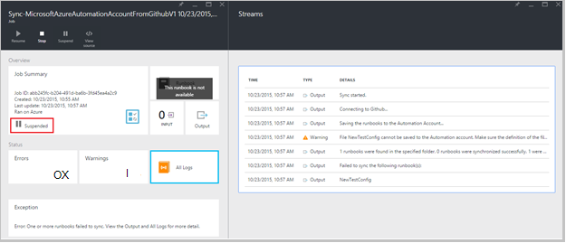
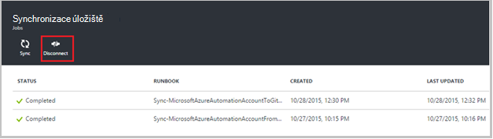

<properties 
    pageTitle=" Zdroj ovládacího prvku integrace v Azure automatizaci | Microsoft Azure"
    description="Tento článek popisuje zdroj ovládacího prvku integrace s GitHub v Azure automatizaci."
    services="automation"
    documentationCenter=""
    authors="mgoedtel"
    manager="jwhit"
    editor="tysonn" />    
<tags 
    ms.service="automation"
    ms.devlang="na"
    ms.topic="article"
    ms.tgt_pltfrm="na"
    ms.workload="infrastructure-services"
    ms.date="09/12/2016"
    ms.author="magoedte;sngun" />

# Integrace zdroj ovládacího prvku v Azure automatizaci

Zdroj ovládacího prvku integrace umožňují přiřadit runbooks ve vašem účtu automatizaci k úložišti GitHub zdroj ovládacího prvku. Ovládací prvek zdroje umožňuje snadno spolupráci s týmem, sledování změn a návrat ke starším verzím vaší runbooks. Například zdrojového vám umožní synchronizovat různých pobočky ovládacího prvku zdroje na vývoj, test nebo výrobní automatizaci účty, usnadňuje propagace kód, který otestování ve vašem prostředí vývoj výroby automatizaci účtu.

Ovládací prvek zdroje umožňuje nabízená kód z Azure automatizaci zdrojového nebo táhnout runbooks z ovládacího prvku zdroje k automatizaci Azure. Tento článek popisuje, jak nastavit ovládacího prvku zdroje v prostředí Azure automatizaci. Začneme nakonfigurováním Azure automatizaci přístup k úložišti GitHub a projděte si různých operacích, které lze provést pomocí integrací správy zdrojů. 

>[AZURE.NOTE]Ovládací prvek zdroje podporuje zavedení a předání [runbooks prostředí PowerShell pracovního postupu](automation-runbook-types.md#powershell-workflow-runbooks) , jakož i [runbooks Powershellu](automation-runbook-types.md#powershell-runbooks). [Grafické runbooks](automation-runbook-types.md#graphical-runbooks) zatím nejsou podporované.  

Existují dva jednoduché kroky konfigurace ovládacího prvku zdroje pro váš účet automatizaci a jenom Pokud už máte účet GitHub. Jsou:
## Krok 1 – Vytvoření GitHub úložiště

Pokud už máte účet GitHub a úložiště, který chcete propojit s Azure automatizace a potom přihlášení k vašemu stávajícímu účtu a začněte od kroku 2 dole. V opačném přejděte [GitHub](https://github.com/), přihlaste se nahoru pro nový účet a [vytvořit nové úložiště](https://help.github.com/articles/create-a-repo/).

## Krok 2 – nastavení ovládacího prvku zdroje v Azure automatizaci

1. Automatizace účtu zásuvné na portálu Azure klikněte na **nastavit zdrojového.** 
 
    

2. Otevře se zásuvné **Ovládacího prvku zdroje** , kde lze konfigurovat GitHub podrobnosti o účtu. Tady je seznam parametrů pro nastavení:  

  	|**Parametr**            |**Popis** |
  	|:---|:---| 
  	|Vyberte zdroj   | Vyberte zdroj výsledků. V současnosti je podporována pouze **GitHub** . |
  	|Povolení | Klikněte na tlačítko **udělit oprávnění** udělujete přístup Azure automatizaci do GitHub úložiště. Pokud jste se už přihlásili k vašemu účtu GitHub v jiném okně, jsou použita pověření tohoto účtu. Po úspěšném ověření se zobrazí zásuvné svoje uživatelské jméno GitHub v části **Vlastnosti se tak mohli ověřovat**. |
  	|Zvolte úložiště | Vyberte úložišti GitHub ze seznamu dostupné úložiště. |
  	|Zvolte větev | Vyberte pobočky ze seznamu dostupných poboček. Pouze **hlavní** větev zobrazený, pokud jste nevytvořili všechny poboček. |
  	|Cestu ke složce postupu Runbook | Cestu ke složce postupu runbook Určuje cestu v úložišti GitHub, ze kterého chcete posunout nebo z vlastního kódu. Je potřeba zadat ve formátu **/foldername/subfoldername**. Ke svému účtu automatizaci budou synchronizovat pouze runbooks cestu ke složce postupu runbook. Synchronizovat Runbooks podsložky **není** bude cesta složky postupu runbook. Použití **/** synchronizovat všechny runbooks v části úložiště. |

3. Například pokud máte s názvem **PowerShellScripts** obsahující do složky nazvané **RootFolder**úložiště, který obsahuje do složky s názvem **podsložky**. Následující řetězce můžete použít k synchronizaci jednotlivých úrovní složky:

    1. Pokud chcete synchronizovat runbooks z **úložiště**, cestu ke složce postupu runbook je*/*
    2. Pokud chcete synchronizovat runbooks z **RootFolder**, cestu ke složce postupu runbook je */RootFolder*
    3. Synchronizace runbooks z **podsložky**, je cestu ke složce postupu runbook */RootFolder/SubFolder*.
  

4. Po konfiguraci parametry, se zobrazí na **nastavit zdrojového zásuvné.**  
 
    

5. Po kliknutí na tlačítko OK integrací správy zdrojů je nyní nakonfigurován pro váš účet automatizaci a mají být aktualizovány GitHub informace. Teď můžete kliknout v této části můžete zobrazit všechny historie zdroj ovládacího prvku synchronizace úloh.  

    

6. Po nastavení ovládacího prvku zdroje v následujících zdrojích automatizaci se vytvoří ve vašem účtu automatizace:  
 Dvě [proměnné prostředky](automation-variables.md) vzniká.  
      
    * Proměnná **Microsoft.Azure.Automation.SourceControl.Connection** obsahuje hodnoty připojovací řetězec, jak je ukázáno v následujícím příkladu.  

  	|**Parametr**            |**Hodnota** |
  	|:---|:---|
  	| Jméno  | Microsoft.Azure.Automation.SourceControl.Connection |
  	| Typ | Řetězec |
  	| Hodnota  | {"Větev":\<*název pobočky*>, "RunbookFolderPath":\<*cestu ke složce postupu Runbook*>, "typ zprostředkovatele":\<*má hodnotu 1 pro GitHub*>, "Úložiště":\<*název úložiště*>, "Uživatelské jméno":\<*GitHub vaše uživatelské jméno*>} |   

    * Proměnná **Microsoft.Azure.Automation.SourceControl.OAuthToken**obsahuje hodnotu zabezpečené šifrované vaší OAuthToken.  

  	|**Parametr**            |**Hodnota** |
  	|:---|:---|
  	| Jméno  | Microsoft.Azure.Automation.SourceControl.OAuthToken |
  	| Typ | Unknown(Encrypted) |
  	| Hodnota | <*Šifrované OAuthToken*> |  

      

    * **Automatizace zdrojového** se přidá ve formě aplikace oprávnění ke svému účtu GitHub. Chcete-li zobrazit aplikace: Z domovské stránky GitHub, přejděte do vlastního **profilu** > **Nastavení** > **aplikací**. Tato aplikace umožňuje Azure automatizaci synchronizace GitHub úložiště k automatizaci účtu.  

    

## Použití ovládacího prvku zdroje v automatizaci

### Vrácení se změnami postupu runbook z Azure automatizaci do ovládacího prvku zdroje

Postupu Runbook vrácení se změnami umožňuje nabízená změny, které jste provedli postupu runbook v Azure automatizaci do úložiště správy zdrojů. Tady najdete postup, jak vrácení se změnami postupu runbook:

1. Z účtu automatizaci, [vytvořte nové textové postupu runbook](automation-first-runbook-textual.md)nebo [Upravit existující, textový postupu runbook](automation-edit-textual-runbook.md). Tohoto postupu runbook může být pracovní postup prostředí PowerShell nebo postupu runbook skript Powershellu.  

2. Po úpravách vaší postupu runbook uložit, abyste ji a klikněte na **vrácení se změnami** z zásuvné **Upravit** .  

    

     >[AZURE.NOTE] Vrácení se změnami z Azure automatizaci přepíše kód, který se právě nachází v ovládacího prvku zdroje. Libovolná odpovídající příkazového řádku pokyn k vrácení se změnami je **přidejte libovolná + libovolná potvrdit + libovolná nabízená**  

3. Po klepnutí na tlačítko **vrátit se změnami**, zobrazí se výzva k potvrzení klikněte na Ano pokračovat.  

    

4. Vrácení se změnami spustí postupu runbook zdroj ovládacího prvku: **Synchronizace MicrosoftAzureAutomationAccountToGitHubV1**. Tohoto postupu runbook připojuje k GitHub a posune změny z Azure automatizaci do úložiště. Pokud chcete zobrazit historii vrácení se změnami projektu, přejděte zpátky na kartě **Integrací správy zdrojů** a klepnutím otevřete zásuvné úložiště synchronizace. Tento zásuvné zobrazuje všechny úlohy zdroj ovládacího prvku.  Vyberte úlohu chcete zobrazit a klikněte na Zobrazit podrobnosti.  

    

    >[AZURE.NOTE] Zdroj ovládacího prvku runbooks jsou jinak runbooks automatizaci, které se nedají zobrazit ani upravit. Když se nezobrazovaly v seznamu postupu runbook, zobrazí se synchronizace úloh neprojevují ve vašem seznamu úlohy.
 
5. Název změněné postupu runbook jsou odeslány jako vstupní parametry postupu runbook vrácení se změnami Můžete [Zobrazit podrobnosti projektu](automation-runbook-execution.md#viewing-job-status-using-the-azure-management-portal) rozbalením postupu runbook v zásuvné **Úložiště synchronizace** .  

    

6. Po dokončení úlohy zobrazíte změny, aktualizujte GitHub úložiště.  V úložišti se zprávou Potvrdit by měl být potvrdit: * *Aktualizované *postupu Runbook název* v Azure Automation.* *  

### Synchronizace runbooks z ovládacího prvku zdroje k automatizaci Azure 

Tlačítko Synchronizovat na zásuvné úložiště synchronizace umožňuje získat všechny runbooks v cestu ke složce postupu runbook úložiště ke svému účtu automatizaci. Stejném úložišti můžete synchronizovat do více než jednoho účtu automatizaci. Tady najdete postup, jak synchronizovat postupu runbook:

1. Z tohoto účtu automatizaci kde nastavení ovládacího prvku zdroje, otevřete **zásuvné zdroje ovládacího prvku integrace/úložiště synchronizaci** a klikněte na **synchronizovat** a zobrazí se výzva k potvrzení klikněte na **Ano** pokračovat.  

    

2. Synchronizace začne postupu runbook: **Synchronizace MicrosoftAzureAutomationAccountFromGitHubV1**. Tohoto postupu runbook připojí se k GitHub a použije změny z úložiště k automatizaci Azure. Měli byste vidět novou úlohu na zásuvné **Synchronizace úložiště** pro tuto akci. Podrobnosti o úlohy synchronizace zobrazíte kliknutím na Otevřít zásuvné podrobnosti projektu.  
 
    

 
    >[AZURE.NOTE] Synchronizovat ze zdrojového přepíše pracovní verze runbooks, které aktuálně existují ve vašem účtu automatizaci pro **všechny** runbooks, která právě probíhá ovládacího prvku zdroje. Libovolná instrukce odpovídající příkazového řádku pro synchronizaci je **Libovolná vyžádané**

## Řešení potíží zdroj ovládacího prvku

Pokud jsou všechny chyby pomocí vrácení se změnami nebo synchronizace úlohy, třeba pozastavit stavu úlohy a zobrazíte další informace o chybě v zásuvné úlohy.  Části **Všechny protokoly** řádku se zobrazí všechny prostředí PowerShell datové proudy přidružený k této úlohy. To vám poskytne podrobností potřebných týkající se odstranění potíží se změnami nebo synchronizace. Je taky zobrazí řadu akcí, které byly při synchronizaci nebo kontrola se změnami postupu runbook.  

## Odpojení ovládacího prvku zdroje

Odpojení od účtu GitHub, otevřete zásuvné synchronizace úložiště a klikněte na **Odpojit**. Po odpojení zdrojového runbooks, které jste synchronizovali dříve bude stále na účtu automatizaci ale nepovolí zásuvné úložiště synchronizace.  

  

## Další kroky

Další informace o integration zdroj ovládacího prvku najdete v následujících zdrojích:  
- [Azure automatizace: Integrací správy zdrojů v Azure automatizaci](https://azure.microsoft.com/blog/azure-automation-source-control-13/)  
- [Hlasování systému oblíbený zdroj ovládacího prvku](https://www.surveymonkey.com/r/?sm=2dVjdcrCPFdT0dFFI8nUdQ%3d%3d)  
- [Azure automatizace: Integrace postupu Runbook ovládacího prvku zdroje služby Visual Studio týmu](https://azure.microsoft.com/blog/azure-automation-integrating-runbook-source-control-using-visual-studio-online/)  
