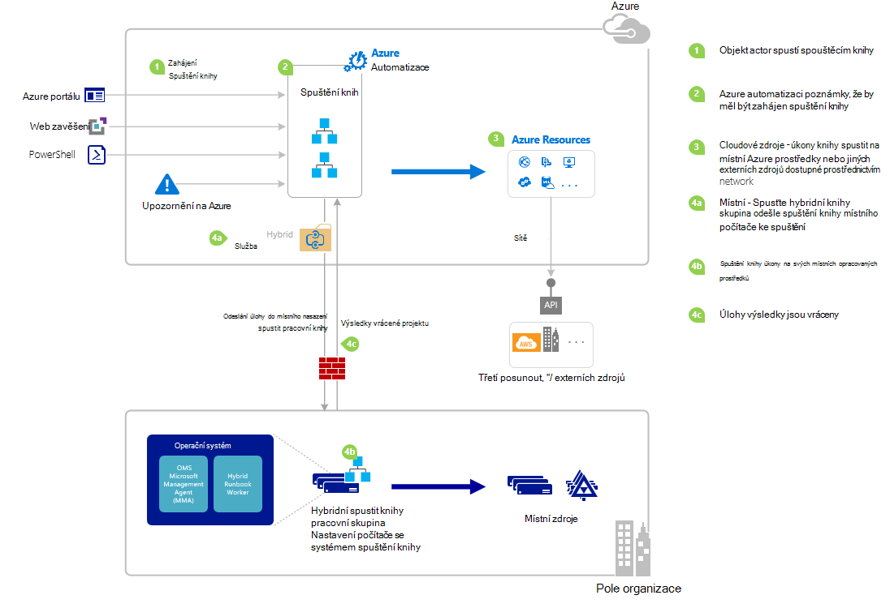

<properties
   pageTitle="Spuštění postupu runbook v Azure automatizaci | Microsoft Azure"
   description="Shrnuje různé metody, které můžete použít ke spuštění postupu runbook v Azure automatizaci a obsahuje podrobné informace o použití Azure portálem a prostředí Windows PowerShell."
   services="automation"
   documentationCenter=""
   authors="mgoedtel"
   manager="jwhit"
   editor="tysonn" />
<tags
   ms.service="automation"
   ms.devlang="na"
   ms.topic="article"
   ms.tgt_pltfrm="na"
   ms.workload="infrastructure-services"
   ms.date="10/08/2016"
   ms.author="magoedte;bwren"/>

# <a name="starting-a-runbook-in-azure-automation"></a>Spuštění postupu runbook v Azure automatizaci

V následující tabulce vám pomůže určit způsob v Azure automatizaci, která je nejvhodnější pro konkrétní scénář začít postupu runbook. Tento článek obsahuje informace o spuštění postupu runbook Azure portálem a používat Windows PowerShell. Podrobnosti o jiné metody jsou uvedeny v jiných dokumentace, která se můžete dostat z těchto odkazů.

| **METODA**                                                                    | **VLASTNOSTI**                                                                                                                                                                                                                                                                                                                                                |
|-------------------------------------------------------------------------------|--------------------------------------------------------------------------------------------------------------------------------------------------------------------------------------------------------------------------------------------------------------------------------------------------------------------------------------------------------------------|
| [Azure portálu](#starting-a-runbook-with-the-azure-portal)                     | <li>Nejjednodušší způsob interaktivní uživatelského rozhraní.<br> <li>Formulář poskytnout jednoduchý parametrický hodnoty.<br> <li>Snadno sledování stavu úlohy.<br> <li>Přístup ověřena Azure přihlášení.                                                                                                                                                                               |
| [Prostředí Windows PowerShell](https://msdn.microsoft.com/library/dn690259.aspx)        | <li>Zavolat z příkazového řádku pomocí rutin prostředí Windows PowerShell.<br> <li>Zahrnout automatizované řešení s několika kroky.<br> <li>Žádost o ověřen certifikát nebo uživatel OAuth hlavních / služby základní.<br> <li>Obsahují hodnoty parametrů jednoduché i složité.<br> <li>Sledování stavu úlohy.<br> <li>Klient je potřebný kvůli podpoře rutiny prostředí PowerShell. |
| [Rozhraní API Azure automatizaci](https://msdn.microsoft.com/library/azure/mt662285.aspx) | <li>Flexibilní metoda, ale taky většina komplexního.<br> <li>Zavolat z vlastní kód, který může být požadavků HTTP.<br> <li>Žádost o ověřena certifikát nebo uživatel Oauth hlavních / služby základní.<br> <li>Obsahují hodnoty parametrů jednoduché i složité.<br> <li>Sledování stavu úlohy.                                                                          |
| [Webhooks](automation-webhooks.md)                                            | <li>Spuštění postupu runbook z jednoho žádost HTTP.<br> <li>U tokenu zabezpečení do pole Adresa URL ověřit.<br> <li>Klient nelze potlačit zadané při vytváření webhook hodnoty parametrů. Postupu Runbook můžete definovat jeden parametr, který je vyplněn podrobnosti žádost HTTP.<br> <li>Žádné možnost sledování stavu úlohy prostřednictvím webhook adresy URL.                                      |
| [Odpovědět na upozornění na Azure](../log-analytics/log-analytics-alerts.md)               | <li>Začněte postupu runbook odpověď Azure upozornění.<br> <li>Konfigurace webhook postupu runbook a odkaz na upozornění.<br> <li>U tokenu zabezpečení do pole Adresa URL ověřit.<br> <li>V současné době podporuje upozornění metrice pouze.                                                                                                                                                       |
| [Plán](automation-schedules.md)                                | <li>Automaticky spouštět postupu runbook hodinové, denně nebo týdně plánu.<br> <li>Pracovat s plánu prostřednictvím portálu pro Azure, rutiny prostředí PowerShell nebo rozhraní API Azure.<br> <li>Obsahují hodnoty parametrů pro použití se plánu.                                                                                                                                               |
| [Z jiného postupu Runbook](automation-child-runbooks.md)                          | <li>Použijte postupu runbook jako aktivita v jiném postupu runbook.<br> <li>Užitečné pro funkci používá více runbooks.<br> <li>Zadání hodnoty parametru postupu runbook podřízené a výstup použít v nadřazené postupu runbook.                                                                                                                                                               |

Následující obrázek ukazuje podrobný postup životního cyklu postupu runbook. Zahrnuje různé způsoby postupu runbook je spuštěn v Azure automatizaci požadované součásti pro pracovního postupu Runbook hybridní provést Azure automatizaci runbooks a interakce mezi různých složek. Další informace o provádění automatizaci runbooks ve vaší datacentru, podívejte se do [hybridní postupu runbook zaměstnanců](automation-hybrid-runbook-worker.md)



## <a name="starting-a-runbook-with-the-azure-portal"></a>Spuštění postupu runbook pomocí portálu Azure

1.  Na portálu Azure vyberte **automatizace** a potom klikněte na položku název účtu, který automatizaci.
2.  Vyberte kartu **Runbooks** .
3.  Vyberte postupu runbook a potom klepněte na tlačítko **Start**.
4.  Pokud postupu runbook parametry, se výzva k zadání hodnot s textovým polem pro každý parametr. Další podrobnosti o parametry najdete v článku [Postupu Runbook parametry](#Runbook-parameters) níže.
5.  Vyberte **Zobrazení projektu** vedle příslušné zprávy postupu runbook **spuštění** nebo klikněte na kartu **úlohy** pro postupu runbook zobrazení stavu úlohy postupu runbook.

## <a name="starting-a-runbook-with-the-azure-portal"></a>Postupu runbook počínaje portálu Azure

1.  Z vašeho účtu automatizaci klikněte na část **Runbooks** otevřete zásuvné **Runbooks** .
2.  Klikněte na postupu runbook otevřete jeho zásuvné **postupu Runbook** .
3.  Klikněte na tlačítko **Start**.
4.  Pokud postupu runbook bez parametrů, se výzva k potvrzení, jestli chcete spustit. Pokud postupu runbook parametry, takže je můžete zadat hodnoty parametrů se otevře zásuvné **Zahájení postupu Runbook** . Další podrobnosti o parametry najdete v článku [Postupu Runbook parametry](#Runbook-parameters) níže.
5.  Zásuvné **úlohy** se otevře, aby mohli sledovat stav úlohy.

## <a name="starting-a-runbook-with-windows-powershell"></a>Začínající postupu runbook prostředí Windows PowerShell

[Zahájení AzureRmAutomationRunbook](https://msdn.microsoft.com/library/mt603661.aspx) umožňuje začínají postupu runbook prostředí Windows PowerShell. Následující ukázkový kód spustí postupu runbook s názvem Test postupu Runbook.

```
Start-AzureRmAutomationRunbook -AutomationAccountName "MyAutomationAccount" -Name "Test-Runbook" -ResourceGroupName "ResourceGroup01"
```

Zahájení AzureRmAutomationRunbook vrátí úlohy objekt, který můžete sledovat její stav po spuštění postupu runbook. Pak můžete tento objekt úlohu s [Get-AzureRmAutomationJob](https://msdn.microsoft.com/library/mt619440.aspx) určit stav úlohy a [Get-AzureRmAutomationJobOutput](https://msdn.microsoft.com/library/mt603476.aspx) zobrazíte jeho výstup. Následující ukázkový kód spustí postupu runbook s názvem Test-postupu Runbook, čeká tak, aby byl dokončen a zobrazí se jeho výstup.

```
$runbookName = "Test-Runbook"
$ResourceGroup = "ResourceGroup01"
$AutomationAcct = "MyAutomationAccount"

$job = Start-AzureRmAutomationRunbook –AutomationAccountName $AutomationAcct -Name $runbookName -ResourceGroupName $ResourceGroup

$doLoop = $true
While ($doLoop) {
   $job = Get-AzureRmAutomationJob –AutomationAccountName $AutomationAcct -Id $job.JobId -ResourceGroupName $ResourceGroup
   $status = $job.Status
   $doLoop = (($status -ne "Completed") -and ($status -ne "Failed") -and ($status -ne "Suspended") -and ($status -ne "Stopped"))
}

Get-AzureRmAutomationJobOutput –AutomationAccountName $AutomationAcct -Id $job.JobId -ResourceGroupName $ResourceGroup –Stream Output
```

Vyžaduje-li postupu runbook parametry, musíte je zadat jako [hashtable](http://technet.microsoft.com/library/hh847780.aspx) kde klávesu hashtable shoduje s názvem parametr a hodnota je hodnota parametru. Následující příklad ukazuje, jak začít postupu runbook se dvěma parametry řetězec s názvem jméno a příjmení, jméno celé s názvem RepeatCount a logické parametr s názvem zobrazit. Další informace o parametry najdete v článku níže uvedené [Parametry postupu Runbook](#Runbook-parameters) .

```
$params = @{"FirstName"="Joe";"LastName"="Smith";"RepeatCount"=2;"Show"=$true}
Start-AzureRmAutomationRunbook –AutomationAccountName "MyAutomationAccount" –Name "Test-Runbook" -ResourceGroupName "ResourceGroup01" –Parameters $params
```

## <a name="runbook-parameters"></a>Parametry postupu Runbook

Když začnete postupu runbook z portálu Azure nebo prostředí Windows PowerShell, instrukce jsou odeslány pomocí webové služby Azure automatizaci Tuto službu nepodporuje parametry se složitými datovými typy. Pokud budete muset zadat hodnotu parametru složité, pak musíte zavolat je vložený z jiného postupu runbook podle popisu v [podřízené runbooks v Azure automatizaci](automation-child-runbooks.md).

Webová služba Azure automatizaci poskytne speciální funkce parametrů pomocí určitých typů dat podle popisu v následujících částech.

### <a name="named-values"></a>Pojmenovaných hodnot

Pokud parametr je datový typ [objekt] a potom ji odeslat seznam pojmenovaných hodnot můžete použít v tomto formátu JSON: *{název1: "Hodnota1", NÁZEV2: "Hodnota2", Name3: "Hodnota3"}*. Tyto hodnoty musí být jednoduché typy. Postupu runbook dostanou parametr jako [PSCustomObject](https://msdn.microsoft.com/library/system.management.automation.pscustomobject%28v=vs.85%29.aspx) s vlastnostmi, které odpovídají jednotlivých pojmenovaných hodnot.

Zvažte následující postupu runbook test, která přijímá parametr s názvem uživatele.

```
Workflow Test-Parameters
{
   param (
      [Parameter(Mandatory=$true)][object]$user
   )
    $userObject = $user | ConvertFrom-JSON
    if ($userObject.Show) {
        foreach ($i in 1..$userObject.RepeatCount) {
            $userObject.FirstName
            $userObject.LastName
        }
    }
}
```

Tento text může použitá pro parametr uživatele.

```
{FirstName:'Joe',LastName:'Smith',RepeatCount:'2',Show:'True'}
```

Výsledkem následující výstup.

```
Joe
Smith
Joe
Smith
```

### <a name="arrays"></a>Matice

Pokud je parametr maticových například [pole] nebo [v tomto formátu JSON můžete použít k odeslání seznamu hodnot typu řetězec []]: *[hodnota1, hodnota2, hodnota3]*. Tyto hodnoty musí být jednoduché typy.

Zvažte následující postupu runbook test, která přijímá parametr s názvem *uživatele*.

```
Workflow Test-Parameters
{
   param (
      [Parameter(Mandatory=$true)][array]$user
   )
    if ($user[3]) {
        foreach ($i in 1..$user[2]) {
            $ user[0]
            $ user[1]
        }
    }
}
```

Tento text může použitá pro parametr uživatele.

```
["Joe","Smith",2,true]
```

Výsledkem následující výstup.

```
Joe
Smith
Joe
Smith
```

### <a name="credentials"></a>Přihlašovací údaje

Pokud je parametr datový typ **PSCredential**, můžete zadat název Azure automatizaci [materiálů přihlašovacích údajů](automation-credentials.md). Postupu runbook načte pověření s názvem, který určíte.

Zvažte následující postupu runbook test, která přijímá parametr s názvem přihlašovacích údajů.

```
Workflow Test-Parameters
{
   param (
      [Parameter(Mandatory=$true)][PSCredential]$credential
   )
   $credential.UserName
}
```

Tento text může použitá pro parametr uživatele za předpokladu, že jste udělali pověření majetku s názvem *Moje přihlašovací údaje*.

```
My Credential
```

Za předpokladu, že uživatelské jméno v pověření byl *jnovak*, výsledkem následující výstup.

```
jsmith
```

## <a name="next-steps"></a>Další kroky

-   Architektura postupu runbook v aktuálním článek poskytuje všeobecný přehled runbooks řízení zdrojů v Azure a místních s hybridním pracovního postupu Runbook.  Další informace o provádění automatizaci runbooks ve vaší datacentru najdete v nápovědě k [Hybridní postupu Runbook zaměstnanců](automation-hybrid-runbook-worker.md).
-   Další informace o vytváření moduly runbooks pro použití v jiných runbooks pro konkrétní nebo běžné funkce najdete v nápovědě k [Podřízené Runbooks](automation-child-runbooks.md).
