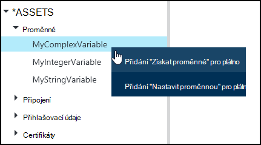
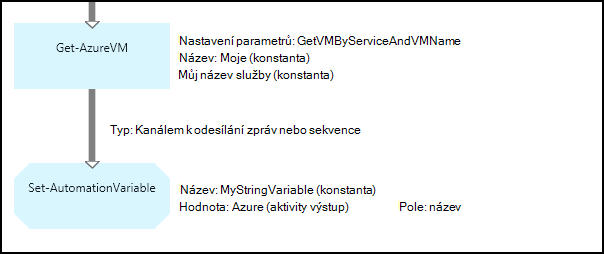
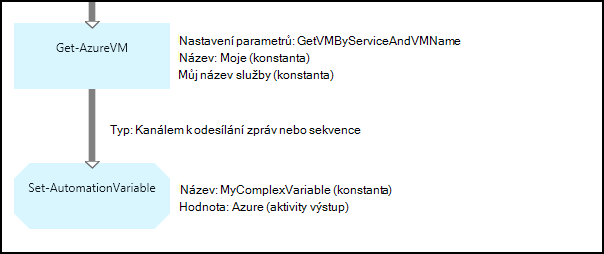
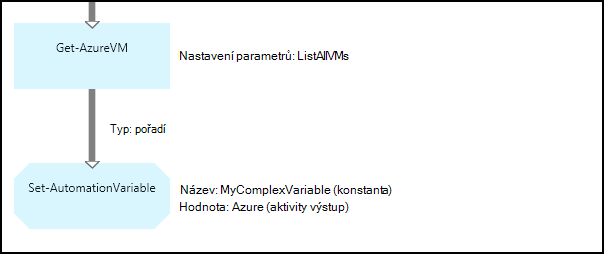
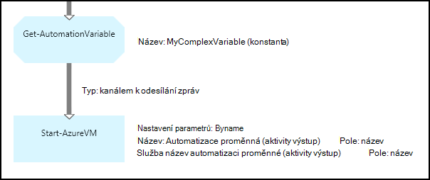
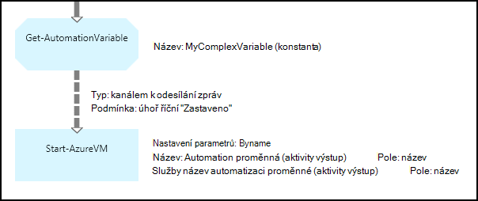

<properties 
   pageTitle="Proměnná prostředky v Azure automatizaci | Microsoft Azure"
   description="Proměnná prostředky jsou zobrazené hodnoty, které jsou dostupné pro všechny runbooks a konfigurace DSC v Azure automatizaci.  Tento článek vysvětluje podrobnosti proměnných a jak pracovat s nimi v textových a grafické vytváření."
   services="automation"
   documentationCenter=""
   authors="mgoedtel"
   manager="jwhit"
   editor="tysonn" />
<tags 
   ms.service="automation"
   ms.devlang="na"
   ms.topic="article"
   ms.tgt_pltfrm="na"
   ms.workload="infrastructure-services"
   ms.date="05/24/2016"
   ms.author="magoedte;bwren" />

# Proměnná vybavení automatizaci Azure

Proměnná prostředky jsou zobrazené hodnoty, které jsou dostupné pro všechny runbooks a konfigurace DSC ve vašem účtu automatizaci. Mohou být vytvořili, upravit a získat prostřednictvím portálu Azure Windows PowerShell a v rámci postupu runbook nebo DSC konfigurace. Automatizace proměnné jsou užitečné v následujících situacích:

- Sdílení hodnotu mezi více runbooks nebo DSC konfigurace.

- Sdílení hodnotu mezi více úloh ze stejného postupu runbook nebo DSC konfigurace.

- Správa hodnotu z portálu nebo z příkazového řádku prostředí Windows PowerShell, který používá runbooks nebo DSC konfigurace.

Trvalý automatizaci proměnné tak, aby nadále k dispozici i v případě postupu runbook nebo DSC konfigurace selže.  Díky také nastavit tak, že jeden postupu runbook, která je pak použít jinou nebo je použito stejné postupu runbook nebo DSC konfigurace při příštím spuštění hodnotu.

Po vytvoření proměnnou můžete určit, že se uloží šifrované.  Po proměnnou musí být zašifrovaný, uloží se bezpečně v Azure automatizaci a jeho hodnotu nelze načtená z kontingenčního seznamu, který se dodává v rámci modul Azure Powershellu rutinu [Get-AzureAutomationVariable](http://msdn.microsoft.com/library/dn913772.aspx) .  Jediný způsob, jak že zašifrované hodnoty můžete získat pochází z **Get-AutomationVariable** aktivitu v postupu runbook nebo DSC konfigurace.

>[AZURE.NOTE]Zabezpečené prostředky v Azure automatizaci zahrnují přihlašovací údaje, certifikáty, připojení a šifrované proměnné. Tyto prostředky jsou zašifrované a uložené v Azure automatizaci pomocí jedinečné vygenerovaný pro každý účet automatizaci. Tento klíč zašifrovaných tak, že certifikát předlohy a uložené v Azure automatizaci. Před uložením zabezpečené materiálů, klíč pro automatizaci účet je dešifrována pomocí předlohy certifikát a potom používaný k šifrování majetku.

## Typy proměnných

Když vytvoříte proměnnou pomocí portálu Azure, je třeba určit datový typ z rozevíracího seznamu tak, aby portál můžete zobrazit příslušný ovládací prvek pro zadání hodnotu proměnné. Proměnná není omezena na tento datový typ, ale je nutné nastavit proměnnou pomocí Windows Powershellu, pokud chcete zadat hodnotu jiného typu. Pokud zadáte **Nedefinováno**, nastavte hodnotu proměnné na **$null**a je třeba nastavit hodnotu s rutinu [Set-AzureAutomationVariable](http://msdn.microsoft.com/library/dn913767.aspx) nebo **Set-AutomationVariable** aktivity.  Nelze vytvořit ani změnit hodnotu pro typ komplexního proměnná na portálu, ale můžete zadat hodnotu typu pomocí Windows Powershellu. Komplexní typy budou vráceny jako [PSCustomObject](http://msdn.microsoft.com/library/system.management.automation.pscustomobject.aspx).

Uložení více hodnot do jedné proměnné vytvořením matici nebo hashtable a uložení proměnné.

## Činnosti rutin a pracovního postupu

Rutin v následující tabulce slouží k vytváření a správa automatizaci proměnné používat Windows PowerShell. Odesláním jako součást [modul Azure Powershellu](../powershell-install-configure.md) , který je k dispozici pro použití v automatizaci runbooks a konfigurace DSC.

|Rutiny pro správu|Popis|
|:---|:---|
|[Get-AzureAutomationVariable](http://msdn.microsoft.com/library/dn913772.aspx)|Vyhledá hodnotu existující proměnné.|
|[Nové AzureAutomationVariable](http://msdn.microsoft.com/library/dn913771.aspx)|Vytvoří novou proměnnou a nastaví její hodnotu.|
|[Odebrat AzureAutomationVariable](http://msdn.microsoft.com/library/dn913775.aspx)|Odebere existující proměnnou.|
|[Nastavení AzureAutomationVariable](http://msdn.microsoft.com/library/dn913767.aspx)|Nastaví hodnotu existující proměnné.|

Činnosti pracovního postupu v následující tabulce se používají pro přístup k automatizaci proměnných v postupu runbook. Jsou dostupné jenom pro použití v postupu runbook nebo DSC konfigurace a ne dodání jako součást modul Azure Powershellu.

|Činnosti pracovního postupu|Popis|
|:---|:---|
|Get-AutomationVariable|Vyhledá hodnotu existující proměnné.|
|Nastavení AutomationVariable|Nastaví hodnotu existující proměnné.|

>[AZURE.NOTE] Vyhněte se použití proměnných v – název parametru **Get-AutomationVariable** v postupu runbook nebo DSC konfigurace, protože to zvětšit zjištění závislostí mezi runbooks nebo DSC konfigurace a automatizace proměnných v době návrhu.

## Vytvoření nového Automation proměnná

### Vytvořit novou proměnnou pomocí portálu Azure

1. Z účtu automatizaci klikněte na **prostředky** v horní části okna.
1. V dolní části okna klikněte na **Přidat nastavení**.
1. Klikněte na **Přidat proměnné**.
1. Dokončete průvodce a klepnutím na zaškrtávací políčko Uložit nové proměnné.

### Vytvořit novou proměnnou pomocí portálu Azure

1. Z účtu automatizaci klikněte na **prostředky** část otevřete zásuvné **prostředky** .
1. Klikněte do **proměnné** části otevřete zásuvné **proměnné** .
1. Klikněte na **Přidat do proměnné** v horní části zásuvné.
1. Vyplňte formulář a klikněte na **vytvořit** a uložit nové proměnné.

### Pokud chcete vytvořit novou proměnnou pomocí prostředí Windows PowerShell

Rutinu [New-AzureAutomationVariable](http://msdn.microsoft.com/library/dn913771.aspx) vytvoří novou proměnnou a nastaví jeho počáteční hodnotu. Můžete obnovit hodnoty na základě [Get-AzureAutomationVariable](http://msdn.microsoft.com/library/dn913772.aspx). Pokud je argument hodnota typu jednoduché, je vrácena stejného typu. Pokud je typem složité, bude vrácena **PSCustomObject** .

Následující ukázkové příkazy ukazují, jak vytvořit proměnnou typu řetězec a vrátí jeho hodnotu.

    New-AzureAutomationVariable –AutomationAccountName "MyAutomationAccount" –Name 'MyStringVariable' –Encrypted $false –Value 'My String'
    $string = (Get-AzureAutomationVariable –AutomationAccountName "MyAutomationAccount" –Name 'MyStringVariable').Value

Následující ukázkové příkazy ukazují, jak vytvořit proměnnou typu složité a vraťte se jeho vlastnosti. V tomto případě se používá objekt virtuálního počítače od **Get-AzureVM** .

    $vm = Get-AzureVM –ServiceName "MyVM" –Name "MyVM"
    New-AzureAutomationVariable –AutomationAccountName "MyAutomationAccount" –Name "MyComplexVariable" –Encrypted $false –Value $vm
    
    $vmValue = (Get-AzureAutomationVariable –AutomationAccountName "MyAutomationAccount" –Name "MyComplexVariable").Value
    $vmName = $vmValue.Name
    $vmIpAddress = $vmValue.IpAddress

## Použití proměnné v postupu runbook nebo DSC konfigurace

Činnost **AutomationVariable nastavení** slouží k nastavení hodnotu proměnné automatické v postupu runbook nebo DSC konfigurace a **Get-AutomationVariable** obnovit.  Rutiny **Set-AzureAutomationVariable** nebo **Get-AzureAutomationVariable** v postupu runbook nebo DSC konfigurace neměli používat, protože jsou méně efektivní než aktivitám pracovního postupu.  Také nemůže získat hodnot zabezpečené proměnných s **Get-AzureAutomationVariable**.  Jediný způsob, jak vytvořit novou proměnnou z postupu runbook nebo DSC konfigurace, je použít rutinu [New-AzureAutomationVariable](http://msdn.microsoft.com/library/dn913771.aspx) .

### Textový postupu runbook vzorky

#### Nastavení a načtení jednoduché hodnoty z proměnné

Následující ukázkové příkazy ukazují, jak nastavit a načíst proměnnou v textové postupu runbook. V tomto příkladu předpokládá se, že proměnné typu integer s názvem *NumberOfIterations* a *NumberOfRunnings* a do proměnné typu řetězec pojmenované *SampleMessage* jste již vytvořili.

    $NumberOfIterations = Get-AutomationVariable -Name 'NumberOfIterations'
    $NumberOfRunnings = Get-AutomationVariable -Name 'NumberOfRunnings'
    $SampleMessage = Get-AutomationVariable -Name 'SampleMessage'
    
    Write-Output "Runbook has been run $NumberOfRunnings times."
    
    for ($i = 1; $i -le $NumberOfIterations; $i++) {
       Write-Output "$i`: $SampleMessage"
    }
    Set-AutomationVariable –Name NumberOfRunnings –Value ($NumberOfRunnings += 1)

#### Nastavení a načítání složité objektu do proměnné

Následující ukázkový kód ukazuje, jak aktualizovat proměnnou složité v s hodnotou textové postupu runbook. V tomto příkladu je Azure virtuálního počítače pomocí **Get-AzureVM** načíst a uložili na existující proměnnou automatizaci.  Způsobem popsaným v tématu [typy proměnných](#variable-types), to je uložená jako PSCustomObject.

    $vm = Get-AzureVM -ServiceName "MyVM" -Name "MyVM"
    Set-AutomationVariable -Name "MyComplexVariable" -Value $vm

Následující kód hodnota získána proměnnou a použít ke spuštění virtuální počítač.

    $vmObject = Get-AutomationVariable -Name "MyComplexVariable"
    if ($vmObject.PowerState -eq 'Stopped') {
       Start-AzureVM -ServiceName $vmObject.ServiceName -Name $vmObject.Name
    }

#### Nastavení a ukládání kolekce do proměnné

Následující ukázkový kód ukazuje, jak používat proměnná s kolekcí složité hodnot v textové postupu runbook. V tomto příkladu více Azure virtuálních počítačích načtena s **Get-AzureVM** se uloží do existující proměnnou automatizaci.  Způsobem popsaným v tématu [typy proměnných](#variable-types), to je uložená jako skupinu PSCustomObjects.

    $vms = Get-AzureVM | Where -FilterScript {$_.Name -match "my"}     
    Set-AutomationVariable -Name 'MyComplexVariable' -Value $vms

Následující kód kolekce získána proměnnou a použít ke spuštění virtuální počítače.

    $vmValues = Get-AutomationVariable -Name "MyComplexVariable"
    ForEach ($vmValue in $vmValues)
    {
       if ($vmValue.PowerState -eq 'Stopped') {
          Start-AzureVM -ServiceName $vmValue.ServiceName -Name $vmValue.Name
       }
    }

### Grafické postupu runbook vzorky

V grafické postupu runbook přidáte **Get-AutomationVariable** nebo **Set-AutomationVariable** pravým tlačítkem myši na proměnnou v podokně knihovna grafické editoru a výběrem činnost, kterou chcete.

#### Nastavení hodnot do proměnné

Následující obrázek zobrazuje ukázka aktivity aktualizovat proměnnou jednoduché v s hodnotou grafické postupu runbook. V tomto příkladu jednoho Azure virtuálního počítače se načítá s **Get-AzureVM** a název počítače se uloží do existující automatizaci proměnnou typu řetězec.  Nezávisle na tom, zda [je odkaz kanálem k odesílání zpráv nebo pořadí](automation-graphical-authoring-intro.md#links-and-workflow) od očekáváme pouze jeden objekt do výstupu.

Následující obrázek znázorňuje aktivity použít k aktualizaci proměnnou složité v s hodnotou grafické postupu runbook. Změnit pouze z předchozího příkladu není zadání **pole Cesta** jako **výstup aktivity** o aktivitě **AutomationVariable nastavit** tak, aby je objekt uložen místo vlastnosti objektu.  Způsobem popsaným v tématu [typy proměnných](#variable-types), to je uložená jako PSCustomObject.

Následující obrázek znázorňuje podobnou funkci obsahují jako v předchozím příkladu, s několika virtuálních počítačích uloží do proměnné.  [Pořadí propojení](automation-graphical-authoring-intro.md#links-and-workflow) musí být použita tady tak, že **Nastavení AutomationVariable** aktivity celou sadu virtuálních počítačích jako jednu kolekci.  Pokud byl použit [odkaz kanálem k odesílání zpráv](automation-graphical-authoring-intro.md#links-and-workflow) , **Sadu AutomationVariable** aktivitu by spusťte samostatně pro každý objekt s výsledkem že by mělo být uloženo pouze poslední virtuálního počítače v kolekci.  Způsobem popsaným v tématu [typy proměnných](#variable-types), to je uložená jako skupinu PSCustomObjects.

#### Načtení hodnot z proměnné

Následující obrázek znázorňuje ukázkové činnosti, které načtení a použití proměnnou v grafické postupu runbook.  První činnosti načte virtuálních počítačích, které byly uložené na proměnnou v předchozím příkladu.  Propojení je třeba [kanálem k odesílání zpráv](automation-graphical-authoring-intro.md#links-and-workflow) tak, aby aktivity **Start AzureVM** jednou pro každý objekt odesílaným z **Get-AutomationVariable** aktivity.  To bude funguje stejně, zda jednoho nebo více objektů uložených v proměnné.  Aktivita **Start AzureVM** používá vlastnosti PSCustomObject představující jednotlivé virtuálního počítače. 

Následující obrázek ukazuje, jak filtrovat objekty, které jsou uložené na proměnnou grafické postupu runbook.  [Podmínka](automation-graphical-authoring-intro.md#links-and-workflow) se přidá na odkaz v předchozím příkladu filtrovat pouze virtuálních počítačích, které byly přerušili, když byl nastaven proměnné.

## Další kroky

- Další informace o připojení aktivity společně při vytváření grafické, najdete v článku [odkazy při vytváření grafické](automation-graphical-authoring-intro.md#links-and-workflow)
- Začínáme s grafickým runbooks, najdete v tématu [Můj první grafické postupu runbook](automation-first-runbook-graphical.md) 
