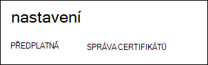
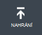
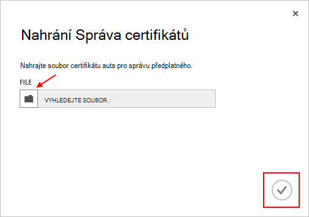

<properties 
    pageTitle="Nahrání certifikát rozhraní API Azure správy | Azure Microsoft" 
    description="Zjistěte, jak nahrát athe rozhraní API správy certifikát pro klasické portálu Azure." 
    services="cloud-services" 
    documentationCenter=".net" 
    authors="Thraka" 
    manager="timlt" 
    editor=""/>

<tags 
    ms.service="na" 
    ms.workload="tbd" 
    ms.tgt_pltfrm="na" 
    ms.devlang="na" 
    ms.topic="article" 
    ms.date="04/18/2016"
    ms.author="adegeo"/>

# Nahrání certifikát správy rozhraní API Azure správy

Osvědčení o řízení umožňují ověřování pomocí rozhraní API služby správy poskytovanou Azure. Mnoho programy a nástroje (například Visual Studio nebo Azure SDK) bude používat tyto certifikáty pro automatické konfigurace a nasazení různé služby Azure. **To platí jenom pro Azure klasický portálu**. 

>[AZURE.WARNING] Dej si pozor! Tyto typy certifikátů povolit každému, kdo ověří s nimi ke správě předplatné, které jsou přidružené. 

Další informace o Azure certifikáty (včetně vytvoření certifikátu podepsaného svým držitelem) je [k dispozici](cloud-services/cloud-services-certs-create.md#what-are-management-certificates) , pokud ho potřebujete.

Můžete taky [Azure Active Directory](/services/active-directory/) ověření klienta použití kódu pro účely automatizaci.

## Nahrání Správa certifikátů

Až budete mít správy ověření vytvořili, (soubor .cer s veřejným klíčem), můžete ho nahrát do portálu. Po k dispozici v portálu certifikát každý, kdo má odpovídající certficiate (privátním klíčem) připojení prostřednictvím rozhraní API správu a přístup ke zdrojům přidružené předplatného.

1. Přihlaste se k [Azure klasické portálu](http://manage.windowsazure.com).

2. Ujistěte se, vyberte správný předplatné, které chcete přiřadit certifikát s. Stisknutím klávesy **předplatná** text v pravém horním rohu na portálu.

    

3. Až budete mít správné vybraného předplatného, stiskněte **Nastavení** na levé straně portálu (budete muset posunout dolů). 
    
    

4. Stisknutím klávesy tab **Osvědčení o řízení** .

    
    
5. Stiskněte tlačítko **Odeslat** .

    
    
6. Vyplňte informace o dialogové okno a stiskněte klávesu Hotovo **zaškrtnutí**.

    

## Další kroky

Teď, když máte správy certifikát přidružený k předplatné, můžete (po instalaci odpovídající certifikát místně) programově připojení do [Služby správy REST API](https://msdn.microsoft.com/library/azure/mt420159.aspx) a automatizovat různé Azure zdroje, které jsou přidružené k této předplatného. 