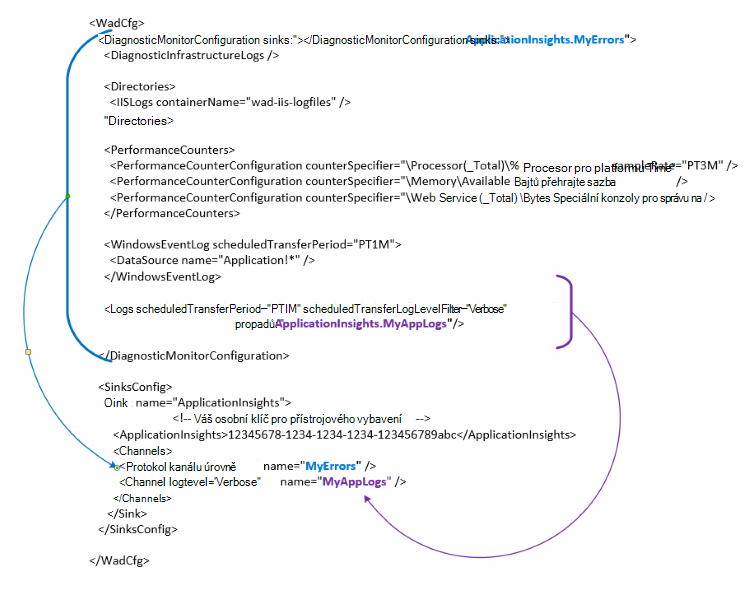

<properties
   pageTitle="Konfigurace Azure diagnostiky odeslání dat do aplikace přehledy | Microsoft Azure"
   description="Aktualizace veřejné konfigurace Azure diagnostiky odeslání dat do aplikace přehledy."
   services="multiple"
   documentationCenter=".net"
   authors="sbtron"
   manager="douge"
   editor="" />
<tags
   ms.service="application-insights"
   ms.devlang="na"
   ms.topic="article"
   ms.tgt_pltfrm="na"
   ms.workload="na"
   ms.date="12/15/2015"
   ms.author="saurabh" />

# Konfigurace Azure diagnostiky odeslání dat do aplikace přehledy

Azure Diagnostika jsou uložená data do tabulek Azure úložiště.  Můžete však také kanálu všechny nebo podmnožinu dat pro přehledy aplikace nakonfigurováním "propadů" a "kanálů" v konfiguraci při použití Azure diagnostiky přípony 1.5 nebo novější.

Tento článek popisuje, jak vytvořit veřejné konfiguraci koncovku Azure diagnostiky tak, aby jeho nakonfigurovaný tak, aby odeslání dat do aplikace přehledy.

## Konfigurace aplikace přehledy jako jímka

Rozšíření Azure diagnostiky 1,5 zavádí **<SinksConfig>** prvek veřejné konfigurace. Tato možnost definuje Další *jímky* kde dat Azure diagnostiky odesílat. Zadejte podrobnosti zdrojů aplikace přehledy místo, kam chcete odeslat dat Azure Diagnostika v rámci tohoto **<SinksConfig>**.
Příklad **SinksConfig** vypadá nějak takto:  

    <SinksConfig>
        <Sink name="ApplicationInsights">
          <ApplicationInsights>{Insert InstrumentationKey}</ApplicationInsights>
          <Channels>
            <Channel logLevel="Error" name="MyTopDiagData"  />
            <Channel logLevel="Verbose" name="MyLogData"  />
          </Channels>
        </Sink>
      </SinksConfig>

Pro prvek **jímky** atribut *název* Určuje řetězcovou hodnotu, která se bude používat pro jedinečně v nápovědě k jímce.
**ApplicationInsights** element určuje přístrojového vybavení klíč zdroje přehledy aplikace, kde dat Azure diagnostiky odešle. Pokud nemáte existující přehledy aplikace zdroj, najdete v tématu [Vytvoření nové aplikace přehledy zdroje](./application-insights/app-insights-create-new-resource.md) Další informace o vytváření zdroje a zprovoznění klávesu přístrojového vybavení.

Pokud vyvíjíte cloudové služby projektu se Azure SDK 2,8 tento klíč přístrojového vybavení naplní veřejné konfigurace na základě **APPINSIGHTS_INSTRUMENTATIONKEY** služby konfigurace nastavení při sbalení projekt služby cloudu. V tématu [Použití aplikace interpretaci s Azure Diagnostika problémů cloudové služby](./cloud-services/cloud-services-dotnet-diagnostics-applicationinsights.md).

Element **kanály** můžete nastavit jeden nebo více prvků **kanálu** data, která se pošle jímce. Kanál funguje jako filtr a umožňuje vybrat konkrétní protokolu úrovně, které budete chtít odešlete jímce. Například mohl shromáždit protokoly podrobného a odešlete je úložiště, ale můžete definovat kanál s úroveň protokolování chyb a odeslat protokoly prostřednictvím, že kanál jenom chybové protokoly se pošle této jímky.
U **kanálu** atribut *název* slouží k jedinečně v nápovědě k tento kanál.
Atribut *loglevel* vám umožní určit úroveň protokolování, které vám umožní kanál. Jsou k dispozici protokolu úrovně v pořadí nejčastěji nejnižších informace
 - Podrobný
 - Informace
 - Upozornění
 - Chyba
 - Kritický

## Odeslání dat do aplikace přehledy jímka
Po definování jímce aplikace přehledy můžete posílat dat, které jímky přidáním atribut *jímky* prvkům uzlu **DiagnosticMonitorConfiguration** . Přidání prvku *propadů* všech uzlech Určuje, že data shromážděná z uzel a všech uzlech pod ní nechat zasílat jímce zadali.

Například pokud chcete odeslat všechna data, která shromážděny Azure diagnostiky pak můžete přidat atribut *jímky* přímo na uzel **DiagnosticMonitorConfiguration** . Nastavte hodnotu *propadů* název jímky zadaného v **SinkConfig**.

    <DiagnosticMonitorConfiguration overallQuotaInMB="4096" sinks="ApplicationInsights">

Pokud jste chtěli poslat jenom protokolů chyb interpretace aplikace dřez a pak nastavte hodnotu *propadů* jímky název a za ním uveďte název kanálu odděleni tečku ("."). Například chcete poslat protokoly chyb pouze pro přehledy aplikace jímky použijte MyTopDiagdata kanál, která byla definována v SinksConfig výše.  

    <DiagnosticMonitorConfiguration overallQuotaInMB="4096" sinks="ApplicationInsights.MyTopDiagdata">

Pokud chcete poslat protokoly podrobného aplikace interpretace aplikace by přidejte atribut *propadů* uzel **protokoly** .

    <Logs scheduledTransferPeriod="PT1M" scheduledTransferLogLevelFilter="Verbose" sinks="ApplicationInsights.MyLogData"/>

Mohou také obsahovat více umyvadel v konfiguraci na různých úrovních hierarchie. V takovém případě jímce uvedené na webu nejvyšší úrovně z hierarchie funguje jako globální nastavení a určenou na jednotlivé prvky elementu úkony jako přepíše globálního nastavení.    

Tady je kompletní příklad veřejné konfiguračního souboru, který rozešle všechny chyby přehledy aplikace (zadaný na uzel **DiagnosticMonitorConfiguration** ) a navíc podrobného úrovně protokolování pro protokoly aplikace (zadaný na uzel **protokoly** ).

    <WadCfg>
      <DiagnosticMonitorConfiguration overallQuotaInMB="4096"
           sinks="ApplicationInsights.MyTopDiagData"> <!-- All info below sent to this channel -->
        <DiagnosticInfrastructureLogs />
        <PerformanceCounters>
          <PerformanceCounterConfiguration counterSpecifier="\Processor(_Total)\% Processor Time" sampleRate="PT3M" sinks="ApplicationInsights.MyLogData/>
          <PerformanceCounterConfiguration counterSpecifier="\Memory\Available MBytes" sampleRate="PT3M" />
          <PerformanceCounterConfiguration counterSpecifier="\Web Service(_Total)\Bytes Total/Sec" sampleRate="PT3M" />
        </PerformanceCounters>
        <WindowsEventLog scheduledTransferPeriod="PT1M">
          <DataSource name="Application!*" />
        </WindowsEventLog>
        <Logs scheduledTransferPeriod="PT1M" scheduledTransferLogLevelFilter="Verbose"
                sinks="ApplicationInsights.MyLogData"/> <!-- This specific info sent to this channel -->
      </DiagnosticMonitorConfiguration>

    <SinksConfig>
        <Sink name="ApplicationInsights">
          <ApplicationInsights>{Insert InstrumentationKey}</ApplicationInsights>
          <Channels>
            <Channel logLevel="Error" name="MyTopDiagData"  />
            <Channel logLevel="Verbose" name="MyLogData"  />
          </Channels>
        </Sink>
      </SinksConfig>
    </WadCfg>

Platí určitá omezení nějaká pomocí této funkce

- Kanály jsou určeny pouze pro práci s typ protokolu a ne výkonnosti. Pokud zadáte kanálu čítač elementem výkonu budou ignorovat.
- Úroveň protokolování pro kanál nesmí překročit úroveň protokolování pro co shromážděny Azure diagnostiky. Příklad: Nelze shromažďovat protokolu chyb v elementu protokoly a odešlete podrobné protokoly jímce přehled aplikace. Atribut *scheduledTransferLogLevelFilter* musí vždy shromáždit rovna nebo další protokoly než protokoly chcete poslat jímka.
- Nemůžete poslat všech objektů blob dat shromážděných podle Azure diagnostiky přípony přehledy aplikace. Příklad všechno, co určené ve skupinovém rámečku uzel *adresáře* . Pro pád vypíše skutečné výpis pořád odešle se úložiště objektů blob a odešle pouze oznámení, že byl vytvořen výpis interpretace aplikace.

## Další kroky

- Použití [Powershellu](./cloud-services/cloud-services-diagnostics-powershell.md) ke povolte rozšíření Azure Diagnostika aplikace. 
- Umožňuje povolit koncovku Azure Diagnostika pro aplikaci [Visual Studio](vs-azure-tools-diagnostics-for-cloud-services-and-virtual-machines.md)
