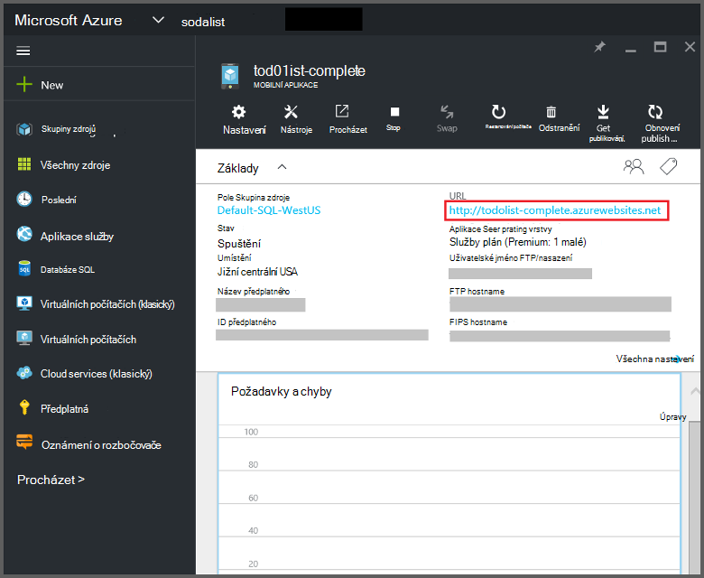
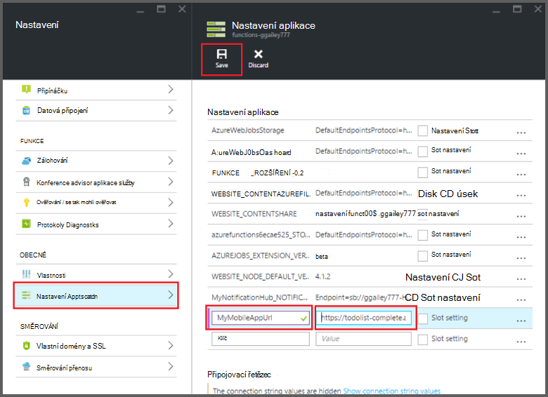

<properties
    pageTitle="Azure vazby funkcí mobilních aplikací | Microsoft Azure"
    description="Principy používání mobilní aplikace Azure vazby ve funkcích Azure."
    services="functions"
    documentationCenter="na"
    authors="ggailey777"
    manager="erikre"
    editor=""
    tags=""
    keywords="Azure funguje, funkce a zpracování události, dynamické výpočetním bez serveru architektura"/>

<tags
    ms.service="functions"
    ms.devlang="multiple"
    ms.topic="reference"
    ms.tgt_pltfrm="multiple"
    ms.workload="na"
    ms.date="08/30/2016"
    ms.author="glenga"/>

# Azure vazby funkce mobilní aplikace

[AZURE.INCLUDE [functions-selector-bindings](../../includes/functions-selector-bindings.md)]

Tento článek vysvětluje, jak nakonfigurovat a kód Azure mobilní aplikace vazby ve funkcích Azure. 

[AZURE.INCLUDE [intro](../../includes/functions-bindings-intro.md)] 

Aplikace Mobile služby Azure aplikace umožňuje zobrazit data tabulky koncový bod pro mobilní klienty. Tento stejné tabulková data se dá používat se obou vstupní a výstupní vazby ve funkcích Azure. Protože podporuje dynamické schéma, Node.js mobilní aplikace back-end je ideální pro vystavení tabulková data pomocí funkce. Dynamické schématu aktivované ve výchozím nastavení a by měly být zakázány v mobilní aplikaci výroby. Další informace o koncové body tabulky v back-end Node.js najdete v tématu [Přehled: tabulky operace](../app-service-mobile/app-service-mobile-node-backend-how-to-use-server-sdk.md#TableOperations). V mobilních aplikacích back-end Node.js podporuje v portálu prohlížení a úpravy tabulek. Další informace najdete v tématu Node.js SDK [v portálu pro úpravy](../app-service-mobile/app-service-mobile-node-backend-how-to-use-server-sdk.md#in-portal-editing) . Pokud používáte mobilní aplikaci back-end .NET s funkcemi Azure, je nutné ručně aktualizovat podle potřeby tak, že funkce datového modelu. Další informace o koncové body tabulky v mobilní aplikaci back-end .NET najdete v tématu [Postup: definování řadiči tabulky](../app-service-mobile/app-service-mobile-dotnet-backend-how-to-use-server-sdk.md#define-table-controller) v tématu SDK back-end .NET. 

## Vytvoření proměnná prostředí pro svoji adresu URL back-end mobilní aplikaci

Mobilní aplikace vazby aktuálně vyžadují, abyste vytvořit proměnné prostředí, který vrací adresu URL mobilní aplikaci back-end systému samotné. Tato adresa URL najdete [Azure portál](https://portal.azure.com) vyhledáním mobilní aplikace a otevírání zásuvné.

Chcete-li nastavit tuto adresu URL jako proměnná prostředí v aplikaci (funkce):

1. V funkce aplikace [portál Azure funkcí](https://functions.azure.com/signin), klikněte na **Nastavení aplikace funkce** > **přejděte na nastavení aplikace služeb**. 

    

2. V aplikaci funkce klikněte na **všechna nastavení**, přejděte dolů **Nastavení aplikace**klikněte v části **Nastavení aplikace** zadejte nový **název** proměnné prostředí, vložte adresu URL do **hodnoty**, jak zajistit pomocí schématu HTTPS a pak klikněte na tlačítko **Uložit** a zavřít zásuvné funkce aplikace se vraťte do portálu funkcí.   

    

Teď můžete nastavit toto nové proměnné jako pole *připojení* v vazby.

## Stisknutím klávesy rozhraní API pro zabezpečený přístup k vaší koncové body tabulky aplikace Mobile.

V Azure funkcí, mezi které vazby mobilní tabulky umožňuje zadat rozhraní API klíč, který je sdílený tajná něhož nechcete, aby nežádoucí přístup z aplikací než vaše funkce. Mobilní aplikace nemá integrovanou podporu pro rozhraní API ověřování klíče. Však využijete klíč rozhraní API v mobilní aplikaci back-end Node.js pomocí následujících příkladech v [implementaci rozhraní API klíč back-end Azure aplikace služby mobilních aplikací](https://github.com/Azure/azure-mobile-apps-node/tree/master/samples/api-key). Podobně využijete klíč rozhraní API v [mobilní aplikaci back-end .NET](https://github.com/Azure/azure-mobile-apps-net-server/wiki/Implementing-Application-Key).

>[AZURE.IMPORTANT] Tento klíč rozhraní API nesmí být rozdělení s klienty mobilní aplikaci, ho měli jenom rozdělí bezpečně klientům straně služby, jako je funkce Azure. 

## Azure mobilní aplikace pro zadávání vazby

Vstupní vazby můžete načíst záznam z mobilních tabulky koncového bodu a předejte přímo do vaší vazby. Záznam, který je určený ID založen na aktivační událost, kterou zavolat a funkce. V jazyce C# funkce se všechny změny provedené záznam automaticky odesílají zpět do tabulky při ukončení funkce úspěšně.

#### Function.JSON pro vstupní vazba mobilní aplikace

Soubor *function.json* podporuje následující vlastnosti:

- `name`: Proměnná Název použitý ve funkci kódu pro nový záznam.
- `type`: Biding typ musí být nastavena na *mobileTable*.
- `tableName`: Tabulka, kde bude vytvořen nový záznam.
- `id`: Identifikátor záznamu načíst. Tato vlastnost podporuje vazby podobně jako `{queueTrigger}`, které se použije řetězec hodnota fronty zprávy jako záznam Id.
- `apiKey`: Řetězec, který je nastavení aplikace, která určuje klávesu volitelné rozhraní API pro mobilní aplikaci. Při je to potřeba aplikace pro mobilní používá rozhraní API klíč omezení přístupu klienta.
- `connection`: Řetězec, který je název proměnné prostředí v nastavení aplikace určující URL svého back-end mobilní aplikace.
- `direction`: Směr vazba, která musí být nastavena na hodnotu *v*.

Příklad *function.json* souboru:

    {
      "bindings": [
        {
          "name": "record",
          "type": "mobileTable",
          "tableName": "MyTable",
          "id" : "{queueTrigger}",
          "connection": "My_MobileApp_Url",
          "apiKey": "My_MobileApp_Key",
          "direction": "in"
        }
      ],
      "disabled": false
    }

#### Azure příklad mobilní aplikace pro C# fronty aktivační událost

Podle function.json výše uvedená příklad načte Vstupní vazba záznam z mobilních aplikací tabulky koncového bodu s ID, která odpovídá řetězce zprávy fronty a předá parametr *záznamu* . Záznam nebyl nalezen, parametr při null. Záznam je pak aktualizován nová hodnota *Text* při ukončení funkce.

    #r "Newtonsoft.Json"    
    using Newtonsoft.Json.Linq;
    
    public static void Run(string myQueueItem, JObject record)
    {
        if (record != null)
        {
            record["Text"] = "This has changed.";
        }    
    }

#### Azure příklad mobilní aplikace pro aktivační Node.js fronty

Podle function.json výše uvedená příklad načte Vstupní vazba záznam z mobilních aplikací tabulky koncového bodu s ID, která odpovídá řetězce zprávy fronty a předá parametr *záznamu* . Ve funkcích Node.js aktualizovanými položkami nejsou odesílány v tabulce. Tento příklad kódu zapíše do protokolu načtený záznam.

    module.exports = function (context, input) {    
        context.log(context.bindings.record);
        context.done();
    };

## Azure aplikací Mobile Výstupní vazba

Funkce můžete napsat záznamu koncový bod tabulky mobilních aplikací pomocí Výstupní vazba. 

#### Function.JSON k aplikacím Mobile Výstupní vazba

Soubor function.json podporuje následující vlastnosti:

- `name`: Proměnná Název použitý ve funkci kódu pro nový záznam.
- `type`: Typ vazby, který musí být nastavený na *mobileTable*.
- `tableName`: Tabulka, kde se vytvoří nový záznam.
- `apiKey`: Řetězec, který je nastavení aplikace, která určuje klávesu volitelné rozhraní API pro mobilní aplikaci. Při je to potřeba aplikace pro mobilní používá rozhraní API klíč omezení přístupu klienta.
- `connection`: Řetězec, který je název proměnné prostředí v nastavení aplikace určující URL svého back-end mobilní aplikace.
- `direction`: Vazba směr, které *se*musí nastavit.

Příklad function.json:

    {
      "bindings": [
        {
          "name": "record",
          "type": "mobileTable",
          "tableName": "MyTable",
          "connection": "My_MobileApp_Url",
          "apiKey": "My_MobileApp_Key",
          "direction": "out"
        }
      ],
      "disabled": false
    }

#### Azure příklad mobilní aplikace pro C# fronty aktivační událost

Tento příklad kódu C# vloží nový záznam koncový bod mobilní aplikace tabulky se vlastnosti *Text* do tabulky podle výše uvedených vazby.

    public static void Run(string myQueueItem, out object record)
    {
        record = new {
            Text = $"I'm running in a C# function! {myQueueItem}"
        };
    }

#### Azure aplikace Mobile příklad aktivační události Node.js fronty

Tento příklad kódu Node.js vloží nový záznam koncový bod mobilní aplikace tabulky se vlastnosti *text* do tabulky podle výše uvedených vazby.

    module.exports = function (context, input) {
    
        context.bindings.record = {
            text : "I'm running in a Node function! Data: '" + input + "'"
        }   
    
        context.done();
    };

## Další kroky

[AZURE.INCLUDE [next steps](../../includes/functions-bindings-next-steps.md)]
