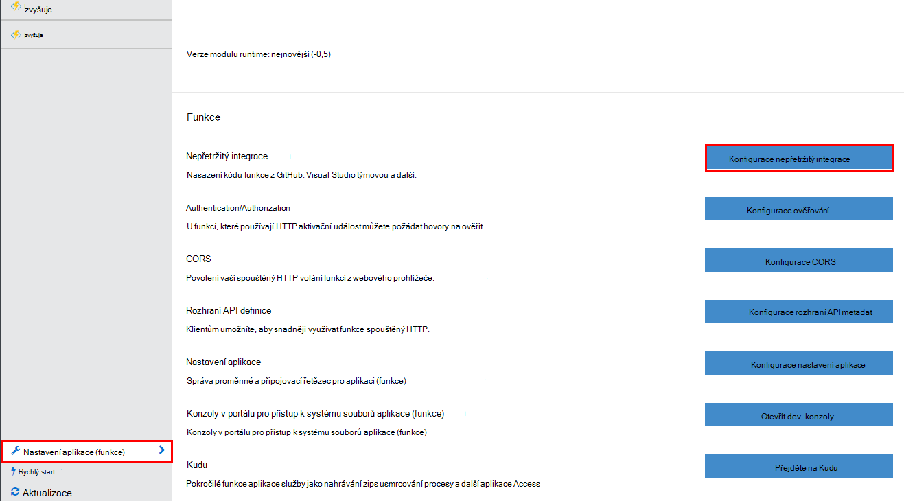
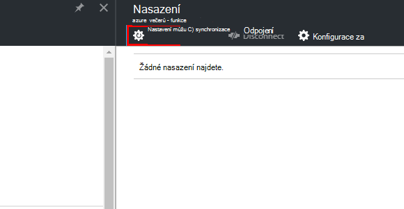
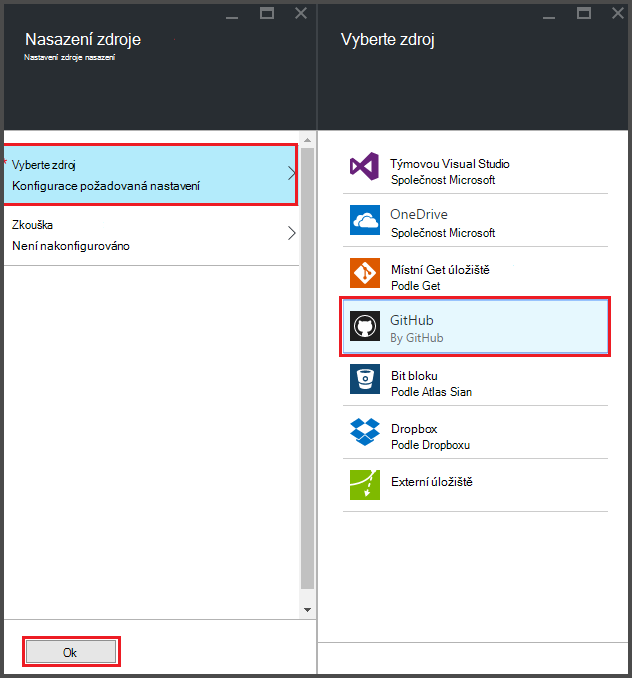
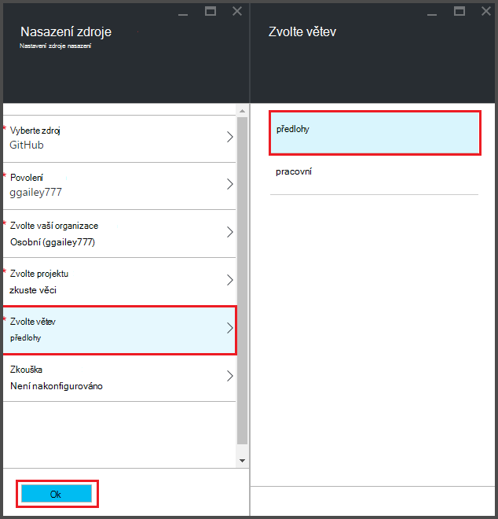
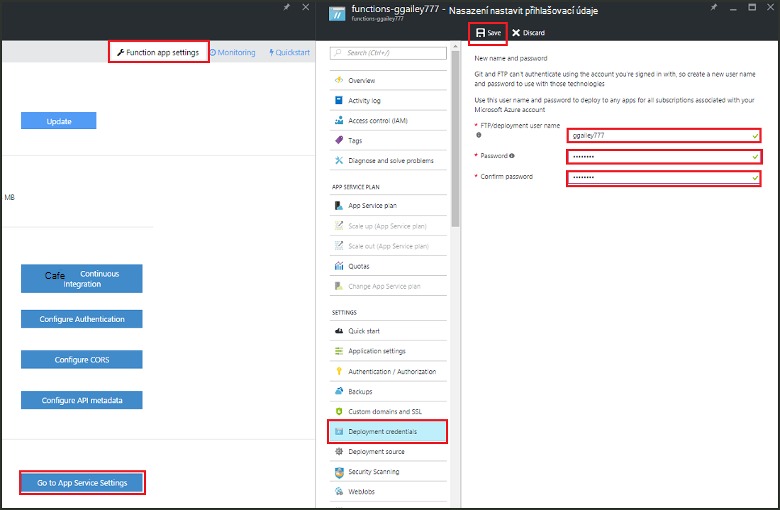
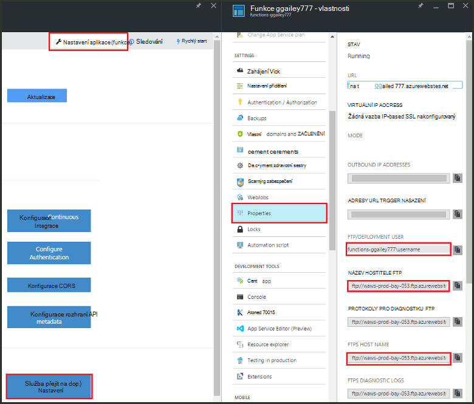
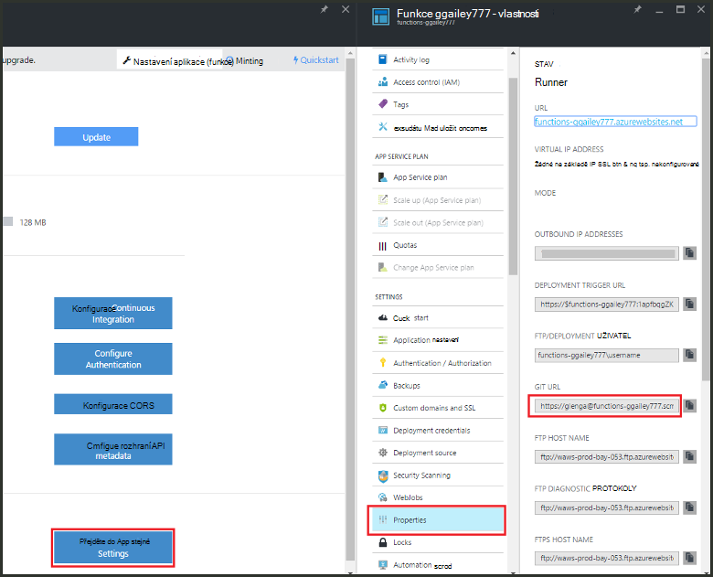

<properties
   pageTitle="Nepřetržitý nasazení Azure funkce | Microsoft Azure"
   description="Publikování funkce Azure pomocí zařízení nepřetržitý nasazení služby Azure aplikace."
   services="functions"
   documentationCenter="na"
   authors="ggailey777"
   manager="erikre"
   editor=""
   tags=""
   />

<tags
   ms.service="functions"
   ms.devlang="multiple"
   ms.topic="article"
   ms.tgt_pltfrm="multiple"
   ms.workload="na"
   ms.date="09/25/2016"
   ms.author="glenga"/>

# Nepřetržitý nasazení funkce Azure 

Azure funkce usnadňuje nakonfigurovat průběžné nasazení aplikace (funkce). Funkce využívá Azure aplikaci služby integrace s BitBucket Dropboxu, GitHub a Visual Studio týmu služeb (VSTS) povolit pracovního postupu nepřetržitý nasazení kde použije Azure aktualizace kódu funkce když jsou publikované na jednu z těchto služeb. Pokud začínáte Azure funkcí, začněte s [Přehled funkcí Azure](functions-overview.md).

Nepřetržitý nasazení je Skvělá volba pro projekty kde více a probíhá integrace časté příspěvky. Umožňuje také udržovat zdrojového kódu funkce. V následujících zdrojích nasazení připojení se aktuálně podporuje:

+ [Bitbucket](https://bitbucket.org/)
+ [Dropbox](https://bitbucket.org/)
+ [Libovolná místní repo](../app-service-web/app-service-deploy-local-git.md)
+ Libovolná externí repo
+ [GitHub]
+ Mercurial externí repo
+ [OneDrive](https://onedrive.live.com/)
+ Týmovou Visual Studio

Nasazení nastavené na základě aplikace za (funkce). Po povolení nepřetržitý nasazení přístup ke kódu funkce na portálu nastavena na *jen pro čtení*.

## Požadavky na nepřetržitý nasazení

Ve zdroji nasazení před se nastavuje průběžné nasazení musí mít nasazení zdroj nakonfigurované a funkce kód. V aplikaci na dané funkce nasazení jednotlivou funkci jsou umístěná v pojmenované podadresáře, název adresáře je název funkce. Tento struktura složek je v podstatě kódu webu. 

[AZURE.INCLUDE [functions-folder-structure](../../includes/functions-folder-structure.md)]

## Vytvoření nepřetržitý nasazení

Abyste mohli nakonfigurovat nepřetržitý nasazení aplikace existující funkce pomocí následujícího postupu:

1. V funkce aplikace [portál Azure funkcí](https://functions.azure.com/signin), klikněte na **Nastavení aplikace funkce** > **Nepřetržitý integrace konfigurovat** > **Nastavení**.

    
    
    
    
    Můžete taky dostali na zásuvné nasazení z rychlý úvod funkce kliknutím na **spustit z ovládacího prvku zdroje**.

2. V zásuvné nasazení klikněte na **Zvolit zdroj**, pak fill-in informace o zdroji vybraném nasazení a klikněte na **OK**.

    

Po konfiguraci nepřetržitý nasazení všechny soubory změny ve zdrojovém nasazení se zkopírují do aplikace (funkce) a nasazení celý web aktivovaná. Kdy mají být aktualizovány soubory ve zdroji, je znovu nasadit na web.

##Možnosti nasazení

Zde jsou některé scénáře typické nasazení:

+ 

###Vytvořit pracovní nasazení

Funkce aplikace, které nejsou podporovány ještě sloty nasazení. Samostatný pracovní a výrobních nasazení však můžete spravovat pomocí průběžné integrace.

Proces ke konfiguraci a práce s pracovní nasazení obvykle vypadá nějak takto:

1. Vytvořte dvěma aplikacemi funkce předplatného, v jednom kódem výrobní a jeden pro pracovní. 

2. Pokud už nemáte, vytvořte zdroj nasazení. Použijeme [GitHub].
 
3. Funkce aplikace výrobní výše uvedené kroky při **vytváření nepřetržitý nasazení** a nastavení větvi nasazení předlohy větve GitHub repo.

    

4. Opakujte tento krok pro pracovní funkce aplikace, ale tentokrát zvolte větvi pracovní GitHub repo. Pokud nasazení zdroje, které nejsou podporovány větvení, použijte jinou složku.
 
5. Provést aktualizace kódu v pracovní větve nebo složku a potom zkontrolujte, že tyto změny se projeví v pracovní nasazení.

6. Po testování sloučení změní z pracovní větve větvi předlohy. To bude spouštět nasazení do aplikace výrobní (funkce). Pokud nasazení zdroje, které nejsou podporovány větví, přepsat soubory ve složce pracovní soubory ve složce výroby.

###Přesunutí stávajících funkcí nepřetržitý nasazení

Pokud máte existující funkce, které jste vytvořili a vedou v portálu, budete muset stáhnout existující funkce kód soubory pomocí FTP nebo místní úložiště libovolná před můžete nastavuje nepřetržitý nasazení ve výše uvedeném. Můžete to udělat v nastavení aplikace služeb pro aplikace (funkce). Po stažení souborů, nahrajte je na zvolený nepřetržitý nasazení zdroj.

>[AZURE.NOTE]Po konfiguraci nepřetržitý integrace už bude možné k úpravě souborů zdroje na portálu funkcí.

####Jak: Konfigurace přihlašovacích údajů nasazení
Před soubory si můžete stáhnout z aplikace pro funkce, musíte nakonfigurovat svoje přihlašovací údaje pro přístup k webu, které můžete použít na portálu. Přihlašovací údaje jsou nastavené na úrovni aplikace (funkce).

1. V funkce aplikace [portál Azure funkcí](https://functions.azure.com/signin), klikněte na **Nastavení aplikace funkce** > **přejděte na nastavení aplikace služeb** > **Nasazení pověření**.

    

2. Zadejte uživatelské jméno a heslo a potom klikněte na **Uložit**. Teď můžete tyto přihlašovací údaje pro přístup k aplikaci funkce z FTP nebo předdefinované repo libovolná.

####Postup: stahování souborů pomocí FTP

1. V funkce aplikace [portál Azure funkcí](https://functions.azure.com/signin), klikněte na **Nastavení aplikace funkce** > **přejděte na nastavení aplikace služeb** > **Vlastnosti** a zkopírujte tyto hodnoty pro **Uživatele FTP/nasazení**, **Název hostitele FTP**a **FTPS název hostitele**.  
**Uživatel FTP/nasazení** musí být zadány, jak jsou zobrazeny v portálu správné kontext serveru FTP včetně na název aplikace.

    
    
2. Z vašeho klienta FTP použít informace o připojení shromážděné připojení k aplikaci a stahovat soubory zdroje pro vaše funkce.

####Postup: stahování souborů pomocí místní libovolná úložiště

1. V funkce aplikace [portál Azure funkcí](https://functions.azure.com/signin), klikněte na **Nastavení aplikace funkce** > **Nepřetržitý integrace konfigurovat** > **Nastavení**.

2. V zásuvné nasazení klikněte na **Zvolit zdroj**, **místní libovolná úložiště**, klepněte na tlačítko **OK**.
 
3. Klikněte na tlačítko **Přejít k nastavení aplikace služeb** > **Vlastnosti** a poznamenejte si hodnotu libovolná URL. 
    
    

4. Klonovat repo na místním počítači podporující libovolná příkazového řádku nebo Oblíbené nástrojem libovolná. Příkaz klonovat libovolná vypadá takto:

        git clone https://username@my-function-app.scm.azurewebsites.net:443/my-function-app.git

5. Vzdálené použití souborů z aplikace pro funkci do klonovat ve vašem počítači jako v následujícím příkladu:

        git pull origin master

    Pokud na vyžádání zadejte uživatelské jméno a heslo pro nasazení aplikace (funkce).  

[GitHub]: https://github.com/
