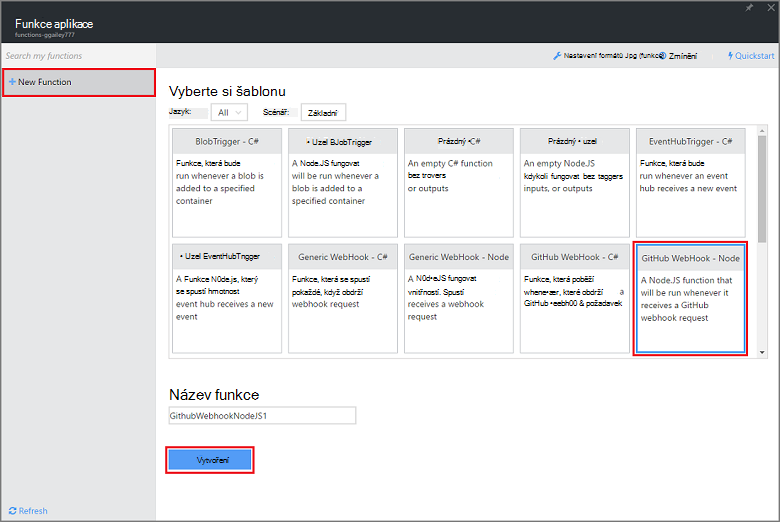
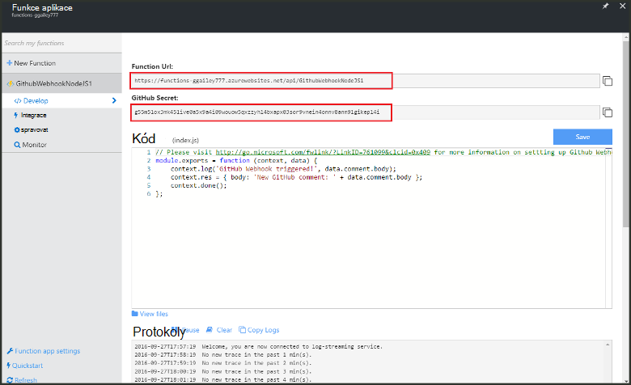
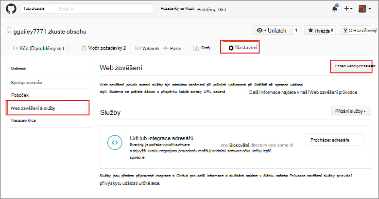
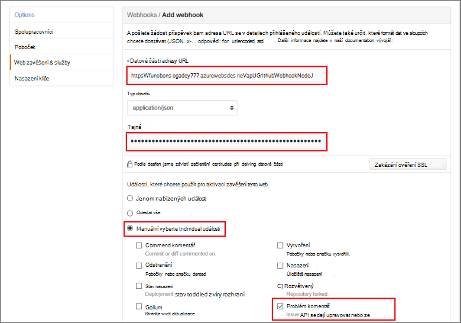

<properties
   pageTitle="Vytvořit web zavěšení nebo funkce Azure rozhraní API | Microsoft Azure"
   description="Použití funkce Azure k vytvoření funkci, která je vyvolat WebHook nebo rozhraní API volat."
   services="azure-functions"
   documentationCenter="na"
   authors="ggailey777"
   manager="erikre"
   editor=""
   tags=""
   />

<tags
   ms.service="functions"
   ms.devlang="multiple"
   ms.topic="get-started-article"
   ms.tgt_pltfrm="multiple"
   ms.workload="na"
   ms.date="08/30/2016"
   ms.author="glenga"/>
   
# Vytvořit webhook nebo funkce rozhraní API Azure

Azure funkce je řízeného událostmi, výpočetním na vyžádání prezentaci, která umožňuje vytvářet naplánované nebo spouštěný kód jednotky implementovaná různými jazyky. Další informace o funkcích Azure najdete v tématu [Přehled funkcí Azure](functions-overview.md).

V tomto tématu se dozvíte, jak vytvořit nový Node.js funkci, která je vyvolat GitHub webhook. Nová funkce je založeno na předdefinované šablony v portálu Azure funkcí. Můžete taky přehrát krátké video a zjistěte, jak se tyto kroky provést na portálu.

## Podívejte se na video

Následující video ukazuje, jak provádět základní kroky v tomto kurzu 

[AZURE.VIDEO create-a-web-hook-or-api-azure-function]

##Vytvoření funkci spouštěný webhook ze šablony

Funkce aplikace hostuje provádění funkce v Azure. Než budete moct vytvářet funkci, musíte mít účet Azure active. Pokud ještě nemáte účet Azure, [bezplatné účty jsou k dispozici](https://azure.microsoft.com/free/). 

1. Přejděte na [portál Azure funkcí](https://functions.azure.com/signin) a přihlaste se pomocí účtu Azure.

2. Pokud máte existující funkce aplikace použít, vyberte ji ze **funkce aplikace** klepněte na tlačítko **Otevřít**. Vytvoření nové funkce aplikace, zadejte jedinečný **název** pro novou aplikaci funkce nebo přijmout vygenerovaných tu, vyberte upřednostňovaný **oblasti**a potom klikněte na **vytvořit + Začínáme**. 

3. V aplikaci funkce klikněte na **+ Nový funkce** > **GitHub Webhook - uzel** > **vytvořit**. Tím vytvoříte funkci s výchozí název, který je založený na šabloně zadané. 

     

4. Poznamenejte si funkce sample express.js v okně s **kódem** v **vývoje**. Tato funkce obdrží žádost o GitHub od webhook komentář problém, protokoly problém text a odešle odpověď webhook jako `New GitHub comment: <Your issue comment text>`.

     

5. Zkopírujte **Adresu URL (funkce)** a **GitHub tajná** hodnoty. Když vytvoříte webhook v GitHub tyto potřebujete. 

6. Posuňte se dolů na **Spustit**, nezapomeňte předdefinované JSON textu komentáře problém v hlavním textu žádosti o a potom klikněte na příkaz **Spustit**. 
 
    Vždy můžete otestovat nový založený na šabloně funkce přímo na kartě **vývoje** zadáním některou očekávání textu JSON dat a klikněte na tlačítko **Spustit** . V tomto případě šablonu má předdefinovaný text komentáře problém. 
 
Dále budou vytvoříte skutečné webhook v úložišti GitHub.

##Konfigurace webhook

1. V GitHub přejděte do úložiště, kterou vlastníte, Tato volba zahrnuje všechny úložiště, ke kterým máte forked.
 
2. Klikněte na **Nastavení** > **Webhooks & služby** > **webhook přidat**.

       

3. Vložte adresu URL a tajná vaší funkci do **Datové části URL** a **tajná**, a pak klepněte na možnost **Vybrat jednotlivé události**, vyberte **problém komentář** a klikněte na **Přidat webhook**.

     

V tomto okamžiku GitHub webhook nakonfigurovaný pro aktivaci funkce po přidání nového komentáře problém.  
Teď je čas testovat ji.

##Otestovat funkce

1. Ve vaší repo GitHub otevření karty **problémů** v novém okně prohlížeče, klikněte na **Nový případ**, zadejte název potom klikněte na tlačítko **Odeslat nový případ**. Můžete také otevřít existující problém.

2. Tento problém zadejte komentář a klikněte na **Komentář**. V tomto okamžiku můžete se vrátit k vaší nové webhook GitHub v části Viz **Poslední dodávky** , která byla odeslána žádost o webhook a text odpovědi je `New GitHub comment: <Your issue comment text>`.

3. Zpět na portálu funkce posuňte se dolů na protokoly a projděte si, že byl spuštěn funkci a hodnotu `New GitHub comment: <Your issue comment text>` je aby došlo k zápisu protokolů datových proudů.

##Další kroky

Další informace o funkcích Azure v těchto tématech.

+ [Referenční informace pro vývojáře Azure funkcí](functions-reference.md)  
Programmer odkaz pro kódování funkcí.
+ [Testování funkcí Azure](functions-test-a-function.md)  
Popisuje různé nástroje a postupy pro účely testování funkce.
+ [Jak zobrazit Azure funkcí](functions-scale.md)  
Tento článek popisuje služby plány dostupných funkcí Azure včetně plán dynamické služeb a výběr správné plán.  

[AZURE.INCLUDE [Getting Started Note](../../includes/functions-get-help.md)]
