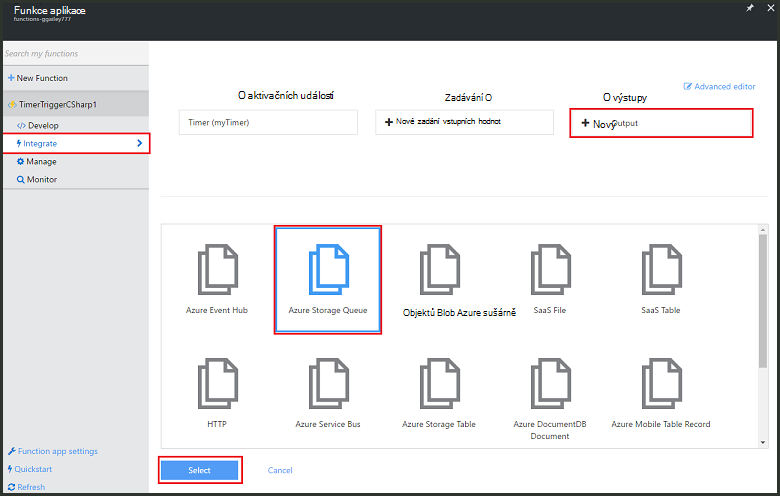
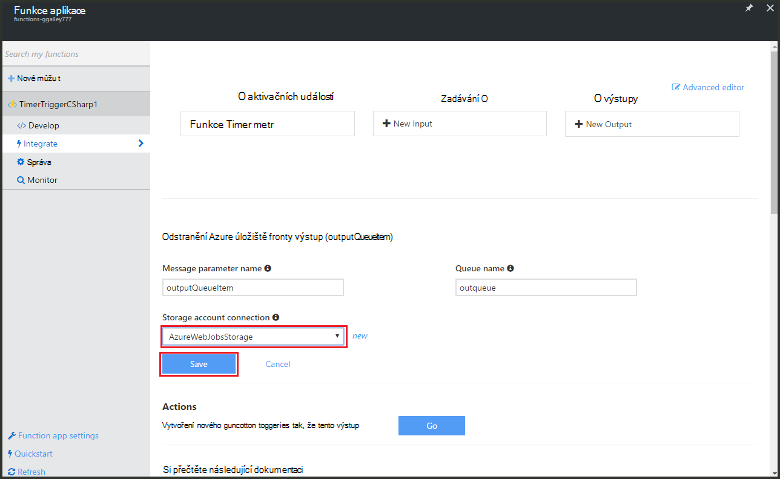

<properties
   pageTitle="Vytvoření události funkce zpracování | Microsoft Azure"
   description="Použití funkcí pro Azure vytvořte funkci C#, která poběží na základě spínání události."
   services="functions"
   documentationCenter="na"
   authors="ggailey777"
   manager="erikre"
   editor=""
   tags=""
   />

<tags
   ms.service="functions"
   ms.devlang="multiple"
   ms.topic="get-started-article"
   ms.tgt_pltfrm="multiple"
   ms.workload="na"
   ms.date="09/25/2016"
   ms.author="glenga"/>
   
# Vytvoření události zpracování Azure (funkce)

Azure funkce je řízeného událostmi, výpočetním na vyžádání prezentaci, která umožňuje vytvářet naplánované nebo spouštěný kód jednotky implementovaná různými jazyky. Další informace o funkcích Azure najdete v tématu [Přehled funkcí Azure](functions-overview.md).

V tomto tématu se dozvíte, jak vytvořit nové funkce v jazyce C# spustitelná na základě spínání události přidáte zprávy do fronty úložiště. 

## Zjistit předpoklady pro 

Než budete moct vytvářet funkci, musíte mít účet Azure active. Pokud ještě nemáte účet Azure, [bezplatné účty jsou k dispozici](https://azure.microsoft.com/free/).

## Vytvoření funkci spouštěný časovače ze šablony

Funkce aplikace hostuje provádění funkce v Azure. Než budete moct vytvářet funkci, musíte mít účet Azure active. Pokud ještě nemáte účet Azure, [bezplatné účty jsou k dispozici](https://azure.microsoft.com/free/). 

1. Přejděte na [portál Azure funkcí](https://functions.azure.com/signin) a přihlaste se pomocí účtu Azure.

2. Pokud máte existující funkce aplikace použít, vyberte ji ze **funkce aplikace** klepněte na tlačítko **Otevřít**. Vytvoření nové funkce aplikace, zadejte jedinečný **název** pro novou aplikaci funkce nebo přijmout vygenerovaných tu, vyberte upřednostňovaný **oblasti**a potom klikněte na **vytvořit + Začínáme**. 

3. V aplikaci funkce klikněte na **+ Nový funkce** > **TimerTrigger - C#** > **vytvořit**. Tím vytvoříte funkci s výchozím názvem, který se spustí u výchozího plánu každou minutu. 

    

4. V nové funkce, klikněte na kartu **Integrace** > **Nový výstup** > **Azure úložiště fronty** > **Vyberte**.

    

5. Ve **frontě úložiště Azure výstup**vyberte existující **připojení účtu úložiště**, nebo vytvořte nový účet a potom klikněte na tlačítko **Uložit**. 

    

6. Zpět na kartě **vývoje** nahraďte stávající C# skript v okně s **kódem** v následující kód:

        using System;
        
        public static void Run(TimerInfo myTimer, out string outputQueueItem, TraceWriter log)
        {
            // Add a new scheduled message to the queue.
            outputQueueItem = $"Ping message added to the queue at: {DateTime.Now}.";
            
            // Also write the message to the logs.
            log.Info(outputQueueItem);
        }

    Tento kód přidá novou zprávu do fronty s aktuálním datem a časem provedení této funkci.

7. Klikněte na tlačítko **Uložit** a podívejte se na **protokoly** systému windows pro další zpracování (funkce).

8. (Volitelné) Přejděte k tomuto účtu úložiště a zkontrolujte, že zprávy se vás někdo přidá do fronty.

9. Přejděte zpátky na kartě **Integrace** a změnit pole plánu `0 0 * * * *`. Funkce nyní spustí každou hodinu. 

Toto je velmi zjednodušené příklad aktivační časovače a úložiště fronty Výstupní vazba. Další informace najdete v tématu [funkce Azure časovače aktivační událost](functions-bindings-timer.md) a v tématech [funkce Azure aktivačních událostí a vazby pro Azure úložiště](functions-bindings-storage.md) .

##Další kroky

Další informace o funkcích Azure v těchto tématech.

+ [Referenční informace pro vývojáře Azure funkcí](functions-reference.md)  
Programmer odkaz pro definování aktivačními událostmi a vazby a kódování funkcí.
+ [Testování funkcí Azure](functions-test-a-function.md)  
Popisuje různé nástroje a postupy pro účely testování funkce.
+ [Jak zobrazit Azure funkcí](functions-scale.md)  
Tento článek popisuje služby plány dostupných funkcí Azure včetně plán dynamické služeb a výběr správné plán.  

[AZURE.INCLUDE [Getting Started Note](../../includes/functions-get-help.md)]
