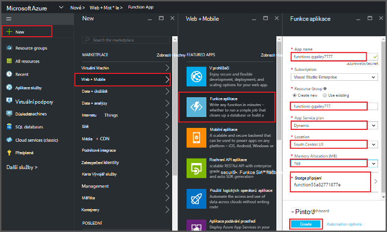
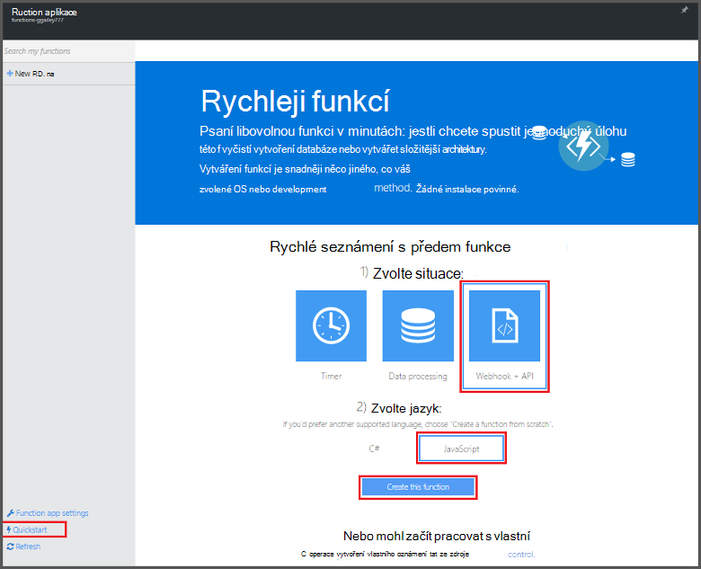
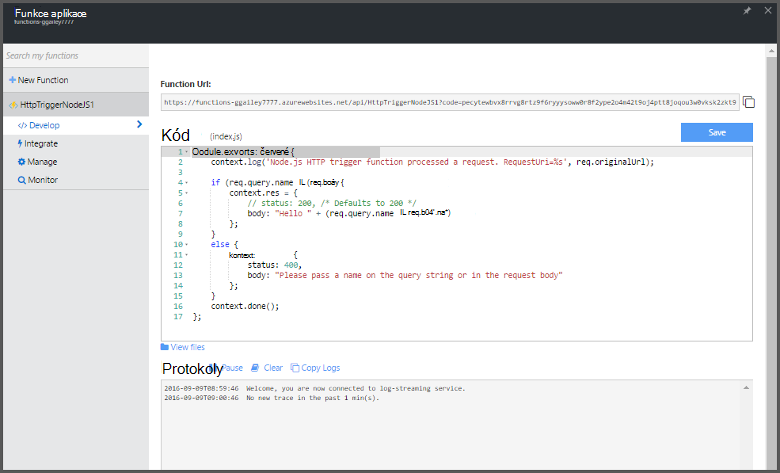

<properties
   pageTitle="Vytvoření funkce z portálu Microsoft Azure | Microsoft Azure"
   description="Vytvořte svůj první funkce Azure aplikace bez serveru v kratší než dvě minuty."
   services="functions"
   documentationCenter="na"
   authors="ggailey777"
   manager="erikre"
   editor=""
   tags=""
/>

<tags
   ms.service="functions"
   ms.devlang="multiple"
   ms.topic="article"
   ms.tgt_pltfrm="multiple"
   ms.workload="na"
   ms.date="09/08/2016"
   ms.author="glenga"/>

#Vytvoření funkce z portálu Microsoft Azure

##Základní informace
Azure funkce je řízeného událostmi, výpočetním na vyžádání prezentaci, která slouží k rozšíření existující Platforma Azure aplikací s možnostmi implementace kód aktivovány událostí v jiných Azure služeb, produktů SaaS a místní systémy. Mezi šablonami Azure funkcí, mezi které aplikace měřítko na základě služba a platí jenom pro zdroje, které můžete používat. Azure funkcí umožňuje vytvářet naplánované nebo spouštěný kód implementovaná v různých jazycích programovací jednotky. Další informace o funkcích Azure najdete v tématu [Přehled funkcí Azure](functions-overview.md).

V tomto tématu se dozvíte, jak vytvořit jednoduchý "Vítáme" pomocí portálu Azure Node.js Azure funkci, která je vyvolat aktivační události pro HTTP. Než vytvoříte funkci Azure portálu musí explicitně vytvoření aplikace funkce v aplikaci služby Azure. Pokud chcete, aby funkce aplikace za vás automaticky vytvoří, najdete v článku [na další kurz Azure funkce Rychlý úvod](functions-create-first-azure-function.md), což je jednodušší prostředí rychlý úvod a obsahuje videa.

##Vytvoření aplikace (funkce)

Funkce aplikace hostuje provádění funkce v Azure. Tímto postupem vytvoření funkce aplikace v portálu Azure.

Než budete moct vytvářet první funkce, musíte mít účet Azure active. Pokud ještě nemáte účet Azure, [bezplatné účty jsou k dispozici](https://azure.microsoft.com/free/).

1. Přejděte na [portál Azure](https://portal.azure.com) a přihlaste se pomocí účtu Azure.

2. Klikněte na **+ Nový** > **Web + Mobile** > **Funkce aplikace**, vyberte **předplatné**, zadejte jedinečný **název aplikace** , který identifikuje aplikace (funkce) a pak zadejte následující nastavení:

    + **[Pole Skupina zdroje](../azure-portal/resource-group-portal.md/)**: vyberte **vytvořit nový** a zadejte název nové skupiny prostředků. Můžete také existující skupiny zdrojů, však stát, že nebudete moct vytvářet dynamické plán služeb aplikací aplikace (funkce).
    + **[Plán služeb aplikací](../app-service/azure-web-sites-web-hosting-plans-in-depth-overview.md)**: Zvolte *dynamické* nebo *Klasická*. 
        + **Dynamické**: výchozí typ plánu pro funkce Azure. Když zvolíte dynamického plánu, musíte taky vyberte **umístění** a nastavit **Přidělování paměti** (v MB). Informace o přidělování paměti vliv bude mít náklady, najdete v článku [funkce Azure ceny](https://azure.microsoft.com/pricing/details/functions/). 
        + **Klasický**: klasické plán služeb aplikací vyžaduje, abyste vytvořit **aplikaci služby plán/umístění** nebo vyberte stávající. Tato nastavení určit [umístění, funkce, náklady a výpočet zdroje](https://azure.microsoft.com/pricing/details/app-service/) přidružený k vaší aplikaci.  
    + **Úložiště účtu**: aplikace každé funkce vyžaduje účet úložiště. Můžete vybrat existující účet úložiště nebo ho vytvořit. 

    

3. Klikněte na **vytvořit** trvat a nasaďte novou aplikaci (funkce).  

Teď máte k dispozici funkce aplikace, můžete vytvořit svůj první funkce.

## Vytvoření funkce

Tento postup vytvoření funkce z funkce Azure rychlý úvod.

1. Na kartě **Rychlý úvod** klikněte na **WebHook + rozhraní API** a **JavaScript**a potom klikněte na **vytvořit funkci**. Vytvoří se nová předdefinované funkce Node.js. 

    

2. (Volitelné) V rychlý úvod, můžete v tomto okamžiku Rychlá prohlídka Azure funkce funkcí na portálu.   Po dokončení nebo vynechán prohlídky můžete otestovat nové funkce pomocí aktivační události HTTP.

##Otestovat funkce

Protože rychlé prohlídky Azure funkce obsahovat funkční kód, můžete otestovat okamžitě novou funkci.

1. Na kartě **vývoje** zkontrolujte okně **kódu** a Všimněte si, že tento kód Node.js předpokládá, že žádost HTTP se hodnoty *název* v těle zprávy nebo v řetězci dotazu. Při spuštění funkce tato hodnota vrátit v odpovědi.

    

2. Posuňte se dolů na textové pole **požadavku** , změňte hodnoty *název* vlastnosti na název a klikněte na příkaz **Spustit**. Uvidíte, že spuštění spouštěný kliknutím žádost HTTP test, informace se došlo k zápisu streamování protokoly a odpověď na "Ahoj" se do **výstupu**. 

3. Spustit provádění stejnou funkci z jiného kartu nebo okno prohlížeče, zkopírujte hodnotu **Funkce URL** na kartě **vytvořit** vložením panelu Adresa v prohlížeči a připojit hodnotu řetězce dotazu `&name=yourname` a stiskněte klávesu enter. Stejné informace je aby došlo k zápisu protokolů a prohlížeč zobrazí odpovědi na "Ahoj" jako před.

##Další kroky

Tento rychlý úvod ukazuje velmi jednoduché spuštění základní funkce HTTP spouštěný. Další informace o používání power Azure funkcí v aplikace v těchto tématech.

+ [Referenční informace pro vývojáře Azure funkcí](functions-reference.md)  
Programmer odkaz pro definování aktivačními událostmi a vazby a kódování funkcí.
+ [Testování funkcí Azure](functions-test-a-function.md)  
Popisuje různé nástroje a postupy pro účely testování funkce.
+ [Jak zobrazit Azure funkcí](functions-scale.md)  
Tento článek popisuje služby plány dostupných funkcí Azure včetně plán dynamické služeb a výběr správné plán. 
+ [Co je aplikace služby Azure?](../app-service/app-service-value-prop-what-is.md)  
Azure funkce používá platformu Azure aplikaci služby základní funkce jako nasazení, proměnné a diagnostických nástrojů. 

[AZURE.INCLUDE [Getting Started Note](../../includes/functions-get-help.md)]
