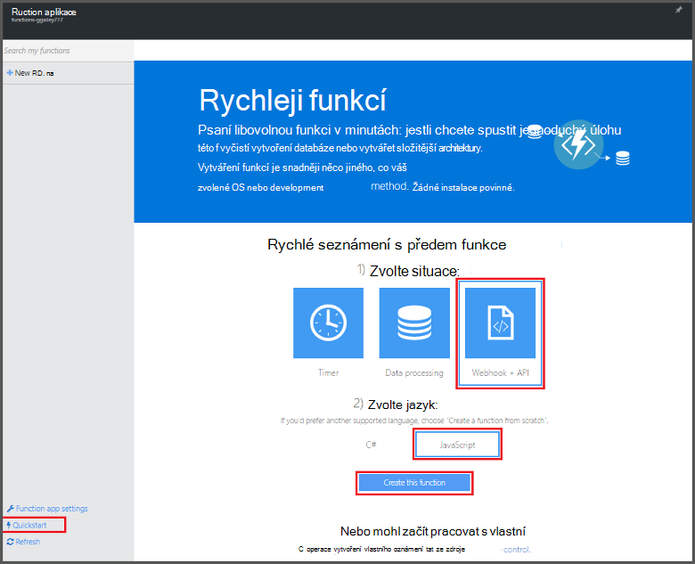
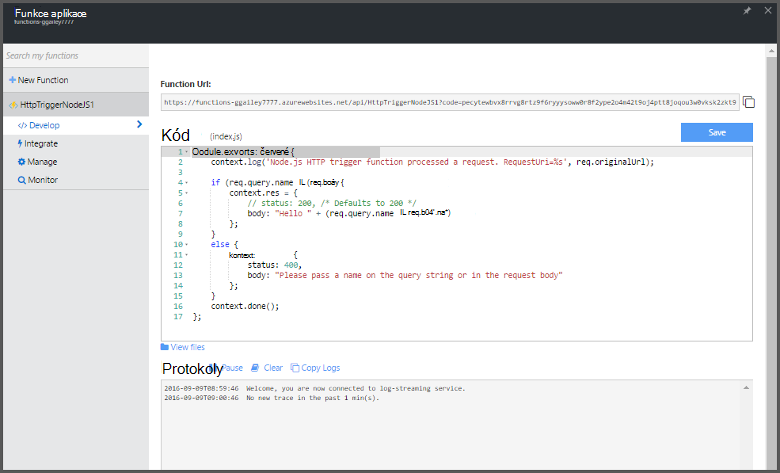

<properties
   pageTitle="Vytvoření první funkce Azure | Microsoft Azure"
   description="Vytvořte svůj první funkce Azure aplikace bez serveru v kratší než dvě minuty."
   services="functions"
   documentationCenter="na"
   authors="ggailey777"
   manager="erikre"
   editor=""
   tags=""
/>

<tags
   ms.service="functions"
   ms.devlang="multiple"
   ms.topic="hero-article"
   ms.tgt_pltfrm="multiple"
   ms.workload="na"
   ms.date="09/08/2016"
   ms.author="glenga"/>

#Vytvoření první funkce Azure

##Základní informace
Azure funkce je řízeného událostmi, výpočetním na vyžádání prezentaci, která slouží k rozšíření existující Platforma Azure aplikací s možnostmi implementace kód aktivovány událostí v jiných Azure služeb, produktů SaaS a místní systémy. Mezi šablonami Azure funkcí, mezi které aplikace měřítko na základě služba a platí jenom pro zdroje, které můžete používat. Azure funkcí umožňuje vytvářet naplánované nebo spouštěný kód implementovaná různými jazyky jednotky. Další informace o funkcích Azure najdete v tématu [Přehled funkcí Azure](functions-overview.md).

Toto téma ukazuje, jak vytvořit jednoduchý "Vítáme" Node.js funkci, která je vyvolat aktivační události pro HTTP pomocí rychlý úvod Azure funkce na portálu. Taky můžete přehrát krátké video a zjistěte, jak se tyto kroky provést na portálu.

## Podívejte se na video

Následující video ukazují, jak provádět základní kroky v tomto kurzu. 

[AZURE.VIDEO create-your-first-azure-function-simple]

##Vytvoření funkci z rychlý úvod

Funkce aplikace hostuje provádění funkce v Azure. Tímto postupem vytvoření nové funkce aplikace, stejně jako nové funkce. Nové funkce aplikace se vytvoří pomocí výchozí konfigurace. Příklad toho, jak explicitně vytvoření aplikace pro funkci naleznete v [jiném kurzu rychlý úvod Azure funkcí](functions-create-first-azure-function-azure-portal.md).

Než budete moct vytvářet první funkce, musíte mít účet Azure active. Pokud ještě nemáte účet Azure, [bezplatné účty jsou k dispozici](https://azure.microsoft.com/free/).

1. Přejděte na [portál Azure funkcí](https://functions.azure.com/signin) a přihlaste se pomocí účtu Azure.

2. Zadejte jedinečný **název** pro novou aplikaci funkce nebo přijmout vygenerovaných tu, vyberte upřednostňovaný **oblasti**a potom klepněte **vytvořit + Začínáme**. 

3. Na kartě **Rychlý úvod** klikněte na **WebHook + rozhraní API** a **JavaScript**a potom klikněte na **vytvořit funkci**. Vytvoří se nová předdefinované funkce Node.js. 

    

4. (Volitelné) V rychlý úvod, můžete v tomto okamžiku Rychlá prohlídka Azure funkce funkcí na portálu.   Po dokončení nebo vynechán prohlídky můžete otestovat nové funkce pomocí aktivační události HTTP.

##Otestovat funkce

Protože rychlé prohlídky Azure funkce obsahovat funkční kód, můžete otestovat okamžitě novou funkci.

1. Na kartě **vývoje** zkontrolujte okně **kódu** a Všimněte si, že tento kód Node.js předpokládá, že žádost HTTP se hodnoty *název* v těle zprávy nebo v řetězci dotazu. Při spuštění funkce tato hodnota vrátit v odpovědi.

    

2. Posuňte se dolů na textové pole **požadavku** , změňte hodnoty *název* vlastnosti na název a klikněte na příkaz **Spustit**. Uvidíte, že spuštění spouštěný kliknutím žádost HTTP test, informace se došlo k zápisu streamování protokoly a odpověď na "Ahoj" se do **výstupu**. 

3. Spustit provádění stejnou funkci z jiného kartu nebo okno prohlížeče, zkopírujte hodnotu **Funkce URL** na kartě **vytvořit** vložením panelu Adresa v prohlížeči a připojit hodnotu řetězce dotazu `&name=yourname` a stiskněte klávesu enter. Stejné informace je aby došlo k zápisu protokolů a prohlížeč zobrazí odpovědi na "Ahoj" jako před.

##Další kroky

Tento rychlý úvod ukazuje velmi jednoduché spuštění základní funkce HTTP spouštěný. Další informace o využití power Azure funkcí v aplikace v těchto tématech.

+ [Referenční informace pro vývojáře Azure funkcí](functions-reference.md)  
Programmer odkaz pro definování aktivačními událostmi a vazby a kódování funkcí.
+ [Testování funkcí Azure](functions-test-a-function.md)  
Popisuje různé nástroje a postupy pro účely testování funkce.
+ [Jak zobrazit Azure funkcí](functions-scale.md)  
Tento článek popisuje služby plány dostupných funkcí Azure včetně plán dynamické služeb a výběr správné plán. 
+ [Co je aplikace služby Azure?](../app-service/app-service-value-prop-what-is.md)  
Azure funkce využívá platformu Azure aplikaci služby základní funkce jako nasazení, proměnné a diagnostických nástrojů. 

[AZURE.INCLUDE [Getting Started Note](../../includes/functions-get-help.md)]
